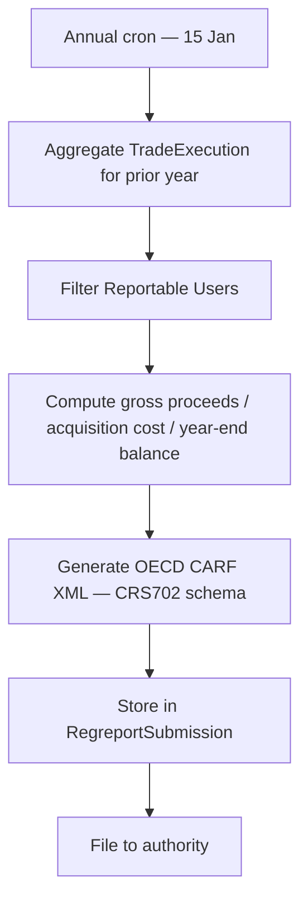

# DAC8 / CARF — Crypto-Asset Tax Reporting

**DAC8** (Council Directive (EU) 2023/2226, amending the Directive on Administrative Cooperation) and the **OECD Crypto-Asset Reporting Framework (CARF)** require Crypto-Asset Service Providers (CASPs) and reporting entities to report annually on crypto-asset transactions and account balances of tax-resident individuals and entities.

DAC8 applies in the EU from **1 January 2026** for the first reporting year 2025.

---

## Reportable information

For each **Reportable User** (a customer tax-resident in a participating jurisdiction), the annual report must include:

| Field | Source |
|---|---|
| Crypto-asset identifier (ISIN / token name) | `Asset.isin`, `Asset.name` |
| Aggregate gross proceeds from disposals | Sum of `TradeExecution.unitPrice × executedQuantity` (sell side) |
| Aggregate gross acquisition cost | Sum of acquisition transactions |
| Number of units at year-end | `AssetHolder.nominalAmount` at 31 December |
| Reportable user's tax identification | `NaturalPerson.taxId` + `taxIdCountry` or `LegalEntity.vatNumber` |
| Cross-border indicator | `LegalEntity.registrationCountry ≠ operatorJurisdiction` |

---

## Reportable users

A "Reportable User" under CARF is:

- A **natural person** (retail investor) tax-resident in a CARF-participating jurisdiction
- A **passive non-financial entity** (PNFE) — a legal entity that is not actively engaged in a trade or business — with a controlling person tax-resident in a participating jurisdiction

In Registerwerk:
- `NaturalPerson` records with `countryOfResidence` in a participating CARF jurisdiction are reportable
- `LegalEntity` records with `entityType = PASSIVE_INVESTMENT_VEHICLE` and a linked `BeneficialOwner` in a participating jurisdiction are reportable

---

## Annual report generation

`CrarsExportService` (in the `regreporting` module) generates the annual CARF/DAC8 XML:

The XML format follows the **OECD CRS Schema version 2.0 / CARF extension** (CrCbC-XML schema). Registerwerk generates one file per jurisdiction.

---

## Filing authorities

| Jurisdiction | Authority | Channel |
|---|---|---|
| DE_EWPG | Bundeszentralamt für Steuern (BZSt) | BZSt online portal (planned 2026) |
| LU_CSSF | Administration des Contributions Directes (ACD) | ACD DAC8 reporting portal |
| FR_AMF | Direction Générale des Finances Publiques (DGFiP) | DGFiP digital reporting |
| LI_TVTG | Steuerverwaltung Liechtenstein | FTA (Liechtenstein) portal |

!!! note "Status"
    DAC8 filing portals are being implemented by member states during 2025. The current `CrarsExportService` generates the XML and stores it in S3, but automated portal submission is pending the portals' availability. The `RegreportSubmission` record tracks when each portal goes live.

---

## CRS partner jurisdictions

In addition to the four primary jurisdictions, the report must cover residents of all CRS (Common Reporting Standard) partner jurisdictions for non-EU residents. Registerwerk's CARF export includes a `crossBorderIndicator` for each reportable user, flagging when the user's tax residence differs from the operator's primary jurisdiction.

---

## Relationship to MiFIR

DAC8 and MiFIR serve different purposes:

| Dimension | MiFIR RTS 22 | DAC8 / CARF |
|---|---|---|
| Frequency | Daily (per-transaction) | Annual (aggregated) |
| Recipient | Capital markets regulator (BaFin, AMF, CSSF) | Tax authority (BZSt, DGFiP, ACD) |
| Content | Individual transaction details | Annual totals per user per asset |
| Trigger | Trade execution | Calendar year end |
| Who is covered | All transactions in MiFID II instruments | All reportable crypto-asset users |

Both use the `RegreportSubmission` table for submission tracking and the same `regreporting` module infrastructure.
