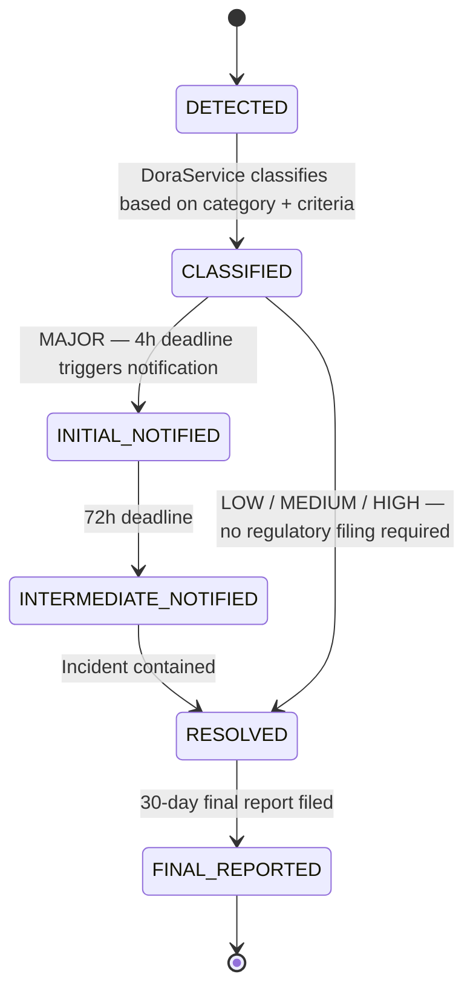

# DORA — Digital Operational Resilience Act

**Regulation (EU) 2022/2554** (DORA) has applied since 17 January 2025. It requires financial entities — including securities register operators — to implement robust ICT risk management, classify and report major incidents, and maintain a register of ICT third-party providers.

---

## Scope of DORA for Registerwerk

Registerwerk qualifies as a "financial entity" under DORA Art. 2 as:
- A securities register operator (eWpG)
- A DLT-based market infrastructure operator

The applicable requirements are:

| DORA Article | Obligation |
|---|---|
| Art. 5-10 | ICT risk management framework |
| Art. 11 | Business continuity and disaster recovery |
| Art. 17-19 | ICT incident classification and reporting |
| Art. 28-30 | ICT third-party risk and register |

---

## ICT incident classification

The `IctIncident` entity in `dora/api/` classifies incidents by category and severity:

### Categories

| Category | Description | Example triggers |
|---|---|---|
| `DATA_BREACH` | Unauthorised access to or exfiltration of data | Failed authentication spike, API abuse |
| `AVAILABILITY` | Service downtime exceeding SLA | Backend unreachable, DB connection exhausted |
| `INTEGRITY` | Data corruption or audit chain breach | `AuditChainBrokenEvent`, `ChainDriftDetectedEvent` |
| `CONFIDENTIALITY` | Sensitive data exposed | Misconfigured S3 bucket, JWT secret leak |
| `THIRD_PARTY` | Failure of an ICT third-party provider | RPC node offline, screening service unreachable |

### Severity levels

| Severity | Criteria | DORA reporting obligation |
|---|---|---|
| `INFORMATIONAL` | No impact on operations | Internal log only |
| `LOW` | Minor, contained, auto-recovered | Internal ticket |
| `MEDIUM` | Service degradation < 2 hours | Internal escalation |
| `HIGH` | Material service disruption | Internal escalation + senior management notification |
| `MAJOR` | Criteria below | Regulatory notification required |

**MAJOR classification criteria (DORA RTS 2024/1772):**
- Downtime > 2 hours affecting core services
- Data breach affecting > 0 customers
- Transaction loss or corruption (any amount)
- Integrity breach in the audit chain
- Loss of access to critical ICT third-party service > 2 hours

---

## Incident lifecycle



For `MAJOR` incidents, `DoraService` sets two deadline fields on creation:

```java
if (severity == MAJOR) {
    incident.setInitialNotificationDeadline(detectedAt.plus(4, HOURS));
    incident.setIntermediateReportDeadline(detectedAt.plus(72, HOURS));
}
```

A `@Scheduled` job runs every 15 minutes and checks whether any `MAJOR` incident has missed its notification deadline. If so, it emits an escalation `AuditEvent` and notifies all `REGISTRY_ADMIN` users.

---

## Automatic incident detection

Registerwerk auto-creates `IctIncident` records from internal events:

| Internal event | Incident category | Auto-severity |
|---|---|---|
| `AuditChainBrokenEvent` | `INTEGRITY` | `MAJOR` |
| `ChainDriftDetectedEvent` (> 0 affected holders) | `INTEGRITY` | `HIGH` |
| `IndexerStaleEvent` (> 2 hours) | `AVAILABILITY` | `HIGH` |
| `IndexerStaleEvent` (> 30 minutes) | `AVAILABILITY` | `MEDIUM` |
| `RpcNodeFailedEvent` (all nodes for chain) | `AVAILABILITY` | `HIGH` |
| `ScreeningServiceUnavailableEvent` | `THIRD_PARTY` | `MEDIUM` |

---

## ICT third-party register

DORA Art. 28 requires a register of all ICT third-party providers. The `ThirdPartyProvider` entity tracks:

| Field | Description |
|---|---|
| `name` | Provider name |
| `providerType` | `CLOUD`, `DATA_ANALYTICS`, `SECURITY`, `BLOCKCHAIN_RPC`, `SCREENING`, `COMMUNICATION` |
| `serviceDescription` | What service they provide |
| `criticalOrImportant` | Boolean — critical = substitution plan required |
| `contractStartDate` | Date of first engagement |
| `contractExpiryDate` | Current contract expiry |
| `dataLocations` | Countries where data is processed/stored |
| `subProviders` | Nested third-party chains (e.g., AWS under a SaaS) |

The register is viewable via `GET /api/v1/dora/third-party-providers` and can be exported as DORA Art. 28 XML for submission to the competent authority.

---

## Incident reporting by jurisdiction

| Jurisdiction | Authority | Channel |
|---|---|---|
| DE_EWPG | BaFin | BaFin Meldewesen portal |
| LU_CSSF | CSSF | CSSF secure messaging |
| FR_AMF | AMF + ACPR | AMF/ACPR incident notification form |
| LI_TVTG | FMA | FMA incident reporting portal |

The `dora` module stores the authority contact and submission method in the `JurisdictionProfile`. When an incident reaches the notification deadline, `DoraService` emits a `DoraIncidentNotificationDueEvent` → the `notification` module triggers the configured channel.
