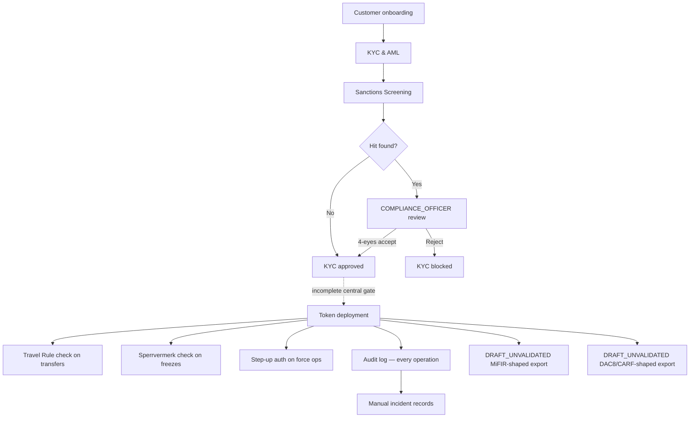

# Compliance-Komponenten { #compliance-components }

!!! warning "EXTERNAL_REVIEW_REQUIRED"
    In diesem Abschnitt werden beabsichtigte Steuerungszuordnungen und das aktuelle Repository-Verhalten aufgezeichnet. Es handelt sich nicht um eine Rechtsberatung oder um einen Nachweis der Konformität, behördlichen Genehmigung, Zertifizierung oder rechtlichen Wirkung. Anwendbarkeit und ausreichende Kontrolle erfordern eine aktuelle betreiber-, dienst-, instrumenten-, transaktions-, gerichtsbarkeits- und einsatzspezifische Prüfung.

Registerwerk enthält gemeinsame technische Komponenten, die nach Compliance-Workflows benannt sind. Eine Komponente oder ein konfigurierter Auslöser beweist nicht, dass eine Verpflichtung gilt, dass jeder relevante Vorgang gesperrt ist oder dass ein gesetzlicher Bericht oder eine Benachrichtigung vorliegt.

---

## Beabsichtigte Kontrollzuordnung – keine Aussage über eine vollständig implementierte, durchgängige Durchsetzung { #intended-control-map-not-a-statement-of-implemented-end-to-end-enforcement }

---

## Komponenten im Überblick { #components-at-a-glance }

| Komponente | Modul | Auslöser | Regulatorische Grundlage |
|---|---|---|---|
| [KYC & AML](kyc-aml.md) | `kyc` | Kundenerstellung / Dokumenteneinreichung | GwG §10, AMLD6 |
| [Sanktionsprüfung](sanctions-screening.md) | `screening` | KYC-Einreichung, tägliche erneute Überprüfung, neue Übertragung | GwG §10(2), AMLD6 Art. 18 |
| [Travel Rule](travel-rule.md) | `travelrule` | Jede Überweisung ≥ 1.000 € an externe VASP | TFR Reg. (EU) 2023/1113 |
| [Sperrvermerk](sperrvermerk.md) | `kyc` (HolderBlock) | Gerichtsbeschluss/Verpfändung/Betreibermaßnahme | eWpG §16 |
| [Step-Up MFA & 4-Eyes](step-up-mfa.md) | `stepup` | Jeder aufsichtsrechtlich sensible Vorgang | GwG §6(2), eWpG §16 |
| [DORA](dora.md) | `dora` | Manuelle Vorfall-/Anbieter-/Testaufzeichnungen und Terminerinnerungen | Beabsichtigte DORA-Zuordnung; Anwendbarkeit und Angemessenheit müssen überprüft werden |
| [MiFIR Reporting](mifir.md) | `regreporting` | Geplanter/On-Demand-Entwurfsexport | `DRAFT_UNVALIDATED`; keine RTS 22-Einreichung |
| [DAC8 / CARF](dac8.md) | `regreporting` | Geplanter/auf Abruf verfügbarer Entwurfsexport der aktuellen Bestände | `DRAFT_UNVALIDATED`; keine DAC8/CARF/KStTG-Einreichung |
| [Datenschutz](data-protection.md) | querschnittlich | PII-Erstellungs-/Löschanfragen | DSGVO Art. 30, 32, 35 |
| [Überprüfung der Repo-/Kreditfazilität](lending-facility-review.md) | `lending` | Vorproduktionsprüfung von besicherten Kreditverträgen | MiFID II Margin-Lending, eWpG §24 |
| [Token Admin Grants](token-admin-grants.md) | `asset` (AssetTokenAdminGrant) | Der Betreiber delegiert forcedTransfer/forcedApprove/forceBurn an eine Kundenentität | eWpG §24 Berichtigung, §26 Einziehung |

---

Ausgewählte Zustandsänderungen geben Audit-Ereignisse aus. Das Repository stellt nicht sicher, dass jede Compliance-Entscheidung erfasst wird oder dass die resultierende Aufzeichnung die erforderliche Beweis- oder Rechtswirkung hat.
