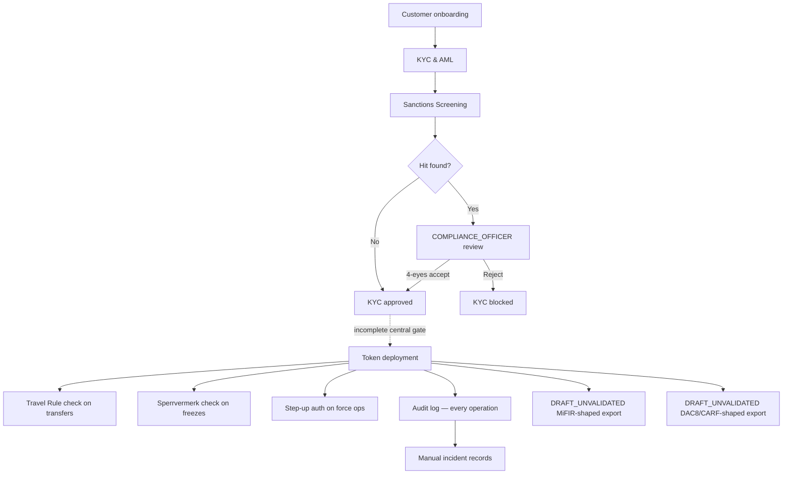

# Componentes de cumplimiento { #compliance-components }

!!! warning "EXTERNAL_REVIEW_REQUIRED"
    Esta sección registra las asignaciones de control previstas y el comportamiento actual del repositorio. No es asesoramiento legal ni evidencia de cumplimiento, autorización regulatoria, certificación o efecto legal. La aplicabilidad y la suficiencia del control requieren una revisión actual específica del operador, servicio,
    instrumento, transacción, jurisdicción e implementación.

Registerwerk contiene componentes técnicos compartidos nombrados para flujos de trabajo de cumplimiento. Un componente o activador configurado no prueba que se aplica una obligación, que cada operación relevante está sujeta a control, o que se produce un informe o notificación legal.

---

## Mapa de control previsto: no es una declaración de aplicación de cumplimiento de extremo a extremo implementada { #intended-control-map-not-a-statement-of-implemented-end-to-end-enforcement }

---

## Componentes de un vistazo { #components-at-a-glance }

| Componente | Módulo | Activador | Base regulatoria |
|---|---|---|---|
| [KYC y AML](kyc-aml.md) | `kyc` | Creación de clientes / envío de documentos | GwG §10, AMLD6 |
| [Detección de sanciones](sanctions-screening.md) | `screening` | Envío de KYC, revisión diaria, nueva transferencia | GwG §10(2), AMLD6 Art. 18 |
| [Travel Rule](travel-rule.md) | `travelrule` | Cualquier transferencia ≥ 1.000€ a VASP externo | TFR Reg. (UE) 2023/1113 |
| [Sperrvermerk](sperrvermerk.md) | `kyc` (HolderBlock) | Orden judicial/prenda/acción del operador | eWpG §16 |
| [Step-up MFA y doble control](step-up-mfa.md) | `stepup` | Cualquier operación de grado regulador | GwG §6(2), eWpG §16 |
| [DORA](dora.md) | `dora` | Registros manuales de incidentes/proveedores/pruebas y recordatorios de fechas límite | Mapeo DORA previsto; la aplicabilidad y suficiencia requieren revisión |
| [Informes MiFIR](mifir.md) | `regreporting` | Exportación de borradores programada/bajo demanda | `DRAFT_UNVALIDATED`; no es una presentación RTS 22 |
| [DAC8 / CARF](dac8.md) | `regreporting` | Exportación de borradores de existencias actuales programada/bajo demanda | `DRAFT_UNVALIDATED`; no es una presentación DAC8/CARF/KStTG |
| [Protección de datos](data-protection.md) | transversal | Solicitudes de creación/eliminación de PII | GDPR Art. 30, 32, 35 |
| [Revisión de la línea de repo/préstamo](lending-facility-review.md) | `lending` | Revisión previa a la producción de contratos de préstamos garantizados | Préstamo de margen MiFID II, eWpG §24 |
| [Concesiones de administrador de tokens](token-admin-grants.md) | `asset` (AssetTokenAdminGrant) | El operador delega `forcedTransfer`/`forcedApprove`/`forceBurn` a una entidad de cliente | eWpG §24 Berichtigung, §26 Einziehung |

---

Los cambios de estado seleccionados emiten eventos de auditoría. El repositorio no establece que cada decisión de cumplimiento sea capturada o que el registro resultante tenga el efecto probatorio o legal necesario.
