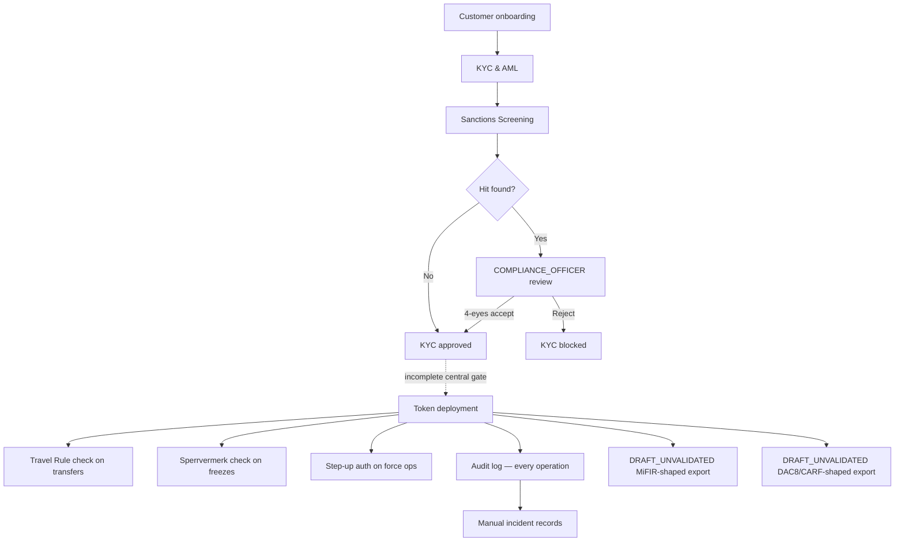

# Composants de conformité {#compliance-components}

!!! warning "EXTERNAL_REVIEW_REQUIRED"
    Cette section enregistre les mappages de contrôle prévus et le comportement actuel du référentiel. Il ne
    s'agit pas d'un avis juridique ni d'une preuve de conformité, d'autorisation réglementaire, de
    certification ou d'effet juridique. L'applicabilité et la suffisance du contrôle nécessitent un examen
    actuel spécifique à l'opérateur, au service, à l'instrument, à la transaction, à la juridiction et au
    déploiement.

Registerwerk contient des composants techniques partagés nommés pour les flux de travail de conformité. Un composant ou un déclencheur configuré ne prouve pas qu'une obligation s'applique, que chaque opération pertinente est bloquée ou qu'un rapport ou une notification statutaire se produit.

---

## Carte de contrôle prévue — et non une déclaration d'application de bout en bout mise en œuvre {#intended-control-map-not-a-statement-of-implemented-end-to-end-enforcement}

---

## Composants en un coup d'œil {#components-at-a-glance}

| Composant | Module | Déclencheur | Base réglementaire |
|---|---|---|---|
| [KYC & AML](kyc-aml.md) | `kyc` | Création client / soumission de documents | GwG §10, AMLD6 |
| [Vérification des sanctions](sanctions-screening.md) | `screening` | Soumission KYC, réexamen quotidien, nouveau transfert | GwG §10(2), AMLD6 Art. 18 |
| [Travel Rule](travel-rule.md) | `travelrule` | Tout transfert ≥ 1 000 € vers un VASP externe | TFR Règl. (UE) 2023/1113 |
| [Sperrvermerk](sperrvermerk.md) | `kyc` (HolderBlock) | Ordonnance du tribunal / gage / action de l'opérateur | eWpG §16 |
| [Step-Up MFA et 4 yeux](step-up-mfa.md) | `stepup` | Toute opération de niveau réglementaire | GwG §6(2), eWpG §16 |
| [DORA](dora.md) | `dora` | Enregistrements manuels des incidents/fournisseurs/tests et rappels de délais | Mappage DORA prévu ; l'applicabilité et la suffisance nécessitent un examen |
| [Rapports MiFIR](mifir.md) | `regreporting` | Exportation de brouillon planifiée/à la demande | `DRAFT_UNVALIDATED` ; pas un dépôt RTS 22 |
| [DAC8 / CARF](dac8.md) | `regreporting` | Exportation planifiée/à la demande des projets d'avoirs actuels | `DRAFT_UNVALIDATED` ; pas un dépôt DAC8/CARF/KStTG |
| [Protection des données](data-protection.md) | transversale | Demandes de création/suppression de PII | GDPR Art. 30, 32, 35 |
| [Revue des facilités de pension/prêt](lending-facility-review.md) | `lending` | Examen de pré-production des contrats de prêts garantis | Prêts sur marge MiFID II, eWpG §24 |
| [Grants d'administration de jetons](token-admin-grants.md) | `asset` (AssetTokenAdminGrant) | L'opérateur délègue forcedTransfer/forcedApprove/forceBurn à une entité cliente | eWpG §24 Berichtigung, §26 Einziehung |

---

Les changements d'état sélectionnés émettent des événements d'audit. Le référentiel n'établit pas que chaque décision de conformité est enregistrée ou que le dossier qui en résulte a l'effet probant ou juridique nécessaire.
