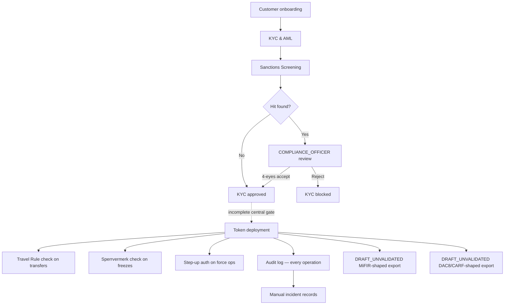

# Componenti di conformità { #compliance-components }

!!! warning "EXTERNAL_REVIEW_REQUIRED"
    Questa sezione registra le mappature dei controlli previste e il comportamento corrente del repository. Non si tratta di consulenza legale o di prova di conformità, autorizzazione normativa, certificazione o effetto legale. L'applicabilità e la sufficienza del controllo richiedono una revisione attuale specifica dell'operatore, del servizio, dello strumento, della transazione, della giurisdizione e dell'implementazione.

Registerwerk contiene componenti tecnici condivisi denominati per flussi di lavoro di conformità. Un componente o un trigger configurato non dimostra che si applica un obbligo, che ogni operazione rilevante è soggetta a restrizioni o che si verifica un rapporto o una notifica legale.

---

## Mappa di controllo prevista: non una dichiarazione di applicazione end-to-end implementata { #intended-control-map-not-a-statement-of-implemented-end-to-end-enforcement }

---

## Panoramica dei componenti { #components-at-a-glance }

| Componente | Modulo | Trigger | Base normativa |
|---|---|---|---|
| [KYC & AML](kyc-aml.md) | `kyc` | Creazione cliente/invio documenti | GwG §10, AMLD6 |
| [Screening sanzioni](sanctions-screening.md) | `screening` | Invio KYC, nuova verifica quotidiana, nuovo trasferimento | GwG §10(2), AMLD6 art. 18 |
| [Travel Rule](travel-rule.md) | `travelrule` | Qualsiasi trasferimento ≥ € 1.000 verso VASP esterno | TFR Reg. (UE) 2023/1113 |
| [Sperrvermerk](sperrvermerk.md) | `kyc` (`HolderBlock`) | Ordinanza del tribunale/pegno/azione dell'operatore | eWpG §16 |
| [Step-Up MFA e 4 occhi](step-up-mfa.md) | `stepup` | Qualsiasi operazione di livello regolatore | GwG §6(2), eWpG §16 |
| [DORA](dora.md) | `dora` | Registrazioni manuali di incidenti/fornitori/test e promemoria delle scadenze | Mappatura DORA prevista; l'applicabilità e la sufficienza richiedono una revisione |
| [Report MiFIR](mifir.md) | `regreporting` | Esportazione di bozze programmate/su richiesta | `DRAFT_UNVALIDATED`; non una scheda RTS 22 |
| [DAC8 / CARF](dac8.md) | `regreporting` | Progetto di esportazione delle partecipazioni correnti programmate/su richiesta | `DRAFT_UNVALIDATED`; non un deposito DAC8/CARF/KStTG |
| [Protezione dei dati](data-protection.md) | trasversale | Richieste di creazione/eliminazione PII | GDPR Art. 30, 32, 35 |
| [Revisione delle operazioni di pronti contro termine/prestiti](lending-facility-review.md) | `lending` | Revisione pre-produzione dei contratti di prestito collateralizzato | Prestiti marginali MiFID II, eWpG §24 |
| [Concessioni amministratore token](token-admin-grants.md) | `asset` (AssetTokenAdminGrant) | L'operatore delega forcedTransfer/forcedApprove/forceBurn a un'entità cliente | eWpG §24 Berichtigung, §26 Einziehung |

---

I cambiamenti di stato selezionati emettono eventi di controllo. L'archivio non dimostra che ogni decisione di conformità venga acquisita o che la registrazione risultante abbia il necessario effetto probatorio o legale.
