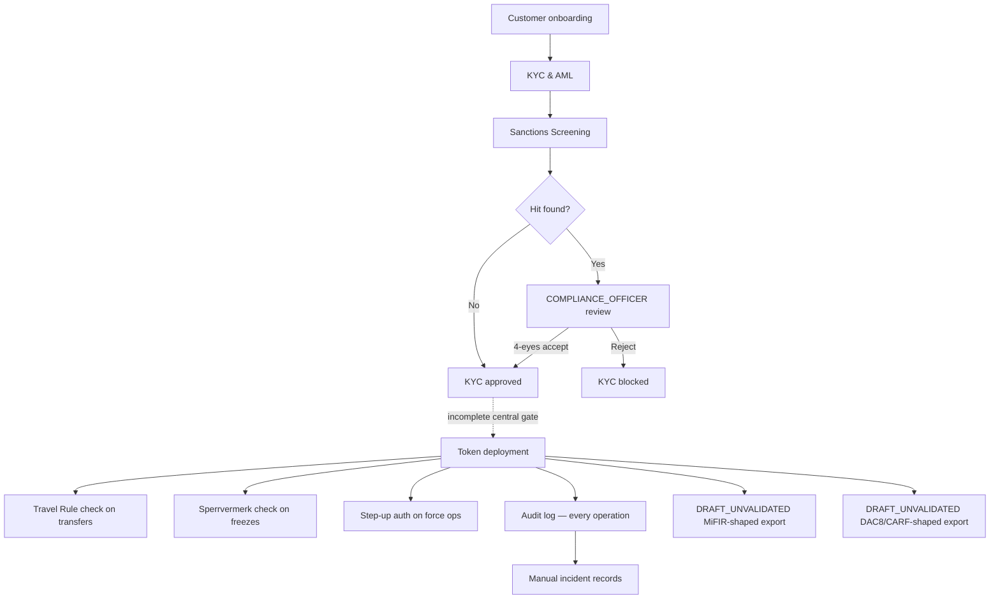

# Compliance Components

!!! warning "EXTERNAL_REVIEW_REQUIRED"
    This section records intended control mappings and current repository behavior. It is not
    legal advice or evidence of compliance, regulatory authorisation, certification, or legal
    effect. Applicability and control sufficiency require a current operator-, service-,
    instrument-, transaction-, jurisdiction-, and deployment-specific review.

Registerwerk contains shared technical components named for compliance workflows. A component or configured trigger does not prove that an obligation applies, that every relevant operation is gated, or that a statutory report or notification occurs.

---

## Intended control map — not a statement of implemented end-to-end enforcement

---

## Components at a glance

| Component | Module | Trigger | Regulatory basis |
|---|---|---|---|
| [KYC & AML](kyc-aml.md) | `kyc` | Customer creation / document submission | GwG §10, AMLD6 |
| [Sanctions Screening](sanctions-screening.md) | `screening` | KYC submission, daily re-screen, new transfer | GwG §10(2), AMLD6 Art. 18 |
| [Travel Rule](travel-rule.md) | `travelrule` | Any transfer ≥ €1,000 to external VASP | TFR Reg. (EU) 2023/1113 |
| [Sperrvermerk](sperrvermerk.md) | `kyc` (HolderBlock) | Court order / pledge / operator action | eWpG §16 |
| [Step-Up MFA & 4-Eyes](step-up-mfa.md) | `stepup` | Any regulator-grade operation | GwG §6(2), eWpG §16 |
| [DORA](dora.md) | `dora` | Manual incident/provider/test records and deadline reminders | Intended DORA mapping; applicability and sufficiency require review |
| [MiFIR Reporting](mifir.md) | `regreporting` | Scheduled/on-demand draft export | `DRAFT_UNVALIDATED`; not an RTS 22 filing |
| [DAC8 / CARF](dac8.md) | `regreporting` | Scheduled/on-demand current-holdings draft export | `DRAFT_UNVALIDATED`; not a DAC8/CARF/KStTG filing |
| [Data Protection](data-protection.md) | cross-cutting | PII creation / deletion requests | GDPR Art. 30, 32, 35 |
| [Repo/Lending Facility Review](lending-facility-review.md) | `lending` | Pre-production review of collateralized-lending contracts | MiFID II margin-lending, eWpG §24 |
| [Token Admin Grants](token-admin-grants.md) | `asset` (AssetTokenAdminGrant) | Operator delegates forcedTransfer/forcedApprove/forceBurn to a customer entity | eWpG §24 Berichtigung, §26 Einziehung |

---

Selected state changes emit audit events. The repository does not establish that every compliance decision is captured or that the resulting record has the necessary evidentiary or legal effect.
