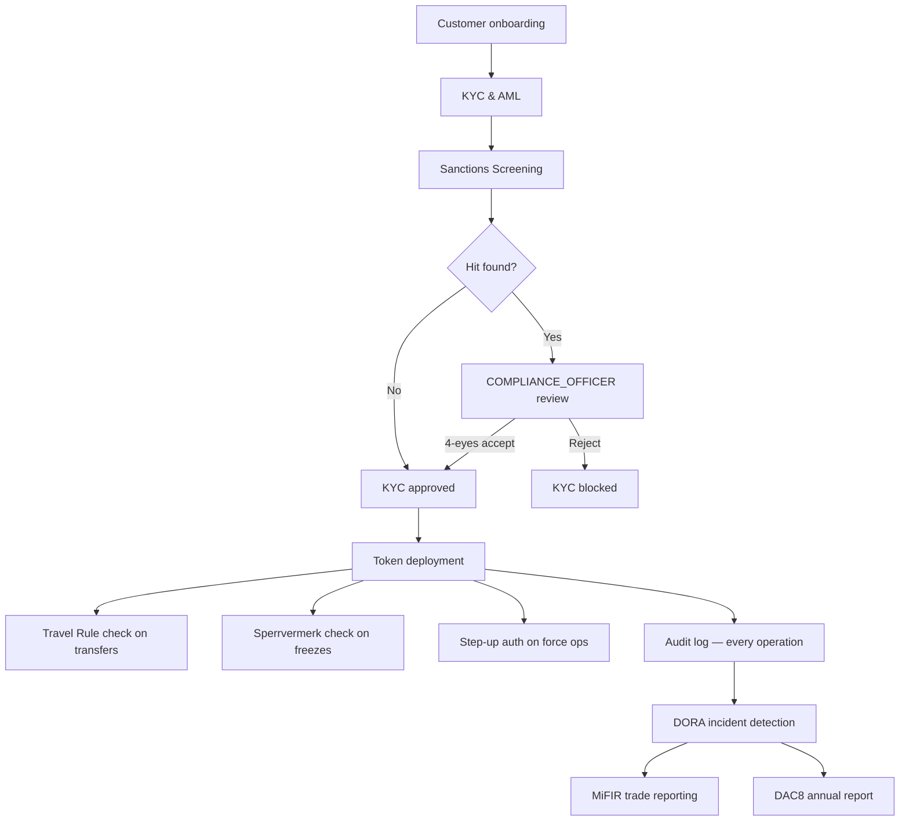

# Compliance Components

Registerwerk implements a set of shared compliance components that apply across all four jurisdictions. Each component maps to one or more regulatory obligations and is implemented as a dedicated Spring Modulith module.

---

## Compliance trigger map

---

## Components at a glance

| Component | Module | Trigger | Regulatory basis |
|---|---|---|---|
| [KYC & AML](kyc-aml.md) | `kyc` | Customer creation / document submission | GwG §10, AMLD6 |
| [Sanctions Screening](sanctions-screening.md) | `screening` | KYC submission, daily re-screen, new transfer | GwG §10(2), AMLD6 Art. 18 |
| [Travel Rule](travel-rule.md) | `travelrule` | Any transfer ≥ €1,000 to external VASP | TFR Reg. (EU) 2023/1113 |
| [Sperrvermerk](sperrvermerk.md) | `kyc` (HolderBlock) | Court order / pledge / operator action | eWpG §16 |
| [Step-Up MFA & 4-Eyes](step-up-mfa.md) | `stepup` | Any regulator-grade operation | GwG §6(2), eWpG §16 |
| [DORA](dora.md) | `dora` | ICT incident, RPC drift, indexer stale | DORA Reg. (EU) 2022/2554 |
| [MiFIR Reporting](mifir.md) | `regreporting` | Trade execution events | MiFIR RTS 22 |
| [DAC8 / CARF](dac8.md) | `regreporting` | Annual aggregation | DAC8 Directive (EU) 2023/2226 |
| [Data Protection](data-protection.md) | cross-cutting | PII creation / deletion requests | GDPR Art. 30, 32, 35 |

---

All compliance events flow through the [audit log](../platform/audit-log.md), creating a traceable, tamper-evident record of every compliance decision.
