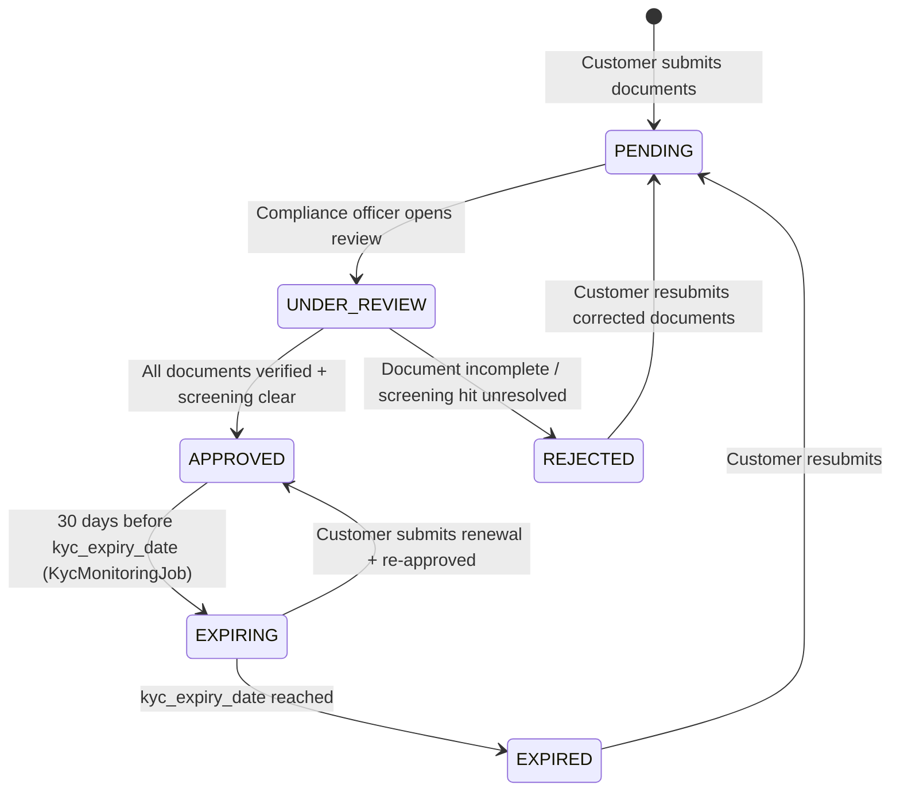

# KYC & AML { #kyc-aml }

!!! warning "EXTERNAL_REVIEW_REQUIRED"
    Auf dieser Seite werden beabsichtigte Steuerungszuordnungen und das aktuelle Repository-Verhalten
    aufgezeichnet. Es handelt sich nicht um Rechtsberatung oder einen Nachweis der AML-/KYC-Konformität.
    Sorgfaltspflichtanforderungen gegenüber Kunden, Nachweise, Turnus, Aufbewahrung, Eskalation und
    zulässige Ausnahmen erfordern eine betreiber-, kunden-, service-, transaktions- und
    gerichtsbarkeitsspezifische Prüfung durch qualifizierte Rechtsberater und Kontrollinhaber.

Registerwerk enthält KYC/KYB-Dokumenten-, Workflows für wirtschaftlich Berechtigte, Screening-, Genehmigungs- und Überwachungsworkflows. Ausgabe-, Bereitstellungs- und Übertragungspfade erzwingen noch nicht einheitlich einen genehmigten KYC-Status; diese Module dürfen daher nicht als vollständiges Produktions-Compliance-Gate beschrieben werden.

---

## KYC-Zustandsautomat { #kyc-state-machine }



Die Zustandsmaschine zeichnet den Kundenstatus auf, aber ein nicht genehmigter `LegalEntity` ist derzeit nicht für jede Ausgabe, Bereitstellung oder jeden Übertragungspfad gesperrt. Ein zentrales, fail-closed (bei Ausfall abweisendes) Betriebstor bleibt erforderlich.

---

## Datenmodell { #data-model }

### `KycDocument`

Der zentrale KYC-Datensatz. Ein `LegalEntity` kann viele `KycDocument`-Datensätze haben, einen pro Dokumenttyp. Schlüsselfelder:

| Feld | Typ | Beschreibung |
|---|---|---|
| `documentType` | Aufzählung | Art des Dokuments (siehe [Anforderungen je Gerichtsbarkeit](#per-jurisdiction-requirements)) |
| `status` | Aufzählung | `PENDING` / `APPROVED` / `REJECTED` / `EXPIRED` |
| `jurisdiction` | `Jurisdiction` | Für welche Gerichtsbarkeit diese Genehmigung gilt |
| `s3Key` | Zeichenfolge | Objektspeicherschlüssel für die Dokumentdatei |
| `expiresAt` | Instant | Für zeitlich begrenzte Dokumente |
| `approvedBy` | UUID | Verweis auf den `AppUser`, der genehmigt hat |
| `approvedAt` | Instant | Genehmigungszeitstempel (unveränderlich, sobald festgelegt) |

### `KycJurisdictionApproval`

Ein Genehmigungsdatensatz je Gerichtsbarkeit. Ein `LegalEntity` kann für jede der vier Gerichtsbarkeiten separate Genehmigungen besitzen, sodass ein Kunde mit einem einzigen Dokumentensatz in mehreren Märkten tätig sein kann.

### `NaturalPerson`

Speichert PII für Direktoren, Zeichnungsberechtigte und wirtschaftlich Berechtigte. Diese Felder sind derzeit gewöhnlichen Datenbankspalten zugeordnet; Feldverschlüsselung auf Anwendungsebene sowie ein DEK/KEK-Lebenszyklus pro Datensatz sind nicht implementiert. Erfassen Sie keine Produktions-PII, bevor die erforderlichen Verschlüsselungs-, Migrations-, Schlüsselverwaltungs-, Sicherungs- und Wiederherstellungskontrollen implementiert und überprüft wurden.

### `BeneficialOwner`

Verknüpft ein `LegalEntity` mit einer `NaturalPerson`:
- `ownershipPct` – Eigentumsanteil in Prozent (Schwellenwert: 25 %)
- `controlType` – DIRECT / INDIRECT / OTHER
- `registeredAt` / `ceasedAt` – Zeitraum der Beteiligung

---

## Anforderungen je nach Gerichtsbarkeit { #per-jurisdiction-requirements }

=== "Deutschland (DE_EWPG)"

    | Dokumenttyp | Erforderlich | Notizen |
    |---|---|---|
    | Gründungsurkunde | ✅ | Handelsregisterauszug |
    | Aktionärsregister | ✅ | |
    | UBO-Deklaration | ✅ | Transparenzregisterauszug |
    | Identität (Direktoren + UBOs) | ✅ | |
    | Vorstandsbeschluss | ✅ | Autorisierung der Token-Ausgabe |
    | Jahresbericht | ✅ | Letzte 2 Jahre |
    | GwG-AML-Fragebogen | ✅ | |
    | LEI-Zertifikat | ✅ (empfohlen) | |

=== "Luxemburg (LU_CSSF)"

    | Dokumenttyp | Erforderlich | Notizen |
    |---|---|---|
    | Gründungsurkunde | ✅ | |
    | RCS-Extrakt | ✅ | Registre du Commerce et des Sociétés |
    | RBE-Extrakt | ✅ | Registre des Bénéficiaires Effectifs |
    | Aktionärsregister | ✅ | Obligatorisch für SICAVs und SICAFs |
    | Herkunftsnachweis der Mittel | ✅ | Obligatorisch für alle LU-Kunden |
    | CSSF-AML-Fragebogen | ✅ | |
    | Identität (Direktoren + UBOs) | ✅ | |
    | Jahresbericht | ✅ | Letzte 2 Jahre |

=== "Frankreich (FR_AMF)"

    | Dokumenttyp | Erforderlich | Notizen |
    |---|---|---|
    | Extrait Kbis | ✅ | ≤ 3 Monate alt |
    | Statuts | ✅ | Satzung |
    | RBE-Deklaration | ✅ | Registre des Bénéficiaires Effectifs |
    | Identität (Direktoren + UBOs) | ✅ | |
    | AMF/ACPR-PSAN-AML-Fragebogen | ✅ | |
    | Jahresbericht | ✅ | Letzte 2 Jahre |
    | Herkunftsnachweis der Mittel | ✅ (hohes Risiko) | |

=== "Liechtenstein (LI_TVTG)"

    | Dokumenttyp | Erforderlich | Notizen |
    |---|---|---|
    | Handelsregisterauszug | ✅ | ≤ 3 Monate alt |
    | UBO-Deklaration | ✅ | FMA-konformes Format |
    | Identität (Direktoren + UBOs) | ✅ | |
    | Token-Whitepaper | ✅ | TVTG §9 — verpflichtend vor der Bereitstellung |
    | Smart-Contract-Audit | ✅ | FMA-Leitlinien für öffentliche Angebote |
    | TT-Dienstleister-Lizenz | ✅ | |
    | Jahresabschluss | ✅ | Letzte 2 Jahre |

---

## KYC-Genehmigungsprüfungen { #kyc-approval-checks }

Eine vollständige Genehmigungsrichtlinie wird nicht zentral durchgesetzt. Das Repository stellt derzeit separate Kontrollen bereit:

1. `KycComplianceService` berechnet Vorhandensein, Alter und Ablaufergebnisse für konfigurierte Dokumentanforderungen.
2. `KycService` blockiert die Genehmigung, wenn die Prüfung des Rechtsträgers oder eines verbundenen wirtschaftlich Berechtigten ungelöst ist.
3. Genehmigungen je Gerichtsbarkeit können Lücken in der Checkliste sowie einen Hinweis zur Ausnahme durch den Betreiber festhalten.
4. Die Durchsetzung am jeweiligen HTTP-Endpunkt erfolgt unabhängig von der Durchsetzung in den Domänendiensten.

Diese Prüfungen bilden noch kein einheitliches Gate für Ausgabe/Empfang/Bereitstellung/Übertragung, und konfigurierte Dokumentenlisten oder Schwellenwerte sind keine rechtlichen Schlussfolgerungen.

Die `ScreeningGate`-Schnittstelle im Modul `screening` wird von `KycService.approveKyc()` aufgerufen:

```java
// KycService.approveKyc() — simplified
if (screeningGate.hasUnresolvedHit(entityId)) {
    throw new InvalidStateTransitionException("Open sanctions hit blocks KYC approval");
}
if (screeningGate.hasUnresolvedBeneficialOwnerHit(entityId)) {
    throw new InvalidStateTransitionException("Open UBO sanctions hit blocks KYC approval");
}
```

---

## Laufende Überwachung { #ongoing-monitoring }

**GwG §10 Abs. 1 Nr. 5** und die Äquivalente in allen vier Gerichtsbarkeiten verlangen eine laufende Überwachung der Geschäftsbeziehungen.

`KycMonitoringJob` (`kyc/internal/`) läuft täglich um 02:00 UTC:

1. Ruft alle `LegalEntity`-Datensätze mit `kycStatus = APPROVED` ab.
2. Liegt `kycExpiryDate` innerhalb von 30 Tagen → Wechsel zu `EXPIRING`, `KycExpiringEvent` wird ausgelöst → E-Mail-Benachrichtigung an den `COMPANY_ADMIN` des Kunden.
3. Ist `kycExpiryDate` verstrichen → Wechsel zu `EXPIRED`, `KycExpiredEvent` wird ausgelöst → löst die Entfernung aus dem [ERC-3643-Identitätsregister](../token-standards/erc3643.md) aus.

Zusätzlich läuft der `ScreeningService` jede Nacht, um alle aktiven Entitäten erneut gegen die aktuellen Sanktionslisten zu prüfen. Ein neu entdeckter Treffer versetzt die Entität in ein `SCREENING_REVIEW`-Flag und benachrichtigt den `COMPLIANCE_OFFICER`.
