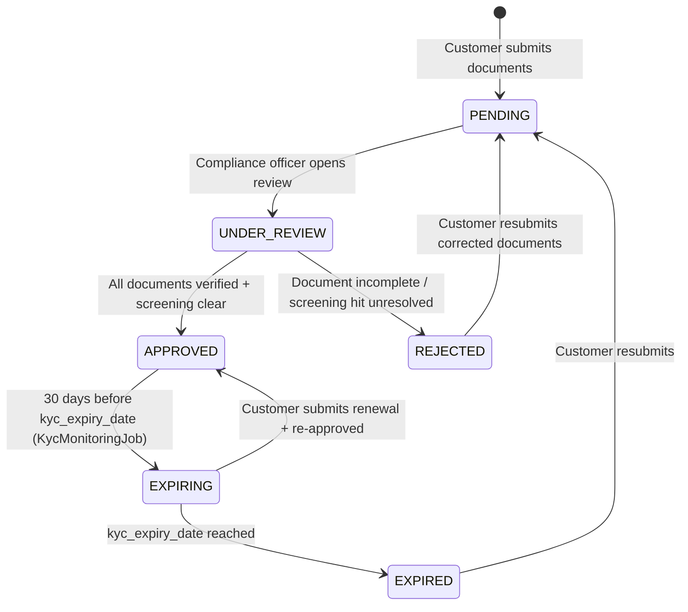

# KYC & AML { #kyc-aml }

!!! warning "EXTERNAL_REVIEW_REQUIRED"
    Auf dieser Seite werden beabsichtigte Steuerungszuordnungen und das aktuelle Repository-Verhalten
    aufgezeichnet. Es handelt sich nicht um Rechtsberatung oder einen Nachweis der AML-/KYC-Konformität.
    Sorgfaltspflichtanforderungen gegenüber Kunden, Nachweise, Turnus, Aufbewahrung, Eskalation und
    zulässige Ausnahmen erfordern eine betreiber-, kunden-, service-, transaktions- und
    gerichtsbarkeitsspezifische Prüfung durch qualifizierte Rechtsberater und Kontrollinhaber.

Registerwerk enthält KYC/KYB-Dokumenten-, Workflows für wirtschaftlich Berechtigte, Screening-, Genehmigungs- und Überwachungsworkflows. Ausgabe-, Bereitstellungs- und Übertragungspfade erzwingen noch nicht einheitlich einen genehmigten KYC-Status; diese Module dürfen daher nicht als vollständiges Produktions-Compliance-Gate beschrieben werden.

---

## KYC-Zustandsautomat { #kyc-state-machine }


```mermaid
stateDiagram-v2
    [*] --> PENDING : Customer submits documents
    PENDING --> UNDER_REVIEW : Compliance officer opens review
    UNDER_REVIEW --> APPROVED : All documents verified + screening clear
    UNDER_REVIEW --> REJECTED : Document incomplete / screening hit unresolved
    APPROVED --> EXPIRING : 30 days before kyc_expiry_date (KycMonitoringJob)
    EXPIRING --> APPROVED : Customer submits renewal + re-approved
    EXPIRING --> EXPIRED : kyc_expiry_date reached
    EXPIRED --> PENDING : Customer resubmits
    REJECTED --> PENDING : Customer resubmits corrected documents
```

Die Zustandsmaschine zeichnet den Kundenstatus auf, aber ein nicht genehmigter `LegalEntity` ist derzeit nicht für jede Ausgabe, Bereitstellung oder jeden Übertragungspfad gesperrt. Ein zentrales, fail-closed (bei Ausfall abweisendes) Betriebstor bleibt erforderlich.

---

## Datenmodell { #data-model }

### `KycDocument`

Der zentrale KYC-Datensatz. Ein `LegalEntity` kann viele `KycDocument`-Datensätze haben, einen pro Dokumenttyp. Schlüsselfelder:

| Feld | Typ | Beschreibung |
|---|---|---|
| `documentType` | Aufzählung | Art des Dokuments (siehe [Anforderungen je Gerichtsbarkeit](#per-jurisdiction-requirements)) |
| `status` | Aufzählung | `PENDING` / `APPROVED` / `REJECTED` / `EXPIRED` |
| `jurisdiction` | `Jurisdiction` | Für welche Gerichtsbarkeit diese Genehmigung gilt |
| `s3Key` | Zeichenfolge | Objektspeicherschlüssel für die Dokumentdatei |
| `expiresAt` | Instant | Für zeitlich begrenzte Dokumente |
| `approvedBy` | UUID | Verweis auf den `AppUser`, der genehmigt hat |
| `approvedAt` | Instant | Genehmigungszeitstempel (unveränderlich, sobald festgelegt) |

### `KycJurisdictionApproval`

Ein Genehmigungsdatensatz je Gerichtsbarkeit. Ein `LegalEntity` kann für jede der vier Gerichtsbarkeiten separate Genehmigungen besitzen, sodass ein Kunde mit einem einzigen Dokumentensatz in mehreren Märkten tätig sein kann.

### `NaturalPerson`

Speichert PII für Direktoren, Zeichnungsberechtigte und wirtschaftlich Berechtigte. Diese Felder sind derzeit gewöhnlichen Datenbankspalten zugeordnet; Feldverschlüsselung auf Anwendungsebene sowie ein DEK/KEK-Lebenszyklus pro Datensatz sind nicht implementiert. Erfassen Sie keine Produktions-PII, bevor die erforderlichen Verschlüsselungs-, Migrations-, Schlüsselverwaltungs-, Sicherungs- und Wiederherstellungskontrollen implementiert und überprüft wurden.

### `BeneficialOwner`

Verknüpft ein `LegalEntity` mit einer `NaturalPerson`:
- `ownershipPct` – Eigentumsanteil in Prozent (Schwellenwert: 25 %)
- `controlType` – DIRECT / INDIRECT / OTHER
- `registeredAt` / `ceasedAt` – Zeitraum der Beteiligung

---

## Anforderungen je nach Gerichtsbarkeit { #per-jurisdiction-requirements }

=== "Deutschland (DE_EWPG)"

    | Dokumenttyp | Erforderlich | Notizen |
    |---|---|---|
    | Gründungsurkunde | ✅ | Handelsregisterauszug |
    | Aktionärsregister | ✅ | |
    | UBO-Deklaration | ✅ | Transparenzregisterauszug |
    | Identität (Direktoren + UBOs) | ✅ | |
    | Vorstandsbeschluss | ✅ | Autorisierung der Token-Ausgabe |
    | Jahresbericht | ✅ | Letzte 2 Jahre |
    | GwG-AML-Fragebogen | ✅ | |
    | LEI-Zertifikat | ✅ (empfohlen) | |

=== "Luxemburg (LU_CSSF)"

    | Dokumenttyp | Erforderlich | Notizen |
    |---|---|---|
    | Gründungsurkunde | ✅ | |
    | RCS-Extrakt | ✅ | Registre du Commerce et des Sociétés |
    | RBE-Extrakt | ✅ | Registre des Bénéficiaires Effectifs |
    | Aktionärsregister | ✅ | Obligatorisch für SICAVs und SICAFs |
    | Herkunftsnachweis der Mittel | ✅ | Obligatorisch für alle LU-Kunden |
    | CSSF-AML-Fragebogen | ✅ | |
    | Identität (Direktoren + UBOs) | ✅ | |
    | Jahresbericht | ✅ | Letzte 2 Jahre |

=== "Frankreich (FR_AMF)"

    | Dokumenttyp | Erforderlich | Notizen |
    |---|---|---|
    | Extrait Kbis | ✅ | ≤ 3 Monate alt |
    | Statuts | ✅ | Satzung |
    | RBE-Deklaration | ✅ | Registre des Bénéficiaires Effectifs |
    | Identität (Direktoren + UBOs) | ✅ | |
    | AMF/ACPR-PSAN-AML-Fragebogen | ✅ | |
    | Jahresbericht | ✅ | Letzte 2 Jahre |
    | Herkunftsnachweis der Mittel | ✅ (hohes Risiko) | |

=== "Liechtenstein (LI_TVTG)"

    | Dokumenttyp | Erforderlich | Notizen |
    |---|---|---|
    | Handelsregisterauszug | ✅ | ≤ 3 Monate alt |
    | UBO-Deklaration | ✅ | FMA-konformes Format |
    | Identität (Direktoren + UBOs) | ✅ | |
    | Token-Whitepaper | ✅ | TVTG §9 — verpflichtend vor der Bereitstellung |
    | Smart-Contract-Audit | ✅ | FMA-Leitlinien für öffentliche Angebote |
    | TT-Dienstleister-Lizenz | ✅ | |
    | Jahresabschluss | ✅ | Letzte 2 Jahre |

---

## KYC-Genehmigungsprüfungen { #kyc-approval-checks }

Eine vollständige Genehmigungsrichtlinie wird nicht zentral durchgesetzt. Das Repository stellt derzeit separate Kontrollen bereit:

1. `KycComplianceService` berechnet Vorhandensein, Alter und Ablaufergebnisse für konfigurierte Dokumentanforderungen.
2. `KycService` blockiert die Genehmigung, wenn die Prüfung des Rechtsträgers oder eines verbundenen wirtschaftlich Berechtigten ungelöst ist.
3. Genehmigungen je Gerichtsbarkeit können Lücken in der Checkliste sowie einen Hinweis zur Ausnahme durch den Betreiber festhalten.
4. Die Durchsetzung am jeweiligen HTTP-Endpunkt erfolgt unabhängig von der Durchsetzung in den Domänendiensten.

Diese Prüfungen bilden noch kein einheitliches Gate für Ausgabe/Empfang/Bereitstellung/Übertragung, und konfigurierte Dokumentenlisten oder Schwellenwerte sind keine rechtlichen Schlussfolgerungen.

Die `ScreeningGate`-Schnittstelle im Modul `screening` wird von `KycService.approveKyc()` aufgerufen:

```java
// KycService.approveKyc() — simplified
if (screeningGate.hasUnresolvedHit(entityId)) {
    throw new InvalidStateTransitionException("Open sanctions hit blocks KYC approval");
}
if (screeningGate.hasUnresolvedBeneficialOwnerHit(entityId)) {
    throw new InvalidStateTransitionException("Open UBO sanctions hit blocks KYC approval");
}
```

---

## CDD-Kontrollen für die Entity-Freigabe { #cdd-controls }

`POST /api/v1/entities/{id}/kyc/approve` (Step-up und zweiter Freigeber) führt jetzt dieselben Nachweisprüfungen aus wie die Jurisdiktionsfreigabe, zusätzlich die Abdeckung der wirtschaftlich Berechtigten. Alle Schwellen sind Übergangswerte bis zu den Entscheidungen des Betreibers zur Risikomethodik; sie sind keine Rechtsaussage.

| Prüfung | Regel |
|---|---|
| Entity-Status | nur `ACTIVE` oder `PENDING_ONBOARDING` |
| Screening | kein ungelöster Treffer der Entity; jeder aktuelle wirtschaftlich Berechtigte gescreent und unauffällig (ein beendeter Berechtigter mit offenem Treffer blockiert weiter) |
| Dokumenten-Checkliste | Heimat-Jurisdiktion (aus dem Registrierungsland oder `jurisdiction` im Body); eine unvollständige Checkliste braucht `overrideNote` und einen `REGISTRY_ADMIN` (Risikoakzeptanz, im Nachweisdatensatz gespeichert) |
| Wirtschaftlich Berechtigte | mindestens einer; identifizierter Anteil von mindestens 75 % oder ein dokumentierter Fallback auf die oberste Führungsebene (`controlType=SENIOR_MANAGING_OFFICIAL` mit Begründung), der ebenfalls `overrideNote` und einen `REGISTRY_ADMIN` braucht |
| Gültigkeit | `expiryDate` darf `registerwerk.kyc.max-validity-months` (Standard 12) nicht überschreiten und wird auf das EDD-Überprüfungsdatum einer verknüpften bestätigten PEP begrenzt |

Jede Freigabe schreibt einen `kyc_approval_record` (Checklisten-Snapshot, Override-Notiz, Abdeckung, zweiter Freigeber); das Audit-Ereignis `KYC_APPROVED` trägt dieselben Daten. `KycJurisdictionApproval` bleibt beratend: kein Gate liest es.

!!! note "Bestehende Freigaben werden nicht herabgestuft"
    `GET /api/v1/kyc/evidence-gaps` listet `APPROVED`-Entities, die die heutigen Prüfungen nicht bestehen würden (unvollständige Checkliste, kein wirtschaftlich Berechtigter, ungeklärter Anteil, Ablauf über der Grenze, PEP ohne EDD, ungelöstes Screening), zur Bearbeitung bei der nächsten Überprüfung.

**Dokumente.** Der Upload akzeptiert `issueDate` und `expiresAt`. `expiresAt` ist für Reisepass, Identitätsdokument und Registerauszüge Pflicht und darf nicht in der Vergangenheit liegen; ein abgelaufenes Dokument zählt in der Checkliste nicht, und die „zu alt“-Frist beginnt mit `issueDate`, falls angegeben. Auflisten und Herunterladen von Dokumenten (und die Liste der wirtschaftlich Berechtigten) ist auf `REGISTRY_ADMIN`, `COMPLIANCE_OFFICER`, `AUDIT` und den eigenen `COMPANY_ADMIN` der Entity beschränkt; Downloads kommen mit `X-Content-Type-Options: nosniff`.

**Wirtschaftlich Berechtigte.** `ownershipPct` muss größer 0 und höchstens 100 sein, die aktive Summe darf 100 nicht überschreiten; `GET .../beneficial-owners/summary` zeigt den identifizierten Anteil und den ungeklärten Rest. `POST .../{id}/verify` hält Prüfer und Nachweisdokument fest. Das Beenden (`DELETE` mit JSON-Body) braucht Step-up, einen zweiten Freigeber und eine Begründung und wird abgelehnt, solange das Screening der Person ungelöst ist: den Treffer zuerst über den Akzeptanzpfad auflösen. Hinzufügen oder Beenden bei einer `APPROVED`-Entity eröffnet eine Aufgabe `KYC_REVIEW_REQUIRED`; der Status ändert sich nicht automatisch.

**PEP und EDD.** Die Bestätigung eines PEP-Treffers setzt `NaturalPerson.pepStatus=CONFIRMED_PEP`. Eine bestätigte PEP passiert das Screening-Gate nur, solange eine EDD-Freigabe gilt: `POST .../{id}/edd-approvals` (`REGISTRY_ADMIN`, Step-up, zweiter Freigeber, Notiz, Überprüfungsdatum höchstens sechs Monate). Nach dem Überprüfungsdatum blockiert die Person wieder. Es gibt kein Risikorating, keine Länderrisikoliste und keine EDD-Checkliste; das gehört in die Risikoanalyse des Betreibers (GwG § 5).

---

## Laufende Überwachung { #ongoing-monitoring }

**GwG §10 Abs. 1 Nr. 5** und die Äquivalente in allen vier Gerichtsbarkeiten verlangen eine laufende Überwachung der Geschäftsbeziehungen.

`KycMonitoringJob` (`kyc/internal/`) läuft täglich um 02:00 UTC:

1. Ruft alle `LegalEntity`-Datensätze mit `kycStatus = APPROVED` ab.
2. Liegt `kycExpiryDate` innerhalb von 30 Tagen → `KycExpiringEvent` wird ausgelöst (`reason=EXPIRING_SOON`; der Status bleibt `APPROVED`) → E-Mail-Benachrichtigung an den `COMPANY_ADMIN` des Kunden.
3. Ist `kycExpiryDate` verstrichen → Wechsel zu `EXPIRED`, `KycExpiringEvent` (`reason=EXPIRED`) wird ausgelöst → `KycChainPropagationListener` überträgt den Ablauf auf die Chain (siehe unten).

Zusätzlich prüft das tägliche Re-Screening (`ScreeningRefreshJob`) alle aktiven Entitäten erneut gegen die aktuellen Sanktionslisten. Ein neuer Treffer wird als offener `ScreeningHit` gespeichert und als `ScreeningHitDetectedEvent` veröffentlicht (auditiert). Offene Treffer sperren über `ScreeningGate` die KYC-Freigabe und die Off-Chain-Abwicklung von Trades. Ein ungeprüfter Treffer löst **noch keine automatische On-Chain-Maßnahme** aus: Die Reaktion (Suspendierung, Einfrieren oder Prüfung innerhalb einer SLA) ist eine offene Produktentscheidung.

### On-Chain-Übertragung eines KYC-Ablaufs

Ein KYC-Ablauf (`KycExpiringEvent` mit `reason=EXPIRED`) oder eine KYC-Ablehnung (`KycRejectedEvent`) wird auf jede Chain übertragen, auf der die Entität eine Org-Registrierung oder eine ONCHAINID hat. `KycChainPropagationListener` (`orgidentity/internal/`) legt je Entität und Chain eine Zeile in `kyc_chain_propagation` an und treibt sie voran, bis alles on-chain bestätigt ist:

- **Org-Suspendierung**: `OrgRegistry.suspendOrg`, über denselben Fail-closed-Pfad wie eine manuelle Suspendierung. Damit sind alle über `PermissionOracle` geschützten dApps und der Paymaster gesperrt.
- **Claim-Widerruf**: für die KYC-Claims (Topic 1) und AML-Claims (Topic 2) der Entität `ONCHAINID.removeClaim` **und** `ClaimIssuer.revokeClaimBySignature`. Das Entfernen allein ist umkehrbar, weil die Org die ursprüngliche Signatur erneut hinzufügen könnte. Durch den Widerruf beim Issuer liefert `isClaimValid` überall `false`, auch in T-REX `isVerified`.

Jeder Schritt ist idempotent und wird jede Minute wiederholt, bis er bestätigt ist. Fehler werden auditiert (`KYC_CHAIN_PROPAGATION`) und über die Gauge `registerwerk_kyc_chain_propagation_failed` für das Alerting bereitgestellt. Nichts wird automatisch rückgängig gemacht: Nach einer erneuten Freigabe (Vier-Augen-Prinzip) reaktiviert der Operator die Org und stellt ausdrücklich neue Claims aus.

!!! note "Der Claim-Ablauf wird on-chain nicht durchgesetzt"
    Der in die Claim-Daten geschriebene Wert `expiresAt` dient nur der Information. Weder `ClaimIssuer.isClaimValid` von ONCHAINID noch T-REX `isVerified` oder `PermissionOracle` lesen ihn. On-chain wirkt ein Ablauf nur über den oben beschriebenen aktiven Widerruf.

!!! warning "Der Widerruf beim Issuer erfordert einen ClaimIssuer-Vertrag"
    `revokeClaimBySignature` greift nur, wenn der Issuer des Claims ein ONCHAINID-`ClaimIssuer`-Vertrag ist, auf dem der Registry-Signer einen MANAGEMENT-Key hält. Bei Claims, deren Issuer eine einfache Signer-Wallet ist, gibt es beim Issuer nichts zu widerrufen; der Schritt entfällt.
