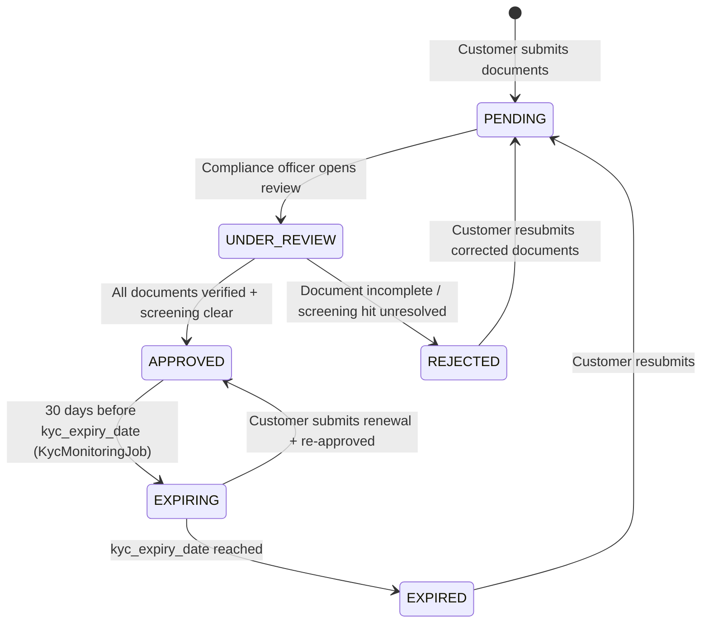

# KYC & AML { #kyc-aml }

!!! warning "EXTERNAL_REVIEW_REQUIRED"
    Esta página registra las asignaciones de control previstas y el comportamiento actual del repositorio. No es un consejo legal
    ni evidencia de cumplimiento de AML/KYC. Los requisitos de diligencia debida del cliente, la evidencia, la cadencia, la retención, el escalamiento y las anulaciones permitidas requieren una revisión específica del operador, del cliente, del servicio, de la transacción y de la jurisdicción por parte de abogados calificados y propietarios de control.

Registerwerk contiene flujos de trabajo de documentos KYC/KYB, titular real, selección, aprobación y seguimiento. Las rutas de emisión, implementación y transferencia aún no aplican de manera uniforme un estado KYC aprobado, por lo que estos módulos no deben describirse como una puerta de cumplimiento de producción completa.

---

## Máquina de estado KYC { #kyc-state-machine }



La máquina de estado registra el estado del cliente, pero un `LegalEntity` no aprobado actualmente no está bloqueado para todas las rutas de emisión, implementación o transferencia. Sigue siendo necesaria una puerta de operación central con denegación por defecto (fail closed).

---

## Modelo de datos { #data-model }

### `KycDocument` { #kycdocument }

El registro principal KYC. Un `LegalEntity` puede tener muchos registros `KycDocument`, uno por tipo de documento. Campos clave:

| Campo | Tipo | Descripción |
|---|---|---|
| `documentType` | Enumeración | Tipo de documento (ver [requisitos por jurisdicción](#per-jurisdiction-requirements)) |
| `status` | Enumeración | `PENDING` / `APPROVED` / `REJECTED` / `EXPIRED` |
| `jurisdiction` | `Jurisdiction` | Qué jurisdicción cubre esta aprobación |
| `s3Key` | Cadena | Clave de almacenamiento de objetos para el archivo del documento |
| `expiresAt` | Instantáneo | Para documentos por tiempo limitado |
| `approvedBy` | UUID | Referencia al `AppUser` que aprobó |
| `approvedAt` | Instantáneo | Marca de tiempo de aprobación (inmutable una vez configurada) |

### `KycJurisdictionApproval` { #kycjurisdictionapproval }

Un registro de aprobación por jurisdicción. Un `LegalEntity` puede tener aprobaciones separadas para cada una de las cuatro jurisdicciones, lo que permite a un cliente operar en múltiples mercados con un solo conjunto de documentos.

### `NaturalPerson` { #naturalperson }

Almacena PII para directores, signatarios y titulares reales. Estos campos actualmente están asignados a columnas de bases de datos ordinarias; el cifrado de campos a nivel de aplicación y un ciclo de vida DEK/KEK por registro no están implementados. No introduzca PII de producción hasta que se implementen y verifiquen los controles requeridos de cifrado, migración, administración de claves, respaldo y recuperación.

### `BeneficialOwner` { #beneficialowner }

Enlaza un `LegalEntity` a un `NaturalPerson` con:
- `ownershipPct` — porcentaje de propiedad (umbral: 25 %)
- `controlType` — DIRECT / INDIRECT / OTHER
- `registeredAt` / `ceasedAt` — período de titularidad

---

## Requisitos por jurisdicción {#per-jurisdiction-requirements}

=== "Alemania (DE_EWPG)"

    | Tipo de documento | Requerido | Notas |
    |---|---|---|
    | Certificado de incorporación | ✅ | Handelsregisterauszug (extracto del registro mercantil) |
    | Registro de accionistas | ✅ | |
    | Declaración UBO | ✅ | Extracto del Transparenzregister (registro de transparencia) |
    | Identidad (directores + UBO) | ✅ | |
    | Resolución de la junta | ✅ | Autorización de emisión de tokens |
    | Informe anual | ✅ | Últimos 2 años |
    | Cuestionario GwG AML | ✅ | |
    | Certificado LEI | ✅ (recomendado) | |

=== "Luxemburgo (LU_CSSF)"

    | Tipo de documento | Requerido | Notas |
    |---|---|---|
    | Certificado de incorporación | ✅ | |
    | Extracto de RCS | ✅ | Registre du Commerce et des Sociétés |
    | Extracto RBE | ✅ | Registre des Bénéficiaires Effectifs |
    | Registro de accionistas | ✅ | Obligatorio para SICAV y SICAF |
    | Fuente de fondos | ✅ | Obligatorio para todos los clientes de LU |
    | Cuestionario CSSF AML | ✅ | |
    | Identidad (directores + UBO) | ✅ | |
    | Informe anual | ✅ | Últimos 2 años |

=== "Francia (FR_AMF)"

    | Tipo de documento | Requerido | Notas |
    |---|---|---|
    | Extracto Kbis | ✅ | ≤ 3 meses |
    | Estatutos | ✅ | Estatutos sociales |
    | Declaración RBE | ✅ | Registre des Bénéficiaires Effectifs |
    | Identidad (directores + UBO) | ✅ | |
    | Cuestionario AMF/ACPR PSAN AML | ✅ | |
    | Informe anual | ✅ | Últimos 2 años |
    | Fuente de fondos | ✅ (alto riesgo) | |

=== "Liechtenstein (LI_TVTG)"

    | Tipo de documento | Requerido | Notas |
    |---|---|---|
    | Handelsregisterauszug | ✅ | ≤ 3 meses |
    | Declaración UBO | ✅ | Formato alineado con FMA |
    | Identidad (directores + UBO) | ✅ | |
    | Documento técnico sobre tokens | ✅ | TVTG §9 — obligatorio antes de la implementación |
    | Auditoría de contratos inteligentes | ✅ | Orientación de la FMA para ofertas públicas |
    | Licencia de proveedor de servicios TT | ✅ | |
    | Estados financieros anuales | ✅ | Últimos 2 años |

---

## Verificaciones de aprobación de KYC { #kyc-approval-checks }

La política de aprobación completa no se aplica de forma centralizada. Actualmente, el repositorio proporciona controles independientes:

1. `KycComplianceService` calcula los resultados de presencia, antigüedad y vencimiento para los requisitos de documentos configurados.
2. `KycService` bloquea la aprobación cuando el filtrado de la entidad o del titular real vinculado no está resuelto.
3. Las aprobaciones por jurisdicción pueden registrar las lagunas en la lista de verificación y una nota de anulación del operador.
4. La aplicación en el punto final HTTP relevante es independiente de la aplicación en los servicios de dominio.

Estas comprobaciones aún no forman una puerta uniforme de emisión/recepción/implementación/transferencia, y las listas o umbrales de documentos configurados no son conclusiones legales.

La interfaz `ScreeningGate` en el módulo `screening` es llamada por `KycService.approveKyc()`:

```java
// KycService.approveKyc() — simplified
if (screeningGate.hasUnresolvedHit(entityId)) {
    throw new InvalidStateTransitionException("Open sanctions hit blocks KYC approval");
}
if (screeningGate.hasUnresolvedBeneficialOwnerHit(entityId)) {
    throw new InvalidStateTransitionException("Open UBO sanctions hit blocks KYC approval");
}
```

---

## Monitoreo continuo { #ongoing-monitoring }

**GwG §10 Abs. 1 Nr. 5** y equivalentes en las cuatro jurisdicciones requieren un seguimiento continuo de las relaciones comerciales.

`KycMonitoringJob` (`kyc/internal/`) se ejecuta diariamente a las 02:00 UTC:

1. Recupera todos los registros `LegalEntity` con `kycStatus = APPROVED`
2. Si `kycExpiryDate` está dentro de los 30 días → hace la transición a `EXPIRING`, emite `KycExpiringEvent` → notificación por correo electrónico al `COMPANY_ADMIN` del cliente
3. Si `kycExpiryDate` ha pasado → hace la transición a `EXPIRED`, emite `KycExpiredEvent` → activa la eliminación del [registro de identidad ERC-3643](../token-standards/erc3643.md)

Además, `ScreeningService` se ejecuta todas las noches para volver a examinar todas las entidades activas con las últimas listas de sanciones. Un hit recién descubierto hace que la entidad pase a un indicador `SCREENING_REVIEW` y notifica a `COMPLIANCE_OFFICER`.
