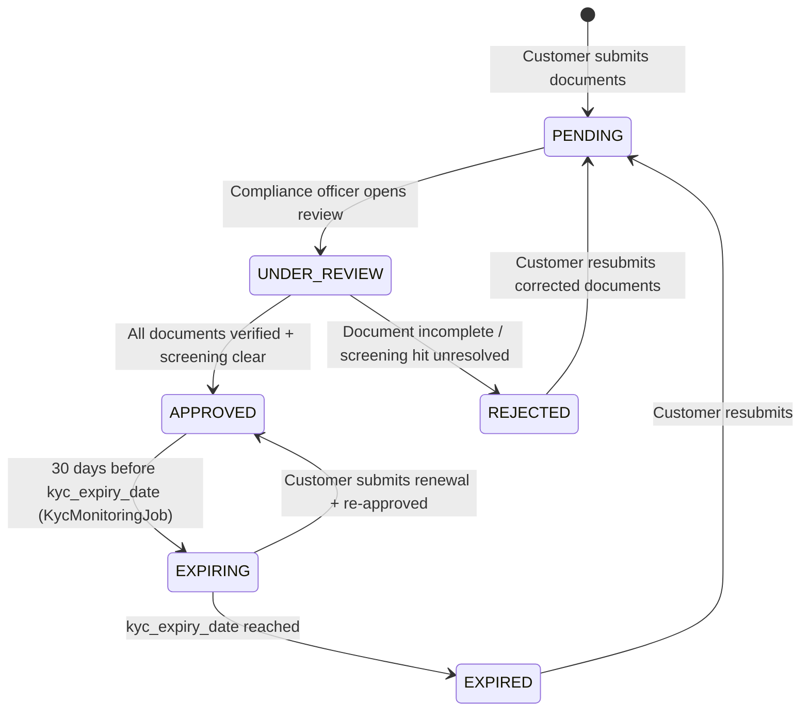

# KYC & AML {#kyc-aml}

!!! warning "EXTERNAL_REVIEW_REQUIRED"
    Cette page enregistre les mappages de contrôle prévus et le comportement actuel du référentiel. Il ne
    s'agit pas d'un conseil juridique ni d'une preuve de conformité AML/KYC. Les exigences de diligence
    raisonnable à l'égard du client, les preuves, la cadence, la conservation, l'escalade et les dérogations
    autorisées nécessitent un examen spécifique à l'opérateur, au client, au service, à la transaction et à la
    juridiction, mené par un conseiller qualifié et les responsables de contrôle.

Registerwerk contient des flux de travail KYC/KYB pour les documents, les bénéficiaires effectifs, la sélection, l'approbation et la surveillance. Les chemins d'émission, de déploiement et de transfert n'appliquent pas encore uniformément un état KYC approuvé, ces modules ne doivent donc pas être décrits comme une porte de conformité de production complète.

---

## Machine d'état KYC {#kyc-state-machine}



La machine d'état enregistre le statut du client, mais un `LegalEntity` non approuvé n'est actuellement pas bloqué pour chaque émission, déploiement ou chemin de transfert. Une porte de contrôle centrale à rejet par défaut (fail closed) reste nécessaire.

---

## Modèle de données {#data-model}

### `KycDocument` {#kycdocument}

L'enregistrement principal KYC. Un `LegalEntity` peut contenir plusieurs enregistrements `KycDocument`, un par type de document. Champs clés :

| Champ | Type | Description |
|---|---|---|
| `documentType` | Énumération | Type de document (voir [exigences par juridiction](#per-jurisdiction-requirements)) |
| `status` | Énumération | `PENDING` / `APPROVED` / `REJECTED` / `EXPIRED` |
| `jurisdiction` | `Jurisdiction` | Quelle juridiction couvre cette approbation |
| `s3Key` | Chaîne | Clé de stockage d'objets pour le fichier de document |
| `expiresAt` | Instantané | Pour les documents à durée limitée |
| `approvedBy` | UUID | Référence à l'`AppUser` qui a approuvé |
| `approvedAt` | Instantané | Horodatage d'approbation (immuable une fois défini) |

### `KycJurisdictionApproval` {#kycjurisdictionapproval}

Un enregistrement de validation par juridiction. Un `LegalEntity` peut détenir des approbations distinctes pour chacune des quatre juridictions, permettant à un client d'opérer sur plusieurs marchés avec un seul ensemble de documents.

### `NaturalPerson` {#naturalperson}

Stocke le PII pour les administrateurs, les signataires et les bénéficiaires effectifs. Ces champs sont actuellement mappés sur des colonnes de base de données ordinaires ; le chiffrement des champs au niveau de l'application et le cycle de vie DEK/KEK par enregistrement ne sont pas implémentés. Ne saisissez pas de PII en production tant que les contrôles requis de chiffrement, de migration, de gestion des clés, de sauvegarde et de récupération n'ont pas été mis en œuvre et vérifiés.

### `BeneficialOwner` {#beneficialowner}

Lie un `LegalEntity` à une `NaturalPerson` avec :
- `ownershipPct` — pourcentage de propriété (seuil : 25 %)
- `controlType` — DIRECT / INDIRECT / OTHER
- `registeredAt` / `ceasedAt` — période de détention

---

## Exigences par juridiction {#per-jurisdiction-requirements}

=== "Allemagne (DE_EWPG)"

    | Type de document | Obligatoire | Remarques |
    |---|---|---|
    | Certificat de constitution | ✅ | Handelregisterauszug |
    | Registre des actionnaires | ✅ | |
    | Déclaration UBO | ✅ | Extrait du Transparenzregister |
    | Identité (administrateurs + UBO) | ✅ | |
    | Résolution du conseil d'administration | ✅ | Autorisant l'émission de jetons |
    | Rapport annuel | ✅ | 2 dernières années |
    | Questionnaire AML GwG | ✅ | |
    | Certificat LEI | ✅ (recommandé) | |

=== "Luxembourg (LU_CSSF)"

    | Type de document | Obligatoire | Remarques |
    |---|---|---|
    | Certificat de constitution | ✅ | |
    | Extrait RCS | ✅ | Registre du Commerce et des Sociétés |
    | Extrait RBE | ✅ | Registre des Bénéficiaires Effectifs |
    | Registre des actionnaires | ✅ | Obligatoire pour les SICAV et SICAF |
    | Origine des fonds | ✅ | Obligatoire pour tous les clients LU |
    | Questionnaire AML CSSF | ✅ | |
    | Identité (administrateurs + UBO) | ✅ | |
    | Rapport annuel | ✅ | 2 dernières années |

=== "France (FR_AMF)"

    | Type de document | Obligatoire | Remarques |
    |---|---|---|
    | Extrait Kbis | ✅ | ≤ 3 mois |
    | Statuts | ✅ | |
    | Déclaration RBE | ✅ | Registre des Bénéficiaires Effectifs |
    | Identité (administrateurs + UBO) | ✅ | |
    | Questionnaire AML AMF/ACPR PSAN | ✅ | |
    | Rapport annuel | ✅ | 2 dernières années |
    | Origine des fonds | ✅ (risque élevé) | |

=== "Liechtenstein (LI_TVTG)"

    | Type de document | Obligatoire | Remarques |
    |---|---|---|
    | Handelsregisterauszug | ✅ | ≤ 3 mois |
    | Déclaration UBO | ✅ | Format aligné FMA |
    | Identité (administrateurs + UBO) | ✅ | |
    | Whitepaper du jeton | ✅ | TVTG §9 — obligatoire avant le déploiement |
    | Audit du smart contract | ✅ | Recommandation FMA pour les offres publiques |
    | Licence de prestataire de services TT | ✅ | |
    | États financiers annuels | ✅ | 2 dernières années |

---

## Contrôles d'approbation KYC {#kyc-approval-checks}

Une politique d'approbation complète n'est pas appliquée de manière centralisée. Le référentiel fournit actuellement des contrôles distincts :

1. `KycComplianceService` calcule les résultats de présence, d'âge et d'expiration pour les exigences de documents configurées.
2. `KycService` bloque l'approbation lorsque la sélection de l'entité ou du bénéficiaire effectif lié n'est pas résolue.
3. Les approbations par juridiction peuvent enregistrer les lacunes de la liste de contrôle et une note de dérogation de l'opérateur.
4. L'application au niveau du point de terminaison HTTP concerné est distincte de l'application dans les services de domaine.

Ces contrôles ne forment pas encore une porte d'émission/réception/déploiement/transfert uniforme, et les listes ou seuils de documents configurés ne constituent pas des conclusions juridiques.

L'interface `ScreeningGate` du module `screening` est appelée par `KycService.approveKyc()` :

```java
// KycService.approveKyc() — simplified
if (screeningGate.hasUnresolvedHit(entityId)) {
    throw new InvalidStateTransitionException("Open sanctions hit blocks KYC approval");
}
if (screeningGate.hasUnresolvedBeneficialOwnerHit(entityId)) {
    throw new InvalidStateTransitionException("Open UBO sanctions hit blocks KYC approval");
}
```

---

## Surveillance continue {#ongoing-monitoring}

**GwG §10 Abs. 1 Nr. 5** et équivalents dans les quatre juridictions nécessitent une surveillance continue des relations d'affaires.

`KycMonitoringJob` (`kyc/internal/`) s'exécute quotidiennement à 02h00 UTC :

1. Récupère tous les enregistrements `LegalEntity` avec `kycStatus = APPROVED`
2. Si `kycExpiryDate` est dans les 30 jours → passe à `EXPIRING`, émet `KycExpiringEvent` → notification par e-mail au `COMPANY_ADMIN` du client
3. Si `kycExpiryDate` est dépassée → passe à `EXPIRED`, émet `KycExpiredEvent` → déclenche la suppression du [registre d'identité ERC-3643](../token-standards/erc3643.md)

De plus, le `ScreeningService` s'exécute chaque nuit pour réexaminer toutes les entités actives par rapport aux dernières listes de sanctions. Un hit nouvellement découvert fait passer l'entité à un indicateur `SCREENING_REVIEW` et informe le `COMPLIANCE_OFFICER`.
