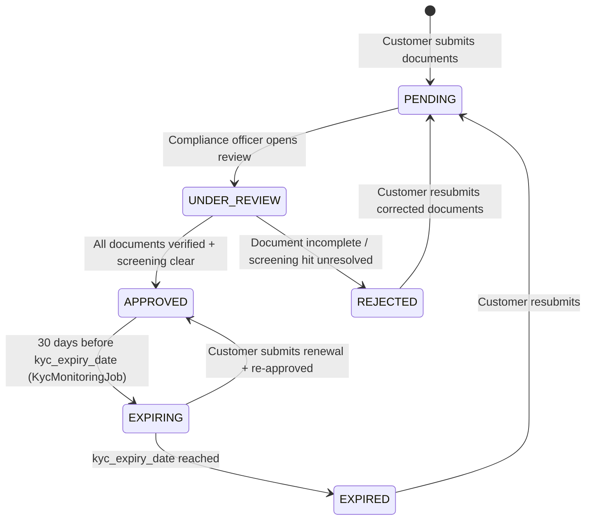

# KYC & AML { #kyc-aml }

!!! warning "EXTERNAL_REVIEW_REQUIRED"
    Questa pagina registra le mappature dei controlli previste e il comportamento corrente del repository. Non costituisce un consiglio
    legale né una prova della conformità AML/KYC. I requisiti di adeguata verifica della clientela, le prove, la cadenza,
    la conservazione, l'escalation e le modifiche consentite richiedono una revisione specifica dell'operatore, del cliente, del servizio,
    della transazione e della giurisdizione da parte di consulenti qualificati e dei responsabili del controllo.

Registerwerk contiene flussi di lavoro per documenti KYC/KYB, titolare effettivo, screening, approvazione e monitoraggio. I percorsi di emissione, distribuzione e trasferimento non applicano ancora in modo uniforme uno stato KYC approvato, pertanto questi moduli non devono essere descritti come un gate di conformità di produzione completo.

---

## KYC state machine { #kyc-state-machine }



La macchina a stati registra lo stato del cliente, ma un `LegalEntity` non approvato non è attualmente bloccato su ogni percorso di emissione, distribuzione o trasferimento. Resta necessario un gate operativo centrale, fail-closed (rifiuto in caso di errore).

---

## Modello dati { #data-model }

### `KycDocument` { #kycdocument }

Il record KYC principale. Uno `LegalEntity` può avere molti record `KycDocument`, uno per tipo di documento. Campi chiave:

| Campo | Tipo | Descrizione |
|---|---|---|
| `documentType` | Enum | Tipo di documento (vedi [requisiti per giurisdizione](#per-jurisdiction-requirements)) |
| `status` | Enum | `PENDING` / `APPROVED` / `REJECTED` / `EXPIRED` |
| `jurisdiction` | `Jurisdiction` | Quale giurisdizione copre questa approvazione |
| `s3Key` | String | Chiave di archiviazione oggetto per il file di documento |
| `expiresAt` | Instant | Per documenti a validità limitata |
| `approvedBy` | UUID | Riferimento all'`AppUser` che ha approvato |
| `approvedAt` | Instant | Timestamp di approvazione (immutabile una volta impostato) |

### `KycJurisdictionApproval` { #kycjurisdictionapproval }

Un record di approvazione per giurisdizione. Un `LegalEntity` può contenere approvazioni separate per ciascuna delle quattro giurisdizioni, consentendo a un cliente di operare in più mercati con un unico set di documenti.

### `NaturalPerson` { #naturalperson }

Memorizza i dati personali (PII) di amministratori, firmatari e titolari effettivi. Questi campi sono attualmente mappati su colonne di database ordinarie; la crittografia dei campi a livello di applicazione e un ciclo di vita DEK/KEK per record non sono implementati. Non inserire dati personali di produzione finché non sono implementati e verificati i controlli richiesti di crittografia, migrazione, gestione delle chiavi, backup e ripristino.

### `BeneficialOwner` { #beneficialowner }

Collega uno `LegalEntity` a uno `NaturalPerson` con:
- `ownershipPct` — percentuale di proprietà (soglia: 25%)
- `controlType` — DIRECT / INDIRECT / OTHER
- `registeredAt` / `ceasedAt` — periodo di proprietà

---

## Requisiti per giurisdizione {#per-jurisdiction-requirements}

=== "Germania (DE_EWPG)"

    | Tipo documento | Obbligatorio | Note |
    |---|---|---|
    | Certificato di costituzione | ✅ | Handelregisterauszug |
    | Registro dei soci | ✅ | |
    | Dichiarazione UBO | ✅ | Estratto Transparenzregister |
    | Identità (amministratori + UBO) | ✅ | |
    | Delibera consiliare | ✅ | Autorizzazione dell'emissione di token |
    | Relazione annuale | ✅ | Ultimi 2 anni |
    | Questionario AML GwG | ✅ | |
    | Certificato LEI | ✅ (consigliato) | |

=== "Lussemburgo (LU_CSSF)"

    | Tipo documento | Obbligatorio | Note |
    |---|---|---|
    | Certificato di costituzione | ✅ | |
    | Estratto RCS | ✅ | Registre du Commerce et des Sociétés |
    | Estratto RBE | ✅ | Registre des Bénéficiaires Effectifs |
    | Registro dei soci | ✅ | Obbligatorio per SICAV e SICAF |
    | Provenienza dei fondi | ✅ | Obbligatorio per tutti i clienti LU |
    | Questionario AML CSSF | ✅ | |
    | Identità (amministratori + UBO) | ✅ | |
    | Relazione annuale | ✅ | Ultimi 2 anni |

=== "Francia (FR_AMF)"

    | Tipo documento | Obbligatorio | Note |
    |---|---|---|
    | Extrait Kbis | ✅ | Non più vecchio di 3 mesi |
    | Statuts | ✅ | Statuto sociale |
    | Dichiarazione RBE | ✅ | Registre des Bénéficiaires Effectifs |
    | Identità (amministratori + UBO) | ✅ | |
    | Questionario AML AMF/ACPR PSAN | ✅ | |
    | Relazione annuale | ✅ | Ultimi 2 anni |
    | Provenienza dei fondi | ✅ (alto rischio) | |

=== "Liechtenstein (LI_TVTG)"

    | Tipo documento | Obbligatorio | Note |
    |---|---|---|
    | Handelsregisterauszug | ✅ | Non più vecchio di 3 mesi |
    | Dichiarazione UBO | ✅ | Formato allineato FMA |
    | Identità (amministratori + UBO) | ✅ | |
    | Whitepaper del token | ✅ | TVTG §9 — obbligatorio prima della distribuzione |
    | Audit dello smart contract | ✅ | Linee guida FMA per le offerte pubbliche |
    | Licenza di TT Service Provider | ✅ | |
    | Bilancio annuale | ✅ | Ultimi 2 anni |

---

## KYC controlli di approvazione { #kyc-approval-checks }

Una politica di approvazione completa non è applicata a livello centrale. Il repository attualmente fornisce controlli separati:

1. `KycComplianceService` calcola i risultati di presenza, età e scadenza per i requisiti di documento configurati.
2. `KycService` blocca l'approvazione quando lo screening dell'entità o del titolare effettivo collegato non è risolto.
3. Le approvazioni per giurisdizione possono registrare le lacune della checklist e una nota di deroga dell'operatore.
4. L'applicazione all'endpoint HTTP pertinente è separata dall'applicazione nei servizi di dominio.

Questi controlli non formano ancora un gate uniforme per emissione/ricezione/distribuzione/trasferimento, e gli elenchi o le soglie di documenti configurati non sono conclusioni legali.

L'interfaccia `ScreeningGate` nel modulo `screening` viene chiamata da `KycService.approveKyc()`:

```java
// KycService.approveKyc() — simplified
if (screeningGate.hasUnresolvedHit(entityId)) {
    throw new InvalidStateTransitionException("Open sanctions hit blocks KYC approval");
}
if (screeningGate.hasUnresolvedBeneficialOwnerHit(entityId)) {
    throw new InvalidStateTransitionException("Open UBO sanctions hit blocks KYC approval");
}
```

---

## Monitoraggio continuo { #ongoing-monitoring }

**GwG §10 Abs. 1 Nr. 5** ed equivalenti in tutte e quattro le giurisdizioni richiedono un monitoraggio continuo dei rapporti commerciali.

`KycMonitoringJob` (`kyc/internal/`) viene eseguito ogni giorno alle 02:00 UTC:

1. Recupera tutti i record `LegalEntity` con `kycStatus = APPROVED`
2. Se `kycExpiryDate` è entro 30 giorni → passa a `EXPIRING`, emette `KycExpiringEvent` → notifica via email al `COMPANY_ADMIN` del cliente
3. Se `kycExpiryDate` è passato → passa a `EXPIRED`, emette `KycExpiredEvent` → attiva la rimozione dal [registro delle identità ERC-3643](../token-standards/erc3643.md)

Inoltre, `ScreeningService` viene eseguito ogni notte per ripetere lo screening di tutte le entità attive rispetto agli elenchi di sanzioni più recenti. Un riscontro appena rilevato porta l'entità allo stato `SCREENING_REVIEW` e avvisa il `COMPLIANCE_OFFICER`.
