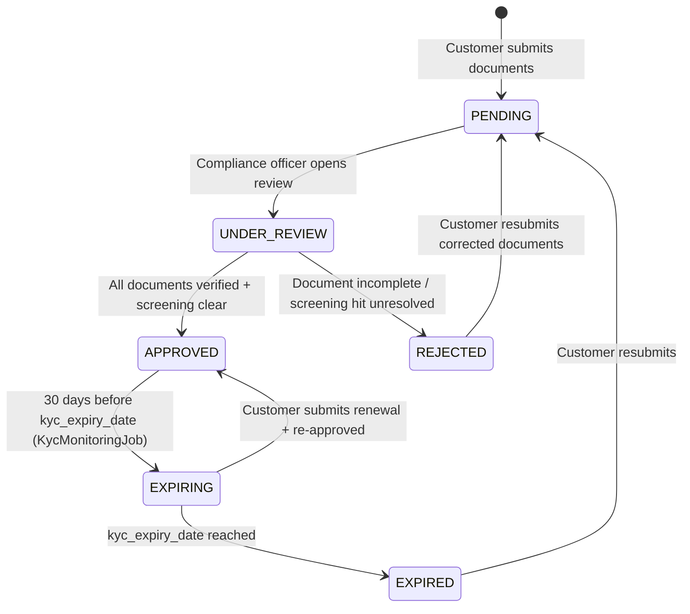

# KYC & AML { #kyc-aml }

!!! warning "EXTERNAL_REVIEW_REQUIRED"
    Questa pagina registra le mappature dei controlli previste e il comportamento corrente del repository. Non costituisce un consiglio
    legale né una prova della conformità AML/KYC. I requisiti di adeguata verifica della clientela, le prove, la cadenza,
    la conservazione, l'escalation e le modifiche consentite richiedono una revisione specifica dell'operatore, del cliente, del servizio,
    della transazione e della giurisdizione da parte di consulenti qualificati e dei responsabili del controllo.

Registerwerk contiene flussi di lavoro per documenti KYC/KYB, titolare effettivo, screening, approvazione e monitoraggio. I percorsi di emissione, distribuzione e trasferimento non applicano ancora in modo uniforme uno stato KYC approvato, pertanto questi moduli non devono essere descritti come un gate di conformità di produzione completo.

---

## KYC state machine { #kyc-state-machine }


```mermaid
stateDiagram-v2
    [*] --> PENDING : Customer submits documents
    PENDING --> UNDER_REVIEW : Compliance officer opens review
    UNDER_REVIEW --> APPROVED : All documents verified + screening clear
    UNDER_REVIEW --> REJECTED : Document incomplete / screening hit unresolved
    APPROVED --> EXPIRING : 30 days before kyc_expiry_date (KycMonitoringJob)
    EXPIRING --> APPROVED : Customer submits renewal + re-approved
    EXPIRING --> EXPIRED : kyc_expiry_date reached
    EXPIRED --> PENDING : Customer resubmits
    REJECTED --> PENDING : Customer resubmits corrected documents
```

La macchina a stati registra lo stato del cliente, ma un `LegalEntity` non approvato non è attualmente bloccato su ogni percorso di emissione, distribuzione o trasferimento. Resta necessario un gate operativo centrale, fail-closed (rifiuto in caso di errore).

---

## Modello dati { #data-model }

### `KycDocument` { #kycdocument }

Il record KYC principale. Uno `LegalEntity` può avere molti record `KycDocument`, uno per tipo di documento. Campi chiave:

| Campo | Tipo | Descrizione |
|---|---|---|
| `documentType` | Enum | Tipo di documento (vedi [requisiti per giurisdizione](#per-jurisdiction-requirements)) |
| `status` | Enum | `PENDING` / `APPROVED` / `REJECTED` / `EXPIRED` |
| `jurisdiction` | `Jurisdiction` | Quale giurisdizione copre questa approvazione |
| `s3Key` | String | Chiave di archiviazione oggetto per il file di documento |
| `expiresAt` | Instant | Per documenti a validità limitata |
| `approvedBy` | UUID | Riferimento all'`AppUser` che ha approvato |
| `approvedAt` | Instant | Timestamp di approvazione (immutabile una volta impostato) |

### `KycJurisdictionApproval` { #kycjurisdictionapproval }

Un record di approvazione per giurisdizione. Un `LegalEntity` può contenere approvazioni separate per ciascuna delle quattro giurisdizioni, consentendo a un cliente di operare in più mercati con un unico set di documenti.

### `NaturalPerson` { #naturalperson }

Memorizza i dati personali (PII) di amministratori, firmatari e titolari effettivi. Questi campi sono attualmente mappati su colonne di database ordinarie; la crittografia dei campi a livello di applicazione e un ciclo di vita DEK/KEK per record non sono implementati. Non inserire dati personali di produzione finché non sono implementati e verificati i controlli richiesti di crittografia, migrazione, gestione delle chiavi, backup e ripristino.

### `BeneficialOwner` { #beneficialowner }

Collega uno `LegalEntity` a uno `NaturalPerson` con:
- `ownershipPct` — percentuale di proprietà (soglia: 25%)
- `controlType` — DIRECT / INDIRECT / OTHER
- `registeredAt` / `ceasedAt` — periodo di proprietà

---

## Requisiti per giurisdizione {#per-jurisdiction-requirements}

=== "Germania (DE_EWPG)"

    | Tipo documento | Obbligatorio | Note |
    |---|---|---|
    | Certificato di costituzione | ✅ | Handelregisterauszug |
    | Registro dei soci | ✅ | |
    | Dichiarazione UBO | ✅ | Estratto Transparenzregister |
    | Identità (amministratori + UBO) | ✅ | |
    | Delibera consiliare | ✅ | Autorizzazione dell'emissione di token |
    | Relazione annuale | ✅ | Ultimi 2 anni |
    | Questionario AML GwG | ✅ | |
    | Certificato LEI | ✅ (consigliato) | |

=== "Lussemburgo (LU_CSSF)"

    | Tipo documento | Obbligatorio | Note |
    |---|---|---|
    | Certificato di costituzione | ✅ | |
    | Estratto RCS | ✅ | Registre du Commerce et des Sociétés |
    | Estratto RBE | ✅ | Registre des Bénéficiaires Effectifs |
    | Registro dei soci | ✅ | Obbligatorio per SICAV e SICAF |
    | Provenienza dei fondi | ✅ | Obbligatorio per tutti i clienti LU |
    | Questionario AML CSSF | ✅ | |
    | Identità (amministratori + UBO) | ✅ | |
    | Relazione annuale | ✅ | Ultimi 2 anni |

=== "Francia (FR_AMF)"

    | Tipo documento | Obbligatorio | Note |
    |---|---|---|
    | Extrait Kbis | ✅ | Non più vecchio di 3 mesi |
    | Statuts | ✅ | Statuto sociale |
    | Dichiarazione RBE | ✅ | Registre des Bénéficiaires Effectifs |
    | Identità (amministratori + UBO) | ✅ | |
    | Questionario AML AMF/ACPR PSAN | ✅ | |
    | Relazione annuale | ✅ | Ultimi 2 anni |
    | Provenienza dei fondi | ✅ (alto rischio) | |

=== "Liechtenstein (LI_TVTG)"

    | Tipo documento | Obbligatorio | Note |
    |---|---|---|
    | Handelsregisterauszug | ✅ | Non più vecchio di 3 mesi |
    | Dichiarazione UBO | ✅ | Formato allineato FMA |
    | Identità (amministratori + UBO) | ✅ | |
    | Whitepaper del token | ✅ | TVTG §9 — obbligatorio prima della distribuzione |
    | Audit dello smart contract | ✅ | Linee guida FMA per le offerte pubbliche |
    | Licenza di TT Service Provider | ✅ | |
    | Bilancio annuale | ✅ | Ultimi 2 anni |

---

## KYC controlli di approvazione { #kyc-approval-checks }

Una politica di approvazione completa non è applicata a livello centrale. Il repository attualmente fornisce controlli separati:

1. `KycComplianceService` calcola i risultati di presenza, età e scadenza per i requisiti di documento configurati.
2. `KycService` blocca l'approvazione quando lo screening dell'entità o del titolare effettivo collegato non è risolto.
3. Le approvazioni per giurisdizione possono registrare le lacune della checklist e una nota di deroga dell'operatore.
4. L'applicazione all'endpoint HTTP pertinente è separata dall'applicazione nei servizi di dominio.

Questi controlli non formano ancora un gate uniforme per emissione/ricezione/distribuzione/trasferimento, e gli elenchi o le soglie di documenti configurati non sono conclusioni legali.

L'interfaccia `ScreeningGate` nel modulo `screening` viene chiamata da `KycService.approveKyc()`:

```java
// KycService.approveKyc() — simplified
if (screeningGate.hasUnresolvedHit(entityId)) {
    throw new InvalidStateTransitionException("Open sanctions hit blocks KYC approval");
}
if (screeningGate.hasUnresolvedBeneficialOwnerHit(entityId)) {
    throw new InvalidStateTransitionException("Open UBO sanctions hit blocks KYC approval");
}
```

---

## Controlli CDD per l'approvazione di un'entità { #cdd-controls }

`POST /api/v1/entities/{id}/kyc/approve` (step-up e secondo approvatore) esegue ora gli stessi controlli di evidenza dell'approvazione per giurisdizione, più la copertura dei titolari effettivi. Tutte le soglie sono valori provvisori in attesa delle decisioni dell'operatore sulla metodologia di rischio; non sono una conclusione giuridica.

| Controllo | Regola |
|---|---|
| Stato dell'entità | solo `ACTIVE` o `PENDING_ONBOARDING` |
| Screening | nessun riscontro non risolto dell'entità; ogni titolare effettivo attuale sottoposto a screening e senza segnalazioni (un titolare cessato con un riscontro aperto continua a bloccare) |
| Checklist documentale | giurisdizione d'origine (paese di registrazione, o `jurisdiction` nel body); una checklist incompleta richiede `overrideNote` e un `REGISTRY_ADMIN` (accettazione del rischio, salvata nel record di evidenza) |
| Titolari effettivi | almeno uno; quota identificata pari ad almeno il 75 %, oppure un ripiego documentato sul dirigente principale (`controlType=SENIOR_MANAGING_OFFICIAL` con motivazione), che richiede anch'esso `overrideNote` e un `REGISTRY_ADMIN` |
| Validità | `expiryDate` non può superare `registerwerk.kyc.max-validity-months` (12 di default) ed è limitata alla data di revisione EDD di una PEP confermata collegata |

Ogni approvazione scrive un `kyc_approval_record` (snapshot della checklist, nota di deroga, copertura, secondo approvatore) e l'evento di audit `KYC_APPROVED` riporta gli stessi dati. `KycJurisdictionApproval` resta indicativo: nessun gate lo legge.

!!! note "Le approvazioni esistenti non vengono declassate"
    `GET /api/v1/kyc/evidence-gaps` elenca le entità `APPROVED` che non supererebbero i controlli attuali (checklist incompleta, nessun titolare effettivo, quota non spiegata, scadenza oltre il limite, PEP senza EDD, screening non risolto) da trattare alla prossima revisione.

**Documenti.** Il caricamento accetta `issueDate` e `expiresAt`. `expiresAt` è obbligatoria per passaporto, documento d'identità ed estratti di registro e non può essere nel passato; un documento scaduto non viene contato dalla checklist e il termine «troppo vecchio» decorre da `issueDate` se indicata. Elenco e download dei documenti (e l'elenco dei titolari effettivi) sono limitati a `REGISTRY_ADMIN`, `COMPLIANCE_OFFICER`, `AUDIT` e al `COMPANY_ADMIN` dell'entità; i download recano `X-Content-Type-Options: nosniff`.

**Titolari effettivi.** `ownershipPct` deve essere maggiore di 0 e al massimo 100, e il totale attivo non può superare 100; `GET .../beneficial-owners/summary` mostra la quota identificata e il resto non spiegato. `POST .../{id}/verify` registra il verificatore e il documento di evidenza. La cessazione (`DELETE` con body JSON) richiede step-up, un secondo approvatore e un motivo, ed è rifiutata finché lo screening della persona non è risolto: risolvere prima il riscontro tramite il percorso di accettazione. Aggiungere o cessare un titolare su un'entità `APPROVED` apre un'attività `KYC_REVIEW_REQUIRED`; lo stato non cambia automaticamente.

**PEP ed EDD.** La conferma di un riscontro PEP imposta `NaturalPerson.pepStatus=CONFIRMED_PEP`. Una PEP confermata supera il gate di screening solo finché è in vigore un'approvazione EDD: `POST .../{id}/edd-approvals` (`REGISTRY_ADMIN`, step-up, secondo approvatore, nota, data di revisione al massimo di sei mesi). Dopo la data di revisione la persona torna a bloccare. Non esistono rating di rischio, elenco dei paesi a rischio né checklist EDD; spettano all'analisi dei rischi dell'operatore (GwG § 5).

---

## Monitoraggio continuo { #ongoing-monitoring }

**GwG §10 Abs. 1 Nr. 5** ed equivalenti in tutte e quattro le giurisdizioni richiedono un monitoraggio continuo dei rapporti commerciali.

`KycMonitoringJob` (`kyc/internal/`) viene eseguito ogni giorno alle 02:00 UTC:

1. Recupera tutti i record `LegalEntity` con `kycStatus = APPROVED`
2. Se `kycExpiryDate` è entro 30 giorni → emette `KycExpiringEvent` (`reason=EXPIRING_SOON`; lo stato resta `APPROVED`) → notifica via email al `COMPANY_ADMIN` del cliente
3. Se `kycExpiryDate` è passato → passa a `EXPIRED`, emette `KycExpiringEvent` (`reason=EXPIRED`) → `KycChainPropagationListener` riporta la scadenza on-chain (vedi sotto)

Inoltre, il nuovo screening giornaliero (`ScreeningRefreshJob`) ricontrolla tutte le entità attive rispetto agli elenchi di sanzioni più recenti. Un nuovo riscontro viene salvato come `ScreeningHit` aperto e pubblicato come `ScreeningHitDetectedEvent` (registrato nell'audit). I riscontri aperti bloccano l'approvazione KYC e il regolamento off-chain delle operazioni tramite `ScreeningGate`. Un riscontro non esaminato **non attiva ancora alcuna azione on-chain automatica**: la risposta (sospensione, congelamento o verifica entro uno SLA) è una decisione di prodotto in sospeso.

### Propagazione on-chain di una scadenza KYC

Una scadenza KYC (`KycExpiringEvent` con `reason=EXPIRED`) o un rifiuto (`KycRejectedEvent`) viene riportato su ogni chain in cui l'entità ha una registrazione di organizzazione o una ONCHAINID. `KycChainPropagationListener` (`orgidentity/internal/`) registra una riga `kyc_chain_propagation` per entità e chain e la porta avanti finché tutto è confermato on-chain:

- **Sospensione dell'organizzazione**: `OrgRegistry.suspendOrg`, tramite lo stesso percorso fail-closed di una sospensione manuale. Questo blocca tutte le dApp protette da `PermissionOracle` e il paymaster.
- **Revoca dei claim**: per i claim KYC (topic 1) e AML (topic 2) dell'entità, `ONCHAINID.removeClaim` **e** `ClaimIssuer.revokeClaimBySignature`. La sola rimozione è reversibile, perché l'organizzazione potrebbe aggiungere di nuovo la firma originale. La revoca presso l'emittente fa sì che `isClaimValid` restituisca `false` ovunque, anche in `isVerified` di T-REX.

Ogni passaggio è idempotente e viene ritentato ogni minuto finché non è confermato. Gli errori vengono registrati nell'audit (`KYC_CHAIN_PROPAGATION`) ed esposti tramite il gauge `registerwerk_kyc_chain_propagation_failed` per l'alerting. Nulla viene annullato automaticamente: dopo una nuova approvazione (principio dei quattro occhi), l'operatore riattiva l'organizzazione ed emette esplicitamente nuovi claim.

!!! note "La scadenza del claim non viene applicata on-chain"
    Il valore `expiresAt` scritto nei dati del claim è solo informativo. Né `ClaimIssuer.isClaimValid` di ONCHAINID, né `isVerified` di T-REX, né `PermissionOracle` lo leggono. La scadenza ha effetto on-chain solo tramite la revoca attiva descritta sopra.

!!! warning "La revoca presso l'emittente richiede un contratto ClaimIssuer"
    `revokeClaimBySignature` si applica solo quando l'emittente del claim è un contratto `ClaimIssuer` di ONCHAINID su cui il firmatario del registro detiene una chiave MANAGEMENT. Per i claim il cui emittente è un semplice wallet firmatario non c'è nulla da revocare presso l'emittente, e il passaggio viene saltato.
