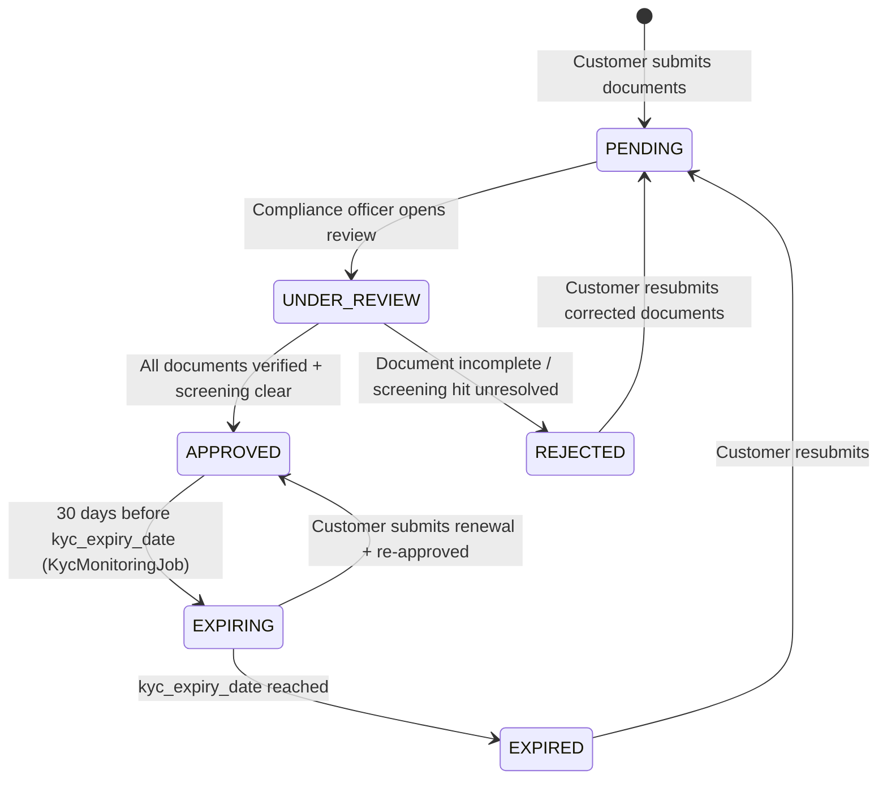

# KYC & AML

!!! warning "EXTERNAL_REVIEW_REQUIRED"
    This page records intended control mappings and current repository behavior. It is not legal
    advice or evidence of AML/KYC compliance. Customer-due-diligence requirements, evidence,
    cadence, retention, escalation, and permitted overrides require an operator-, customer-,
    service-, transaction-, and jurisdiction-specific review by qualified counsel and control owners.

Registerwerk contains KYC/KYB document, beneficial-owner, screening, approval, and monitoring workflows. Issuance, deployment, and transfer paths do not yet uniformly enforce an approved KYC state, so these modules must not be described as a complete production compliance gate.

---

## KYC state machine



The state machine records customer status, but an unapproved `LegalEntity` is not currently blocked from every issuance, deployment, or transfer path. A central, fail-closed operation gate remains required.

---

## Data model

### `KycDocument`

The core KYC record. One `LegalEntity` can have many `KycDocument` records, one per document type. Key fields:

| Field | Type | Description |
|---|---|---|
| `documentType` | Enum | Type of document (see [per-jurisdiction requirements](#per-jurisdiction-requirements)) |
| `status` | Enum | `PENDING` / `APPROVED` / `REJECTED` / `EXPIRED` |
| `jurisdiction` | `Jurisdiction` | Which jurisdiction this approval covers |
| `s3Key` | String | Object storage key for the document file |
| `expiresAt` | Instant | For time-limited documents |
| `approvedBy` | UUID | Reference to the `AppUser` who approved |
| `approvedAt` | Instant | Approval timestamp (immutable once set) |

### `KycJurisdictionApproval`

A per-jurisdiction sign-off record. One `LegalEntity` can hold separate approvals for each of the four jurisdictions, allowing a customer to operate in multiple markets with a single set of documents.

### `NaturalPerson`

Stores PII for directors, signatories, and beneficial owners. These fields are currently mapped to ordinary database columns; application-level field encryption and a per-record DEK/KEK lifecycle are not implemented. Do not enter production PII until the required encryption, migration, key-management, backup, and recovery controls are implemented and verified.

### `BeneficialOwner`

Links a `LegalEntity` to a `NaturalPerson` with:
- `ownershipPct` — ownership percentage (threshold: 25%)
- `controlType` — DIRECT / INDIRECT / OTHER
- `registeredAt` / `ceasedAt` — ownership period

---

## Per-jurisdiction requirements

=== "Germany (DE_EWPG)"

    | Document type | Required | Notes |
    |---|---|---|
    | Certificate of incorporation | ✅ | Handelregisterauszug |
    | Shareholder register | ✅ | |
    | UBO declaration | ✅ | Transparenzregister extract |
    | Identity (directors + UBOs) | ✅ | |
    | Board resolution | ✅ | Authorising token issuance |
    | Annual report | ✅ | Last 2 years |
    | GwG AML questionnaire | ✅ | |
    | LEI certificate | ✅ (recommended) | |

=== "Luxembourg (LU_CSSF)"

    | Document type | Required | Notes |
    |---|---|---|
    | Certificate of incorporation | ✅ | |
    | RCS extract | ✅ | Registre du Commerce et des Sociétés |
    | RBE extract | ✅ | Registre des Bénéficiaires Effectifs |
    | Shareholder register | ✅ | Mandatory for SICAVs and SICAFs |
    | Source of funds | ✅ | Mandatory for all LU customers |
    | CSSF AML questionnaire | ✅ | |
    | Identity (directors + UBOs) | ✅ | |
    | Annual report | ✅ | Last 2 years |

=== "France (FR_AMF)"

    | Document type | Required | Notes |
    |---|---|---|
    | Extrait Kbis | ✅ | ≤ 3 months old |
    | Statuts | ✅ | Articles of association |
    | RBE declaration | ✅ | Registre des Bénéficiaires Effectifs |
    | Identity (directors + UBOs) | ✅ | |
    | AMF/ACPR PSAN AML questionnaire | ✅ | |
    | Annual report | ✅ | Last 2 years |
    | Source of funds | ✅ (high-risk) | |

=== "Liechtenstein (LI_TVTG)"

    | Document type | Required | Notes |
    |---|---|---|
    | Handelsregisterauszug | ✅ | ≤ 3 months old |
    | UBO declaration | ✅ | FMA-aligned format |
    | Identity (directors + UBOs) | ✅ | |
    | Token whitepaper | ✅ | TVTG §9 — mandatory before deployment |
    | Smart contract audit | ✅ | FMA guidance for public offerings |
    | TT Service Provider licence | ✅ | |
    | Annual financial statements | ✅ | Last 2 years |

---

## KYC approval checks

A complete approval policy is not enforced centrally. The repository currently provides separate controls:

1. `KycComplianceService` calculates presence, age, and expiry results for configured document requirements.
2. `KycService` blocks approval when entity or linked beneficial-owner screening is unresolved.
3. Per-jurisdiction approvals can record checklist gaps and an operator override note.
4. Enforcement at the relevant HTTP endpoint is separate from enforcement in domain services.

These checks do not yet form a uniform issue/receive/deploy/transfer gate, and configured document lists or thresholds are not legal conclusions.

The `ScreeningGate` interface in the `screening` module is called by `KycService.approveKyc()`:

```java
// KycService.approveKyc() — simplified
if (screeningGate.hasUnresolvedHit(entityId)) {
    throw new InvalidStateTransitionException("Open sanctions hit blocks KYC approval");
}
if (screeningGate.hasUnresolvedBeneficialOwnerHit(entityId)) {
    throw new InvalidStateTransitionException("Open UBO sanctions hit blocks KYC approval");
}
```

---

## Ongoing monitoring

**GwG §10 Abs. 1 Nr. 5** and equivalents in all four jurisdictions require ongoing monitoring of business relationships.

`KycMonitoringJob` (`kyc/internal/`) runs daily at 02:00 UTC:

1. Fetches all `LegalEntity` records with `kycStatus = APPROVED`
2. If `kycExpiryDate` is within 30 days → transitions to `EXPIRING`, emits `KycExpiringEvent` → email notification to the customer's `COMPANY_ADMIN`
3. If `kycExpiryDate` has passed → transitions to `EXPIRED`, emits `KycExpiredEvent` → triggers removal from [ERC-3643 identity registry](../token-standards/erc3643.md)

Additionally, the `ScreeningService` runs nightly to re-screen all active entities against the latest sanctions lists. A newly discovered hit transitions the entity to a `SCREENING_REVIEW` flag and notifies the `COMPLIANCE_OFFICER`.
