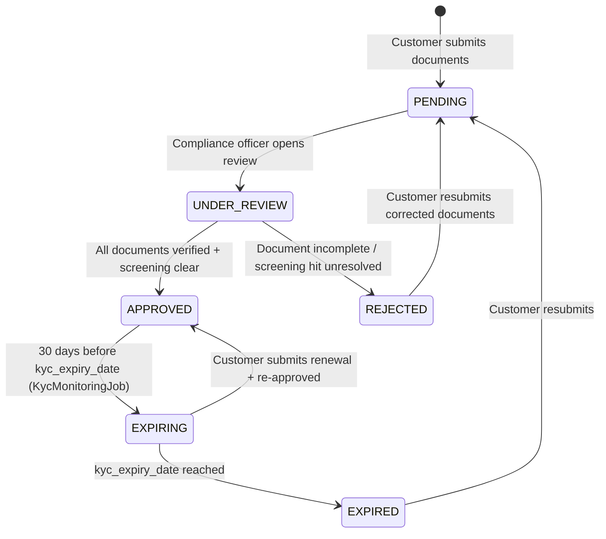

# KYC & AML

!!! warning "EXTERNAL_REVIEW_REQUIRED"
    This page records intended control mappings and current repository behavior. It is not legal
    advice or evidence of AML/KYC compliance. Customer-due-diligence requirements, evidence,
    cadence, retention, escalation, and permitted overrides require an operator-, customer-,
    service-, transaction-, and jurisdiction-specific review by qualified counsel and control owners.

Registerwerk contains KYC/KYB document, beneficial-owner, screening, approval, and monitoring workflows. Issuance, deployment, and transfer paths do not yet uniformly enforce an approved KYC state, so these modules must not be described as a complete production compliance gate.

---

## KYC state machine


```mermaid
stateDiagram-v2
    [*] --> PENDING : Customer submits documents
    PENDING --> UNDER_REVIEW : Compliance officer opens review
    UNDER_REVIEW --> APPROVED : All documents verified + screening clear
    UNDER_REVIEW --> REJECTED : Document incomplete / screening hit unresolved
    APPROVED --> EXPIRING : 30 days before kyc_expiry_date (KycMonitoringJob)
    EXPIRING --> APPROVED : Customer submits renewal + re-approved
    EXPIRING --> EXPIRED : kyc_expiry_date reached
    EXPIRED --> PENDING : Customer resubmits
    REJECTED --> PENDING : Customer resubmits corrected documents
```

The state machine records customer status, but an unapproved `LegalEntity` is not currently blocked from every issuance, deployment, or transfer path. A central, fail-closed operation gate remains required.

---

## Data model

### `KycDocument`

The core KYC record. One `LegalEntity` can have many `KycDocument` records, one per document type. Key fields:

| Field | Type | Description |
|---|---|---|
| `documentType` | Enum | Type of document (see [per-jurisdiction requirements](#per-jurisdiction-requirements)) |
| `status` | Enum | `PENDING` / `APPROVED` / `REJECTED` / `EXPIRED` |
| `jurisdiction` | `Jurisdiction` | Which jurisdiction this approval covers |
| `s3Key` | String | Object storage key for the document file |
| `expiresAt` | Instant | For time-limited documents |
| `approvedBy` | UUID | Reference to the `AppUser` who approved |
| `approvedAt` | Instant | Approval timestamp (immutable once set) |

### `KycJurisdictionApproval`

A per-jurisdiction sign-off record. One `LegalEntity` can hold separate approvals for each of the four jurisdictions, allowing a customer to operate in multiple markets with a single set of documents.

### `NaturalPerson`

Stores PII for directors, signatories, and beneficial owners. These fields are currently mapped to ordinary database columns; application-level field encryption and a per-record DEK/KEK lifecycle are not implemented. Do not enter production PII until the required encryption, migration, key-management, backup, and recovery controls are implemented and verified.

### `BeneficialOwner`

Links a `LegalEntity` to a `NaturalPerson` with:
- `ownershipPct` — ownership percentage (threshold: 25%)
- `controlType` — DIRECT / INDIRECT / OTHER
- `registeredAt` / `ceasedAt` — ownership period

---

## Per-jurisdiction requirements

=== "Germany (DE_EWPG)"

    | Document type | Required | Notes |
    |---|---|---|
    | Certificate of incorporation | ✅ | Handelregisterauszug |
    | Shareholder register | ✅ | |
    | UBO declaration | ✅ | Transparenzregister extract |
    | Identity (directors + UBOs) | ✅ | |
    | Board resolution | ✅ | Authorising token issuance |
    | Annual report | ✅ | Last 2 years |
    | GwG AML questionnaire | ✅ | |
    | LEI certificate | ✅ (recommended) | |

=== "Luxembourg (LU_CSSF)"

    | Document type | Required | Notes |
    |---|---|---|
    | Certificate of incorporation | ✅ | |
    | RCS extract | ✅ | Registre du Commerce et des Sociétés |
    | RBE extract | ✅ | Registre des Bénéficiaires Effectifs |
    | Shareholder register | ✅ | Mandatory for SICAVs and SICAFs |
    | Source of funds | ✅ | Mandatory for all LU customers |
    | CSSF AML questionnaire | ✅ | |
    | Identity (directors + UBOs) | ✅ | |
    | Annual report | ✅ | Last 2 years |

=== "France (FR_AMF)"

    | Document type | Required | Notes |
    |---|---|---|
    | Extrait Kbis | ✅ | ≤ 3 months old |
    | Statuts | ✅ | Articles of association |
    | RBE declaration | ✅ | Registre des Bénéficiaires Effectifs |
    | Identity (directors + UBOs) | ✅ | |
    | AMF/ACPR PSAN AML questionnaire | ✅ | |
    | Annual report | ✅ | Last 2 years |
    | Source of funds | ✅ (high-risk) | |

=== "Liechtenstein (LI_TVTG)"

    | Document type | Required | Notes |
    |---|---|---|
    | Handelsregisterauszug | ✅ | ≤ 3 months old |
    | UBO declaration | ✅ | FMA-aligned format |
    | Identity (directors + UBOs) | ✅ | |
    | Token whitepaper | ✅ | TVTG §9 — mandatory before deployment |
    | Smart contract audit | ✅ | FMA guidance for public offerings |
    | TT Service Provider licence | ✅ | |
    | Annual financial statements | ✅ | Last 2 years |

---

## KYC approval checks

A complete approval policy is not enforced centrally. The repository currently provides separate controls:

1. `KycComplianceService` calculates presence, age, and expiry results for configured document requirements.
2. `KycService` blocks approval when entity or linked beneficial-owner screening is unresolved.
3. Per-jurisdiction approvals can record checklist gaps and an operator override note.
4. Enforcement at the relevant HTTP endpoint is separate from enforcement in domain services.

These checks do not yet form a uniform issue/receive/deploy/transfer gate, and configured document lists or thresholds are not legal conclusions.

The `ScreeningGate` interface in the `screening` module is called by `KycService.approveKyc()`:

```java
// KycService.approveKyc() — simplified
if (screeningGate.hasUnresolvedHit(entityId)) {
    throw new InvalidStateTransitionException("Open sanctions hit blocks KYC approval");
}
if (screeningGate.hasUnresolvedBeneficialOwnerHit(entityId)) {
    throw new InvalidStateTransitionException("Open UBO sanctions hit blocks KYC approval");
}
```

---

## CDD controls for entity approval { #cdd-controls }

`POST /api/v1/entities/{id}/kyc/approve` (step-up and second approver) now runs the same evidence checks the jurisdiction approval uses, plus beneficial-owner coverage. All thresholds are interim values pending operator decisions on the risk methodology; they are not a legal conclusion.

| Check | Rule |
|---|---|
| Entity status | `ACTIVE` or `PENDING_ONBOARDING` only |
| Screening | no unresolved entity hit and every current beneficial owner screened and clear (a ceased owner with an open hit keeps blocking) |
| Document checklist | home jurisdiction (from the registration country, or `jurisdiction` in the body); an incomplete checklist needs `overrideNote` and a `REGISTRY_ADMIN` (risk acceptance, stored in the evidence record) |
| Beneficial owners | at least one; identified ownership of 75 % or more, or a documented senior-managing-official fallback (`controlType=SENIOR_MANAGING_OFFICIAL` with a reason), which also needs `overrideNote` and a `REGISTRY_ADMIN` |
| Validity | `expiryDate` must not exceed `registerwerk.kyc.max-validity-months` (default 12) and is capped at the EDD review date of a linked confirmed PEP |

Every approval writes a `kyc_approval_record` (checklist snapshot, override note, ownership coverage, second approver) and the `KYC_APPROVED` audit event carries the same payload. `KycJurisdictionApproval` stays advisory: no gate reads it.

!!! note "Existing approvals are not downgraded"
    `GET /api/v1/kyc/evidence-gaps` lists `APPROVED` entities that would fail today's checks (incomplete checklist, no beneficial owner, unexplained ownership, expiry beyond the cap, PEP without EDD, unresolved screening) for work at the next review.

**Documents.** The upload accepts `issueDate` and `expiresAt`. `expiresAt` is mandatory for passport, identity document and register extracts and must not be in the past; an expired document is not counted by the checklist, and the "too old" clock starts at `issueDate` when given. Listing and downloading documents (and the beneficial-owner list) is limited to `REGISTRY_ADMIN`, `COMPLIANCE_OFFICER`, `AUDIT` and the entity's own `COMPANY_ADMIN`; downloads are served with `X-Content-Type-Options: nosniff`.

**Beneficial owners.** `ownershipPct` must be above 0 and at most 100 and the active total must not exceed 100; `GET .../beneficial-owners/summary` shows the identified share and the unexplained remainder. `POST .../{id}/verify` records the verifier and the evidence document. Ceasing an owner (`DELETE`, with a JSON body) needs step-up, a second approver and a reason, and is refused while the person's screening is unresolved: resolve the hit through the acceptance path first. Adding or ceasing an owner on an `APPROVED` entity opens a `KYC_REVIEW_REQUIRED` task; the status is not changed automatically.

**PEP and EDD.** Confirming a PEP screening hit sets `NaturalPerson.pepStatus=CONFIRMED_PEP`. A confirmed PEP passes the screening gate only while an EDD approval is in force: `POST .../{id}/edd-approvals` (`REGISTRY_ADMIN`, step-up, second approver, note, review date of at most six months). After the review date the person blocks again. There is no risk rating, country-risk list or EDD checklist; those belong to the operator's risk analysis (GwG s.5).

---

## Ongoing monitoring

**GwG §10 Abs. 1 Nr. 5** and equivalents in all four jurisdictions require ongoing monitoring of business relationships.

`KycMonitoringJob` (`kyc/internal/`) runs daily at 02:00 UTC:

1. Fetches all `LegalEntity` records with `kycStatus = APPROVED`
2. If `kycExpiryDate` is within 30 days → emits `KycExpiringEvent` (`reason=EXPIRING_SOON`; the status stays `APPROVED`) → email notification to the customer's `COMPANY_ADMIN`
3. If `kycExpiryDate` has passed → transitions to `EXPIRED`, emits `KycExpiringEvent` (`reason=EXPIRED`) → `KycChainPropagationListener` pushes the lapse on chain (see below)

Additionally, the daily re-screen (`ScreeningRefreshJob`) re-checks all active entities against the latest sanctions lists. A new hit is stored as an open `ScreeningHit` and published as `ScreeningHitDetectedEvent` (audited). Open hits block KYC approval and off-chain trade settlement through `ScreeningGate`. An unreviewed hit triggers **no automatic on-chain action yet**: the response (suspend, freeze, or review within an SLA) is a pending product decision.

### On-chain propagation of a KYC lapse

A KYC expiry (`KycExpiringEvent` with `reason=EXPIRED`) or rejection (`KycRejectedEvent`) is pushed to every chain where the entity has an org registration or an ONCHAINID. `KycChainPropagationListener` (`orgidentity/internal/`) records one `kyc_chain_propagation` row per entity and chain and drives it until everything is confirmed on chain:

- **Org suspension** — `OrgRegistry.suspendOrg`, through the same fail-closed path as a manual suspension. This blocks every `PermissionOracle`-gated dApp and the paymaster.
- **Claim revocation** — for the entity's KYC (topic 1) and AML (topic 2) claims: `ONCHAINID.removeClaim` **and** `ClaimIssuer.revokeClaimBySignature`. Removal alone is reversible, because the org could re-add the original signature. Issuer-level revocation makes `isClaimValid` return `false` everywhere, including in T-REX `isVerified`.

Every step is idempotent and retried every minute until it is confirmed. Failures are audited (`KYC_CHAIN_PROPAGATION`) and exposed through the `registerwerk_kyc_chain_propagation_failed` gauge for alerting. Nothing is reversed automatically: after a re-approval (4-eyes), the operator reinstates the org and issues new claims explicitly.

!!! note "Claim expiry is not enforced on chain"
    The `expiresAt` value written into a claim's data is informational. Neither ONCHAINID's `ClaimIssuer.isClaimValid`, T-REX `isVerified` nor `PermissionOracle` reads it. Expiry takes effect on chain only through the push revocation described above.

!!! warning "Issuer-level revocation needs a ClaimIssuer contract"
    `revokeClaimBySignature` only applies when the claim's issuer is an ONCHAINID `ClaimIssuer` contract on which the registry signer holds a MANAGEMENT key. Claims recorded with a plain signer-wallet issuer have nothing to revoke at issuer level, and the step is skipped.
