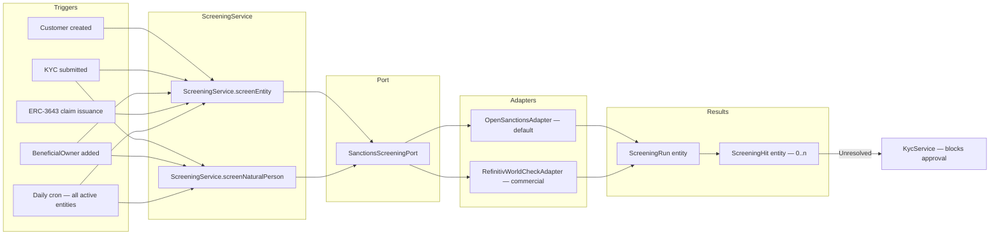

# Sanktionsprüfung { #sanctions-screening }

!!! warning "EXTERNAL_REVIEW_REQUIRED"
    Auf dieser Seite werden beabsichtigte Steuerungszuordnungen und konfigurierte Arbeitsabläufe
    aufgezeichnet. Sie ist kein Nachweis der Einhaltung von Sanktions-/PEP-Vorschriften oder
    vollständiger, aktueller, lizenzierter oder angemessen abgeglichener Quelldaten. Listen, Umfang,
    Abgleichsschwellenwerte, Überprüfung, Außerkraftsetzungen, Turnus und Aufbewahrung der
    Aufzeichnungen erfordern eine betreiber- und jurisdiktionsspezifische Genehmigung.

Registerwerk enthält Sanktions- und PEP-Überprüfungsauslöser an den unten aufgeführten
Lebenszykluspunkten. Abdeckung, Quellqualität, Abgleich, Überprüfung, Außerkraftsetzung, Turnus und
rechtliche Angemessenheit bleiben ungeprüft und erfordern die oben genannten Genehmigungen.

---

## Screening-Architektur { #screening-architecture }



---

## Geprüfte Listen { #screened-lists }

Der `OpenSanctionsAdapter` prüft standardmäßig gegen die folgenden Listen:

| Liste | Quelle | Abdeckung |
|---|---|---|
| OFAC SDN | US-Finanzministerium | US-Sanktionen — Einzelpersonen und Organisationen |
| EU CFSP | EU-Rat | Sanktionen der Gemeinsamen Außen- und Sicherheitspolitik |
| UN-Sicherheitsrat 1267 | Vereinte Nationen | Sanktionen gegen Al-Qaida und ISIL |
| UK HMT | His Majesty's Treasury | UK-Sanktionen |
| Schweizer SECO | Staatssekretariat für Wirtschaft | Schweizer Sanktionen |
| BaFin / EU-Sperrliste | BaFin über OpenSanctions | Deutsche innerstaatliche Einfrierungs-Zusätze |
| EU-PEP-Liste | OpenSanctions-Aggregation | Politisch exponierte Personen |

OpenSanctions stellt eine einheitliche REST-API bereit, die alle diese Listen abdeckt. Der Adapter cacht den vollständigen Datensatz lokal (alle 24 Stunden aktualisiert) und führt einen Fuzzy-Abgleich gegen Entitätsnamen, Aliasnamen, Geburtsdaten und Passnummern durch.

Für Einsätze, die eine höhere Zuverlässigkeit erfordern, kann der `RefinitivWorldCheckAdapter` (kommerziell) konfiguriert werden, indem `REFINITIV_WORLDCHECK_API_KEY` in der Umgebung gesetzt wird.

---

## Datenmodell { #data-model }

### `ScreeningRun` { #screeningrun }

Ein Datensatz pro Screening-Durchlauf. Felder:

| Feld | Beschreibung |
|---|---|
| `entityId` / `naturalPersonId` | Wer überprüft wurde |
| `startedAt` / `completedAt` | Zeitpunkte |
| `listsChecked` | Menge der in diesem Durchlauf einbezogenen Listen |
| `status` | `PENDING` / `COMPLETED` / `FAILED` |
| `hitCount` | Anzahl der gefundenen Treffer |
| `triggeredBy` | Was die Überprüfung ausgelöst hat (ONBOARDING / PERIODIC / MANUAL / CLAIM_ISSUANCE) |

### `ScreeningHit` { #screeninghit }

Ein Datensatz pro gefundener Übereinstimmung. Felder:

| Feld | Beschreibung |
|---|---|
| `runId` | FK zu `ScreeningRun` |
| `listSource` | Von welcher Liste der Treffer stammt (z. B. `OFAC_SDN`) |
| `matchScore` | 0–100, Fuzzy-Match-Konfidenz |
| `entityField` | Welches Feld übereinstimmte (z. B. `NAME`, `DATE_OF_BIRTH`) |
| `entityValue` | Der übereinstimmende Wert |
| `status` | `OPEN` / `ACCEPTED` / `FALSE_POSITIVE` |
| `acceptedBy` | UUID des `COMPLIANCE_OFFICER`, der den Treffer aufgelöst hat |
| `acceptedAt` | Zeitstempel der Annahme |
| `acceptReason` | Freitextbegründung (verpflichtend für `ACCEPTED`) |
| `dualControlApprover` | Erforderlich für Treffer oberhalb eines Risiko-Score-Schwellenwerts |

---

## Fail-Closed-Screening-Gate { #fail-closed-screening-gate }

Das Screening-Gate ist fail-closed ausgelegt (weist im Fehlerfall ab, statt durchzulassen) (GwG §10). Die KYC-Genehmigung — global **und** je Gerichtsbarkeit — wird blockiert, wenn:

- die Entität **noch nie überprüft wurde**,
- der letzte Durchlauf `PENDING` oder `ERROR` ist (eine nicht abgeschlossene Überprüfung ist kein eindeutiges Ergebnis),
- der letzte Durchlauf `REJECTED` ist, oder
- der letzte Durchlauf einen `HIT` mit mindestens einer ungeprüften Übereinstimmung ergeben hat.

Anbieterausfälle (Netzwerkfehler, API-Fehler, leere Anfrage) lösen eine `ScreeningProviderException` aus und erfassen den Durchlauf als `ERROR` — sie werden **niemals** stillschweigend als `CLEAR` behandelt. Sanktionssperren sind über `overrideNote` **nicht überschreibbar**; ein Admin-Override kann Lücken in der Checkliste ausräumen, nicht jedoch EU-Sanktionsrecht. Die Sperre wird aufgehoben, indem eine Überprüfung durchgeführt wird oder ein Compliance-Beauftragter die offenen Treffer klärt.

Der nächtliche `periodicRefresh`-Job lädt vor der erneuten Überprüfung den aktuellen Namen, das Registrierungsland und die LEI jeder Entität.

---

## Auflösen von Treffern { #resolving-hits }

Ein `ScreeningHit` im Status `OPEN` blockiert:
- die KYC-Genehmigung der zugehörigen Entität
- die Token-Ausgabe an die/von der Entität
- die Ausstellung von ERC-3643-Claims für die Entität

Ein `COMPLIANCE_OFFICER` kann einen Treffer entweder als `FALSE_POSITIVE` (nicht dieselbe Person) oder als `ACCEPTED` (bekanntes, dokumentiertes, akzeptables Risiko — z. B. ein Amtsträger, der keinen Sanktionen unterliegt) auflösen:

1. `POST /api/v1/compliance/screening/hits/{hitId}/accept`
2. Body: `{ "resolution": "FALSE_POSITIVE" | "ACCEPTED", "reason": "..." }`
3. Ein nicht leerer `reason` ist stets zwingend erforderlich (GwG §8 Dokumentationspflicht)
4. Bei Treffern mit hohem Score (Match-Score ≥ 0,80) ist ein zweiter Genehmiger obligatorisch — auf der Service-Ebene erzwungen
5. Der zweite Genehmiger muss ein **anderer Benutzer** als der annehmende Beamte sein (Selbstgenehmigung wird abgelehnt)

Alle Auflösungen werden zusammen mit der Identität des annehmenden Beamten im Audit-Log erfasst.

---

## Eskalation je Gerichtsbarkeit { #per-jurisdiction-escalation }

Wurde ein Treffer festgestellt und kann nicht sofort aufgelöst werden, hat jede Gerichtsbarkeit spezifische Eskalationspflichten:

=== "Deutschland (DE_EWPG)"
    Reichen Sie eine Verdachtsmeldung (SAR) bei der **BaFin** ein und, bei Verdacht auf Geldwäsche, bei der **FIU (Zentralstelle für Finanztransaktionsuntersuchungen)**. Das Modul `screening` speichert die SAR-Referenz in `ScreeningHit.regulatoryRef`.

=== "Luxemburg (LU_CSSF)"
    Reichen Sie einen Bericht bei der **CSSF Cellule Juridique de Prévention (JFP)** ein. In schwerwiegenden Fällen eskalieren Sie an die **CRF (Cellule de Renseignement Financier)**.

=== "Frankreich (FR_AMF)"
    Reichen Sie über den Meldemechanismus von AMF/ACPR einen Bericht bei **TRACFIN** ein. Der `ScreeningService` protokolliert die TRACFIN-Referenz, sobald sie eingereicht wurde.

=== "Liechtenstein (LI_TVTG)"
    Benachrichtigen Sie die **FMA** (Sanktions-Compliance) und reichen Sie in schwerwiegenden Fällen bei der **FIU Liechtenstein** ein.

---

## Integration mit `ScreeningGate` { #integration-with-screeninggate }

Die `ScreeningGate`-Schnittstelle (`screening/api/`) ist die öffentliche API, die von anderen Modulen verwendet wird:

```java
public interface ScreeningGate {
    boolean hasUnresolvedHit(UUID entityId);
    boolean hasUnresolvedBeneficialOwnerHit(UUID entityId);
}
```

`KycService` ruft dieses Gate auf, bevor KYC genehmigt wird. `TokenAdminController` ruft es auf, bevor einem neuen Inhaber der Empfang von Token gestattet wird. Dadurch wird sichergestellt, dass die Überprüfung an jedem Punkt durchgeführt wird, an dem eine neue Geschäftsbeziehung aufgebaut oder erweitert wird.
