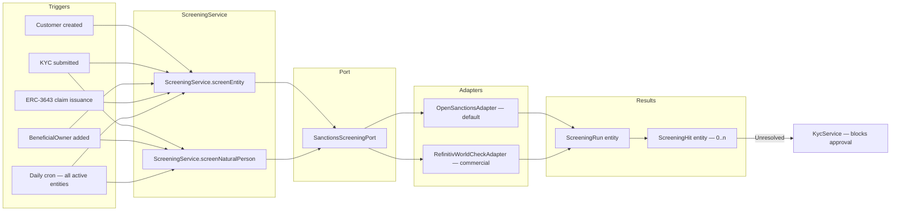

# Detección de sanciones { #sanctions-screening }

!!! warning "EXTERNAL_REVIEW_REQUIRED"
    Esta página registra las asignaciones de control previstas y los flujos de trabajo configurados. No es evidencia de
    cumplimiento en materia de sanciones/PEP, ni de que los datos de origen sean completos, actuales, con licencia o
    adecuadamente coincidentes. Las listas, el alcance, los umbrales de coincidencia, la revisión, las anulaciones, la
    cadencia y la retención de registros requieren aprobación específica del operador y de la jurisdicción.

Registerwerk contiene activadores de detección de sanciones y PEP en los puntos del ciclo de vida que se enumeran a continuación.
La cobertura, la calidad de la fuente, la coincidencia, la revisión, la anulación, la cadencia y la suficiencia legal
permanecen sin verificar y requieren las aprobaciones indicadas anteriormente.

---

## Arquitectura de detección { #screening-architecture }



---

## Listas filtradas { #screened-lists }

El `OpenSanctionsAdapter` compara las siguientes listas de forma predeterminada:

| Lista | Fuente | Cobertura |
|---|---|---|
| OFAC SDN | Tesoro de EE.UU. | Sanciones estadounidenses: personas y entidades |
| UE CFSP | Consejo de la UE | Sanciones de la Política Exterior y de Seguridad Común |
| Consejo de Seguridad de la ONU 1267 | Naciones Unidas | Sanciones a Al-Qaeda y ISIL |
| Reino Unido HMT | Tesoro de Su Majestad | Sanciones del Reino Unido |
| Suizo SECO | Secretaría de Estado de Asuntos Económicos | Sanciones suizas |
| Lista de congelación BaFin / UE | BaFin a través de OpenSanctions | Adiciones de congelación interna alemana |
| Lista UE PEP | Agregación OpenSanctions | Personas políticamente expuestas |

OpenSanctions proporciona una API REST unificada que cubre todas estas listas. El adaptador almacena en caché el conjunto de datos completo localmente (se actualiza cada 24 horas) y realiza coincidencias aproximadas con nombres de entidades, alias, fechas de nacimiento y números de pasaporte.

Para implementaciones que requieren mayor confianza, `RefinitivWorldCheckAdapter` (comercial) puede habilitarse configurando `REFINITIV_WORLDCHECK_API_KEY` en el entorno.

---

## Modelo de datos { #data-model }

### `ScreeningRun` { #screeningrun }

Un registro por ejecución de detección. Campos:

| Campo | Descripción |
|---|---|
| `entityId` / `naturalPersonId` | Quién fue examinado |
| `startedAt` / `completedAt` | Sincronización |
| `listsChecked` | Conjunto de listas incluidas en esta ejecución |
| `status` | `PENDING` / `COMPLETED` / `FAILED` |
| `hitCount` | Número de hits encontrados |
| `triggeredBy` | Qué causó la evaluación (ONBOARDING / PERIODIC / MANUAL / CLAIM_ISSUANCE) |

### `ScreeningHit` { #screeninghit }

Un registro por cada coincidencia encontrada. Campos:

| Campo | Descripción |
|---|---|
| `runId` | FK a `ScreeningRun` |
| `listSource` | De qué lista proviene el resultado (por ejemplo, `OFAC_SDN`) |
| `matchScore` | Confianza de coincidencia difusa de 0 a 100 |
| `entityField` | Qué campo coincide (por ejemplo, `NAME`, `DATE_OF_BIRTH`) |
| `entityValue` | El valor coincidente |
| `status` | `OPEN` / `ACCEPTED` / `FALSE_POSITIVE` |
| `acceptedBy` | UUID del `COMPLIANCE_OFFICER` que resolvió el hit |
| `acceptedAt` | Marca de tiempo de aceptación |
| `acceptReason` | Justificación de texto libre (obligatoria para `ACCEPTED`) |
| `dualControlApprover` | Requerido para hits por encima de un umbral de puntuación de riesgo |

---

## Puerta de detección con denegación por defecto (fail closed) { #fail-closed-screening-gate }

La puerta de detección deniega por defecto — falla cerrada (fail closed) — conforme al GwG §10. La aprobación de KYC (global **y** por jurisdicción) se bloquea cuando:

- la entidad **nunca ha sido examinada**,
- la última ejecución tiene estado `PENDING` o `ERROR` (una evaluación que no se completó no es un resultado concluyente),
- la última ejecución tiene estado `REJECTED`, o
- la última ejecución produjo un `HIT` con al menos una coincidencia sin revisar.

Los fallos del proveedor (errores de red, errores de API, consulta en blanco) generan `ScreeningProviderException` y registran la ejecución como `ERROR`: **nunca** se tratan silenciosamente como `CLEAR`. Los bloqueos de sanciones **no se pueden anular** mediante `overrideNote`; una anulación administrativa puede eliminar las lagunas de la lista de verificación, pero no la normativa de sanciones de la UE. El bloqueo se levanta ejecutando una nueva evaluación o cuando un oficial de cumplimiento resuelve los hits abiertos.

El trabajo nocturno `periodicRefresh` carga el nombre actual de cada entidad, su país de registro y su LEI antes de volver a evaluarla.

---

## Resolviendo hits { #resolving-hits }

Un `ScreeningHit` en estado `OPEN` bloquea:
- la aprobación KYC de la entidad asociada
- la emisión de tokens hacia/desde la entidad
- la emisión de claims ERC-3643 para la entidad

Un `COMPLIANCE_OFFICER` puede resolver un hit como `FALSE_POSITIVE` (no es la misma persona) o `ACCEPTED` (riesgo conocido, documentado y aceptable, por ejemplo, un funcionario público no sujeto a sanciones):

1. `POST /api/v1/compliance/screening/hits/{hitId}/accept`
2. Cuerpo: `{ "resolution": "FALSE_POSITIVE" | "ACCEPTED", "reason": "..." }`
3. Un `reason` que no esté en blanco siempre es obligatorio (deber de documentación GwG §8)
4. Para aciertos de puntuación alta (puntuación de coincidencia ≥ 0,80), es obligatorio un segundo aprobador, que se aplica en la capa de servicio
5. El segundo aprobador debe ser un **usuario diferente** que el oficial de aceptación (se rechaza la autoaprobación)

Todas las resoluciones se escriben en el registro de auditoría con la identidad del oficial que las acepta.

---

## Escalado por jurisdicción { #per-jurisdiction-escalation }

Después de que se encuentra una coincidencia y no se puede resolver de inmediato, cada jurisdicción tiene obligaciones de escalada específicas:

=== "Alemania (DE_EWPG)"
    Envíe un informe de actividad sospechosa (SAR) a **BaFin** y, si se sospecha de blanqueo de capitales, a la **FIU (Zentralstelle für Finanztransaktionsuntersuchungen)**. El módulo `screening` almacena la referencia del SAR en `ScreeningHit.regulatoryRef`.

=== "Luxemburgo (LU_CSSF)"
    Envíe un informe a la **CSSF Cellule Juridique de Prévention (JFP)**. Para casos graves, escale a la **CRF (Cellule de Renseignement Financier)**.

=== "Francia (FR_AMF)"
    Envíe un informe a **TRACFIN** a través del mecanismo de notificación de la AMF/ACPR. El `ScreeningService` registra la referencia de TRACFIN una vez presentada.

=== "Liechtenstein (LI_TVTG)"
    Notifique a la **FMA** (cumplimiento de sanciones) y presente el informe a la **FIU Liechtenstein** en casos graves.

---

## Integración con `ScreeningGate` { #integration-with-screeninggate }

La interfaz `ScreeningGate` (`screening/api/`) es la API pública utilizada por otros módulos:

```java
public interface ScreeningGate {
    boolean hasUnresolvedHit(UUID entityId);
    boolean hasUnresolvedBeneficialOwnerHit(UUID entityId);
}
```

`KycService` llama a esta puerta antes de aprobar KYC. `TokenAdminController` lo llama antes de permitir que un nuevo titular reciba tokens. Esto garantiza que se aplique un control en cada punto en el que se establezca o amplíe una nueva relación comercial.
