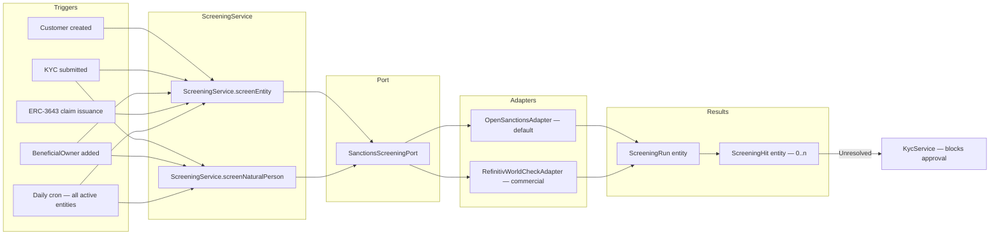

# Filtrage des sanctions {#sanctions-screening}

!!! warning "EXTERNAL_REVIEW_REQUIRED"
    Cette page enregistre les mappages de contrôle prévus et les flux de travail configurés. Elle ne constitue
    pas une preuve de conformité en matière de sanctions/PEP, ni de données source complètes, à jour, sous
    licence ou correctement appariées. Les listes, la portée, les seuils de correspondance, l'examen, les
    dérogations, la cadence et la conservation des enregistrements nécessitent une approbation spécifique à
    l'opérateur et à la juridiction.

Registerwerk contient des déclencheurs de filtrage des sanctions et PEP aux points du cycle de vie listés
ci-dessous. La couverture, la qualité des sources, la correspondance, l'examen, les dérogations, la cadence et
la suffisance juridique restent non vérifiées et nécessitent les approbations indiquées ci-dessus.

---

## Architecture de filtrage {#screening-architecture}



---

## Listes filtrées {#screened-lists}

Le `OpenSanctionsAdapter` vérifie par défaut les listes suivantes :

| Liste | Source | Couverture |
|---|---|---|
| OFAC SDN | Trésor américain | Sanctions américaines — personnes et entités |
| EU CFSP | Conseil de l'UE | Sanctions au titre de la politique étrangère et de sécurité commune |
| Conseil de sécurité de l'ONU 1267 | Nations Unies | Sanctions Al-Qaïda et Daech (ISIL) |
| UK HMT | His Majesty's Treasury | Sanctions britanniques |
| Swiss SECO | Secrétariat d'État à l'économie (Suisse) | Sanctions suisses |
| Liste de gel BaFin/UE | BaFin via OpenSanctions | Ajouts de gel spécifiques à l'Allemagne |
| Liste PPE de l'UE | Agrégation OpenSanctions | Personnes politiquement exposées |

OpenSanctions fournit une API REST unifiée couvrant toutes ces listes. L'adaptateur met en cache localement
l'ensemble de données complet (actualisé toutes les 24 heures) et effectue une correspondance floue sur les
noms d'entités, les alias, les dates de naissance et les numéros de passeport.

Pour les déploiements nécessitant un niveau de confiance plus élevé, le `RefinitivWorldCheckAdapter`
(commercial) peut être configuré en définissant `REFINITIV_WORLDCHECK_API_KEY` dans l'environnement.

---

## Modèle de données {#data-model}

### `ScreeningRun` {#screeningrun}

Un enregistrement par exécution de filtrage. Champs :

| Champ | Description |
|---|---|
| `entityId` / `naturalPersonId` | Qui a été filtré |
| `startedAt` / `completedAt` | Horodatage |
| `listsChecked` | Ensemble des listes incluses dans cette exécution |
| `status` | `PENDING` / `COMPLETED` / `FAILED` |
| `hitCount` | Nombre de correspondances trouvées |
| `triggeredBy` | Ce qui a déclenché le filtrage (ONBOARDING / PERIODIC / MANUAL / CLAIM_ISSUANCE) |

### `ScreeningHit` {#screeninghit}

Un enregistrement par correspondance trouvée. Champs :

| Champ | Description |
|---|---|
| `runId` | Clé étrangère vers `ScreeningRun` |
| `listSource` | La liste dont provient la correspondance (par exemple `OFAC_SDN`) |
| `matchScore` | Score de confiance de correspondance floue, de 0 à 100 |
| `entityField` | Le champ qui a correspondu (par exemple `NAME`, `DATE_OF_BIRTH`) |
| `entityValue` | La valeur correspondante |
| `status` | `OPEN` / `ACCEPTED` / `FALSE_POSITIVE` |
| `acceptedBy` | UUID du `COMPLIANCE_OFFICER` qui a résolu la correspondance |
| `acceptedAt` | Horodatage d'acceptation |
| `acceptReason` | Justification en texte libre (obligatoire pour `ACCEPTED`) |
| `dualControlApprover` | Requis pour les correspondances dépassant un seuil de score de risque |

---

## Porte de contrôle à rejet par défaut (fail closed) {#fail-closed-screening-gate}

La porte de contrôle du filtrage est à rejet par défaut — *fail closed* (GwG §10). L'approbation KYC — globale
**et** par juridiction — est bloquée lorsque :

- l'entité n'a **jamais été filtrée**,
- la dernière exécution est `PENDING` ou `ERROR` (un filtrage qui ne s'est pas terminé n'est pas un résultat
  clair),
- la dernière exécution est `REJECTED`, ou
- la dernière exécution a produit un `HIT` avec au moins une correspondance non examinée.

Les défaillances du fournisseur (erreurs réseau, erreurs d'API, requête vide) déclenchent une
`ScreeningProviderException` et enregistrent l'exécution comme `ERROR` — elles ne sont **jamais** traitées
silencieusement comme `CLEAR`. Les blocages liés aux sanctions ne sont **pas contournables** via `overrideNote` ;
une dérogation d'administrateur peut lever des lacunes de liste de contrôle, mais pas le droit des sanctions de
l'UE. Le blocage est levé en relançant un filtrage, ou par un responsable de la conformité qui résout les
correspondances ouvertes.

Le job nocturne `periodicRefresh` recharge le nom actuel, le pays d'enregistrement et le LEI de chaque entité
avant de procéder à un nouveau filtrage.

---

## Résolution des correspondances {#resolving-hits}

Un `ScreeningHit` au statut `OPEN` bloque :
- l'approbation KYC de l'entité associée
- l'émission de jetons vers/depuis l'entité
- l'émission d'attestations (claims) ERC-3643 pour l'entité

Un `COMPLIANCE_OFFICER` peut résoudre une correspondance soit comme `FALSE_POSITIVE` (il ne s'agit pas de la
même personne), soit comme `ACCEPTED` (risque connu, documenté et acceptable — par exemple, une personnalité
publique non soumise à des sanctions) :

1. `POST /api/v1/compliance/screening/hits/{hitId}/accept`
2. Corps : `{ "resolution": "FALSE_POSITIVE" | "ACCEPTED", "reason": "..." }`
3. Un `reason` non vide est toujours obligatoire (obligation de documentation GwG §8)
4. Pour les correspondances à score élevé (score de correspondance ≥ 0,80), un second approbateur est
   obligatoire — appliqué au niveau de la couche de service
5. Le second approbateur doit être un **utilisateur différent** de l'agent qui accepte (l'auto-approbation est
   rejetée)

Toutes les résolutions sont consignées dans le journal d'audit avec l'identité de l'agent qui a accepté.

---

## Escalade par juridiction {#per-jurisdiction-escalation}

Une fois qu'une correspondance est trouvée et ne peut pas être résolue immédiatement, chaque juridiction impose
des obligations d'escalade spécifiques :

=== "Allemagne (DE_EWPG)"

    Soumettez une déclaration d'activité suspecte (SAR) à **BaFin** et, en cas de soupçon de blanchiment
    d'argent, à la **FIU (Zentralstelle für Finanztransaktionsuntersuchungen)**. Le module `screening` stocke
    la référence de la SAR dans `ScreeningHit.regulatoryRef`.

=== "Luxembourg (LU_CSSF)"

    Soumettez un rapport à la **CSSF Cellule Juridique de Prévention (JFP)**. Pour les cas graves, transmettez
    le dossier à la **CRF (Cellule de Renseignement Financier)**.

=== "France (FR_AMF)"

    Soumettez un rapport à **TRACFIN** via le mécanisme de notification AMF/ACPR. Le `ScreeningService`
    enregistre la référence TRACFIN une fois la déclaration déposée.

=== "Liechtenstein (LI_TVTG)"

    Notifiez la **FMA** (conformité en matière de sanctions) et, pour les cas graves, déposez une déclaration
    auprès de la **FIU Liechtenstein**.

---

## Intégration avec `ScreeningGate` {#integration-with-screeninggate}

L'interface `ScreeningGate` (`screening/api/`) est l'API publique utilisée par les autres modules :

```java
public interface ScreeningGate {
    boolean hasUnresolvedHit(UUID entityId);
    boolean hasUnresolvedBeneficialOwnerHit(UUID entityId);
}
```

`KycService` appelle cette porte avant d'approuver un KYC. `TokenAdminController` l'appelle avant d'autoriser
un nouveau détenteur à recevoir des jetons. Cela garantit que le filtrage est appliqué à chaque point où une
nouvelle relation d'affaires est établie ou étendue.
