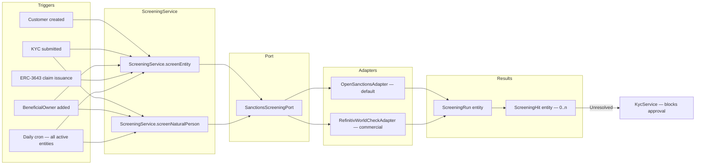

# Screening delle sanzioni { #sanctions-screening }

!!! warning "EXTERNAL_REVIEW_REQUIRED"
    Questa pagina registra le mappature dei controlli previsti e i flussi di lavoro configurati. Non costituisce prova di
    conformità in materia di sanzioni/PEP né di dati di origine completi, aggiornati, concessi in licenza o
    adeguatamente abbinati. Elenchi, ambito, soglie di corrispondenza, revisione, sostituzioni, cadenza e conservazione
    dei record richiedono l'approvazione specifica dell'operatore e della giurisdizione.

Registerwerk contiene trigger di screening sanzioni e PEP nei punti del ciclo di vita elencati di seguito.
Copertura, qualità della fonte, corrispondenza, revisione, override, cadenza e sufficienza legale rimangono
non verificati e richiedono le approvazioni sopra indicate.

---

## Architettura dello screening { #screening-architecture }



---

## Elenchi schermati { #screened-lists }

`OpenSanctionsAdapter` controlla i seguenti elenchi per impostazione predefinita:

| Elenco | Fonte | Copertura |
|---|---|---|
| OFAC SDN | Ministero del Tesoro americano | Sanzioni statunitensi — individui ed entità |
| UE CFSP | Consiglio UE | Sanzioni della politica estera e di sicurezza comune |
| Consiglio di Sicurezza delle Nazioni Unite 1267 | Nazioni Unite | Sanzioni ad Al-Qaeda e ISIL |
| Regno Unito HMT | Il Tesoro di Sua Maestà | Sanzioni del Regno Unito |
| Svizzero SECO | Segreteria di Stato per l'economia | Sanzioni svizzere |
| BaFin / Elenco congelamento UE | BaFin tramite OpenSanctions | Aggiunte di congelamento domestico tedesco |
| Elenco UE PEP | Aggregazione OpenSanctions | Persone politicamente esposte |

OpenSanctions fornisce un REST API unificato che copre tutti questi elenchi. L'adattatore memorizza nella cache locale il set di dati completo (aggiornato ogni 24 ore) ed esegue corrispondenze fuzzy con nomi di entità, alias, date di nascita e numeri di passaporto.

Per distribuzioni che richiedono maggiore affidabilità, `RefinitivWorldCheckAdapter` (commerciale) può essere configurato impostando `REFINITIV_WORLDCHECK_API_KEY` nell'ambiente.

---

## Modello dati { #data-model }

### `ScreeningRun` { #screeningrun }

Un record per esecuzione dello screening. Campi:

| Campo | Descrizione |
|---|---|
| `entityId` / `naturalPersonId` | Chi è stato sottoposto a screening |
| `startedAt` / `completedAt` | Tempistica |
| `listsChecked` | Insieme di elenchi inclusi in questa esecuzione |
| `status` | `PENDING` / `COMPLETED` / `FAILED` |
| `hitCount` | Numero di riscontri trovati |
| `triggeredBy` | Cosa ha attivato lo screening (ONBOARDING / PERIODIC / MANUAL / CLAIM_ISSUANCE) |

### `ScreeningHit` { #screeninghit }

Un record per ogni corrispondenza trovata. Campi:

| Campo | Descrizione |
|---|---|
| `runId` | FK a `ScreeningRun` |
| `listSource` | Da quale elenco proviene l'hit (ad es. `OFAC_SDN`) |
| `matchScore` | Confidenza della corrispondenza fuzzy 0–100 |
| `entityField` | Quale campo corrisponde (ad esempio, `NAME`, `DATE_OF_BIRTH`) |
| `entityValue` | Il valore corrispondente |
| `status` | `OPEN` / `ACCEPTED` / `FALSE_POSITIVE` |
| `acceptedBy` | UUID del `COMPLIANCE_OFFICER` che ha risolto il riscontro |
| `acceptedAt` | Timestamp di accettazione |
| `acceptReason` | Giustificazione a testo libero (obbligatoria per `ACCEPTED`) |
| `dualControlApprover` | Richiesto per risultati superiori a una soglia del punteggio di rischio |

---

## Gate di screening fail-closed (rifiuto in caso di errore) { #fail-closed-screening-gate }

Il gate di screening applica il rifiuto in caso di errore — fail closed (GwG §10): se lo screening non può essere eseguito, l'accesso viene negato, non concesso. L'approvazione KYC — globale **e** per giurisdizione — è bloccata quando:

- l'entità **non è mai stata sottoposta a screening**,
- l'ultima esecuzione è `PENDING` o `ERROR` (uno screening non completato non è un risultato chiaro),
- l'ultima esecuzione è `REJECTED`, o
- l'ultima esecuzione ha prodotto un `HIT` con almeno una corrispondenza non esaminata.

Errori del provider (errori di rete, errori API, query vuota) generano `ScreeningProviderException` e registrano l'esecuzione come `ERROR` — non vengono **mai** trattati silenziosamente come `CLEAR`. I blocchi delle sanzioni **non sono sostituibili** tramite `overrideNote`; un intervento amministrativo può ignorare le lacune della lista di controllo, ma non la normativa sulle sanzioni dell’UE. Il blocco viene rimosso eseguendo uno screening o tramite la risoluzione dei problemi aperti da parte di un responsabile della conformità.

Il lavoro notturno `periodicRefresh` carica il nome corrente, il paese di registrazione e il LEI di ciascuna entità prima di ripetere lo screening.

---

## Risoluzione dei riscontri { #resolving-hits }

Uno `ScreeningHit` nello stato `OPEN` blocca:
- l'approvazione KYC dell'entità collegata
- l'emissione di token verso / dall'entità
- l'emissione di claim ERC-3643 per l'entità

Un `COMPLIANCE_OFFICER` può risolvere un riscontro come `FALSE_POSITIVE` (non è la stessa persona) o `ACCEPTED` (rischio noto, documentato, accettabile — ad esempio, un pubblico ufficiale non soggetto a sanzioni):

1. `POST /api/v1/compliance/screening/hits/{hitId}/accept`
2. Corpo: `{ "resolution": "FALSE_POSITIVE" | "ACCEPTED", "reason": "..." }`
3. Uno `reason` non vuoto è sempre obbligatorio (obbligo di documentazione GwG §8)
4. Per i risultati con punteggi più alti (punteggio di corrispondenza ≥ 0,80), è obbligatorio un secondo approvatore, applicato a livello di servizio
5. Il secondo approvatore deve essere un **utente diverso** rispetto al funzionario accettante (l'autoapprovazione viene rifiutata)

Tutte le risoluzioni vengono scritte nel registro di controllo con l'identità del funzionario accettante.

---

## Escalation per giurisdizione { #per-jurisdiction-escalation }

Dopo che viene trovato un riscontro che non può essere risolto immediatamente, ciascuna giurisdizione ha obblighi di escalation specifici:

=== "Germania (DE_EWPG)"

    Inviare una segnalazione di operazione sospetta (SAR) alla **BaFin** e, se si sospetta riciclaggio di denaro, alla **FIU (Zentralstelle für Finanztransaktionsuntersuchungen)**. Il modulo `screening` memorizza il riferimento della SAR in `ScreeningHit.regulatoryRef`.

=== "Lussemburgo (LU_CSSF)"

    Presentare una segnalazione alla **CSSF Cellule Juridique de Prévention (JFP)**. Per i casi più gravi, procedere con l'escalation verso la **CRF (Cellule de Renseignement Financier)**.

=== "Francia (FR_AMF)"

    Inviare una segnalazione a **TRACFIN** tramite il meccanismo di notifica AMF/ACPR. `ScreeningService` registra il riferimento TRACFIN una volta presentata la segnalazione.

=== "Liechtenstein (LI_TVTG)"

    Notificare alla **FMA** (conformità in materia di sanzioni) e presentare una segnalazione alla **FIU Liechtenstein** per i casi gravi.

---

## Integrazione con `ScreeningGate` { #integration-with-screeninggate }

L'interfaccia `ScreeningGate` (`screening/api/`) è la API pubblica utilizzata da altri moduli:

```java
public interface ScreeningGate {
    boolean hasUnresolvedHit(UUID entityId);
    boolean hasUnresolvedBeneficialOwnerHit(UUID entityId);
}
```

`KycService` chiama questo gate prima di approvare KYC. `TokenAdminController` lo chiama prima di consentire a un nuovo titolare di ricevere token. Ciò garantisce che lo screening venga applicato in ogni momento in cui viene stabilito o ampliato un nuovo rapporto commerciale.
