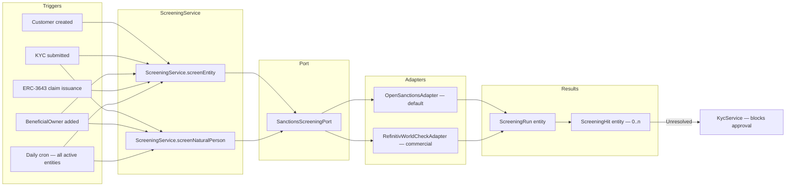

# Sanctions Screening

Registerwerk performs automated sanctions and PEP (Politically Exposed Person) screening at all critical points in the customer lifecycle. This satisfies GwG §10(2), AMLD6 Art. 18, and MiCAR Art. 60 obligations across all four [supported jurisdictions](../legal/index.md).

---

## Screening architecture



---

## Screened lists

The `OpenSanctionsAdapter` checks against the following lists by default:

| List | Source | Coverage |
|---|---|---|
| OFAC SDN | US Treasury | US sanctions — individuals and entities |
| EU CFSP | EU Council | Common Foreign and Security Policy sanctions |
| UN Security Council 1267 | United Nations | Al-Qaeda and ISIL sanctions |
| UK HMT | His Majesty's Treasury | UK sanctions |
| Swiss SECO | State Secretariat for Economic Affairs | Swiss sanctions |
| BaFin / EU Freeze list | BaFin via OpenSanctions | German domestic freeze additions |
| EU PEP list | OpenSanctions aggregation | Politically Exposed Persons |

OpenSanctions provides a unified REST API covering all these lists. The adapter caches the full dataset locally (refreshed every 24 hours) and performs fuzzy matching against entity names, aliases, dates of birth, and passport numbers.

For deployments requiring higher confidence, the `RefinitivWorldCheckAdapter` (commercial) can be configured by setting `REFINITIV_WORLDCHECK_API_KEY` in the environment.

---

## Data model

### `ScreeningRun`

One record per screening execution. Fields:

| Field | Description |
|---|---|
| `entityId` / `naturalPersonId` | Who was screened |
| `startedAt` / `completedAt` | Timing |
| `listsChecked` | Set of lists included in this run |
| `status` | `PENDING` / `COMPLETED` / `FAILED` |
| `hitCount` | Number of hits found |
| `triggeredBy` | What caused the screen (ONBOARDING / PERIODIC / MANUAL / CLAIM_ISSUANCE) |

### `ScreeningHit`

One record per match found. Fields:

| Field | Description |
|---|---|
| `runId` | FK to `ScreeningRun` |
| `listSource` | Which list the hit is from (e.g., `OFAC_SDN`) |
| `matchScore` | 0–100 fuzzy match confidence |
| `entityField` | Which field matched (e.g., `NAME`, `DATE_OF_BIRTH`) |
| `entityValue` | The matched value |
| `status` | `OPEN` / `ACCEPTED` / `FALSE_POSITIVE` |
| `acceptedBy` | UUID of the `COMPLIANCE_OFFICER` who resolved the hit |
| `acceptedAt` | Acceptance timestamp |
| `acceptReason` | Free-text justification (mandatory for `ACCEPTED`) |
| `dualControlApprover` | Required for hits above a risk score threshold |

---

## Resolving hits

A `ScreeningHit` in status `OPEN` blocks:
- KYC approval of the associated entity
- Token issuance to / from the entity
- ERC-3643 claim issuance for the entity

A `COMPLIANCE_OFFICER` can resolve a hit as either `FALSE_POSITIVE` (not the same person) or `ACCEPTED` (known, documented, acceptable risk — e.g., a public official not subject to sanctions):

1. `POST /api/v1/compliance/screening/hits/{hitId}/accept`
2. Body: `{ "resolution": "FALSE_POSITIVE" | "ACCEPTED", "reason": "..." }`
3. For high-score hits (≥ 80), a second approver from `SECOND_APPROVER` role is required

All resolutions are written to the audit log with the accepting officer's identity.

---

## Per-jurisdiction escalation

After a hit is found and cannot be immediately resolved, each jurisdiction has specific escalation obligations:

=== "Germany (DE_EWPG)"
    Submit a suspicious activity report (SAR) to **BaFin** and, if money laundering is suspected, to the **FIU (Zentralstelle für Finanztransaktionsuntersuchungen)**. The `screening` module stores the SAR reference in `ScreeningHit.regulatoryRef`.

=== "Luxembourg (LU_CSSF)"
    Submit a report to the **CSSF Cellule Juridique de Prévention (JFP)**. For severe cases, escalate to **CRF (Cellule de Renseignement Financier)**.

=== "France (FR_AMF)"
    Submit a report to **TRACFIN** via the AMF/ACPR notification mechanism. The `ScreeningService` logs the TRACFIN reference once filed.

=== "Liechtenstein (LI_TVTG)"
    Notify the **FMA** (sanctions compliance) and submit to the **FIU Liechtenstein** for severe cases.

---

## Integration with `ScreeningGate`

The `ScreeningGate` interface (`screening/api/`) is the public API used by other modules:

```java
public interface ScreeningGate {
    boolean hasUnresolvedHit(UUID entityId);
    boolean hasUnresolvedBeneficialOwnerHit(UUID entityId);
}
```

`KycService` calls this gate before approving KYC. `TokenAdminController` calls it before allowing a new holder to receive tokens. This ensures screening is enforced at every point where a new business relationship is established or expanded.
