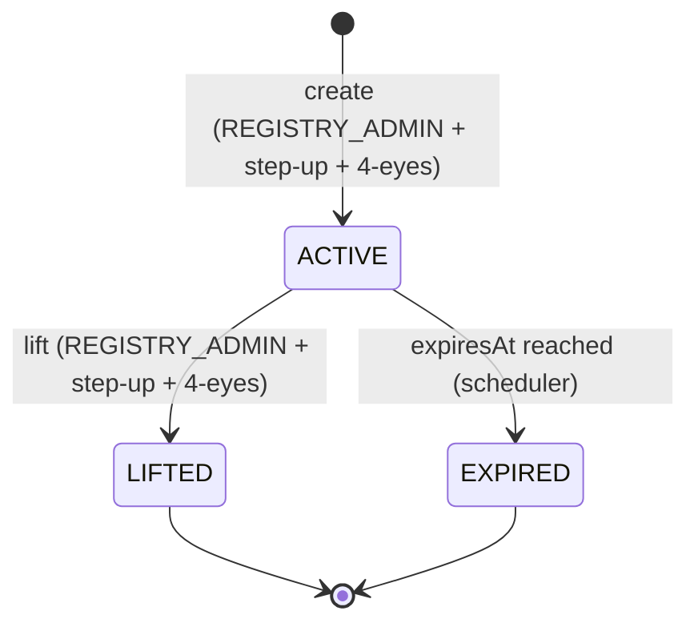

# Sperrvermerk – Handelsbeschränkungen auf Registrierungsebene { #sperrvermerk-registry-layer-trading-restrictions }

!!! warning "EXTERNAL_REVIEW_REQUIRED"
    Auf dieser Seite wird eine beabsichtigte Rechts-/Kontrollzuordnung aufgezeichnet. Es ist kein
    Beweis dafür, dass ein Datenbank-Flag oder eine Smart-Contract-Beschränkung eine Beschränkung
    mit rechtlicher Wirkung erstellt, aufzeichnet, aufhebt oder nachweist. Bei einem Sperrvermerk
    erfordern Instrumentenbedingungen, Weisungsbefugnis, Registerbefugnis, Nachweise und
    jurisdiktionsspezifische Verfahren eine qualifizierte externe Prüfung.

Der **Sperrvermerk** ist eine im Wertpapierregister eingetragene Sperre, die die Möglichkeit eines Inhabers einschränkt, seine Token zu übertragen, zu verpfänden oder anderweitig darüber zu verfügen. Er ist durch **eWpG §16** für das Kryptowertpapierregister vorgeschrieben und ist auf Registerebene das Äquivalent einer gerichtlichen Sperre oder Pfändungsnotation im traditionellen Wertpapierclearing.

Obwohl das Konzept seinen Ursprung im deutschen Recht hat, erkennen alle vier [unterstützten Gerichtsbarkeiten](../legal/index.md) gleichwertige Sperrmechanismen an. Registerwerk implementiert eine einzelne `HolderBlock`-Entität, die alle Blocktypen über alle Gerichtsbarkeiten hinweg abdeckt.

---

## Blocktypen { #block-types }

| Blocktyp | Deutscher Begriff | Beschreibung |
|---|---|---|
| `PFANDRECHT` | Pfandrecht | Verpfändung — der Inhaber hat die Position als Sicherheit verpfändet |
| `PFAENDUNG` | Pfändung | Pfändung — Gläubigervollstreckungsbeschluss |
| `GERICHTSBESCHLUSS` | Gerichtsbeschluss | Gerichtsbeschluss — allgemeine gerichtliche Sperre |
| `NACHLASSSPERRE` | Nachlasssperre | Nachlasssperre — anhängiges Nachlassverfahren |
| `VERFUGUNGSVERBOT` | Verfügungsverbot | Verfügungsverbot — gerichtlich oder behördlich angeordnet |
| `TOD` | Tod des Inhabers | Tod des Inhabers — ausstehende Nachlassregelung |
| `INSOLVENZ` | Insolvenz | Insolvenzverfahren — Insolvenzverwalter benachrichtigt |

---

## `HolderBlock`-Entität { #holderblock-entity }

Die `HolderBlock`-Entität im `kyc`-Modul speichert alle aktiven und historischen Blöcke:

| Feld | Beschreibung |
|---|---|
| `entityId` | FK zu `LegalEntity` |
| `assetId` | FK zu `Asset` |
| `walletAddress` | Bestimmte zu blockierende Wallet (optional — wenn null, alle Wallets der Entität) |
| `blockType` | Einer der oben genannten Typen |
| `legalBasis` | Rechtsgrundlage im Freitext (z. B. Gerichtsaktenzeichen) |
| `courtRef` | Gerichtsreferenznummer |
| `documentId` | FK zu `KycDocument`, der den Sperrbefehl enthält |
| `startsAt` | Wann der Block aktiv wird |
| `expiresAt` | Automatisches Ablaufdatum (nullbar — unbegrenzte Blöcke zulässig) |
| `liftedAt` | Wann die Sperre manuell aufgehoben wurde |
| `liftedBy` | UUID des Betreibers, der die Sperre aufgehoben hat |
| `twoManRuleApprover` | UUID des zweiten Genehmigers |
| `twoManRuleApprovedAt` | Wann der zweite Genehmiger bestätigt hat |
| `onChainFreezeTxHash` | Hash der entsprechenden On-Chain-Freeze-Transaktion |

---

## Lifecycle { #lifecycle }

**Erstellen eines Blocks:**
1. `REGISTRY_ADMIN` übermittelt `POST /api/v1/holder-blocks` mit Blocktyp, Rechtsgrundlage und optionalem Ablaufdatum
2. Der Aspekt `@RequiresStepUp` erzwingt ein frisches Step-up-Token (TOTP oder WebAuthn)
3. `SperrvermerkService` prüft, ob ein zweiter Genehmiger bestätigt hat (`dualControlPending`-Token)
4. Verwendet das Asset [ERC-3643](../token-standards/erc3643.md)-identitätsgebundene Token, wird `freezeAddress()` auf dem Compliance-Modul-Vertrag aufgerufen
5. Der `onChainFreezeTxHash` wird gespeichert, sobald die Transaktion bestätigt ist
6. Ein `AuditEvent` mit den vollständigen Blockdetails wird ausgegeben

**Aufheben eines Blocks:**
Es gilt derselbe Step-up-+-Vier-Augen-Ablauf. Das Aufheben ruft das entsprechende On-Chain-`unfreezeAddress()` auf und leert das Feld `HolderBlock.liftedAt`.

**Automatischer Ablauf:**
Ein `@Scheduled`-Job läuft nächtlich, findet alle `HolderBlock`-Datensätze, bei denen `expiresAt < NOW()` und `liftedAt IS NULL` gilt, versetzt sie in den Status `EXPIRED` und ruft das On-Chain-Unfreeze auf.

---

## Auswirkung auf Token-Operationen { #effect-on-token-operations }

`HolderBlock` wird auf mehreren Ebenen erzwungen:

| Vorgang | Durchsetzungspunkt |
|---|---|
| `forceTransfer` | `TokenAdminController` — wird vor jedem Übertragungsaufruf geprüft |
| `forceApprove` | `TokenAdminController` — wird vor der Genehmigung geprüft |
| `AssetHolder`-Erstellung (neuer Investor) | `AssetService` — bestehende Blöcke können neue Positionen verhindern |
| On-Chain-Übertragung (ERC-3643) | `ComplianceModuleContract` — das Identitätsregister lehnt eingefrorene Adressen ab |

Der Registry-Layer-Block (DB) und das On-Chain-Freeze (Smart Contract) sind **beide** für ERC-3643-Token erforderlich. Für andere Standards (ERC-20, ERC-3525) gilt nur der Registry-Layer-Block; die On-Chain-Übertragung wird dadurch verhindert, dass der Betreiber sich weigert, die Transaktion zu signieren.

---

## Audit-Trail { #audit-trail }

Jede Erstellung, Änderung und Aufhebung eines Blocks erzeugt ein `AuditEvent` vom Typ `HOLDER_BLOCK_CREATED`, `HOLDER_BLOCK_LIFTED` oder `HOLDER_BLOCK_EXPIRED`. Diese Ereignisse enthalten:

- Die Identität des initiierenden Betreibers
- Die Identität des zweiten Genehmigers (bei Erstellung/Aufhebung)
- Den vollständigen `HolderBlock`-Snapshot zum Zeitpunkt des Ereignisses
- Die Step-up-Token-Referenz (TOTP-Zeitstempel oder WebAuthn-Assertion-ID)

Dieser Audit-Trail soll die Dokumentation des Registereintrags unterstützen und ist durch die [Audit-Hash-Kette](../platform/audit-log.md) manipulationssicher nachweisbar; seine Vollständigkeit und die Behandlung nach eWpG §15 bedürfen einer externen Prüfung.
