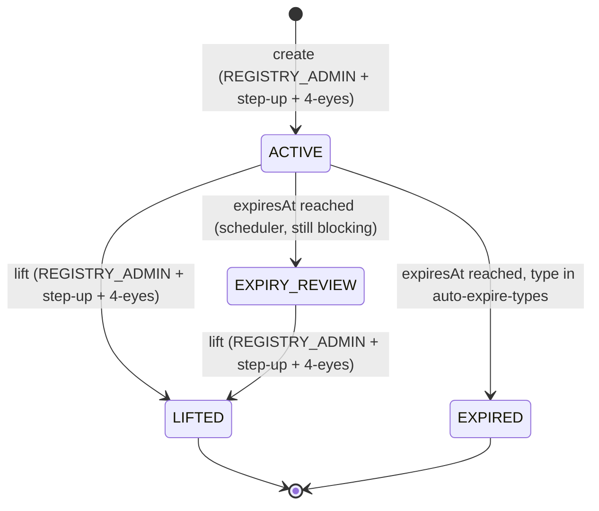

# Sperrvermerk – Handelsbeschränkungen auf Registrierungsebene { #sperrvermerk-registry-layer-trading-restrictions }

!!! warning "EXTERNAL_REVIEW_REQUIRED"
    Auf dieser Seite wird eine beabsichtigte Rechts-/Kontrollzuordnung aufgezeichnet. Es ist kein
    Beweis dafür, dass ein Datenbank-Flag oder eine Smart-Contract-Beschränkung eine Beschränkung
    mit rechtlicher Wirkung erstellt, aufzeichnet, aufhebt oder nachweist. Bei einem Sperrvermerk
    erfordern Instrumentenbedingungen, Weisungsbefugnis, Registerbefugnis, Nachweise und
    jurisdiktionsspezifische Verfahren eine qualifizierte externe Prüfung.

Der **Sperrvermerk** ist eine im Wertpapierregister eingetragene Sperre, die die Möglichkeit eines Inhabers einschränkt, seine Token zu übertragen, zu verpfänden oder anderweitig darüber zu verfügen. Er ist durch **eWpG §16** für das Kryptowertpapierregister vorgeschrieben und ist auf Registerebene das Äquivalent einer gerichtlichen Sperre oder Pfändungsnotation im traditionellen Wertpapierclearing.

Obwohl das Konzept seinen Ursprung im deutschen Recht hat, erkennen alle vier [unterstützten Gerichtsbarkeiten](../legal/index.md) gleichwertige Sperrmechanismen an. Registerwerk implementiert eine einzelne `HolderBlock`-Entität, die alle Blocktypen über alle Gerichtsbarkeiten hinweg abdeckt.

---

## Blocktypen { #block-types }

| Blocktyp | Deutscher Begriff | Beschreibung |
|---|---|---|
| `PFANDRECHT` | Pfandrecht | Verpfändung — der Inhaber hat die Position als Sicherheit verpfändet |
| `PFAENDUNG` | Pfändung | Pfändung — Gläubigervollstreckungsbeschluss |
| `GERICHTSBESCHLUSS` | Gerichtsbeschluss | Gerichtsbeschluss — allgemeine gerichtliche Sperre |
| `NACHLASSSPERRE` | Nachlasssperre | Nachlasssperre — anhängiges Nachlassverfahren |
| `VERFUGUNGSVERBOT` | Verfügungsverbot | Verfügungsverbot — gerichtlich oder behördlich angeordnet |
| `TOD` | Tod des Inhabers | Tod des Inhabers — ausstehende Nachlassregelung |
| `INSOLVENZ` | Insolvenz | Insolvenzverfahren — Insolvenzverwalter benachrichtigt |
| `REGULATORISCH` | Regulatorische Sperre | Regulatorische Sperre — von einer Aufsichtsbehörde angeordnet |

---

## `HolderBlock`-Entität { #holderblock-entity }

Die `HolderBlock`-Entität im `kyc`-Modul speichert alle aktiven und historischen Blöcke:

| Feld | Beschreibung |
|---|---|
| `id` | Primärschlüssel |
| `entityId` | FK auf `LegalEntity`. Gesetzt bei einem rechtsträgerbezogenen Block, der alle Inhaber-Wallets des Rechtsträgers erfasst (aus dem Inhaber-Eintrag der Wallet aufgelöst, wenn genau ein Rechtsträger die Wallet hält) |
| `assetId` | FK auf `Asset`; null bedeutet jeder Vermögenswert, den die Wallet hält |
| `walletAddress` | Die gesperrte Wallet — Pflichtfeld, in normalisierter Form gespeichert |
| `blockType` | Einer der obigen Typen |
| `status` | `ACTIVE`, `EXPIRY_REVIEW`, `LIFTED`, `EXPIRED` oder `SUPERSEDED` (siehe [Lifecycle](#lifecycle)) |
| `legalBasis` | Rechtsgrundlage im Freitext (z. B. Aktenzeichen) |
| `courtRef` | Gerichtliches Aktenzeichen |
| `documentId` | FK auf `KycDocument` mit der Sperranordnung |
| `startsAt` | Wann der Block wirksam wird |
| `expiresAt` | Ablaufdatum (nullable — unbefristete Blocks sind erlaubt) |
| `expiryConfirmedByApprover` | Ob der zweite Genehmiger das Ablaufdatum gegen die Anordnung bestätigt hat |
| `expiryReviewAt` | Wann der Block in `EXPIRY_REVIEW` überging |
| `liftedAt` / `liftedBy` / `liftReason` | Wann, durch wen und warum der Block aufgehoben wurde |
| `createdBy` | Der Betreiber, der den Block angelegt hat |
| `dualControlApproverId` | Der zweite Genehmiger (vom Step-up-Aspekt validiert) |
| `dualControlApprovedAt` | Wann die Genehmigung des zweiten Genehmigers erfasst wurde |
| `createdAt` / `updatedAt` | Zeitstempel des Datensatzes |
| `onChainFreezeTxHash` | Hash der ersten bestätigten On-Chain-Freeze-Transaktion dieses Blocks. Ein Block kann mehrere Deployments erreichen; das Ergebnis je Deployment und Wallet steht in `holder_block_freeze` (siehe [On-Chain-Wirkung](#on-chain-reach)) |

---

## Lifecycle { #lifecycle }

```mermaid
stateDiagram-v2
    [*] --> ACTIVE : create (REGISTRY_ADMIN + step-up + 4-eyes)
    ACTIVE --> LIFTED : lift (REGISTRY_ADMIN + step-up + 4-eyes)
    ACTIVE --> EXPIRY_REVIEW : expiresAt reached (scheduler, still blocking)
    EXPIRY_REVIEW --> LIFTED : lift (REGISTRY_ADMIN + step-up + 4-eyes)
    ACTIVE --> EXPIRED : expiresAt reached, type in auto-expire-types
    LIFTED --> [*]
    EXPIRED --> [*]
```

`SUPERSEDED` ist im Status-Enum definiert, wird aber von keinem aktuellen Codepfad gesetzt. `EXPIRED` wird nur für Blocktypen erreicht, die in `registerwerk.sperrvermerk.auto-expire-types` stehen (Standard leer); andernfalls führt ein abgelaufenes Datum zu `EXPIRY_REVIEW`.

**Erstellen eines Blocks:**
1. `REGISTRY_ADMIN` übermittelt `POST /api/v1/holder-blocks` mit Blocktyp, Rechtsgrundlage und optionalem Ablaufdatum
2. `@RequiresStepUp` erzwingt ein frisches Step-up-Token (lokales TOTP oder der Entra-Authentifizierungskontext) und einen zweiten Genehmiger: Das Token des Genehmigers wird in `X-Dual-Control-Token` gesendet und vom Step-up-Aspekt validiert, und der Dienst erhält die ID des Genehmigers
3. `SperrvermerkService` hält den Block mit `dualControlApproverId` und `dualControlApprovedAt` fest
4. Sobald der Block committet ist, friert `SperrvermerkOnchainSyncListener` die Wallet über den dauerhaften Transaktions-Outbox auf jedem aktiven Token-Deployment der gehaltenen Assets ein (bei einem Asset-bezogenen Block nur auf dem des `assetId`). Welche Standards sich einfrieren lassen, steht [unten](#on-chain-reach); ein Deployment, das sich nicht einfrieren lässt, wird erfasst und eskaliert, nicht übersprungen
5. Das Ergebnis je Block, Deployment und Wallet wird in `holder_block_freeze` festgehalten und folgt dem Transaktionsstatus: `SUBMITTED` wird zu `CONFIRMED` (dann wird `onChainFreezeTxHash` gespeichert) oder zu `FAILED`
6. Ein `AuditEvent` mit den vollständigen Blockdetails wird ausgegeben

**Aufheben eines Blocks:**
Es gilt derselbe Step-up-+-Vier-Augen-Ablauf. Das Aufheben gleicht in umgekehrter Richtung ab: Je Wallet und Deployment wird das On-Chain-Unfreeze nur eingereicht, wenn kein verbleibender sperrender Block die Wallet noch abdeckt (`RELEASE_SUBMITTED`, danach `RELEASED`). Ein fehlgeschlagenes Unfreeze lässt die Wallet eingefroren, wird gemeldet (`HOLDER_BLOCK_RELEASE_FAILED`, Operator-Aufgabe) und erneut versucht. Im Register ist der Block in jedem Fall `LIFTED`; `liftedAt` und `liftedBy` werden gesetzt.

**Automatischer Ablauf:**
Ein `@Scheduled`-Job läuft nächtlich und findet alle ACTIVE-Blöcke mit `expiresAt < NOW()`. Standardmäßig **läuft kein Block-Typ automatisch ab**: Der Block wechselt in `EXPIRY_REVIEW`, sperrt weiterhin (Register-Gates und On-Chain-Freeze), und es werden eine Operator-Aufgabe und eine Compliance-E-Mail ausgelöst. Aufgehoben wird er nur über die normale Aufhebung (Step-up + zweiter Genehmiger). Typen in `registerwerk.sperrvermerk.auto-expire-types` (Standard leer) werden weiterhin automatisch auf `EXPIRED` gesetzt.

!!! note "Ablaufdaten (6-25)"
    `expiresAt` muss in der Zukunft liegen. Bei Gerichts- und Behördentypen (`GERICHTSBESCHLUSS`, `PFAENDUNG`, `INSOLVENZ`, `NACHLASSSPERRE`, `VERFUGUNGSVERBOT`, `TOD`, `REGULATORISCH`) braucht ein Ablaufdatum zusätzlich `courtRef` oder `documentId`, und der zweite Genehmiger bestätigt es gegen die Anordnung. Wird der letzte Block aufgehoben, werden alle Freezes gelöst, die kein verbleibender Block mehr abdeckt – über alle Assets der Wallet; entitätsbezogene Blöcke gelten für alle Halter-Wallets der Entität. Reine Wallet-Blöcke sind auch für die Repo-Desk- und Lending-Gates sichtbar. Ob ein Typ automatisch ablaufen darf, ist eine geparkte Rechtsentscheidung (T6-11).

---

## Auswirkung auf Token-Operationen { #effect-on-token-operations }

`HolderBlock` wird auf mehreren Ebenen erzwungen:

| Vorgang | Durchsetzungspunkt |
|---|---|
| EVM-Token-Administration (`TokenAdminService`, `Erc3525AdminService`, `Erc7540AdminService`, `Erc3643LifecycleService`) | Ein privilegierter Vorgang, an dem eine gesperrte Wallet beteiligt ist, wird abgelehnt (fail closed) |
| ERC-3643-Claim-Ausstellung (`ClaimIssuanceService`) | Für einen gesperrten Rechtsträger wird kein On-Chain-Identitäts-Claim ausgestellt |
| Registerseitige Portfoliomigration (`PortfolioMigrationService`) | Die Position eines gesperrten Inhabers wird nicht migriert |
| Ausgehende Ziele und Beteiligten-Eignung (`OutboundDestinationGateImpl`, `PartyEligibilityGateImpl`) | Genutzt von Handel, Repo, Lending und Auszahlungen bei Kapitalmaßnahmen: Eine gesperrte Partei oder ein gesperrtes Ziel wird abgelehnt; schützende Repo-Aktionen des Kreditgebers werden stattdessen für den Betreiber markiert |
| On-Chain-Transfer | Der Token-Vertrag lehnt Bewegungen von, zu oder durch eine eingefrorene Adresse ab (`freezeAddress` / `setAddressFrozen`), siehe [On-Chain-Wirkung](#on-chain-reach) |

---

## On-Chain-Wirkung { #on-chain-reach }

Der Block der Registerebene (Datenbank) ist die maßgebliche Quelle für Registerwerks eigene Prüfungen und gilt für jeden Token-Standard. Das On-Chain-Einfrieren spiegelt ihn dort, wo ein Vertrag ihn ausdrücken kann, sodass auch Pfade, die das Backend nicht vermittelt (direkte Transfers, Repo-`repay`/`liquidate`, Vault-Einzahlungen und -Rücknahmen), für die Wallet geschlossen sind. Es ist eine technische Maßnahme, keine Rechtswirkung (siehe den Prüfhinweis oben).

| Standard / Chain | Automatischer On-Chain-Freeze | Wie |
|---|---|---|
| ERC-20, ERC-721, ERC-1155 | Ja | `freezeAddress(address,string)` (`EwpgCompliance`) über den Token-Admin-Port |
| ERC-3525 | Ja | `freezeAddress` über den ERC-3525-Admin-Port; ein manuelles Unfreeze wird abgelehnt, solange ein Block die Wallet abdeckt |
| ERC-4626 / ERC-7540 Vault-Anteile | Ja | `freezeAddress` (`EwpgCompliance`); an einen eingefrorenen Eigentümer oder Zahler wird nicht ausgezahlt, das Escrow bleibt im Vault (Freeze-in-place) |
| ERC-3643 (T-REX) | Ja | `setAddressFrozen(address,true)` auf dem Token (`Erc3643LifecycleService`) |
| Vertrauliches ERC-3643 (Zama fhEVM) | Ja | `setAddressFrozen(address,bool)` |
| Vertrauliches ERC-20 | Nein | der Vertrag hat keine Freeze-Funktion |
| Solana (SPL, Token-2022 und die Erweiterungs-Presets) | Nein | `FreezeAccount` wirkt je Token-Konto und ist eine manuelle Betreiberaktion |
| Starknet (ERC-20, ERC-3525) | Nein | die Cairo-Verträge haben `freeze_address`, das aber nur ein manueller Betreiberaufruf ist: Starknet-Invokes laufen nicht über den dauerhaften Outbox und ihre Receipts werden nicht verfolgt, ein Ergebnis ließe sich also nicht bestätigen |
| Stellar | Nein | ein Freeze ist eine Änderung der Trustline-Autorisierung, eine manuelle Betreiberaktion |
| Canton / Daml | Nein | kein Freeze auf Halterebene, den das Register steuern kann |

Jeder Freeze läuft über den dauerhaften Transaktions-Outbox (in der Datenbanktransaktion signiert, nach dem Commit gesendet), und sein Ergebnis wird aus dem Transaktionsstatus gelesen. `holder_block_freeze` führt eine Zeile je Block, Deployment und Wallet:

| Status | Bedeutung |
|---|---|
| `SUBMITTED` | die Freeze-Transaktion liegt im Outbox, ihr Ergebnis ist noch nicht final |
| `CONFIRMED` | die Transaktion ist final und erfolgreich; `onChainFreezeTxHash` ist gespeichert; Audit-Ereignis `HOLDER_BLOCK_FREEZE_CONFIRMED` |
| `FAILED` | der Freeze konnte nicht eingereicht werden, wurde zurückgesetzt (Revert) oder ersetzt: die Wallet kann on-chain noch Bewegungen ausführen |
| `UNSUPPORTED_ON_CHAIN` | der Standard bzw. die Chain hat keinen automatischen Freeze (Tabelle oben): manuelles Eingreifen nötig |
| `RELEASE_SUBMITTED` / `RELEASED` / `RELEASE_FAILED` | dasselbe für das Unfreeze nach einem aufgehobenen Block; `RELEASED` umfasst auch „ein anderer Block deckt die Wallet noch ab, der Freeze bleibt“ |

Ein Ergebnis `FAILED` oder `UNSUPPORTED_ON_CHAIN` bleibt nie unbemerkt: Es löst das Audit-Ereignis `HOLDER_BLOCK_NOT_PROPAGATED` aus (`cause`: `SUBMISSION_FAILED`, `TX_FAILED`, `UNSUPPORTED_ON_CHAIN`, `NO_DEPLOYMENT_MATCHED` oder `DRIFT`), eine Operator-Aufgabe `SPERRVERMERK_FREEZE_NOT_PROPAGATED` auf der Emittenten-Entität des Assets, die Gauges `registerwerk_sperrvermerk_freeze_failed` / `registerwerk_sperrvermerk_freeze_unsupported` und die Alarme `SperrvermerkFreezeFailed` / `SperrvermerkFreezeUnsupported`. **Der Block auf Registerebene wird dadurch nie aufgehoben.**

Zwei Jobs halten die Chain mit dem Register im Einklang (beide durch ShedLock abgesichert). Ein Sweep alle 5 Minuten liest das Ergebnis eingereichter Freezes und wiederholt fehlgeschlagene mit Back-off (5 Versuche; `registerwerk.sperrvermerk.freeze-sweep-ms`). Ein nächtlicher Abgleich (`registerwerk.sperrvermerk.freeze-reconcile-cron`, Standard 02:30) geht jeden Block durch, der noch sperrt, also `ACTIVE` und `EXPIRY_REVIEW`: Er sendet fehlende und fehlgeschlagene Freezes erneut, liest bei bestätigten `isFrozen` zurück und meldet eine Wallet, die **nicht** eingefroren ist, als Drift (`registerwerk_sperrvermerk_freeze_drift_total`, Alarm `SperrvermerkFreezeDrift`, danach wird sie erneut eingefroren). Ein fehlgeschlagenes Unfreeze lässt die Wallet eingefroren (die sichere Richtung) und wird über `HOLDER_BLOCK_RELEASE_FAILED` gemeldet.

---

## Audit-Trail { #audit-trail }

Jede Anlage, Änderung und Aufhebung eines Blocks erzeugt ein `AuditEvent` vom Typ `HOLDER_BLOCK_CREATED` oder `HOLDER_BLOCK_LIFTED` (eine automatische Aufhebung trägt den Grund `AUTO_EXPIRED`); das Erreichen des Ablaufdatums löst `HOLDER_BLOCK_EXPIRY_REVIEW` aus. Die On-Chain-Folgeschritte fügen `HOLDER_BLOCK_FREEZE_CONFIRMED`, `HOLDER_BLOCK_NOT_PROPAGATED` und `HOLDER_BLOCK_RELEASE_FAILED` hinzu. Diese Ereignisse enthalten:

- Die Identität des initiierenden Betreibers
- Die Identität des zweiten Genehmigers (bei Erstellung/Aufhebung)
- Den vollständigen `HolderBlock`-Snapshot zum Zeitpunkt des Ereignisses
- Das Ereignis `DUAL_CONTROL_APPROVED`, das die Genehmigung des zweiten Genehmigers festgehalten hat (Token-ID und Request-Digest), bei Anlage/Aufhebung

Dieser Audit-Trail soll die Dokumentation des Registereintrags unterstützen und ist durch die [Audit-Hash-Kette](../platform/audit-log.md) manipulationssicher nachweisbar; seine Vollständigkeit und die Behandlung nach eWpG §15 bedürfen einer externen Prüfung.
