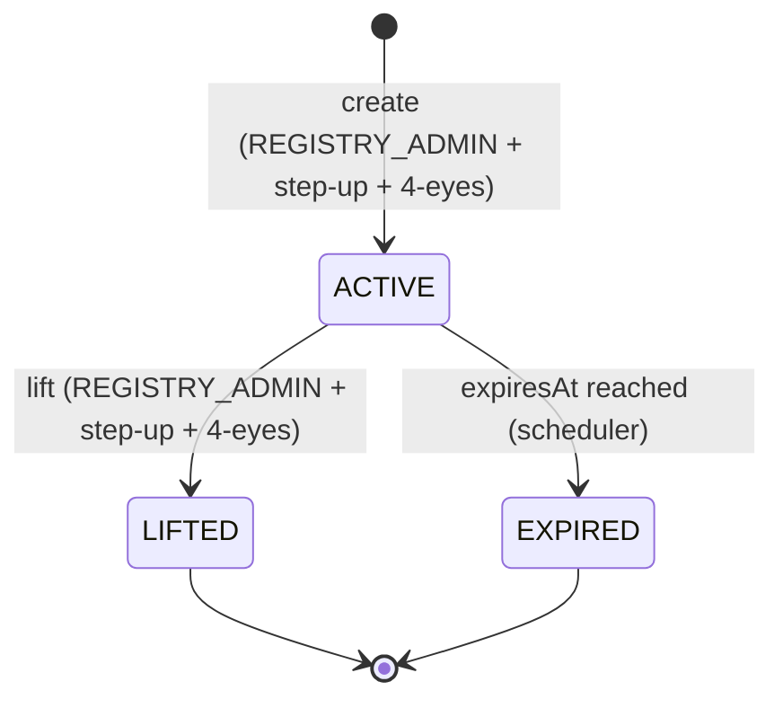

# Sperrvermerk: Restricciones comerciales en la capa de registro { #sperrvermerk-registry-layer-trading-restrictions }

!!! warning "EXTERNAL_REVIEW_REQUIRED"
    Esta página registra un mapeo legal/de control previsto. No es evidencia de que una marca de base de datos
    o una restricción de contrato inteligente cree, registre, levante o demuestre una restricción con el efecto
    legal de un Sperrvermerk. Los términos del instrumento, la autoridad de instrucción, la autoridad de registro,
    la evidencia y el procedimiento específico de la jurisdicción requieren una revisión externa calificada.

El **Sperrvermerk** es una notación de bloqueo en el registro de valores que restringe la capacidad de un titular para transferir, pignorar o disponer de otro modo de sus tokens. Está ordenado por **eWpG §16** para el registro de valores criptográficos y es el equivalente en la capa de registro de una congelación judicial o notación de compromiso en la compensación de valores tradicional.

Aunque el concepto se origina en la ley alemana, las cuatro [jurisdicciones admitidas](../legal/index.md) reconocen mecanismos de bloqueo equivalentes. Registerwerk implementa una única entidad `HolderBlock` que cubre todos los tipos de bloques en todas las jurisdicciones.

---

## Tipos de bloques { #block-types }

| Tipo de bloque | Término alemán | Descripción |
|---|---|---|
| `PFANDRECHT` | Pfandrecht | Prenda — el titular ha pignorado la posición como garantía |
| `PFAENDUNG` | Pfändung | Embargo — orden de ejecución del acreedor |
| `GERICHTSBESCHLUSS` | Gerichtsbeschluss | Orden judicial — congelación judicial general |
| `NACHLASSSPERRE` | Nachlasssperre | Nachlasssperre (bloqueo sucesorio) — procedimiento sucesorio pendiente |
| `VERFUGUNGSVERBOT` | Verfügungsverbot | Prohibición de disposición — ordenada por un tribunal o autoridad |
| `TOD` | Tod des Inhabers | Muerte del titular — liquidación patrimonial pendiente |
| `INSOLVENZ` | Insolvenz | Procedimiento de insolvencia — administrador notificado |

---

## La entidad `HolderBlock` { #holderblock-entity }

La entidad `HolderBlock` en el módulo `kyc` almacena todos los bloques activos e históricos:

| Campo | Descripción |
|---|---|
| `entityId` | FK a `LegalEntity` |
| `assetId` | FK a `Asset` |
| `walletAddress` | Cartera específica para bloquear (opcional: si es nula, todas las carteras de la entidad) |
| `blockType` | Uno de los tipos anteriores |
| `legalBasis` | Base jurídica de texto libre (p. ej., número de expediente judicial) |
| `courtRef` | Número de referencia del tribunal |
| `documentId` | FK a `KycDocument` que contiene la orden de bloqueo |
| `startsAt` | Cuando el bloque se activa |
| `expiresAt` | Fecha de vencimiento automática (anulable: se permiten bloques indefinidos) |
| `liftedAt` | Cuando el bloque se levantó manualmente |
| `liftedBy` | UUID del operador que levantó el bloque |
| `twoManRuleApprover` | UUID del segundo aprobador |
| `twoManRuleApprovedAt` | Cuando el segundo aprobador confirmó |
| `onChainFreezeTxHash` | Hash de la transacción de congelación en cadena correspondiente |

---

## Ciclo de vida { #lifecycle }

**Creando un bloque:**
1. `REGISTRY_ADMIN` envía `POST /api/v1/holder-blocks` con tipo de bloque, base legal y vencimiento opcional
2. El aspecto `@RequiresStepUp` exige un token de autenticación reforzada (step-up) recién emitido (TOTP o WebAuthn)
3. `SperrvermerkService` comprueba que un segundo aprobador haya confirmado (token `dualControlPending`)
4. Si el activo utiliza [ERC-3643](../token-standards/erc3643.md) tokens vinculados a identidad, se llama a `freezeAddress()` en el contrato del módulo de cumplimiento
5. El `onChainFreezeTxHash` se almacena una vez confirmada la transacción
6. Se emite un `AuditEvent` con los detalles completos del bloque

**Levantando un bloque:**
Se aplica el mismo flujo de autenticación reforzada (step-up) + doble control (4-eyes). Levantar el bloque llama al `unfreezeAddress()` correspondiente on-chain y borra el campo `HolderBlock.liftedAt`.

**Vencimiento automático:**
Un trabajo `@Scheduled` se ejecuta todas las noches, encuentra todos los registros `HolderBlock` cuyo `expiresAt < NOW()` y `liftedAt IS NULL`, los hace transicionar a `EXPIRED` e invoca el unfreeze on-chain correspondiente.

---

## Efecto en las operaciones de token { #effect-on-token-operations }

El `HolderBlock` se aplica en múltiples capas:

| Operación | Punto de cumplimiento |
|---|---|
| `forceTransfer` | `TokenAdminController` — verificado antes de cualquier llamada de transferencia |
| `forceApprove` | `TokenAdminController` — comprobado antes de la aprobación |
| Creación de `AssetHolder` (nuevo inversor) | `AssetService` — los bloques existentes pueden impedir nuevas posiciones |
| Transferencia en cadena (ERC-3643) | `ComplianceModuleContract`: el registro de identidad rechaza direcciones congeladas |

El bloque de capa de registro (DB) y la congelación en cadena (contrato inteligente) son **ambos** necesarios para los tokens ERC-3643. Para otros estándares (ERC-20, ERC-3525), solo se aplica el bloque de la capa de registro; la transferencia en cadena se evita porque el operador se niega a firmar la transacción.

---

## Registro de auditoría { #audit-trail }

Cada creación, modificación y levantamiento de bloques genera un `AuditEvent` de tipo `HOLDER_BLOCK_CREATED`, `HOLDER_BLOCK_LIFTED` o `HOLDER_BLOCK_EXPIRED`. Estos eventos incluyen:

- la identidad del operador que inicia la acción
- la identidad del segundo aprobador (para crear/levantar)
- la instantánea completa de `HolderBlock` en el momento del evento
- la referencia del token de autenticación reforzada (marca de tiempo TOTP o ID de aserción WebAuthn)

Esta pista de auditoría está destinada a respaldar la documentación de entrada de registro y es a prueba de manipulaciones a través de
la [cadena de hash de auditoría](../platform/audit-log.md); su integridad y su tratamiento eWpG §15 requieren una revisión externa.
