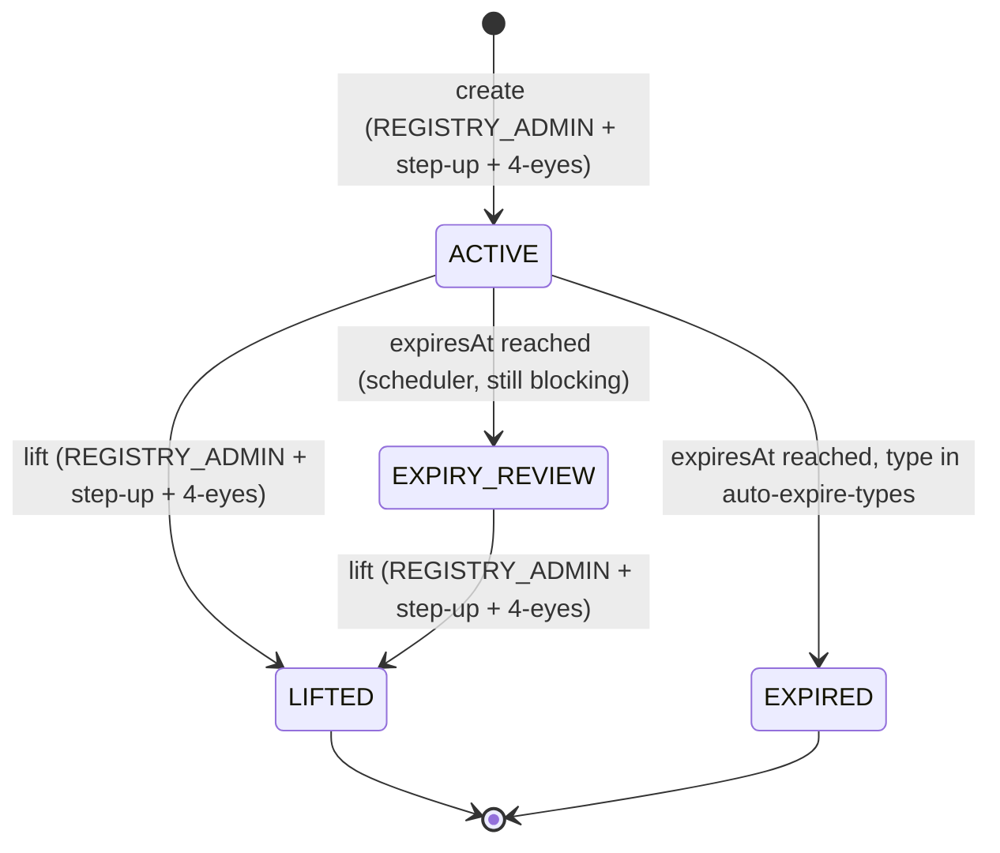

# Sperrvermerk: Restricciones comerciales en la capa de registro { #sperrvermerk-registry-layer-trading-restrictions }

!!! warning "EXTERNAL_REVIEW_REQUIRED"
    Esta página registra un mapeo legal/de control previsto. No es evidencia de que una marca de base de datos
    o una restricción de contrato inteligente cree, registre, levante o demuestre una restricción con el efecto
    legal de un Sperrvermerk. Los términos del instrumento, la autoridad de instrucción, la autoridad de registro,
    la evidencia y el procedimiento específico de la jurisdicción requieren una revisión externa calificada.

El **Sperrvermerk** es una notación de bloqueo en el registro de valores que restringe la capacidad de un titular para transferir, pignorar o disponer de otro modo de sus tokens. Está ordenado por **eWpG §16** para el registro de valores criptográficos y es el equivalente en la capa de registro de una congelación judicial o notación de compromiso en la compensación de valores tradicional.

Aunque el concepto se origina en la ley alemana, las cuatro [jurisdicciones admitidas](../legal/index.md) reconocen mecanismos de bloqueo equivalentes. Registerwerk implementa una única entidad `HolderBlock` que cubre todos los tipos de bloques en todas las jurisdicciones.

---

## Tipos de bloques { #block-types }

| Tipo de bloque | Término alemán | Descripción |
|---|---|---|
| `PFANDRECHT` | Pfandrecht | Prenda — el titular ha pignorado la posición como garantía |
| `PFAENDUNG` | Pfändung | Embargo — orden de ejecución del acreedor |
| `GERICHTSBESCHLUSS` | Gerichtsbeschluss | Orden judicial — congelación judicial general |
| `NACHLASSSPERRE` | Nachlasssperre | Nachlasssperre (bloqueo sucesorio) — procedimiento sucesorio pendiente |
| `VERFUGUNGSVERBOT` | Verfügungsverbot | Prohibición de disposición — ordenada por un tribunal o autoridad |
| `TOD` | Tod des Inhabers | Muerte del titular — liquidación patrimonial pendiente |
| `INSOLVENZ` | Insolvenz | Procedimiento de insolvencia — administrador notificado |

---

## La entidad `HolderBlock` { #holderblock-entity }

La entidad `HolderBlock` en el módulo `kyc` almacena todos los bloques activos e históricos:

| Campo | Descripción |
|---|---|
| `entityId` | FK a `LegalEntity` |
| `assetId` | FK a `Asset` |
| `walletAddress` | Cartera específica para bloquear (opcional: si es nula, todas las carteras de la entidad) |
| `blockType` | Uno de los tipos anteriores |
| `legalBasis` | Base jurídica de texto libre (p. ej., número de expediente judicial) |
| `courtRef` | Número de referencia del tribunal |
| `documentId` | FK a `KycDocument` que contiene la orden de bloqueo |
| `startsAt` | Cuando el bloque se activa |
| `expiresAt` | Fecha de vencimiento automática (anulable: se permiten bloques indefinidos) |
| `liftedAt` | Cuando el bloque se levantó manualmente |
| `liftedBy` | UUID del operador que levantó el bloque |
| `twoManRuleApprover` | UUID del segundo aprobador |
| `twoManRuleApprovedAt` | Cuando el segundo aprobador confirmó |
| `onChainFreezeTxHash` | Hash de la primera transacción de congelación en cadena confirmada de este bloqueo. Un bloqueo puede alcanzar varios despliegues; el resultado por despliegue y wallet está en `holder_block_freeze` (véase [Alcance en cadena](#on-chain-reach)) |

---

## Ciclo de vida { #lifecycle }

```mermaid
stateDiagram-v2
    [*] --> ACTIVE : create (REGISTRY_ADMIN + step-up + 4-eyes)
    ACTIVE --> LIFTED : lift (REGISTRY_ADMIN + step-up + 4-eyes)
    ACTIVE --> EXPIRY_REVIEW : expiresAt reached (scheduler, still blocking)
    EXPIRY_REVIEW --> LIFTED : lift (REGISTRY_ADMIN + step-up + 4-eyes)
    ACTIVE --> EXPIRED : expiresAt reached, type in auto-expire-types
    LIFTED --> [*]
    EXPIRED --> [*]
```

**Creando un bloque:**
1. `REGISTRY_ADMIN` envía `POST /api/v1/holder-blocks` con tipo de bloque, base legal y vencimiento opcional
2. El aspecto `@RequiresStepUp` exige un token de autenticación reforzada (step-up) recién emitido (TOTP o WebAuthn)
3. `SperrvermerkService` comprueba que un segundo aprobador haya confirmado (token `dualControlPending`)
4. Una vez confirmado el bloqueo en la base de datos, `SperrvermerkOnchainSyncListener` congela la wallet mediante el outbox duradero de transacciones en cada despliegue de token activo de los activos que mantiene (o solo en el del `assetId`, si el bloqueo se limita a un activo). Los estándares que se pueden congelar figuran [más abajo](#on-chain-reach); un despliegue que no se puede congelar se registra y se escala, no se omite
5. El resultado por bloqueo, despliegue y wallet se registra en `holder_block_freeze` y sigue el estado de la transacción: `SUBMITTED` pasa a `CONFIRMED` (entonces se almacena `onChainFreezeTxHash`) o a `FAILED`
6. Se emite un `AuditEvent` con los detalles completos del bloque

**Levantando un bloque:**
Se aplica el mismo flujo de autenticación reforzada (step-up) + doble control (4-eyes). El levantamiento concilia en sentido inverso: por cada wallet y despliegue, la descongelación en cadena solo se envía si ningún otro bloqueo vigente sigue cubriendo la wallet (`RELEASE_SUBMITTED`, luego `RELEASED`). Una descongelación fallida deja la wallet congelada, se notifica (`HOLDER_BLOCK_RELEASE_FAILED`, tarea de operador) y se reintenta. En el registro el bloqueo queda `LIFTED` en cualquier caso; se rellenan `liftedAt` y `liftedBy`.

**Vencimiento automático:**
Un trabajo `@Scheduled` se ejecuta todas las noches y encuentra todos los bloqueos ACTIVE con `expiresAt < NOW()`. Por defecto **ningún tipo de bloqueo vence automáticamente**: el bloqueo pasa a `EXPIRY_REVIEW`, sigue bloqueando (controles del registro y congelación on-chain) y se genera una tarea de operador y un correo a cumplimiento. Solo se levanta mediante el levantamiento normal (step-up + segundo aprobador). Los tipos listados en `registerwerk.sperrvermerk.auto-expire-types` (vacío por defecto) se siguen levantando automáticamente a `EXPIRED`.

!!! note "Fechas de vencimiento (6-25)"
    `expiresAt` debe estar en el futuro. Para los tipos judiciales y de autoridad (`GERICHTSBESCHLUSS`, `PFAENDUNG`, `INSOLVENZ`, `NACHLASSSPERRE`, `VERFUGUNGSVERBOT`, `TOD`, `REGULATORISCH`), una fecha de vencimiento exige además `courtRef` o `documentId`, y el segundo aprobador la confirma frente a la orden. Al levantar el último bloqueo se liberan todas las congelaciones que ningún bloqueo restante cubre, en todos los activos de la wallet; los bloqueos de entidad cubren todas las wallets de titular de la entidad. Los bloqueos solo de wallet también son visibles para los controles del repo desk y de préstamos. Si algún tipo puede vencer automáticamente es una decisión legal aparcada (T6-11).

---

## Efecto en las operaciones de token { #effect-on-token-operations }

El `HolderBlock` se aplica en múltiples capas:

| Operación | Punto de cumplimiento |
|---|---|
| `forceTransfer` | `TokenAdminController` — verificado antes de cualquier llamada de transferencia |
| `forceApprove` | `TokenAdminController` — comprobado antes de la aprobación |
| Creación de `AssetHolder` (nuevo inversor) | `AssetService` — los bloques existentes pueden impedir nuevas posiciones |
| Transferencia en cadena | El contrato del token rechaza movimientos desde, hacia o por una dirección congelada (`freezeAddress` / `setAddressFrozen`), véase [Alcance en cadena](#on-chain-reach) |

---

## Alcance en cadena { #on-chain-reach }

El bloqueo de la capa de registro (base de datos) es el que prevalece y se aplica a todos los estándares de token. La congelación en cadena lo refleja allí donde un contrato puede expresarlo, de modo que también se cierren para la wallet las vías que el backend no media (transferencias directas, `repay`/`liquidate` del repo, depósitos y reembolsos de vaults). Es una medida técnica, no un efecto jurídico (véase la advertencia de revisión al principio de la página).

| Estándar / cadena | Congelación en cadena automatizada | Cómo |
|---|---|---|
| ERC-20, ERC-721, ERC-1155 | Sí | `freezeAddress(address,string)` (`EwpgCompliance`) mediante el puerto de administración de tokens |
| ERC-3525 | Sí | `freezeAddress` mediante el puerto de administración ERC-3525; se rechaza una descongelación manual mientras un bloqueo cubra la wallet |
| Participaciones de vault ERC-4626 / ERC-7540 | Sí | `freezeAddress` (`EwpgCompliance`); a un propietario o pagador congelado no se le paga y el depósito en garantía permanece en el vault (congelación in situ) |
| ERC-3643 (T-REX) | Sí | `setAddressFrozen(address,true)` en el token (`Erc3643LifecycleService`) |
| ERC-3643 confidencial (Zama fhEVM) | Sí | `setAddressFrozen(address,bool)` |
| ERC-20 confidencial | No | el contrato no tiene función de congelación |
| Solana (SPL, Token-2022 y los preajustes de extensiones) | No | `FreezeAccount` actúa por cuenta de token y es una acción manual del operador |
| Starknet (ERC-20, ERC-3525) | No | los contratos Cairo tienen `freeze_address`, pero es solo una llamada manual del operador: los invokes de Starknet no pasan por el outbox duradero y sus recibos no se siguen, por lo que no podría confirmarse ningún resultado |
| Stellar | No | una congelación es un cambio de autorización de la trustline, una acción manual del operador |
| Canton / Daml | No | no hay congelación a nivel de titular que el registro pueda gobernar |

Cada congelación pasa por el outbox duradero de transacciones (firmada en la transacción de base de datos, difundida tras el commit) y su resultado se lee del estado de la transacción. `holder_block_freeze` guarda una fila por bloqueo, despliegue y wallet:

| Estado | Significado |
|---|---|
| `SUBMITTED` | la transacción de congelación está en el outbox, su resultado aún no es definitivo |
| `CONFIRMED` | la transacción es definitiva y exitosa; `onChainFreezeTxHash` queda almacenado; evento de auditoría `HOLDER_BLOCK_FREEZE_CONFIRMED` |
| `FAILED` | la congelación no pudo enviarse, se revirtió o fue reemplazada: la wallet aún puede moverse en cadena |
| `UNSUPPORTED_ON_CHAIN` | el estándar o la cadena no tiene congelación automatizada (tabla anterior): se necesita intervención manual |
| `RELEASE_SUBMITTED` / `RELEASED` / `RELEASE_FAILED` | lo mismo para la descongelación tras levantar un bloqueo; `RELEASED` cubre también «otro bloqueo aún cubre la wallet, la congelación se mantiene» |

Un resultado `FAILED` o `UNSUPPORTED_ON_CHAIN` nunca pasa inadvertido: genera el evento de auditoría `HOLDER_BLOCK_NOT_PROPAGATED` (`cause`: `SUBMISSION_FAILED`, `TX_FAILED`, `UNSUPPORTED_ON_CHAIN`, `NO_DEPLOYMENT_MATCHED` o `DRIFT`), una tarea de operador `SPERRVERMERK_FREEZE_NOT_PROPAGATED` sobre la entidad emisora del activo, los indicadores `registerwerk_sperrvermerk_freeze_failed` / `registerwerk_sperrvermerk_freeze_unsupported` y las alertas `SperrvermerkFreezeFailed` / `SperrvermerkFreezeUnsupported`. **Nunca levanta el bloqueo de la capa de registro.**

Dos trabajos mantienen la cadena alineada con el registro (ambos protegidos con ShedLock). Un barrido cada 5 minutos lee el resultado de las congelaciones enviadas y reintenta las fallidas con back-off (5 intentos; `registerwerk.sperrvermerk.freeze-sweep-ms`). Una conciliación nocturna (`registerwerk.sperrvermerk.freeze-reconcile-cron`, por defecto 02:30) recorre cada bloqueo que aún bloquea, tanto `ACTIVE` como `EXPIRY_REVIEW`: reenvía las congelaciones ausentes y fallidas, relee `isFrozen` de las confirmadas y notifica como deriva (`registerwerk_sperrvermerk_freeze_drift_total`, alerta `SperrvermerkFreezeDrift`, y la vuelve a congelar) una wallet que **no** está congelada. Una descongelación fallida deja la wallet congelada (el sentido seguro) y se notifica mediante `HOLDER_BLOCK_RELEASE_FAILED`.

---

## Registro de auditoría { #audit-trail }

Cada creación, modificación y levantamiento de bloques genera un `AuditEvent` de tipo `HOLDER_BLOCK_CREATED`, `HOLDER_BLOCK_LIFTED` o `HOLDER_BLOCK_EXPIRED`; el seguimiento en cadena añade `HOLDER_BLOCK_FREEZE_CONFIRMED`, `HOLDER_BLOCK_NOT_PROPAGATED` y `HOLDER_BLOCK_RELEASE_FAILED`. Estos eventos incluyen:

- la identidad del operador que inicia la acción
- la identidad del segundo aprobador (para crear/levantar)
- la instantánea completa de `HolderBlock` en el momento del evento
- la referencia del token de autenticación reforzada (marca de tiempo TOTP o ID de aserción WebAuthn)

Esta pista de auditoría está destinada a respaldar la documentación de entrada de registro y es a prueba de manipulaciones a través de
la [cadena de hash de auditoría](../platform/audit-log.md); su integridad y su tratamiento eWpG §15 requieren una revisión externa.
