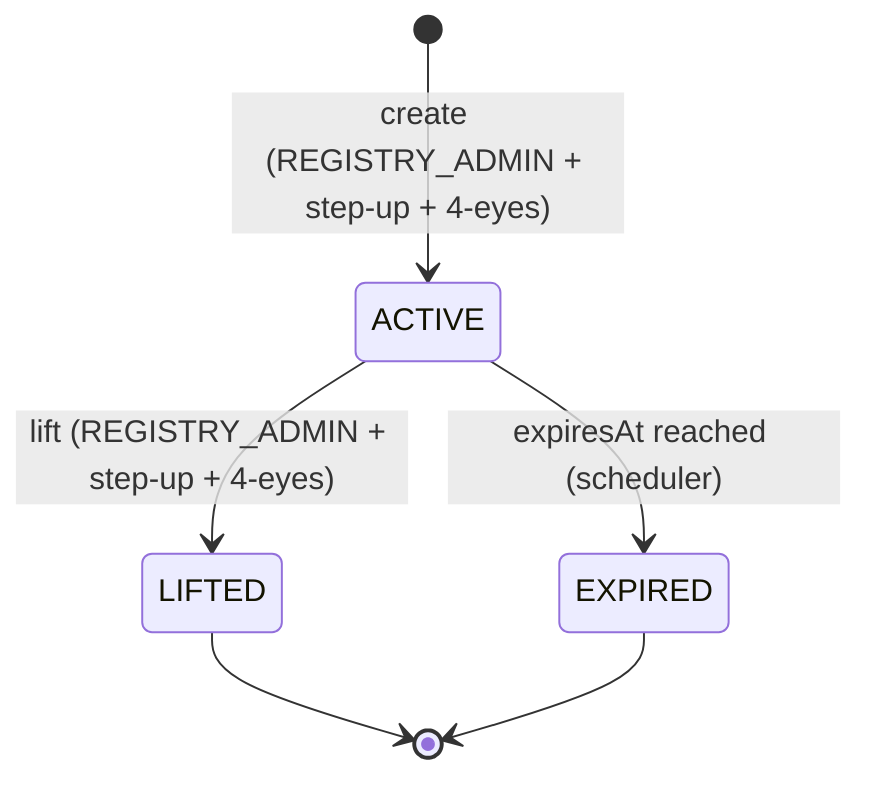

# Sperrvermerk — Restrictions commerciales au niveau du registre {#sperrvermerk-registry-layer-trading-restrictions}

!!! warning "EXTERNAL_REVIEW_REQUIRED"
    Cette page enregistre un mappage juridique/contrôle prévu. Cela ne constitue pas une preuve qu'un indicateur de base de données
    ou une restriction de contrat intelligent crée, enregistre, lève ou prouve une restriction ayant un effet juridique
    Sperrvermerk. Les termes de l'instrument, l'autorité d'instruction, l'autorité de registre, les preuves et la procédure spécifique à la juridiction
    nécessitent un examen externe qualifié.

Le **Sperrvermerk** est une notation de blocage dans le registre des valeurs mobilières qui restreint la capacité d'un détenteur à transférer, mettre en gage ou autrement disposer de ses jetons. Il est mandaté par **eWpG §16** pour le registre des titres cryptographiques et est l'équivalent au niveau du registre d'un gel judiciaire ou d'une notation de gage dans la compensation de titres traditionnelle.

Bien que le concept soit originaire du droit allemand, les quatre [juridictions prises en charge](../legal/index.md) reconnaissent des mécanismes de blocage équivalents. Registerwerk implémente une seule entité `HolderBlock` qui couvre tous les types de blocs dans toutes les juridictions.

---

## Types de blocs {#block-types}

| Type de bloc | Terme allemand | Description |
|---|---|---|
| `PFANDRECHT` | Pfandrecht | Nantissement — le détenteur a donné la position en garantie |
| `PFAENDUNG` | Pfändung | Saisie-arrêt — ordonnance d'exécution du créancier |
| `GERICHTSBESCHLUSS` | Gerichtsbeschluss | Ordonnance du tribunal — gel judiciaire général |
| `NACHLASSSPERRE` | Nachlasssperre | Gel successoral — procédures successorales en cours |
| `VERFUGUNGSVERBOT` | Verfügungsverbot | Interdiction d'élimination — ordonnée par un tribunal ou une autorité |
| `TOD` | Tod des Inhabers | Décès du titulaire — en attendant le règlement de la succession |
| `INSOLVENZ` | Insolvenz | Procédure d'insolvabilité — administrateur notifié |

---

## Entité `HolderBlock` {#holderblock-entity}

L'entité `HolderBlock` dans le module `kyc` stocke tous les blocs actifs et historiques :

| Champ | Description |
|---|---|
| `entityId` | FK à `LegalEntity` |
| `assetId` | FK à `Asset` |
| `walletAddress` | Portefeuille spécifique à bloquer (facultatif — si nul, tous les portefeuilles de l'entité) |
| `blockType` | Un des types ci-dessus |
| `legalBasis` | Base juridique en texte libre (par exemple, numéro de dossier du tribunal) |
| `courtRef` | Numéro de référence du tribunal |
| `documentId` | FK à `KycDocument` détenant l'ordre de blocage |
| `startsAt` | Lorsque le bloc devient actif |
| `expiresAt` | Date d'expiration automatique (nullable — blocs indéfinis autorisés) |
| `liftedAt` | Lorsque le bloc a été levé manuellement |
| `liftedBy` | UUID de l'opérateur qui a levé le bloc |
| `twoManRuleApprover` | UUID du deuxième approbateur |
| `twoManRuleApprovedAt` | Lorsque le deuxième approbateur a confirmé |
| `onChainFreezeTxHash` | Hachage de la transaction de gel en chaîne correspondante |

---

## Lifecycle {#lifecycle}

**Création d'un bloc :**
1. `REGISTRY_ADMIN` soumet `POST /api/v1/holder-blocks` avec le type de bloc, la base juridique et l'expiration facultative
2. L'aspect `@RequiresStepUp` impose un nouveau jeton d'authentification renforcée (step-up) (TOTP ou WebAuthn)
3. `SperrvermerkService` vérifie qu'un deuxième approbateur a confirmé (jeton `dualControlPending`)
4. Si l'actif utilise des jetons [ERC-3643](../token-standards/erc3643.md) liés à l'identité, `freezeAddress()` est appelé sur le contrat du module de conformité
5. Le `onChainFreezeTxHash` est stocké une fois la transaction confirmée
6. Un `AuditEvent` est émis avec les détails complets du bloc

**Levée d'un bloc :**
Le même circuit d'authentification renforcée (step-up) + quatre yeux s'applique. La levée appelle le `unfreezeAddress()` en chaîne correspondant et efface le champ `HolderBlock.liftedAt`.

**Expiration automatique :**
Un job `@Scheduled` s'exécute chaque nuit, trouve tous les enregistrements `HolderBlock` où `expiresAt < NOW()` et `liftedAt IS NULL`, les fait passer à `EXPIRED` et appelle le dégel en chaîne.

---

## Effet sur les opérations de jeton {#effect-on-token-operations}

Le `HolderBlock` est appliqué à plusieurs couches :

| Opération | Point de contrôle |
|---|---|
| `forceTransfer` | `TokenAdminController` — vérifié avant tout appel de transfert |
| `forceApprove` | `TokenAdminController` — vérifié avant approbation |
| Création `AssetHolder` (nouvel investisseur) | `AssetService` — les blocs existants peuvent empêcher de nouvelles positions |
| Transfert en chaîne (ERC-3643) | `ComplianceModuleContract` — le registre d'identité rejette les adresses gelées |

Le bloc de couche de registre (DB) et le gel en chaîne (contrat intelligent) sont **tous deux** requis pour les jetons ERC-3643. Pour les autres normes (ERC-20, ERC-3525), seul le bloc de la couche de registre s'applique ; le transfert en chaîne est empêché par le refus de l'opérateur de signer la transaction.

---

## Piste d'audit {#audit-trail}

Chaque création, modification et levée de bloc génère un `AuditEvent` de type `HOLDER_BLOCK_CREATED`, `HOLDER_BLOCK_LIFTED` ou `HOLDER_BLOCK_EXPIRED`. Ces événements incluent :

- l'identité de l'opérateur initiateur
- l'identité du second approbateur (pour la création/la levée)
- l'instantané complet du `HolderBlock` au moment de l'événement
- la référence du jeton d'authentification renforcée (step-up) (horodatage TOTP ou identifiant d'assertion WebAuthn)

Cette piste d'audit est destinée à prendre en charge la documentation d'entrée de registre et est inviolable via
la [chaîne de hachage d'audit](../platform/audit-log.md) ; son exhaustivité et son traitement eWpG §15 nécessitent un examen externe.
