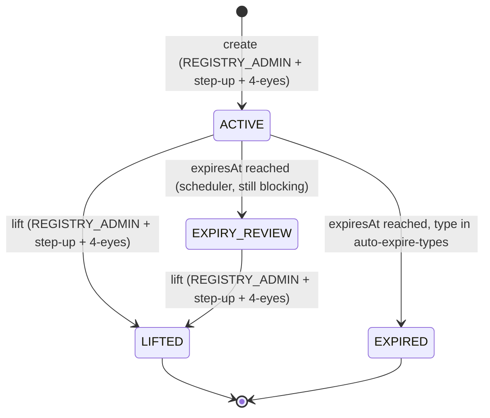

# Sperrvermerk — Restrictions commerciales au niveau du registre {#sperrvermerk-registry-layer-trading-restrictions}

!!! warning "EXTERNAL_REVIEW_REQUIRED"
    Cette page enregistre un mappage juridique/contrôle prévu. Cela ne constitue pas une preuve qu'un indicateur de base de données
    ou une restriction de contrat intelligent crée, enregistre, lève ou prouve une restriction ayant un effet juridique
    Sperrvermerk. Les termes de l'instrument, l'autorité d'instruction, l'autorité de registre, les preuves et la procédure spécifique à la juridiction
    nécessitent un examen externe qualifié.

Le **Sperrvermerk** est une notation de blocage dans le registre des valeurs mobilières qui restreint la capacité d'un détenteur à transférer, mettre en gage ou autrement disposer de ses jetons. Il est mandaté par **eWpG §16** pour le registre des titres cryptographiques et est l'équivalent au niveau du registre d'un gel judiciaire ou d'une notation de gage dans la compensation de titres traditionnelle.

Bien que le concept soit originaire du droit allemand, les quatre [juridictions prises en charge](../legal/index.md) reconnaissent des mécanismes de blocage équivalents. Registerwerk implémente une seule entité `HolderBlock` qui couvre tous les types de blocs dans toutes les juridictions.

---

## Types de blocs {#block-types}

| Type de bloc | Terme allemand | Description |
|---|---|---|
| `PFANDRECHT` | Pfandrecht | Nantissement — le détenteur a donné la position en garantie |
| `PFAENDUNG` | Pfändung | Saisie-arrêt — ordonnance d'exécution du créancier |
| `GERICHTSBESCHLUSS` | Gerichtsbeschluss | Ordonnance du tribunal — gel judiciaire général |
| `NACHLASSSPERRE` | Nachlasssperre | Gel successoral — procédures successorales en cours |
| `VERFUGUNGSVERBOT` | Verfügungsverbot | Interdiction d'élimination — ordonnée par un tribunal ou une autorité |
| `TOD` | Tod des Inhabers | Décès du titulaire — en attendant le règlement de la succession |
| `INSOLVENZ` | Insolvenz | Procédure d'insolvabilité — administrateur notifié |
| `REGULATORISCH` | Regulatorische Sperre | Blocage réglementaire — ordonné par une autorité de supervision |

---

## Entité `HolderBlock` {#holderblock-entity}

L'entité `HolderBlock` dans le module `kyc` stocke tous les blocs actifs et historiques :

| Champ | Description |
|---|---|
| `id` | Clé primaire |
| `entityId` | FK vers `LegalEntity`. Renseigné pour un blocage au niveau de l'entité, qui couvre tous les wallets de détenteur de l'entité (résolu à partir de la ligne de détenteur du wallet lorsqu'une seule entité détient le wallet) |
| `assetId` | FK vers `Asset` ; null signifie tous les actifs détenus par le wallet |
| `walletAddress` | Le wallet bloqué — obligatoire, stocké sous forme normalisée |
| `blockType` | L'un des types ci-dessus |
| `status` | `ACTIVE`, `EXPIRY_REVIEW`, `LIFTED`, `EXPIRED` ou `SUPERSEDED` (voir [Lifecycle](#lifecycle)) |
| `legalBasis` | Base juridique en texte libre (p. ex. numéro de dossier judiciaire) |
| `courtRef` | Numéro de référence judiciaire |
| `documentId` | FK vers `KycDocument` contenant l'ordre de blocage |
| `startsAt` | Date à laquelle le blocage devient actif |
| `expiresAt` | Date d'expiration (nullable — blocages à durée indéterminée autorisés) |
| `expiryConfirmedByApprover` | Si le deuxième approbateur a confirmé la date d'expiration au regard de l'ordre |
| `expiryReviewAt` | Date à laquelle le blocage est passé en `EXPIRY_REVIEW` |
| `liftedAt` / `liftedBy` / `liftReason` | Quand, par qui et pourquoi le blocage a été levé |
| `createdBy` | L'opérateur qui a créé le blocage |
| `dualControlApproverId` | Le deuxième approbateur (validé par l'aspect step-up) |
| `dualControlApprovedAt` | Date d'enregistrement de l'approbation du deuxième approbateur |
| `createdAt` / `updatedAt` | Horodatages de l'enregistrement |
| `onChainFreezeTxHash` | Hash de la première transaction de gel en chaîne confirmée de ce blocage. Un blocage peut atteindre plusieurs déploiements ; le résultat par déploiement et par wallet figure dans `holder_block_freeze` (voir [Portée en chaîne](#on-chain-reach)) |

---

## Lifecycle {#lifecycle}

```mermaid
stateDiagram-v2
    [*] --> ACTIVE : create (REGISTRY_ADMIN + step-up + 4-eyes)
    ACTIVE --> LIFTED : lift (REGISTRY_ADMIN + step-up + 4-eyes)
    ACTIVE --> EXPIRY_REVIEW : expiresAt reached (scheduler, still blocking)
    EXPIRY_REVIEW --> LIFTED : lift (REGISTRY_ADMIN + step-up + 4-eyes)
    ACTIVE --> EXPIRED : expiresAt reached, type in auto-expire-types
    LIFTED --> [*]
    EXPIRED --> [*]
```

`SUPERSEDED` est défini dans l'énumération des statuts, mais aucun chemin de code actuel ne le positionne. `EXPIRED` n'est atteint que pour les types de blocage listés dans `registerwerk.sperrvermerk.auto-expire-types` (vide par défaut) ; sinon une date dépassée conduit à `EXPIRY_REVIEW`.

**Création d'un bloc :**
1. `REGISTRY_ADMIN` soumet `POST /api/v1/holder-blocks` avec le type de bloc, la base juridique et l'expiration facultative
2. `@RequiresStepUp` impose un jeton step-up récent (TOTP local, ou contexte d'authentification Entra) et un deuxième approbateur : le jeton de l'approbateur est envoyé dans `X-Dual-Control-Token` et validé par l'aspect step-up, et le service reçoit l'identifiant de l'approbateur
3. `SperrvermerkService` enregistre le blocage avec `dualControlApproverId` et `dualControlApprovedAt`
4. Une fois le bloc validé, `SperrvermerkOnchainSyncListener` gèle le wallet, via l'outbox durable des transactions, sur chaque déploiement de jeton actif des actifs détenus (ou du seul `assetId` pour un bloc limité à un actif). Les normes gelables sont listées [ci-dessous](#on-chain-reach) ; un déploiement qui ne peut pas être gelé est consigné et escaladé, pas ignoré
5. Le résultat par bloc, déploiement et wallet est consigné dans `holder_block_freeze` et suit le statut de la transaction : `SUBMITTED` devient `CONFIRMED` (le `onChainFreezeTxHash` est alors stocké) ou `FAILED`
6. Un `AuditEvent` est émis avec les détails complets du bloc

**Levée d'un bloc :**
Le même circuit d'authentification renforcée (step-up) + quatre yeux s'applique. La levée rapproche dans le sens inverse : pour chaque wallet et chaque déploiement, le dégel en chaîne n'est soumis que si aucun autre bloc bloquant ne couvre encore le wallet (`RELEASE_SUBMITTED`, puis `RELEASED`). Un dégel échoué laisse le wallet gelé, est signalé (`HOLDER_BLOCK_RELEASE_FAILED`, tâche opérateur) et réessayé. Dans le registre, le bloc est de toute façon `LIFTED` ; `liftedAt` et `liftedBy` sont renseignés.

**Expiration automatique :**
Un job `@Scheduled` s'exécute chaque nuit et trouve tous les blocs ACTIVE avec `expiresAt < NOW()`. Par défaut, **aucun type de blocage n'expire automatiquement** : le bloc passe à `EXPIRY_REVIEW`, continue de bloquer (contrôles du registre et gel en chaîne), et une tâche opérateur ainsi qu'un e-mail à la conformité sont déclenchés. Il n'est levé que par la levée normale (step-up + second approbateur). Les types listés dans `registerwerk.sperrvermerk.auto-expire-types` (vide par défaut) restent levés automatiquement vers `EXPIRED`.

!!! note "Dates d'expiration (6-25)"
    `expiresAt` doit être dans le futur. Pour les types judiciaires et d'autorité (`GERICHTSBESCHLUSS`, `PFAENDUNG`, `INSOLVENZ`, `NACHLASSSPERRE`, `VERFUGUNGSVERBOT`, `TOD`, `REGULATORISCH`), une date d'expiration exige en plus un `courtRef` ou `documentId`, et le second approbateur la confirme par rapport à l'ordonnance. Lorsque le dernier bloc est levé, tous les gels qu'aucun bloc restant ne couvre sont libérés sur l'ensemble des actifs du portefeuille ; les blocs portant sur une entité couvrent tous ses portefeuilles de détenteur. Les blocs limités à un portefeuille sont aussi visibles pour les contrôles du repo desk et du prêt. La question de savoir si un type peut expirer automatiquement est une décision juridique en suspens (T6-11).

---

## Effet sur les opérations de jeton {#effect-on-token-operations}

Le `HolderBlock` est appliqué à plusieurs couches :

| Opération | Point de contrôle |
|---|---|
| Administration des jetons EVM (`TokenAdminService`, `Erc3525AdminService`, `Erc7540AdminService`, `Erc3643LifecycleService`) | Une opération privilégiée impliquant un wallet sous blocage est refusée (échec fermé) |
| Émission de claims ERC-3643 (`ClaimIssuanceService`) | Aucun claim d'identité en chaîne n'est émis pour une entité sous blocage |
| Migration de portefeuille du registre (`PortfolioMigrationService`) | La position d'un détenteur bloqué n'est pas migrée |
| Destinations sortantes et éligibilité des parties (`OutboundDestinationGateImpl`, `PartyEligibilityGateImpl`) | Utilisés par le trading, le repo, le lending et les paiements d'opérations sur titres : une partie ou une destination bloquée est refusée ; les actions de protection du prêteur en repo sont en revanche signalées à l'opérateur |
| Transfert en chaîne | Le contrat de jeton refuse les mouvements depuis, vers ou par une adresse gelée (`freezeAddress` / `setAddressFrozen`), voir [Portée en chaîne](#on-chain-reach) |

---

## Portée en chaîne {#on-chain-reach}

Le blocage de la couche registre (base de données) est la source de vérité des contrôles propres à Registerwerk et s'applique à chaque standard de jeton. Le gel en chaîne le reflète là où un contrat peut l'exprimer, de sorte que les chemins que le backend ne médie pas (transferts directs, `repay`/`liquidate` du repo, dépôts et rachats de vault) soient aussi fermés pour le wallet. C'est une mesure technique, pas un effet juridique (voir l'avertissement de revue en haut de page).

| Norme / chaîne | Gel en chaîne automatisé | Comment |
|---|---|---|
| ERC-20, ERC-721, ERC-1155 | Oui | `freezeAddress(address,string)` (`EwpgCompliance`) via le port d'administration des jetons |
| ERC-3525 | Oui | `freezeAddress` via le port d'administration ERC-3525 ; un dégel manuel est refusé tant qu'un bloc couvre le wallet |
| Parts de vault ERC-4626 / ERC-7540 | Oui | `freezeAddress` (`EwpgCompliance`) ; un propriétaire ou payeur gelé n'est pas payé et le séquestre reste dans le vault (gel sur place) |
| ERC-3643 (T-REX) | Oui | `setAddressFrozen(address,true)` sur le jeton (`Erc3643LifecycleService`) |
| ERC-3643 confidentiel (Zama fhEVM) | Oui | `setAddressFrozen(address,bool)` |
| ERC-20 confidentiel | Non | le contrat n'a pas de fonction de gel |
| Solana (SPL, Token-2022 et préréglages d'extensions) | Non | `FreezeAccount` agit par compte de jeton et reste une action manuelle de l'opérateur |
| Starknet (ERC-20, ERC-3525) | Non | les contrats Cairo ont `freeze_address`, mais ce n'est qu'un appel manuel de l'opérateur : les invokes Starknet ne passent pas par l'outbox durable et leurs reçus ne sont pas suivis, aucun résultat ne pourrait donc être confirmé |
| Stellar | Non | un gel est une modification de l'autorisation de trustline, une action manuelle de l'opérateur |
| Canton / Daml | Non | pas de gel au niveau du titulaire que le registre puisse piloter |

Chaque gel passe par l'outbox durable des transactions (signé dans la transaction de base de données, diffusé après validation) et son résultat est lu dans le statut de la transaction. `holder_block_freeze` conserve une ligne par bloc, déploiement et wallet :

| Statut | Signification |
|---|---|
| `SUBMITTED` | la transaction de gel est dans l'outbox, son résultat n'est pas encore définitif |
| `CONFIRMED` | la transaction est définitive et réussie ; `onChainFreezeTxHash` est stocké ; événement d'audit `HOLDER_BLOCK_FREEZE_CONFIRMED` |
| `FAILED` | le gel n'a pas pu être soumis, a été annulé (revert) ou remplacé : le wallet peut encore bouger en chaîne |
| `UNSUPPORTED_ON_CHAIN` | la norme ou la chaîne n'a pas de gel automatisé (tableau ci-dessus) : intervention manuelle nécessaire |
| `RELEASE_SUBMITTED` / `RELEASED` / `RELEASE_FAILED` | la même chose pour le dégel après la levée d'un bloc ; `RELEASED` couvre aussi « un autre bloc couvre encore le wallet, le gel reste » |

Un résultat `FAILED` ou `UNSUPPORTED_ON_CHAIN` n'est jamais silencieux : il déclenche l'événement d'audit `HOLDER_BLOCK_NOT_PROPAGATED` (`cause` : `SUBMISSION_FAILED`, `TX_FAILED`, `UNSUPPORTED_ON_CHAIN`, `NO_DEPLOYMENT_MATCHED` ou `DRIFT`), une tâche opérateur `SPERRVERMERK_FREEZE_NOT_PROPAGATED` sur l'entité émettrice de l'actif, les jauges `registerwerk_sperrvermerk_freeze_failed` / `registerwerk_sperrvermerk_freeze_unsupported` et les alertes `SperrvermerkFreezeFailed` / `SperrvermerkFreezeUnsupported`. **Il ne lève jamais le bloc de la couche de registre.**

Deux jobs maintiennent la chaîne alignée sur le registre (tous deux protégés par ShedLock). Un balayage toutes les 5 minutes lit le résultat des gels soumis et réessaie les gels échoués avec un back-off (5 tentatives ; `registerwerk.sperrvermerk.freeze-sweep-ms`). Un rapprochement nocturne (`registerwerk.sperrvermerk.freeze-reconcile-cron`, 02:30 par défaut) parcourt chaque bloc qui bloque encore, `ACTIVE` comme `EXPIRY_REVIEW` : il renvoie les gels manquants et échoués, relit `isFrozen` pour les gels confirmés, et signale comme dérive (`registerwerk_sperrvermerk_freeze_drift_total`, alerte `SperrvermerkFreezeDrift`, puis nouveau gel) un wallet qui n'est **pas** gelé. Un dégel échoué laisse le wallet gelé (le sens sûr) et est signalé par `HOLDER_BLOCK_RELEASE_FAILED`.

---

## Piste d'audit {#audit-trail}

Chaque création, modification et levée de blocage génère un `AuditEvent` de type `HOLDER_BLOCK_CREATED` ou `HOLDER_BLOCK_LIFTED` (une levée automatique porte le motif `AUTO_EXPIRED`) ; l'atteinte de la date d'expiration déclenche `HOLDER_BLOCK_EXPIRY_REVIEW`. Le suivi en chaîne ajoute `HOLDER_BLOCK_FREEZE_CONFIRMED`, `HOLDER_BLOCK_FREEZE_RESYNC_REQUESTED`, `HOLDER_BLOCK_NOT_PROPAGATED` et `HOLDER_BLOCK_RELEASE_FAILED`. Ces événements comprennent :

- l'identité de l'opérateur initiateur
- l'identité du second approbateur (pour la création/la levée)
- l'instantané complet du `HolderBlock` au moment de l'événement
- l'événement `DUAL_CONTROL_APPROVED` qui a enregistré l'approbation du deuxième approbateur (identifiant du jeton et empreinte de la requête), pour la création et la levée

Cette piste d'audit est destinée à prendre en charge la documentation d'entrée de registre et est inviolable via
la [chaîne de hachage d'audit](../platform/audit-log.md) ; son exhaustivité et son traitement eWpG §15 nécessitent un examen externe.
