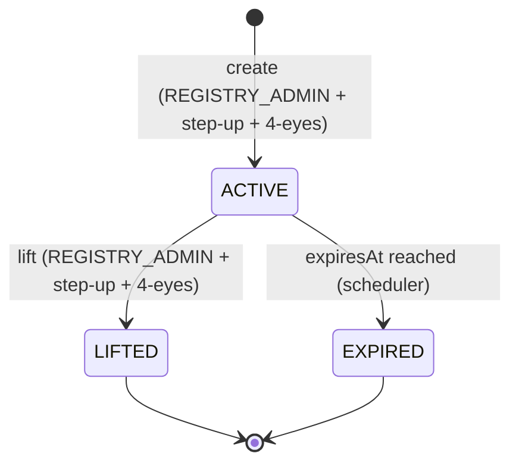

# Sperrvermerk: restrizioni al trading a livello di registro { #sperrvermerk-registry-layer-trading-restrictions }

!!! warning "EXTERNAL_REVIEW_REQUIRED"
    Questa pagina registra una mappatura legale/di controllo prevista. Non è una prova che un flag del database
    o una restrizione del contratto intelligente crei, registri, revochi o dimostri una restrizione con effetto legale
    Sperrvermerk. I termini dello strumento, l'autorità di istruzione, l'autorità di registro, le prove e la procedura specifica della giurisdizione richiedono una revisione esterna qualificata.

Lo **Sperrvermerk** è una notazione di blocco nel registro dei titoli che limita la capacità del detentore di trasferire, impegnare o altrimenti disporre dei propri token. È imposto dall'**eWpG §16** per il registro dei titoli crittografici ed è l'equivalente, a livello di registro, di un congelamento giudiziario o di una notazione di pegno nella compensazione tradizionale dei titoli.

Sebbene il concetto abbia origine nella legge tedesca, tutte e quattro le [giurisdizioni supportate](../legal/index.md) riconoscono meccanismi di blocco equivalenti. Registerwerk implementa un'unica entità `HolderBlock` che copre tutti i tipi di blocco nelle giurisdizioni.

---

## Tipi di blocco { #block-types }

| Tipo di blocco | Termine tedesco | Descrizione |
|---|---|---|
| `PFANDRECHT` | Pfandrecht | Pegno: il detentore ha impegnato la posizione come garanzia |
| `PFAENDUNG` | Pfändung | Pignoramento/sequestro conservativo — titolo esecutivo di un creditore |
| `GERICHTSBESCHLUSS` | Gerichtsbeschluss | Ordinanza del tribunale — congelamento giudiziario generale |
| `NACHLASSSPERRE` | Nachlasssperre | Blocco successorio (Nachlasssperre) — procedimento di successione pendente |
| `VERFUGUNGSVERBOT` | Verfügungsverbot | Divieto di disposizione — disposto dal tribunale o dall'autorità |
| `TOD` | Tod des Inhabers | Morte del titolare — liquidazione patrimoniale in attesa |
| `INSOLVENZ` | Insolvenz | Procedura di insolvenza — amministratore notificato |

---

## Entità `HolderBlock` { #holderblock-entity }

L'entità `HolderBlock` nel modulo `kyc` memorizza tutti i blocchi attivi e storici:

| Campo | Descrizione |
|---|---|
| `entityId` | FK a `LegalEntity` |
| `assetId` | FK a `Asset` |
| `walletAddress` | Portafoglio specifico da bloccare (facoltativo — se nullo, tutti i portafogli per entità) |
| `blockType` | Uno dei tipi sopra |
| `legalBasis` | Base giuridica in testo libero (ad es. numero del fascicolo giudiziario) |
| `courtRef` | Numero di riferimento del tribunale |
| `documentId` | FK a `KycDocument` che detiene l'ordine di blocco |
| `startsAt` | Quando il blocco diventa attivo |
| `expiresAt` | Data di scadenza automatica (campo nullable — sono consentiti blocchi a tempo indeterminato) |
| `liftedAt` | Quando il blocco è stato revocato manualmente |
| `liftedBy` | UUID dell'operatore che ha revocato il blocco |
| `twoManRuleApprover` | UUID del secondo approvatore |
| `twoManRuleApprovedAt` | Quando il secondo approvatore ha confermato |
| `onChainFreezeTxHash` | Hash della transazione di congelamento in catena corrispondente |

---

## Ciclo di vita { #lifecycle }

**Creazione di un blocco:**
1. `REGISTRY_ADMIN` invia `POST /api/v1/holder-blocks` con tipo di blocco, base legale e scadenza opzionale
2. L'aspetto `@RequiresStepUp` applica un nuovo token di step-up (TOTP o WebAuthn)
3. `SperrvermerkService` verifica che un secondo approvatore abbia confermato (token `dualControlPending`)
4. Se l'asset utilizza [token ERC-3643 legati all'identità](../token-standards/erc3643.md), viene chiamata `freezeAddress()` sul contratto del modulo di conformità
5. `onChainFreezeTxHash` viene memorizzato una volta confermata la transazione
6. Viene emesso un `AuditEvent` con i dettagli completi del blocco

**Revoca di un blocco:**
Si applica lo stesso flusso step-up + quattro occhi. La revoca richiama il corrispondente `unfreezeAddress()` on-chain e cancella il campo `HolderBlock.liftedAt`.

**Scadenza automatica:**
Un job `@Scheduled` viene eseguito ogni notte, trova tutti i record `HolderBlock` in cui `expiresAt < NOW()` e `liftedAt IS NULL`, li fa transitare a `EXPIRED` e richiama l'unfreeze on-chain.

---

## Effetto sulle operazioni dei token { #effect-on-token-operations }

`HolderBlock` viene applicato a più livelli:

| Operazione | Punto di applicazione |
|---|---|
| `forceTransfer` | `TokenAdminController` — controllato prima di qualsiasi chiamata di trasferimento |
| `forceApprove` | `TokenAdminController` — controllato prima dell'approvazione |
| Creazione `AssetHolder` (nuovo investitore) | `AssetService` — i blocchi esistenti possono impedire nuove posizioni |
| Trasferimento su catena (ERC-3643) | `ComplianceModuleContract` — il registro delle identità rifiuta gli indirizzi congelati |

Il blocco del livello di registro (DB) e il congelamento sulla catena (contratto intelligente) sono **entrambi** richiesti per i token ERC-3643. Per altri standard (ERC-20, ERC-3525), si applica solo il blocco del livello di registro; il trasferimento on-chain è impedito dall'operatore che rifiuta di firmare la transazione.

---

## Audit trail { #audit-trail }

Ogni creazione, modifica e revoca di blocchi genera un `AuditEvent` di tipo `HOLDER_BLOCK_CREATED`, `HOLDER_BLOCK_LIFTED` o `HOLDER_BLOCK_EXPIRED`. Questi eventi includono:

- l'identità dell'operatore che ha avviato l'operazione
- l'identità del secondo approvatore (per creazione/revoca)
- lo snapshot completo di `HolderBlock` al momento dell'evento
- il riferimento al token di step-up (timestamp TOTP o ID dell'asserzione WebAuthn)

Questo audit trail è destinato a supportare la documentazione delle voci di registro ed è a prova di manomissione grazie
alla [catena di hash di controllo](../platform/audit-log.md); la sua completezza e il trattamento ai sensi dell'eWpG §15 richiedono una revisione esterna.
