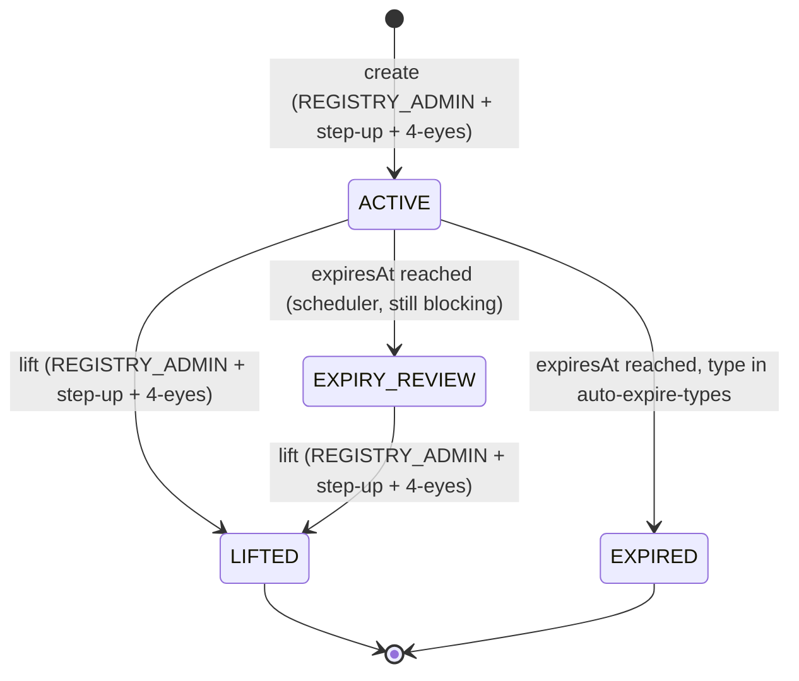

# Sperrvermerk: restrizioni al trading a livello di registro { #sperrvermerk-registry-layer-trading-restrictions }

!!! warning "EXTERNAL_REVIEW_REQUIRED"
    Questa pagina registra una mappatura legale/di controllo prevista. Non è una prova che un flag del database
    o una restrizione del contratto intelligente crei, registri, revochi o dimostri una restrizione con effetto legale
    Sperrvermerk. I termini dello strumento, l'autorità di istruzione, l'autorità di registro, le prove e la procedura specifica della giurisdizione richiedono una revisione esterna qualificata.

Lo **Sperrvermerk** è una notazione di blocco nel registro dei titoli che limita la capacità del detentore di trasferire, impegnare o altrimenti disporre dei propri token. È imposto dall'**eWpG §16** per il registro dei titoli crittografici ed è l'equivalente, a livello di registro, di un congelamento giudiziario o di una notazione di pegno nella compensazione tradizionale dei titoli.

Sebbene il concetto abbia origine nella legge tedesca, tutte e quattro le [giurisdizioni supportate](../legal/index.md) riconoscono meccanismi di blocco equivalenti. Registerwerk implementa un'unica entità `HolderBlock` che copre tutti i tipi di blocco nelle giurisdizioni.

---

## Tipi di blocco { #block-types }

| Tipo di blocco | Termine tedesco | Descrizione |
|---|---|---|
| `PFANDRECHT` | Pfandrecht | Pegno: il detentore ha impegnato la posizione come garanzia |
| `PFAENDUNG` | Pfändung | Pignoramento/sequestro conservativo — titolo esecutivo di un creditore |
| `GERICHTSBESCHLUSS` | Gerichtsbeschluss | Ordinanza del tribunale — congelamento giudiziario generale |
| `NACHLASSSPERRE` | Nachlasssperre | Blocco successorio (Nachlasssperre) — procedimento di successione pendente |
| `VERFUGUNGSVERBOT` | Verfügungsverbot | Divieto di disposizione — disposto dal tribunale o dall'autorità |
| `TOD` | Tod des Inhabers | Morte del titolare — liquidazione patrimoniale in attesa |
| `INSOLVENZ` | Insolvenz | Procedura di insolvenza — amministratore notificato |

---

## Entità `HolderBlock` { #holderblock-entity }

L'entità `HolderBlock` nel modulo `kyc` memorizza tutti i blocchi attivi e storici:

| Campo | Descrizione |
|---|---|
| `entityId` | FK a `LegalEntity` |
| `assetId` | FK a `Asset` |
| `walletAddress` | Portafoglio specifico da bloccare (facoltativo — se nullo, tutti i portafogli per entità) |
| `blockType` | Uno dei tipi sopra |
| `legalBasis` | Base giuridica in testo libero (ad es. numero del fascicolo giudiziario) |
| `courtRef` | Numero di riferimento del tribunale |
| `documentId` | FK a `KycDocument` che detiene l'ordine di blocco |
| `startsAt` | Quando il blocco diventa attivo |
| `expiresAt` | Data di scadenza automatica (campo nullable — sono consentiti blocchi a tempo indeterminato) |
| `liftedAt` | Quando il blocco è stato revocato manualmente |
| `liftedBy` | UUID dell'operatore che ha revocato il blocco |
| `twoManRuleApprover` | UUID del secondo approvatore |
| `twoManRuleApprovedAt` | Quando il secondo approvatore ha confermato |
| `onChainFreezeTxHash` | Hash della prima transazione di congelamento on-chain confermata di questo blocco. Un blocco può interessare più deployment; l'esito per deployment e wallet è in `holder_block_freeze` (vedi [Portata on-chain](#on-chain-reach)) |

---

## Ciclo di vita { #lifecycle }

```mermaid
stateDiagram-v2
    [*] --> ACTIVE : create (REGISTRY_ADMIN + step-up + 4-eyes)
    ACTIVE --> LIFTED : lift (REGISTRY_ADMIN + step-up + 4-eyes)
    ACTIVE --> EXPIRY_REVIEW : expiresAt reached (scheduler, still blocking)
    EXPIRY_REVIEW --> LIFTED : lift (REGISTRY_ADMIN + step-up + 4-eyes)
    ACTIVE --> EXPIRED : expiresAt reached, type in auto-expire-types
    LIFTED --> [*]
    EXPIRED --> [*]
```

**Creazione di un blocco:**
1. `REGISTRY_ADMIN` invia `POST /api/v1/holder-blocks` con tipo di blocco, base legale e scadenza opzionale
2. L'aspetto `@RequiresStepUp` applica un nuovo token di step-up (TOTP o WebAuthn)
3. `SperrvermerkService` verifica che un secondo approvatore abbia confermato (token `dualControlPending`)
4. Una volta confermato il blocco nel database, `SperrvermerkOnchainSyncListener` congela il wallet tramite l'outbox durevole delle transazioni su ogni deployment di token attivo degli asset detenuti (o solo su quelli dell'`assetId`, se il blocco è limitato a un asset). Gli standard congelabili sono elencati [più sotto](#on-chain-reach); un deployment che non si può congelare viene registrato ed escalato, non saltato
5. L'esito per blocco, deployment e wallet è registrato in `holder_block_freeze` e segue lo stato della transazione: `SUBMITTED` diventa `CONFIRMED` (e viene memorizzato `onChainFreezeTxHash`) oppure `FAILED`
6. Viene emesso un `AuditEvent` con i dettagli completi del blocco

**Revoca di un blocco:**
Si applica lo stesso flusso step-up + quattro occhi. La revoca riconcilia nel verso opposto: per ogni wallet e deployment lo scongelamento on-chain viene inviato solo se nessun altro blocco vigente copre ancora il wallet (`RELEASE_SUBMITTED`, poi `RELEASED`). Uno scongelamento fallito lascia il wallet congelato, viene segnalato (`HOLDER_BLOCK_RELEASE_FAILED`, attività per l'operatore) e ritentato. Nel registro il blocco è comunque `LIFTED`; `liftedAt` e `liftedBy` vengono valorizzati.

**Scadenza automatica:**
Un job `@Scheduled` viene eseguito ogni notte e trova tutti i blocchi ACTIVE con `expiresAt < NOW()`. Per impostazione predefinita **nessun tipo di blocco scade automaticamente**: il blocco passa a `EXPIRY_REVIEW`, continua a bloccare (controlli del registro e congelamento on-chain) e vengono generati un task per l'operatore e un'e-mail alla compliance. Viene revocato solo con la revoca normale (step-up + secondo approvatore). I tipi elencati in `registerwerk.sperrvermerk.auto-expire-types` (vuoto di default) continuano a essere revocati automaticamente in `EXPIRED`.

!!! note "Date di scadenza (6-25)"
    `expiresAt` deve essere nel futuro. Per i tipi giudiziari e di autorità (`GERICHTSBESCHLUSS`, `PFAENDUNG`, `INSOLVENZ`, `NACHLASSSPERRE`, `VERFUGUNGSVERBOT`, `TOD`, `REGULATORISCH`) una data di scadenza richiede inoltre `courtRef` o `documentId`, e il secondo approvatore la conferma rispetto al provvedimento. Quando l'ultimo blocco viene revocato, vengono rilasciati tutti i congelamenti che nessun blocco residuo copre, su tutti gli asset del wallet; i blocchi di entità coprono tutti i wallet di titolare dell'entità. I blocchi solo wallet sono visibili anche ai controlli di repo desk e lending. Se un tipo possa scadere automaticamente è una decisione legale parcheggiata (T6-11).

---

## Effetto sulle operazioni dei token { #effect-on-token-operations }

`HolderBlock` viene applicato a più livelli:

| Operazione | Punto di applicazione |
|---|---|
| `forceTransfer` | `TokenAdminController` — controllato prima di qualsiasi chiamata di trasferimento |
| `forceApprove` | `TokenAdminController` — controllato prima dell'approvazione |
| Creazione `AssetHolder` (nuovo investitore) | `AssetService` — i blocchi esistenti possono impedire nuove posizioni |
| Trasferimento on-chain | Il contratto del token rifiuta i movimenti da, verso o da parte di un indirizzo congelato (`freezeAddress` / `setAddressFrozen`), vedi [Portata on-chain](#on-chain-reach) |

---

## Portata on-chain { #on-chain-reach }

Il blocco del livello di registro (database) è quello che prevale e vale per ogni standard di token. Il congelamento on-chain lo riproduce dove un contratto è in grado di esprimerlo, così che siano chiuse anche per il wallet le vie che il backend non media (trasferimenti diretti, `repay`/`liquidate` del repo, depositi e rimborsi dei vault). È una misura tecnica, non un effetto giuridico (vedi l'avviso di revisione in cima alla pagina).

| Standard / chain | Congelamento on-chain automatico | Come |
|---|---|---|
| ERC-20, ERC-721, ERC-1155 | Sì | `freezeAddress(address,string)` (`EwpgCompliance`) tramite la porta di amministrazione dei token |
| ERC-3525 | Sì | `freezeAddress` tramite la porta di amministrazione ERC-3525; uno scongelamento manuale è rifiutato finché un blocco copre il wallet |
| Quote di vault ERC-4626 / ERC-7540 | Sì | `freezeAddress` (`EwpgCompliance`); a un proprietario o pagatore congelato non si paga e l'escrow resta nel vault (congelamento sul posto) |
| ERC-3643 (T-REX) | Sì | `setAddressFrozen(address,true)` sul token (`Erc3643LifecycleService`) |
| ERC-3643 confidenziale (Zama fhEVM) | Sì | `setAddressFrozen(address,bool)` |
| ERC-20 confidenziale | No | il contratto non ha una funzione di congelamento |
| Solana (SPL, Token-2022 e i preset di estensioni) | No | `FreezeAccount` agisce per token account ed è un'azione manuale dell'operatore |
| Starknet (ERC-20, ERC-3525) | No | i contratti Cairo hanno `freeze_address`, ma è solo una chiamata manuale dell'operatore: gli invoke Starknet non passano dall'outbox durevole e le loro ricevute non sono tracciate, quindi nessun esito potrebbe essere confermato |
| Stellar | No | un congelamento è una modifica dell'autorizzazione della trustline, un'azione manuale dell'operatore |
| Canton / Daml | No | nessun congelamento a livello di titolare che il registro possa pilotare |

Ogni congelamento passa dall'outbox durevole delle transazioni (firmato nella transazione di database, trasmesso dopo il commit) e il suo esito si legge dallo stato della transazione. `holder_block_freeze` conserva una riga per blocco, deployment e wallet:

| Stato | Significato |
|---|---|
| `SUBMITTED` | la transazione di congelamento è nell'outbox, il suo esito non è ancora definitivo |
| `CONFIRMED` | la transazione è definitiva e riuscita; `onChainFreezeTxHash` è memorizzato; evento di audit `HOLDER_BLOCK_FREEZE_CONFIRMED` |
| `FAILED` | il congelamento non ha potuto essere inviato, è stato annullato (revert) o sostituito: il wallet può ancora muoversi on-chain |
| `UNSUPPORTED_ON_CHAIN` | lo standard o la chain non ha un congelamento automatico (tabella sopra): serve un intervento manuale |
| `RELEASE_SUBMITTED` / `RELEASED` / `RELEASE_FAILED` | lo stesso per lo scongelamento dopo la revoca di un blocco; `RELEASED` comprende anche «un altro blocco copre ancora il wallet, il congelamento resta» |

Un esito `FAILED` o `UNSUPPORTED_ON_CHAIN` non passa mai inosservato: genera l'evento di audit `HOLDER_BLOCK_NOT_PROPAGATED` (`cause`: `SUBMISSION_FAILED`, `TX_FAILED`, `UNSUPPORTED_ON_CHAIN`, `NO_DEPLOYMENT_MATCHED` o `DRIFT`), un'attività per l'operatore `SPERRVERMERK_FREEZE_NOT_PROPAGATED` sull'entità emittente dell'asset, i gauge `registerwerk_sperrvermerk_freeze_failed` / `registerwerk_sperrvermerk_freeze_unsupported` e gli allarmi `SperrvermerkFreezeFailed` / `SperrvermerkFreezeUnsupported`. **Non revoca mai il blocco del livello di registro.**

Due job mantengono la chain allineata al registro (entrambi protetti da ShedLock). Uno sweep ogni 5 minuti legge l'esito dei congelamenti inviati e ritenta quelli falliti con back-off (5 tentativi; `registerwerk.sperrvermerk.freeze-sweep-ms`). Una riconciliazione notturna (`registerwerk.sperrvermerk.freeze-reconcile-cron`, predefinito 02:30) scorre ogni blocco che blocca ancora, sia `ACTIVE` sia `EXPIRY_REVIEW`: reinvia i congelamenti mancanti e falliti, rilegge `isFrozen` per quelli confermati e segnala come deriva (`registerwerk_sperrvermerk_freeze_drift_total`, allarme `SperrvermerkFreezeDrift`, poi lo ricongela) un wallet che **non** risulta congelato. Uno scongelamento fallito lascia il wallet congelato (il verso sicuro) e viene segnalato con `HOLDER_BLOCK_RELEASE_FAILED`.

---

## Audit trail { #audit-trail }

Ogni creazione, modifica e revoca di blocchi genera un `AuditEvent` di tipo `HOLDER_BLOCK_CREATED`, `HOLDER_BLOCK_LIFTED` o `HOLDER_BLOCK_EXPIRED`; il seguito on-chain aggiunge `HOLDER_BLOCK_FREEZE_CONFIRMED`, `HOLDER_BLOCK_NOT_PROPAGATED` e `HOLDER_BLOCK_RELEASE_FAILED`. Questi eventi includono:

- l'identità dell'operatore che ha avviato l'operazione
- l'identità del secondo approvatore (per creazione/revoca)
- lo snapshot completo di `HolderBlock` al momento dell'evento
- il riferimento al token di step-up (timestamp TOTP o ID dell'asserzione WebAuthn)

Questo audit trail è destinato a supportare la documentazione delle voci di registro ed è a prova di manomissione grazie
alla [catena di hash di controllo](../platform/audit-log.md); la sua completezza e il trattamento ai sensi dell'eWpG §15 richiedono una revisione esterna.
