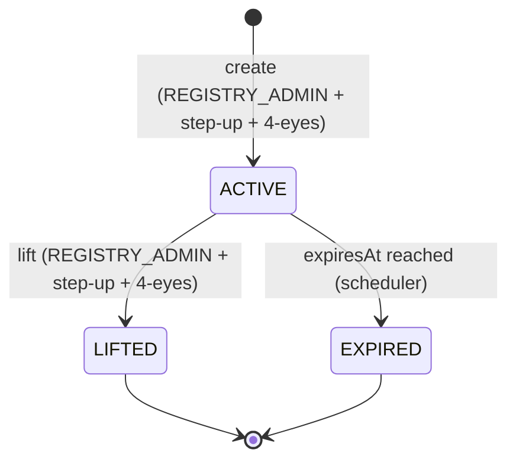

# Sperrvermerk — Registry-Layer Trading Restrictions

The **Sperrvermerk** is a blocking notation in the securities register that restricts a holder's ability to transfer, pledge, or otherwise dispose of their tokens. It is mandated by **eWpG §16** for the crypto securities register and is the registry-layer equivalent of a court freeze or pledge notation in traditional securities clearing.

Although the concept originates in German law, all four [supported jurisdictions](../legal/index.md) recognise equivalent blocking mechanisms. Registerwerk implements a single `HolderBlock` entity that covers all block types across jurisdictions.

---

## Block types

| Block type | German term | Description |
|---|---|---|
| `PFANDRECHT` | Pfandrecht | Pledge — holder has pledged the position as collateral |
| `PFAENDUNG` | Pfändung | Attachment/garnishment — creditor enforcement order |
| `GERICHTSBESCHLUSS` | Gerichtsbeschluss | Court order — general judicial freeze |
| `NACHLASSSPERRE` | Nachlasssperre | Estate freeze — pending succession proceedings |
| `VERFUGUNGSVERBOT` | Verfügungsverbot | Disposal prohibition — ordered by court or authority |
| `TOD` | Tod des Inhabers | Death of holder — pending estate settlement |
| `INSOLVENZ` | Insolvenz | Insolvency proceedings — administrator notified |

---

## `HolderBlock` entity

The `HolderBlock` entity in the `kyc` module stores all active and historical blocks:

| Field | Description |
|---|---|
| `entityId` | FK to `LegalEntity` |
| `assetId` | FK to `Asset` |
| `walletAddress` | Specific wallet to block (optional — if null, all wallets for entity) |
| `blockType` | One of the types above |
| `legalBasis` | Free-text legal basis (e.g., court file number) |
| `courtRef` | Court reference number |
| `documentId` | FK to `KycDocument` holding the blocking order |
| `startsAt` | When the block becomes active |
| `expiresAt` | Automatic expiry date (nullable — indefinite blocks allowed) |
| `liftedAt` | When the block was manually lifted |
| `liftedBy` | UUID of the operator who lifted the block |
| `twoManRuleApprover` | UUID of the second approver |
| `twoManRuleApprovedAt` | When the second approver confirmed |
| `onChainFreezeTxHash` | Hash of the corresponding on-chain freeze transaction |

---

## Lifecycle

**Creating a block:**
1. `REGISTRY_ADMIN` submits `POST /api/v1/holder-blocks` with block type, legal basis, and optional expiry
2. `@RequiresStepUp` aspect enforces a fresh step-up token (TOTP or WebAuthn)
3. `SperrvermerkService` checks that a second approver has confirmed (`dualControlPending` token)
4. If the asset uses [ERC-3643](../token-standards/erc3643.md) identity-bound tokens, `freezeAddress()` is called on the compliance module contract
5. The `onChainFreezeTxHash` is stored once the transaction is confirmed
6. An `AuditEvent` is emitted with the full block details

**Lifting a block:**
The same step-up + 4-eyes flow applies. Lifting calls the corresponding on-chain `unfreezeAddress()` and clears the `HolderBlock.liftedAt` field.

**Automatic expiry:**
A `@Scheduled` job runs nightly, finds all `HolderBlock` records where `expiresAt < NOW()` and `liftedAt IS NULL`, transitions them to `EXPIRED`, and calls on-chain unfreeze.

---

## Effect on token operations

The `HolderBlock` is enforced at multiple layers:

| Operation | Enforcement point |
|---|---|
| `forceTransfer` | `TokenAdminController` — checked before any transfer call |
| `forceApprove` | `TokenAdminController` — checked before approval |
| `AssetHolder` creation (new investor) | `AssetService` — existing blocks can prevent new positions |
| On-chain transfer (ERC-3643) | `ComplianceModuleContract` — identity registry rejects frozen addresses |

The registry-layer block (DB) and the on-chain freeze (smart contract) are **both** required for ERC-3643 tokens. For other standards (ERC-20, ERC-3525), only the registry-layer block applies; the on-chain transfer is prevented by the operator refusing to sign the transaction.

---

## Audit trail

Every block creation, modification, and lifting generates an `AuditEvent` of type `HOLDER_BLOCK_CREATED`, `HOLDER_BLOCK_LIFTED`, or `HOLDER_BLOCK_EXPIRED`. These events include:

- The initiating operator's identity
- The second approver's identity (for create/lift)
- The full `HolderBlock` snapshot at the time of the event
- The step-up token reference (TOTP timestamp or WebAuthn assertion ID)

This audit trail satisfies eWpG §15 requirements for registry entry documentation and is tamper-protected by the [audit hash chain](../platform/audit-log.md).
