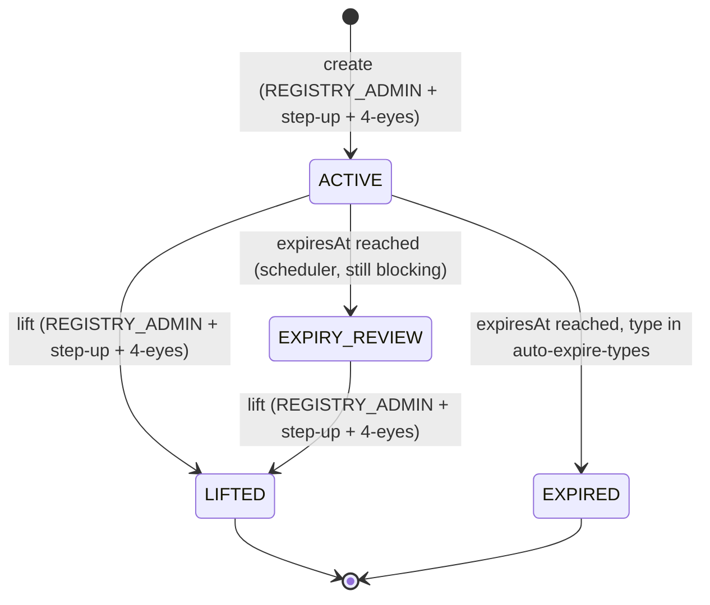

# Sperrvermerk — Registry-Layer Trading Restrictions

!!! warning "EXTERNAL_REVIEW_REQUIRED"
    This page records an intended legal/control mapping. It is not evidence that a database flag
    or smart-contract restriction creates, records, lifts, or proves a restriction with legal effect
    Sperrvermerk. Instrument terms, instruction authority, register authority, evidence, and
    jurisdiction-specific procedure require qualified external review.

The **Sperrvermerk** is a blocking notation in the securities register that restricts a holder's ability to transfer, pledge, or otherwise dispose of their tokens. It is mandated by **eWpG §16** for the crypto securities register and is the registry-layer equivalent of a court freeze or pledge notation in traditional securities clearing.

Although the concept originates in German law, all four [supported jurisdictions](../legal/index.md) recognise equivalent blocking mechanisms. Registerwerk implements a single `HolderBlock` entity that covers all block types across jurisdictions.

---

## Block types

| Block type | German term | Description |
|---|---|---|
| `PFANDRECHT` | Pfandrecht | Pledge — holder has pledged the position as collateral |
| `PFAENDUNG` | Pfändung | Attachment/garnishment — creditor enforcement order |
| `GERICHTSBESCHLUSS` | Gerichtsbeschluss | Court order — general judicial freeze |
| `NACHLASSSPERRE` | Nachlasssperre | Estate freeze — pending succession proceedings |
| `VERFUGUNGSVERBOT` | Verfügungsverbot | Disposal prohibition — ordered by court or authority |
| `TOD` | Tod des Inhabers | Death of holder — pending estate settlement |
| `INSOLVENZ` | Insolvenz | Insolvency proceedings — administrator notified |
| `REGULATORISCH` | Regulatorische Sperre | Regulatory block — ordered by a supervisory authority |

---

## `HolderBlock` entity

The `HolderBlock` entity in the `kyc` module stores all active and historical blocks:

| Field | Description |
|---|---|
| `id` | Primary key |
| `entityId` | FK to `LegalEntity`. Set for an entity-scoped block, which covers all of the entity's holder wallets (resolved from the wallet's holder row when exactly one entity holds the wallet) |
| `assetId` | FK to `Asset`; null means every asset the wallet holds |
| `walletAddress` | The blocked wallet — mandatory, stored in normalised form |
| `blockType` | One of the types above |
| `status` | `ACTIVE`, `EXPIRY_REVIEW`, `LIFTED`, `EXPIRED` or `SUPERSEDED` (see [Lifecycle](#lifecycle)) |
| `legalBasis` | Free-text legal basis (e.g., court file number) |
| `courtRef` | Court reference number |
| `documentId` | FK to `KycDocument` holding the blocking order |
| `startsAt` | When the block becomes active |
| `expiresAt` | Expiry date (nullable — indefinite blocks allowed) |
| `expiryConfirmedByApprover` | Whether the second approver confirmed the expiry date against the order |
| `expiryReviewAt` | When the block moved to `EXPIRY_REVIEW` |
| `liftedAt` / `liftedBy` / `liftReason` | When, by whom and why the block was lifted |
| `createdBy` | The operator who created the block |
| `dualControlApproverId` | The second approver (validated by the step-up aspect) |
| `dualControlApprovedAt` | When the second approver's approval was recorded |
| `createdAt` / `updatedAt` | Record timestamps |
| `onChainFreezeTxHash` | Hash of the first confirmed on-chain freeze transaction of this block. A block can reach several deployments; the outcome per deployment and wallet is in `holder_block_freeze` (see [On-chain reach](#on-chain-reach)) |

---

## Lifecycle

```mermaid
stateDiagram-v2
    [*] --> ACTIVE : create (REGISTRY_ADMIN + step-up + 4-eyes)
    ACTIVE --> LIFTED : lift (REGISTRY_ADMIN + step-up + 4-eyes)
    ACTIVE --> EXPIRY_REVIEW : expiresAt reached (scheduler, still blocking)
    EXPIRY_REVIEW --> LIFTED : lift (REGISTRY_ADMIN + step-up + 4-eyes)
    ACTIVE --> EXPIRED : expiresAt reached, type in auto-expire-types
    LIFTED --> [*]
    EXPIRED --> [*]
```

`SUPERSEDED` is defined in the status enum but no current code path sets it. `EXPIRED` is reached only for block types listed in `registerwerk.sperrvermerk.auto-expire-types` (default empty); otherwise an expired date leads to `EXPIRY_REVIEW`.

**Creating a block:**
1. `REGISTRY_ADMIN` submits `POST /api/v1/holder-blocks` with block type, legal basis, and optional expiry
2. `@RequiresStepUp` enforces a fresh step-up token (local TOTP, or the Entra authentication context) and a second approver: the approver's token is sent in `X-Dual-Control-Token` and validated by the step-up aspect, and the service receives the approver's id
3. `SperrvermerkService` records the block with `dualControlApproverId` and `dualControlApprovedAt`
4. Once the block is committed, `SperrvermerkOnchainSyncListener` freezes the wallet on every live token deployment of the assets it holds (or of the `assetId` only, for an asset-scoped block), through the durable transaction outbox. The standards that can be frozen are listed [below](#on-chain-reach); a deployment that cannot be frozen is recorded and escalated, not skipped
5. The outcome per block, deployment and wallet is recorded in `holder_block_freeze` and follows the transaction status: `SUBMITTED` becomes `CONFIRMED` (and `onChainFreezeTxHash` is stored) or `FAILED`
6. An `AuditEvent` is emitted with the full block details

**Lifting a block:**
The same step-up + 4-eyes flow applies. Lifting runs the reconciliation in reverse: for each wallet and deployment the on-chain unfreeze is submitted only if no remaining blocking block still covers it (`RELEASE_SUBMITTED`, then `RELEASED`). A failed unfreeze leaves the wallet frozen, is reported (`HOLDER_BLOCK_RELEASE_FAILED`, operator task) and retried. In the register the block is `LIFTED` either way; `liftedAt` and `liftedBy` are set.

**Automatic expiry:**
A `@Scheduled` job runs nightly and finds all ACTIVE blocks with `expiresAt < NOW()`. By default **no block type expires automatically**: the block moves to `EXPIRY_REVIEW`, keeps blocking (registry gates and on-chain freeze), and an operator task and a compliance e-mail are raised. It is lifted only through the normal lift (step-up + second approver). Types listed in `registerwerk.sperrvermerk.auto-expire-types` (default empty) are still auto-lifted to `EXPIRED`.

!!! note "Expiry dates (6-25)"
    `expiresAt` must lie in the future. For court and authority types (`GERICHTSBESCHLUSS`, `PFAENDUNG`, `INSOLVENZ`, `NACHLASSSPERRE`, `VERFUGUNGSVERBOT`, `TOD`, `REGULATORISCH`) an expiry date additionally needs a `courtRef` or `documentId`, and the second approver confirms it against the order. When the last block is lifted, every freeze that no remaining block covers is released across all of the wallet's assets, and entity-scoped blocks cover all of the entity's holder wallets. Wallet-only blocks are also visible to the repo desk and lending gates. Whether any type may expire automatically is a parked legal decision (T6-11).

---

## Effect on token operations

The `HolderBlock` is enforced at multiple layers:

| Operation | Enforcement point |
|---|---|
| EVM token administration (`TokenAdminService`, `Erc3525AdminService`, `Erc7540AdminService`, `Erc3643LifecycleService`) | A privileged operation involving a wallet under a block is refused (fail closed) |
| ERC-3643 claim issuance (`ClaimIssuanceService`) | No on-chain identity claim is issued for an entity under a block |
| Register portfolio migration (`PortfolioMigrationService`) | A blocked holder's position is not migrated |
| Outbound destinations and party eligibility (`OutboundDestinationGateImpl`, `PartyEligibilityGateImpl`) | Used by trading, repo, lending and corporate-action payouts: a blocked party or destination is refused; a lender's protective repo actions are flagged for the operator instead |
| On-chain transfer | The token contract refuses movements from, to or by a frozen address (`freezeAddress` / `setAddressFrozen`), see [On-chain reach](#on-chain-reach) |

---

## On-chain reach { #on-chain-reach }

The registry-layer block (database) is the source of truth for Registerwerk's own gates and applies to every token standard. The on-chain freeze mirrors it where a contract can express it, so that paths the backend does not mediate (direct transfers, repo `repay`/`liquidate`, vault deposits and redemptions) are closed for the wallet too. It is a technical measure, not a legal effect (see the review warning at the top).

| Standard / chain | Automated on-chain freeze | How |
|---|---|---|
| ERC-20, ERC-721, ERC-1155 | Yes | `freezeAddress(address,string)` (`EwpgCompliance`) through the token admin port |
| ERC-3525 | Yes | `freezeAddress` through the ERC-3525 admin port; a manual unfreeze is refused while a block covers the wallet |
| ERC-4626 / ERC-7540 vault shares | Yes | `freezeAddress` (`EwpgCompliance`); a frozen owner or payer is not paid out and the escrow stays in the vault (freeze-in-place) |
| ERC-3643 (T-REX) | Yes | `setAddressFrozen(address,true)` on the token (`Erc3643LifecycleService`) |
| Confidential ERC-3643 (Zama fhEVM) | Yes | `setAddressFrozen(address,bool)` |
| Confidential ERC-20 | No | the contract has no freeze function |
| Solana (SPL, Token-2022 and the extension presets) | No | `FreezeAccount` works per token account and is a manual operator action |
| Starknet (ERC-20, ERC-3525) | No | the Cairo contracts have `freeze_address`, but it is only a manual operator call: Starknet invokes are not in the durable outbox and their receipts are not tracked, so no outcome could be confirmed |
| Stellar | No | a freeze is a trustline authorization change, a manual operator action |
| Canton / Daml | No | no holder-level freeze that the register can drive |

Every freeze goes through the durable transaction outbox (signed in the database transaction, broadcast after commit) and its outcome is read from the transaction status. `holder_block_freeze` keeps one row per block, deployment and wallet:

| Status | Meaning |
|---|---|
| `SUBMITTED` | the freeze transaction is in the outbox, its outcome is not final yet |
| `CONFIRMED` | the transaction is final and successful; `onChainFreezeTxHash` is stored; audit event `HOLDER_BLOCK_FREEZE_CONFIRMED` |
| `FAILED` | the freeze could not be submitted, reverted or was replaced: the wallet may still move on-chain |
| `UNSUPPORTED_ON_CHAIN` | the standard or chain has no automated freeze (table above): manual action needed |
| `RELEASE_SUBMITTED` / `RELEASED` / `RELEASE_FAILED` | the same for the unfreeze after a lifted block; `RELEASED` also covers "another block still covers the wallet, the freeze stays" |

A `FAILED` or `UNSUPPORTED_ON_CHAIN` outcome is never silent: it raises the audit event `HOLDER_BLOCK_NOT_PROPAGATED` (`cause`: `SUBMISSION_FAILED`, `TX_FAILED`, `UNSUPPORTED_ON_CHAIN`, `NO_DEPLOYMENT_MATCHED` or `DRIFT`), an operator task `SPERRVERMERK_FREEZE_NOT_PROPAGATED` on the asset's issuer entity, the gauges `registerwerk_sperrvermerk_freeze_failed` / `registerwerk_sperrvermerk_freeze_unsupported` and the alerts `SperrvermerkFreezeFailed` / `SperrvermerkFreezeUnsupported`. **It never unblocks the register-level block.**

Two jobs keep the chain aligned with the register (both ShedLock-guarded). A sweep every 5 minutes reads the outcome of submitted freezes and retries failed ones with a back-off (5 attempts; `registerwerk.sperrvermerk.freeze-sweep-ms`). A nightly reconcile (`registerwerk.sperrvermerk.freeze-reconcile-cron`, default 02:30) walks every block that still blocks, both `ACTIVE` and `EXPIRY_REVIEW`: it re-sends missing and failed freezes, reads `isFrozen` back for confirmed ones, and reports a wallet found **not** frozen as drift (`registerwerk_sperrvermerk_freeze_drift_total`, alert `SperrvermerkFreezeDrift`, then re-freezes it). A failed unfreeze leaves the wallet frozen (the safe direction) and is reported through `HOLDER_BLOCK_RELEASE_FAILED`.

---

## Audit trail

Every block creation, modification, and lifting generates an `AuditEvent` of type `HOLDER_BLOCK_CREATED` or `HOLDER_BLOCK_LIFTED` (an automatic lift carries the reason `AUTO_EXPIRED`); reaching the expiry date raises `HOLDER_BLOCK_EXPIRY_REVIEW`. The on-chain follow-up adds `HOLDER_BLOCK_FREEZE_CONFIRMED`, `HOLDER_BLOCK_NOT_PROPAGATED` and `HOLDER_BLOCK_RELEASE_FAILED`. These events include:

- The initiating operator's identity
- The second approver's identity (for create/lift)
- The full `HolderBlock` snapshot at the time of the event
- The `DUAL_CONTROL_APPROVED` event that recorded the second approver's approval (token id and request digest), for create/lift

This audit trail is intended to support registry-entry documentation and is tamper-evident through
the [audit hash chain](../platform/audit-log.md); its completeness and eWpG §15 treatment require external review.
