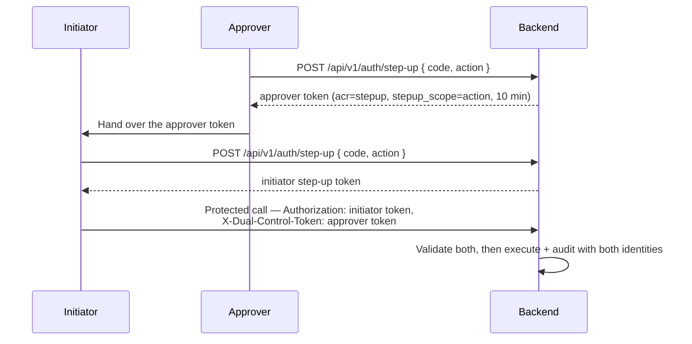

# Step-Up MFA & 4-Augen { #step-up-mfa-4-eyes }

!!! warning "EXTERNAL_REVIEW_REQUIRED"
    Auf dieser Seite werden die beabsichtigten Steuerungszuordnungen beschrieben. Es ist kein Beweis
    dafür, dass der konfigurierte MFA- oder Doppelkontroll-Ablauf eine bestimmte gesetzliche,
    regulatorische, sicherheitsbezogene oder auf Aufgabentrennung bezogene Anforderung erfüllt.
    Rollen, geschützte Aktionen, Sicherheitsstufe, Wiederherstellung und Prüfnachweise erfordern
    eine einsatzspezifische Überprüfung.

Bestimmte Vorgänge in Registerwerk sind so folgenreich – oder durch Vorschriften so eindeutig auf eine doppelte Aufsicht angewiesen –, dass eine normale Anmeldesitzung nicht ausreicht. Bei der **Step-up-Authentifizierung** muss der Betreiber seine Identität im Moment der Ausführung des Vorgangs erneut nachweisen. Das **Vier-Augen-Prinzip** verlangt zusätzlich, dass ein zweiter, unabhängiger Genehmiger bestätigt, bevor die Aktion ausgeführt wird.

---

## Warum das erforderlich ist { #why-this-exists }

| Verordnung | Verpflichtung |
|---|---|
| GwG §6(2) | Interne Kontrollsysteme — Entscheidungen mit hohem Risiko erfordern eine dokumentierte doppelte Aufsicht |
| eWpG §16 | Blockierungsvorgänge (Sperrvermerk) müssen auf einen benannten, verifizierten Betreiber zurückzuführen sein |
| BaFin KAIT | Die IT-Sicherheit erfordert MFA für den privilegierten Zugriff auf kritische Systeme |
| DSGVO Art. 32 | Geeignete technische Maßnahmen zum Schutz personenbezogener Daten — MFA ist die Grundlinie |

---

## Geschützte Vorgänge { #protected-operations }

Die Annotation `@RequiresStepUp` wird auf den folgenden Endpunkten und Dienstmethoden platziert. Für mit **4-Augen** gekennzeichnete Vorgänge ist zusätzlich ein zweiter Genehmiger erforderlich.

| Vorgang | Step-up | 4-Augen | Grund |
|---|---|---|---|
| `forceTransfer` | ✅ | ✅ | Irreversibler On-Chain-Vorgang |
| `forceBurn` | ✅ | ✅ | Dauerhafte Vernichtung von Token |
| `forceApprove` | ✅ | ✅ | Compliance-Override |
| `setSupplyCap` | ✅ | ✅ | Änderung eines wirtschaftlichen Parameters |
| KYC-Override (Genehmigung trotz Flag) | ✅ | ✅ | Umgehung des AML-Gates |
| Sperrvermerk erstellen | ✅ | ✅ | Gesetzliche Beschränkung des Inhabers |
| Sperrvermerk aufheben | ✅ | ✅ | Aufhebung der gesetzlichen Beschränkung |
| Identitätsübernahme (Impersonation) starten | ❌ ¹ | ❌ | Privilegierter Zugriff auf Kundendaten |
| Screening-Treffer akzeptieren | ✅ (hohe Punktzahl) | ✅ (Score ≥ 80) | AML-Override für einen bestätigten Treffer |
| Export des privaten Wallet-Schlüssels (Break-Glass) | ✅ | ✅ | Zugriff auf Schlüsselmaterial |
| Entra: eine Authentifizierungsmethode löschen | ✅ | ❌ | Entfernt einen veralteten Faktor |
| Entra: alle Authentifizierungsmethoden zurücksetzen | ✅ | ✅ | Erzwingt die erneute MFA-Registrierung für eine andere Person |
| Entra: Anmeldesitzungen widerrufen | ✅ | ❌ | Nur Auswirkung auf die Verfügbarkeit, kein Berechtigungsgewinn |
| Entra: temporären Zugangspass ausstellen | ✅ | ✅ | Eine Inhaber-Anmeldeinformation, die *als* der Kunde authentifiziert |

¹ `AdminImpersonationController` trägt heute kein `@RequiresStepUp`, und die Identitätsübernahme wird
rundweg verweigert, wenn `ENTRA_ENABLED=true` gilt. Diese Zeile behauptete zuvor einen
Step-up-Schutz, den der Code nicht implementiert.

---

## Zwei Wege { #two-tracks }

Wie der zweite Faktor nachgewiesen wird, hängt davon ab, wer die Sitzungstoken ausstellt. Beide werden durch dieselbe `@RequiresStepUp`-Annotation und denselben Aspekt erzwungen; nur die Prüfung unterscheidet sich.

### Lokales TOTP — `ENTRA_ENABLED=false`, und im Betreiberportal immer { #local-totp-entraenabledfalse-and-the-operator-portal-always }

RFC 6238 TOTP (HMAC-SHA1, 30-Sekunden-Fenster, 6 Ziffern), verifiziert durch `StepUpTokenIssuer`. Registrieren Sie sich bei `POST /api/v1/auth/step-up/enroll`, bestätigen Sie bei `/enroll/confirm`, und tauschen Sie dann bei `POST /api/v1/auth/step-up` einen Code gegen ein kurzlebiges Token mit `acr=stepup` ein, das 10 Minuten gültig ist. Der Aufrufer sendet dieses Token anstelle seines Sitzungstokens bei der geschützten Anfrage. Die Ablehnung erfolgt mit **403**.

> **WebAuthn/FIDO2 ist nicht implementiert.** Das Feld `method` in der Step-up-Anfrage wird akzeptiert und ignoriert. Frühere Versionen dieses Dokuments beschrieben es als primären Faktor; es existierte nie im Code. Bei der Entra-Anmeldung ist phishingresistente MFA verfügbar — allerdings über Conditional Access, nicht über dieses Modul.

### Entra-Authentifizierungskontext — `ENTRA_ENABLED=true` { #entra-authentication-context-entraenabledtrue }

Das Zugriffstoken muss den erforderlichen Conditional-Access-Authentifizierungskontext in seinem `acrs`-Claim tragen. Registerwerk verifiziert selbst keinen Faktor; es stellt eine Anforderung und überlässt Conditional Access die Entscheidung, was diese erfüllt — wodurch ein Betreiber phishingresistente MFA für erzwungene Übertragungen verlangen kann, ohne den Code zu ändern.

Die Ablehnung erfolgt als **401-Claims-Challenge**, sodass sich die SPA nur für diese eine Aktion erneut authentifiziert, statt den Benutzer abzumelden:

```
WWW-Authenticate: Bearer realm="", authorization_uri="…",
                  error="insufficient_claims", claims="<base64>"
```

Die Kontext-ID ist Konfiguration, referenziert über `@RequiresStepUp(reason = …)`:

```yaml
registerwerk.auth.step-up.entra:
  auth-context-id: c1                 # ENTRA_STEPUP_AUTH_CONTEXT_ID
  reason-overrides:
    FORCE_BURN_EWG26: c2
    "Payment rail creation": c1       # quote reasons containing spaces
```

Sie wird beim Start gegen den Tenant validiert: Ein Kontext, der nicht existiert oder existiert, aber **nicht für Apps veröffentlicht** ist, lässt den Start im Produktionsmodus fehlschlagen. Ein unveröffentlichter Kontext kann niemals erfüllt werden und erzeugt eine Anmelde-Umleitungsschleife, ohne dass die Protokolle dafür eine Erklärung liefern.

#### Aktualität funktioniert hier anders { #freshness-works-differently-here }

Ein Entra-Zugriffstoken lebt 60–90 Minuten, und `acrs` bleibt für seine gesamte Lebensdauer bestehen, sodass die Anwendung von `maxAgeMinutes` auf `iat` bei nahezu jedem geschützten Aufruf eine vollständige Browser-Umleitung erzwingen würde. Stattdessen gilt:

- die **primäre** Aktualitätskontrolle ist die Conditional-Access-Richtlinie für den Authentifizierungskontext (setzen Sie *Anmeldehäufigkeit: Jedes Mal* für Aktionen auf Regulierungsebene);
- `maxAgeMinutes` wird als Rückfallprüfung gegen den `auth_time`-Claim geprüft.

`auth_time` ist ein optionaler Claim, der bei der API-App-Registrierung angefordert werden muss. Ohne ihn fällt die Prüfung auf `iat` zurück, was schwächer ist — das Backend protokolliert beim ersten Mal eine Warnung, wenn es ein Entra-Token ohne diesen Claim sieht.

---

## 4-Augen-Implementierung { #4-eyes-implementation }

Die aktuelle Durchsetzung der Doppelkontrolle erfordert zwei unterschiedliche `REGISTRY_ADMIN`-Benutzer. Es gibt keine Anwendungsrolle `SECOND_APPROVER`, und ein `COMPLIANCE_OFFICER` wird nicht als Ersatz akzeptiert, sofern die Implementierung nicht geändert und separat überprüft wird.

**Das Vier-Augen-Prinzip ist in beiden Wegen identisch**: Ein Doppelkontroll-Token wird immer lokal nach TOTP-Verifizierung geprägt und immer gegen den lokalen HS256-Decoder validiert; es hängt also nicht davon ab, wie der primäre Faktor nachgewiesen wurde.



Von `StepUpEnforcementAspect` und `StepUpTokenValidator` erzwungene Schlüsselinvarianten:

- Initiator und Genehmiger **müssen unterschiedliche Benutzer sein** (`sub`-Vergleich)
- Das Token des Genehmigers muss `stepup_scope` **exakt gleich** dem `reason` der Annotation tragen — andernfalls wäre eine Genehmigung ein allgemeiner Berechtigungsnachweis, der für jede Vier-Augen-Aktion in ihrem Zeitfenster gültig wäre
- Der Genehmiger muss weiterhin ein **aktivierter `REGISTRY_ADMIN` in der Datenbank** sein, nicht nur gemäß den Claims des Tokens, die den Status nur zum Zeitpunkt der Prägung widerspiegeln
- Beide Token laufen nach 10 Minuten ab

---

## AOP-Durchsetzung { #aop-enforcement }

Der `StepUpEnforcementAspect` fängt jede mit `@RequiresStepUp` annotierte Methode ab und:

1. liest das authentifizierte JWT aus dem Sicherheitskontext
2. verzweigt je nach aktivem Weg:
   - **lokal** — erfordert `acr=stepup` und `iat` innerhalb von `maxAgeMinutes` (Standard 10); ein Fehler führt zu **403**
   - **Entra** — erfordert, dass `acrs` den konfigurierten Authentifizierungskontext enthält und `auth_time` innerhalb von `maxAgeMinutes` liegt; ein Fehler führt zu einer **401-Claims-Challenge**
3. validiert, falls `requireSecondApprover = true`, den Header `X-Dual-Control-Token` und legt die ID des Genehmigers als Anforderungsattribut `stepup.dualControlApproverId` offen, das Controller mit `@RequestAttribute` lesen — sie dürfen das Token nicht selbst erneut dekodieren
4. Die Claims-Challenge wird von `ClaimsChallengeAdvice` ausgelöst, nicht von Spring Security: Die Exception wird aus einem AOP-`@Around` geworfen und daher von `@RestControllerAdvice` behandelt, und der `BearerTokenAuthenticationEntryPoint` von Spring Security hat ohnehin keinen Codepfad, der einen `claims=`-Parameter serialisieren kann

---

## Audit-Ereignisse { #audit-events }

Jedes Step-up-Authentifizierungsereignis und jeder geschützte Vorgang erzeugt ein `AuditEvent`:

| Ereignistyp | Inhalt |
|---|---|
| `STEP_UP_ISSUED` | Benutzer-ID, Methode, Zeitstempel |
| `DUAL_CONTROL_INITIATED` | Initiator-ID, Vorgangstyp, Hash der Vorgangsparameter |
| `DUAL_CONTROL_CONFIRMED` | Genehmiger-ID, Vorgangstyp, Referenz auf das bestätigte Token |
| `PROTECTED_OPERATION_EXECUTED` | Beide Benutzer-IDs, Vorgangstyp, vollständige Vorgangsparameter |
| `STEP_UP_FAILED` | Benutzer-ID, Fehlergrund, IP-Adresse |

Diese Ereignisse sind Teil der manipulationssicher nachweisbaren [Audit-Kette](../platform/audit-log.md) und können nicht gelöscht oder geändert werden.
