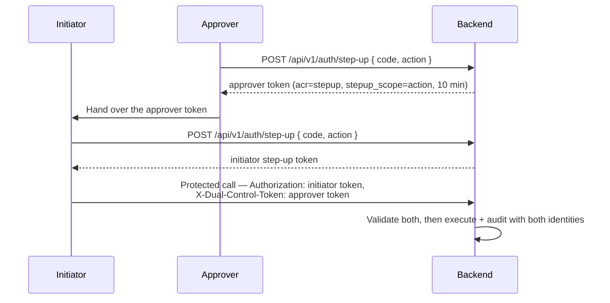

# Step-up MFA y doble control (4-eyes) { #step-up-mfa-4-eyes }

!!! warning "EXTERNAL_REVIEW_REQUIRED"
    Esta página describe las asignaciones de control previstas. No es evidencia de que el flujo de MFA o de control
    dual configurado satisfaga un requisito legal, regulatorio, de seguridad o de segregación de funciones en
    particular. Las funciones, las acciones protegidas, el nivel de garantía, la recuperación y la evidencia de
    auditoría requieren una revisión específica de la implementación.

Ciertas operaciones en Registerwerk son tan trascendentes — o están tan claramente sujetas a doble supervisión por
regulación — que una sesión de inicio de sesión normal no es suficiente. La **autenticación reforzada (step-up)**
exige que el operador vuelva a probar su identidad en el momento de ejecutar la operación. El **principio de doble
control** (Vier-Augen-Prinzip, «4-eyes») exige además que un segundo aprobador independiente confirme la acción
antes de que se ejecute.

---

## Por qué existe esto { #why-this-exists }

| Normativa | Obligación |
|---|---|
| GwG §6(2) | Sistemas de control interno: las decisiones de alto riesgo requieren doble supervisión documentada |
| eWpG §16 | Las operaciones de bloqueo (Sperrvermerk) deben ser rastreables hasta un operador verificado y nombrado |
| BaFin KAIT | La seguridad de TI requiere MFA para el acceso privilegiado a sistemas críticos |
| DSGVO Art. 32 | Medidas técnicas apropiadas para proteger los datos personales: MFA es la línea base |

---

## Operaciones protegidas { #protected-operations }

La anotación `@RequiresStepUp` se coloca en los siguientes endpoints y métodos de servicio. Las operaciones marcadas con **doble control (4-eyes)** requieren además un segundo aprobador.

| Operación | Step-up | Doble control (4-eyes) | Motivo |
|---|---|---|---|
| `forceTransfer` | ✅ | ✅ | Operación on-chain irreversible |
| `forceBurn` | ✅ | ✅ | Destrucción permanente de tokens |
| `forceApprove` | ✅ | ✅ | Anulación de cumplimiento |
| `setSupplyCap` | ✅ | ✅ | Cambio de parámetro económico |
| Anulación de KYC (aprobar pese a un indicador) | ✅ | ✅ | Elusión de la puerta AML |
| Crear Sperrvermerk | ✅ | ✅ | Restricción legal sobre el titular |
| Levantar Sperrvermerk | ✅ | ✅ | Eliminación de una restricción legal |
| Iniciar modo soporte (impersonation) | ❌ ¹ | ❌ | Acceso privilegiado a los datos del cliente |
| Aceptar hit de detección | ✅ (puntuación alta) | ✅ (puntuación ≥ 80) | Anulación de AML para un hit confirmado |
| Exportación de clave privada del monedero (break-glass) | ✅ | ✅ | Acceso al material de la clave |
| Entra: eliminar un método de autenticación | ✅ | ❌ | Elimina un factor obsoleto |
| Entra: restablecer todos los métodos de autenticación | ✅ | ✅ | Fuerza un nuevo registro de MFA para otra persona |
| Entra: revocar sesiones de inicio de sesión | ✅ | ❌ | Solo impacto en disponibilidad, sin ganancia de privilegios |
| Entra: emitir un Temporary Access Pass | ✅ | ✅ | Una credencial portadora que autentica *como* el cliente |

¹ `AdminImpersonationController` no lleva ningún `@RequiresStepUp` hoy, y el modo soporte se rechaza
categóricamente cuando `ENTRA_ENABLED=true`. Esta fila afirmaba antes contar con protección step-up que el
código no implementa.

---

## Dos vías { #two-tracks }

La forma en que se prueba el segundo factor depende de quién emite los tokens de sesión. Ambas vías se aplican
mediante la misma anotación `@RequiresStepUp` y el mismo aspecto; solo la verificación difiere.

### TOTP local — `ENTRA_ENABLED=false`, y siempre en el portal del operador { #local-totp-entraenabledfalse-and-the-operator-portal-always }

RFC 6238 TOTP (HMAC-SHA1, ventana de 30 segundos, 6 dígitos), verificado por
`StepUpTokenIssuer`. Inscríbase en `POST /api/v1/auth/step-up/enroll`, confirme en
`/enroll/confirm`, y luego canjee un código en `POST /api/v1/auth/step-up` por un token de corta duración
que lleva `acr=stepup`, válido durante 10 minutos. Quien llama envía ese token en lugar de su token de sesión
en la solicitud protegida. El rechazo es **403**.

> **WebAuthn / FIDO2 no está implementado.** El campo `method` de la solicitud de step-up se acepta
> y se ignora. Versiones anteriores de este documento lo describían como el factor principal; nunca
> existió en el código. Con el inicio de sesión de Entra, hay MFA resistente al phishing disponible, pero a
> través de Conditional Access, no a través de este módulo.

### Contexto de autenticación de Entra: `ENTRA_ENABLED=true` { #entra-authentication-context-entraenabledtrue }

El access token debe llevar el contexto de autenticación de Conditional Access requerido en su claim `acrs`.
Registerwerk no verifica un factor por sí mismo; declara un requisito y deja que Conditional Access decida
qué lo satisface — lo que permite a un operador exigir MFA resistente al phishing para las transferencias
forzosas sin ningún cambio de código.

El rechazo es un **claims challenge 401**, de modo que la SPA se reautentica para esa única acción en lugar
de cerrar la sesión del usuario:

```
WWW-Authenticate: Bearer realm="", authorization_uri="…",
                  error="insufficient_claims", claims="<base64>"
```

El identificador del contexto es configuración, indexada por `@RequiresStepUp(reason = …)`:

```yaml
registerwerk.auth.step-up.entra:
  auth-context-id: c1                 # ENTRA_STEPUP_AUTH_CONTEXT_ID
  reason-overrides:
    FORCE_BURN_EWG26: c2
    "Payment rail creation": c1       # quote reasons containing spaces
```

Se valida frente al tenant en el arranque: un contexto que no existe, o que existe pero **no está publicado
para las apps**, hace fallar el arranque en modo producción. Un contexto no publicado nunca puede satisfacerse
y produce un bucle de redirección de inicio de sesión sin nada en los logs que lo explique.

#### Aquí la frescura funciona de otra manera { #freshness-works-differently-here }

Un access token de Entra dura entre 60 y 90 minutos y `acrs` persiste durante toda su vida útil, de modo que
aplicar `maxAgeMinutes` sobre `iat` forzaría una redirección completa del navegador en casi todas las
llamadas protegidas. En su lugar:

- el control de frescura **principal** es la política de Conditional Access sobre el contexto de autenticación
  (fije *Sign-in frequency: Every time* para las acciones de nivel regulatorio);
- `maxAgeMinutes` se compara con el claim `auth_time` como respaldo.

`auth_time` es un claim opcional que debe solicitarse en el registro de la aplicación de la API. Sin él, la
comprobación recae en `iat`, que es más débil: el backend registra una advertencia la primera vez que ve un
token de Entra que carece de él.

---

## Implementación del doble control (4-eyes) { #4-eyes-implementation }

La aplicación actual del control dual exige dos usuarios `REGISTRY_ADMIN` distintos. No existe un rol de
aplicación `SECOND_APPROVER`, y un `COMPLIANCE_OFFICER` no se acepta como sustituto salvo que la
implementación se modifique y se revise por separado.

**El doble control es idéntico en ambas vías**: un token de control dual siempre se acuña localmente tras la
verificación TOTP y siempre se valida con el decodificador HS256 local, por lo que no depende de cómo se
demostró el factor principal.



Invariantes clave aplicadas por `StepUpEnforcementAspect` y `StepUpTokenValidator`:

- El iniciador y el aprobador **deben ser usuarios diferentes** (comparación de `sub`)
- El token del aprobador debe contener `stepup_scope` **exactamente igual** al `reason` de la anotación —
  de lo contrario, una sola aprobación sería una credencial genérica válida para cualquier acción de doble
  control dentro de su ventana de validez
- El aprobador debe seguir siendo un **`REGISTRY_ADMIN` habilitado en la base de datos**, no solo según las
  claims del token, que reflejan el estado únicamente en el momento en que se acuñó
- Ambos tokens caducan a los 10 minutos

---

## Aplicación de AOP { #aop-enforcement }

El `StepUpEnforcementAspect` intercepta cualquier método anotado con `@RequiresStepUp` y:

1. Lee el JWT autenticado del contexto de seguridad
2. Se ramifica según la vía activa:
   - **local** — requiere `acr=stepup` y `iat` dentro de `maxAgeMinutes` (predeterminado 10); el fallo es **403**
   - **Entra** — requiere que `acrs` contenga el contexto de autenticación configurado y que `auth_time`
     esté dentro de `maxAgeMinutes`; el fallo es un **claims challenge 401**
3. Si `requireSecondApprover = true`, valida la cabecera `X-Dual-Control-Token` y expone el id del aprobador
   como atributo de solicitud `stepup.dualControlApproverId`, que los controladores leen con
   `@RequestAttribute` — no deben decodificar el token por su cuenta
4. El claims challenge lo emite `ClaimsChallengeAdvice`, no Spring Security: la excepción se lanza desde un
   `@Around` de AOP y por eso la resuelve `@RestControllerAdvice`; el `BearerTokenAuthenticationEntryPoint`
   de Spring Security no tiene, en cualquier caso, ninguna ruta de código capaz de serializar un parámetro
   `claims=`

---

## Eventos de auditoría { #audit-events }

Cada evento de autenticación step-up y cada operación protegida genera un `AuditEvent`:

| Tipo de evento | Contenido |
|---|---|
| `STEP_UP_ISSUED` | ID de usuario, método, marca de tiempo |
| `DUAL_CONTROL_INITIATED` | ID del iniciador, tipo de operación, hash de parámetros de operación |
| `DUAL_CONTROL_CONFIRMED` | ID del aprobador, tipo de operación, referencia del token_confirmado |
| `PROTECTED_OPERATION_EXECUTED` | Ambos ID de usuario, tipo de operación, parámetros de operación completos |
| `STEP_UP_FAILED` | ID de usuario, motivo de la falla, dirección IP |

Estos eventos forman parte de la [cadena de auditoría](../platform/audit-log.md) a prueba de manipulaciones y no se pueden eliminar ni modificar.
