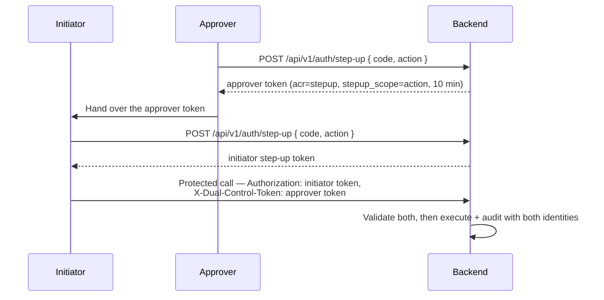

# Step-Up MFA et 4 yeux {#step-up-mfa-4-eyes}

!!! warning "EXTERNAL_REVIEW_REQUIRED"
    Cette page décrit les mappages de contrôle prévus. Elle ne constitue pas une preuve que le MFA configuré ou
    le flux de double contrôle satisfait une exigence légale, réglementaire, de sécurité ou de séparation des
    tâches particulière. Les rôles, les actions protégées, le niveau d'assurance, la récupération et les preuves
    d'audit nécessitent un examen spécifique au déploiement.

Certaines opérations dans Registerwerk sont si conséquentes — ou la réglementation exige si clairement une
double surveillance — qu'une session de connexion normale n'est pas suffisante. **L'authentification
renforcée (step-up)** exige que l'opérateur prouve à nouveau son identité au moment de l'exécution de
l'opération. Le **principe des quatre yeux** (Vier-Augen-Prinzip) exige en outre qu'un deuxième approbateur
indépendant confirme l'action avant son exécution.

---

## Pourquoi cela existe {#why-this-exists}

| Réglementation | Obligation |
|---|---|
| GwG §6(2) | Systèmes de contrôle interne — les décisions à haut risque nécessitent une double surveillance documentée |
| eWpG §16 | Les opérations de blocage (Sperrvermerk) doivent être traçables jusqu'à un opérateur nommé et vérifié |
| BaFin KAIT | La sécurité informatique exige le MFA pour tout accès privilégié aux systèmes critiques |
| DSGVO Art. 32 | Mesures techniques appropriées pour protéger les données personnelles — le MFA est la base |

---

## Opérations protégées {#protected-operations}

L'annotation `@RequiresStepUp` est placée sur les points de terminaison et méthodes de service suivants. Les
opérations marquées **4 yeux** nécessitent en outre un deuxième approbateur.

| Opération | Step-up | 4 yeux | Raison |
|---|---|---|---|
| `forceTransfer` | ✅ | ✅ | Opération on-chain irréversible |
| `forceBurn` | ✅ | ✅ | Destruction permanente de jetons |
| `forceApprove` | ✅ | ✅ | Dérogation de conformité |
| `setSupplyCap` | ✅ | ✅ | Modification d'un paramètre économique |
| Dérogation KYC (approuver malgré l'indicateur) | ✅ | ✅ | Contournement de la porte AML |
| Création d'un Sperrvermerk | ✅ | ✅ | Restriction légale sur un titulaire |
| Levée d'un Sperrvermerk | ✅ | ✅ | Suppression d'une restriction légale |
| Démarrer le mode support (impersonation) | ❌ ¹ | ❌ | Accès privilégié aux données du client |
| Acceptation d'une correspondance de filtrage | ✅ (score élevé) | ✅ (score ≥ 80) | Dérogation AML pour une correspondance confirmée |
| Export de clé privée de portefeuille (bris de glace) | ✅ | ✅ | Accès au matériel de clé |
| Entra : supprimer une méthode d'authentification | ✅ | ❌ | Supprime un facteur obsolète |
| Entra : réinitialiser toutes les méthodes d'authentification | ✅ | ✅ | Force la réinscription au MFA pour une autre personne |
| Entra : révoquer les sessions de connexion | ✅ | ❌ | Impact sur la disponibilité uniquement, aucun gain de privilège |
| Entra : émettre un pass d'accès temporaire (Temporary Access Pass) | ✅ | ✅ | Un identifiant porteur qui authentifie *en tant que* le client |

¹ `AdminImpersonationController` ne porte aujourd'hui aucun `@RequiresStepUp`, et le mode support est
purement et simplement refusé lorsque `ENTRA_ENABLED=true`. Cette ligne revendiquait auparavant une protection
step-up que le code n'implémente pas.

---

## Deux filières {#two-tracks}

La manière dont le deuxième facteur est prouvé dépend de qui émet les jetons de session. Les deux filières sont
appliquées par la même annotation `@RequiresStepUp` et le même aspect ; seule la vérification diffère.

### TOTP local — `ENTRA_ENABLED=false`, et toujours pour le portail opérateur {#local-totp-entraenabledfalse-and-the-operator-portal-always}

TOTP RFC 6238 (HMAC-SHA1, fenêtre de 30 secondes, 6 chiffres), vérifié par `StepUpTokenIssuer`. Inscription via
`POST /api/v1/auth/step-up/enroll`, confirmation via `/enroll/confirm`, puis échange d'un code via
`POST /api/v1/auth/step-up` contre un jeton de courte durée portant `acr=stepup`, valable 10 minutes.
L'appelant envoie ce jeton à la place de son jeton de session sur la requête protégée. Le rejet est **403**.

> **WebAuthn / FIDO2 n'est pas implémenté.** Le champ `method` de la requête de step-up est accepté et ignoré.
> D'anciennes versions de ce document le décrivaient comme le facteur principal ; il n'a jamais existé dans le
> code. Sous une connexion Entra, un MFA résistant au phishing est disponible — mais via l'accès conditionnel,
> pas via ce module.

### Contexte d'authentification Entra — `ENTRA_ENABLED=true` {#entra-authentication-context-entraenabledtrue}

Le jeton d'accès doit porter le contexte d'authentification d'accès conditionnel requis dans sa revendication
`acrs`. Registerwerk ne vérifie pas lui-même un facteur ; il énonce une exigence et laisse l'accès conditionnel
décider de ce qui la satisfait — ce qui permet à un opérateur d'exiger un MFA résistant au phishing pour les
transferts forcés sans changement de code.

Le rejet est un **défi de revendications 401**, de sorte que le SPA se réauthentifie pour cette action précise
au lieu de déconnecter l'utilisateur :

```
WWW-Authenticate: Bearer realm="", authorization_uri="…",
                  error="insufficient_claims", claims="<base64>"
```

L'identifiant de contexte est une donnée de configuration, indexée sur `@RequiresStepUp(reason = …)` :

```yaml
registerwerk.auth.step-up.entra:
  auth-context-id: c1                 # ENTRA_STEPUP_AUTH_CONTEXT_ID
  reason-overrides:
    FORCE_BURN_EWG26: c2
    "Payment rail creation": c1       # quote reasons containing spaces
```

Il est validé par rapport au tenant au démarrage : un contexte qui n'existe pas, ou qui existe mais n'est
**pas publié pour les applications**, fait échouer le démarrage en mode production. Un contexte non publié ne
peut jamais être satisfait et produit une boucle de redirection de connexion, sans rien dans les journaux pour
l'expliquer.

#### La fraîcheur fonctionne différemment ici {#freshness-works-differently-here}

Un jeton d'accès Entra vit 60 à 90 minutes et `acrs` persiste pendant toute sa durée de vie, si bien
qu'appliquer `maxAgeMinutes` à `iat` forcerait une redirection complète du navigateur sur presque chaque appel
protégé. À la place :

- le contrôle de fraîcheur **principal** est la politique d'accès conditionnel sur le contexte
  d'authentification (définir *Fréquence de connexion : à chaque fois* pour les actions de niveau
  réglementaire) ;
- `maxAgeMinutes` est vérifié par rapport à la revendication `auth_time`, en filet de sécurité.

`auth_time` est une revendication optionnelle qui doit être demandée sur l'enregistrement de l'application API.
En son absence, la vérification retombe sur `iat`, ce qui est plus faible — le backend journalise un
avertissement la première fois qu'il rencontre un jeton Entra qui en est dépourvu.

---

## Implémentation des 4 yeux {#4-eyes-implementation}

L'application actuelle du double contrôle exige deux utilisateurs `REGISTRY_ADMIN` distincts. Il n'existe pas
de rôle applicatif `SECOND_APPROVER`, et un `COMPLIANCE_OFFICER` n'est pas accepté en substitut, sauf si
l'implémentation est modifiée et fait l'objet d'un examen séparé.

**Le principe des 4 yeux est identique dans les deux filières** : un jeton de double contrôle est toujours émis
localement après vérification TOTP, et toujours validé par rapport au décodeur HS256 local — il ne dépend donc
pas de la manière dont le facteur principal a été prouvé.



Invariants clés appliqués par `StepUpEnforcementAspect` et `StepUpTokenValidator` :

- L'initiateur et l'approbateur **doivent être des utilisateurs différents** (comparaison sur `sub`)
- Le jeton de l'approbateur doit porter un `stepup_scope` **exactement égal** au `reason` de l'annotation —
  sinon une approbation deviendrait un identifiant générique valable pour n'importe quelle action à 4 yeux
  dans sa fenêtre de validité
- L'approbateur doit toujours être un `REGISTRY_ADMIN` **actif dans la base de données**, pas seulement selon
  les revendications du jeton, qui ne reflètent le statut qu'au moment de l'émission
- Les deux jetons expirent après 10 minutes

---

## Application par AOP {#aop-enforcement}

Le `StepUpEnforcementAspect` intercepte toute méthode annotée `@RequiresStepUp` et :

1. Lit le JWT authentifié depuis le contexte de sécurité
2. Se branche selon la filière active :
   - **locale** — exige `acr=stepup` et un `iat` dans la fenêtre `maxAgeMinutes` (10 par défaut) ; l'échec est
     **403**
   - **Entra** — exige que `acrs` contienne le contexte d'authentification configuré et que `auth_time` soit
     dans la fenêtre `maxAgeMinutes` ; l'échec est un **défi de revendications 401**
3. Si `requireSecondApprover = true`, valide l'en-tête `X-Dual-Control-Token` et expose l'identifiant de
   l'approbateur en tant qu'attribut de requête `stepup.dualControlApproverId`, que les contrôleurs lisent via
   `@RequestAttribute` — ils ne doivent pas redécoder le jeton eux-mêmes
4. Le défi de revendications est émis par `ClaimsChallengeAdvice`, et non par Spring Security : l'exception est
   levée depuis un `@Around` AOP et donc résolue par `@RestControllerAdvice`, et le
   `BearerTokenAuthenticationEntryPoint` de Spring Security n'a de toute façon aucun chemin de code permettant
   de sérialiser un paramètre `claims=`

---

## Événements d'audit {#audit-events}

Chaque événement d'authentification renforcée et chaque opération protégée génère un `AuditEvent` :

| Type d'événement | Contenu |
|---|---|
| `STEP_UP_ISSUED` | ID utilisateur, méthode, horodatage |
| `DUAL_CONTROL_INITIATED` | ID de l'initiateur, type d'opération, hachage des paramètres de l'opération |
| `DUAL_CONTROL_CONFIRMED` | ID de l'approbateur, type d'opération, référence du jeton confirmé |
| `PROTECTED_OPERATION_EXECUTED` | Les deux ID utilisateur, le type d'opération, les paramètres complets de l'opération |
| `STEP_UP_FAILED` | ID utilisateur, motif de l'échec, adresse IP |

Ces événements font partie de la [chaîne d'audit inviolable](../platform/audit-log.md) et ne peuvent être ni
supprimés ni modifiés.
