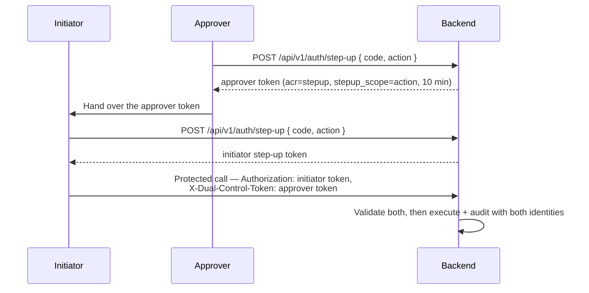

# Step-Up MFA e 4 occhi { #step-up-mfa-4-eyes }

!!! warning "EXTERNAL_REVIEW_REQUIRED"
    Questa pagina descrive le mappature dei controlli previste. Non è una prova che il flusso a doppio controllo MFA o
    configurato soddisfi un particolare requisito legale, normativo, di sicurezza o di separazione dei compiti
    . Ruoli, azioni protette, livello di garanzia, ripristino e prove di audit richiedono una revisione specifica per l'implementazione.

Certe operazioni in Registerwerk sono così consequenziali (o così chiaramente obbligate ad avere una doppia supervisione per regolamento) che una normale sessione di accesso non è sufficiente. L'**autenticazione step-up** richiede che l'operatore provi nuovamente la propria identità al momento dell'esecuzione dell'operazione. Il **principio dei 4 occhi** (Vier-Augen-Prinzip) richiede inoltre la conferma di un secondo approvatore indipendente prima che l'azione venga eseguita.

---

## Perché esiste { #why-this-exists }

| Regolamento | Obbligo |
|---|---|
| GwG §6(2) | Sistemi di controllo interno: le decisioni ad alto rischio richiedono una doppia supervisione documentata |
| eWpG §16 | Le operazioni di blocco (Sperrvermerk) devono essere riconducibili a un operatore identificato e verificato |
| BaFin KAIT | La sicurezza IT richiede MFA per l'accesso privilegiato ai sistemi critici |
| DSGVO Art. 32 | Misure tecniche adeguate per proteggere i dati personali — MFA è la linea di base |

---

## Operazioni protette { #protected-operations }

L'annotazione `@RequiresStepUp` viene inserita sui seguenti endpoint e metodi di servizio. Le operazioni contrassegnate da **4 occhi** richiedono inoltre un secondo approvatore.

| Operazione | Step-up | 4 occhi | Motivo |
|---|---|---|---|
| `forceTransfer` | ✅ | ✅ | Operazione on-chain irreversibile |
| `forceBurn` | ✅ | ✅ | Distruzione permanente dei token |
| `forceApprove` | ✅ | ✅ | Deroga di conformità |
| `setSupplyCap` | ✅ | ✅ | Modifica di un parametro economico |
| Deroga KYC (approva nonostante il contrassegno) | ✅ | ✅ | Aggiramento del gate AML |
| Creazione Sperrvermerk | ✅ | ✅ | Restrizione legale sul titolare |
| Revoca Sperrvermerk | ✅ | ✅ | Rimozione di una restrizione legale |
| Avvio della modalità supporto (impersonation) | ❌ ¹ | ❌ | Accesso privilegiato ai dati del cliente |
| Accettazione di un riscontro di screening | ✅ (punteggio alto) | ✅ (punteggio ≥ 80) | Deroga AML per un riscontro confermato |
| Esportazione della chiave privata del wallet (break-glass) | ✅ | ✅ | Accesso al materiale della chiave |
| Entra: eliminazione di un metodo di autenticazione | ✅ | ❌ | Rimuove un fattore obsoleto |
| Entra: reimpostazione di tutti i metodi di autenticazione | ✅ | ✅ | Forza la ri-registrazione MFA per un'altra persona |
| Entra: revoca delle sessioni di accesso | ✅ | ❌ | Solo impatto sulla disponibilità, nessun guadagno di privilegi |
| Entra: emissione di un Temporary Access Pass | ✅ | ✅ | Una credenziale al portatore che autentica *come* il cliente |

¹ `AdminImpersonationController` oggi non ha `@RequiresStepUp`, e la modalità supporto (impersonation)
viene rifiutata del tutto quando `ENTRA_ENABLED=true`. Questa riga in precedenza dichiarava una protezione
step-up che il codice non implementa.

---

## Due tracce { #two-tracks }

Il modo in cui viene dimostrato il secondo fattore dipende da chi emette i token di sessione. Entrambi sono applicati dalla
stessa annotazione `@RequiresStepUp` e dallo stesso aspetto; differisce solo il controllo.

### Locale TOTP — `ENTRA_ENABLED=false` e il portale dell'operatore sempre { #local-totp-entraenabledfalse-and-the-operator-portal-always }

RFC 6238 TOTP (HMAC-SHA1, finestra di 30 secondi, 6 cifre), verificato da
`StepUpTokenIssuer`. Iscriviti a `POST /api/v1/auth/step-up/enroll`, conferma a
`/enroll/confirm`, quindi scambia un codice a `POST /api/v1/auth/step-up` con un token di breve durata
che trasporta `acr=stepup`, valido 10 minuti. Il chiamante invia quel token al posto della propria sessione
token sulla richiesta protetta. Il rifiuto è **403**.

> **WebAuthn / FIDO2 non è implementato.** Il campo `method` nella richiesta di incremento viene accettato
> e ignorato. Le versioni precedenti di questo documento lo descrivevano come il fattore principale; non è mai esistito
> nel codice. Sotto l'accesso a Entra, MFA resistente al phishing è disponibile, ma tramite
> Accesso condizionale, non tramite questo modulo.

### Contesto di autenticazione Entra: `ENTRA_ENABLED=true` { #entra-authentication-context-entraenabledtrue }

Il token di accesso deve contenere il contesto di autenticazione di accesso condizionale richiesto nel suo `acrs`
reclamo. Registerwerk non verifica un fattore in sé; stabilisce un requisito e consente a Conditional
Access di decidere cosa lo soddisfa, ovvero ciò che consente a un operatore di richiedere
MFA resistente al phishing per trasferimenti forzati senza una modifica del codice.

Il rifiuto è una **sfida delle attestazioni 401**, quindi la SPA si autentica nuovamente per quell'unica azione invece
di disconnettere l'utente:

```
WWW-Authenticate: Bearer realm="", authorization_uri="…",
                  error="insufficient_claims", claims="<base64>"
```

L'ID del contesto è configurazione, indicizzata da `@RequiresStepUp(reason = …)`:

```yaml
registerwerk.auth.step-up.entra:
  auth-context-id: c1                 # ENTRA_STEPUP_AUTH_CONTEXT_ID
  reason-overrides:
    FORCE_BURN_EWG26: c2
    "Payment rail creation": c1       # quote reasons containing spaces
```

Viene convalidato rispetto al tenant all'avvio: un contesto che non esiste, o esiste ma è
**non pubblicato nelle app**, non riesce ad avviarsi in modalità di produzione. Un contesto non pubblicato non può mai essere soddisfatto e produce un ciclo di reindirizzamento di accesso senza nulla nei log che lo spieghi.

#### Freshness funziona diversamente qui { #freshness-works-differently-here }

Un token di accesso Entra dura 60-90 minuti e `acrs` persiste per tutta la sua vita, quindi l'applicazione di
`maxAgeMinutes` a `iat` forzerebbe un reindirizzamento completo del browser su quasi tutte le chiamate protette.
Invece:

- il controllo di aggiornamento **primario** è il criterio di accesso condizionale sul contesto di autenticazione
  (impostare *Frequenza di accesso: Ogni volta* per le azioni di livello regolatorio);
- `maxAgeMinutes` viene confrontato con l'attestazione `auth_time` come backstop.

`auth_time` è un'attestazione facoltativa che deve essere richiesta durante la registrazione dell'app API. Senza di esso
il controllo ricade su `iat`, che è più debole: il backend registra un avviso la prima volta che
vede un token Entra privo di esso.

---

## Implementazione 4-Eyes { #4-eyes-implementation }

L'attuale applicazione del doppio controllo richiede due utenti `REGISTRY_ADMIN` distinti. Non esiste un ruolo applicativo
`SECOND_APPROVER` e un `COMPLIANCE_OFFICER` non è accettato come sostituto
a meno che l'implementazione non venga modificata e rivista separatamente.

**4-eyes è identico in entrambe le tracce**: un token a doppio controllo viene sempre coniato localmente dopo la verifica TOTP
e sempre convalidato rispetto al decoder HS256 locale, quindi non dipende da come
è stato dimostrato il fattore principale.



Invarianti chiave applicate da `StepUpEnforcementAspect` e `StepUpTokenValidator`:

- Iniziatore e approvatore **devono essere utenti diversi** (confronto `sub`)
- Il token dell'approvatore deve contenere `stepup_scope` **esattamente uguale** al token dell'annotazione `reason` —
altrimenti un'approvazione sarebbe una credenziale generica valida per qualsiasi azione 4-eyes nella sua finestra
- L'approvatore deve comunque essere un **`REGISTRY_ADMIN` abilitato nel database**, non semplicemente in base alle
  dichiarazioni del token, che riflettono lo stato solo al momento del conio
- Entrambi i token scadono dopo 10 minuti

---

## Applicazione AOP { #aop-enforcement }

`StepUpEnforcementAspect` intercetta qualsiasi metodo annotato con `@RequiresStepUp` e:

1. Legge lo JWT autenticato dal contesto di sicurezza
2. Si dirama in base alla traccia attiva:
   - **locale** — richiede `acr=stepup` e `iat` entro `maxAgeMinutes` (default 10); il fallimento è **403**
   - **Entra** — richiede che `acrs` contenga il contesto di autenticazione configurato e `auth_time`
     entro `maxAgeMinutes`; il fallimento è una **sfida delle attestazioni 401**
3. Se `requireSecondApprover = true`, convalida l'intestazione `X-Dual-Control-Token` ed espone l'ID dell'approvatore
   come attributo di richiesta `stepup.dualControlApproverId`, che i controller leggono con
   `@RequestAttribute` — non devono ridecodificare il token autonomamente
4. La sfida delle attestazioni viene emessa da `ClaimsChallengeAdvice`, non da Spring Security: l'eccezione
   viene generata da un AOP `@Around` e quindi viene risolta da `@RestControllerAdvice`, e il
   `BearerTokenAuthenticationEntryPoint` di Spring Security non ha comunque alcun percorso di codice in grado
   di serializzare un parametro `claims=`

---

## Eventi di controllo { #audit-events }

Ogni evento di autenticazione step-up e ogni operazione protetta genera un `AuditEvent`:

| Tipo evento | Contenuto |
|---|---|
| `STEP_UP_ISSUED` | ID utente, metodo, timestamp |
| `DUAL_CONTROL_INITIATED` | ID iniziatore, tipo di operazione, hash dei parametri di operazione |
| `DUAL_CONTROL_CONFIRMED` | ID approvatore, tipo di operazione, riferimento confirmed_token |
| `PROTECTED_OPERATION_EXECUTED` | Entrambi gli ID utente, il tipo di operazione, i parametri operativi completi |
| `STEP_UP_FAILED` | ID utente, motivo dell'errore, indirizzo IP |

Questi eventi fanno parte della [catena di controllo a prova di manomissione](../platform/audit-log.md) e non possono essere eliminati o modificati.
