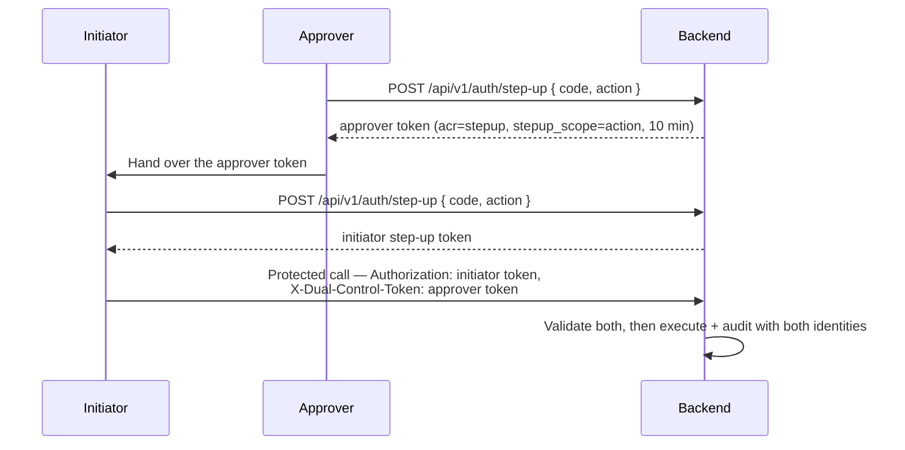

# Step-Up MFA & 4-Eyes

!!! warning "EXTERNAL_REVIEW_REQUIRED"
    This page describes intended control mappings. It is not evidence that the configured MFA or
    dual-control flow satisfies a particular legal, regulatory, security, or segregation-of-duties
    requirement. Roles, protected actions, assurance level, recovery, and audit evidence require
    deployment-specific review.

Certain operations in Registerwerk are so consequential — or so clearly required to have dual oversight by regulation — that a normal login session is not sufficient. **Step-up authentication** requires the operator to re-prove their identity at the moment of executing the operation. The **4-eyes principle** (Vier-Augen-Prinzip) further requires a second, independent approver to confirm before the action executes.

---

## Why this exists

| Regulation | Obligation |
|---|---|
| GwG §6(2) | Internal control systems — high-risk decisions require documented dual oversight |
| eWpG §16 | Blocking operations (Sperrvermerk) must be traceable to a named, verified operator |
| BaFin KAIT | IT security requires MFA for privileged access to critical systems |
| DSGVO Art. 32 | Appropriate technical measures to protect personal data — MFA is baseline |

---

## Protected operations

The `@RequiresStepUp` annotation is placed on the following endpoints and service methods. Operations marked **4-eyes** additionally require a second approver.

| Operation | Step-up | 4-Eyes | Reason |
|---|---|---|---|
| `forceTransfer` | ✅ | ✅ | Irreversible on-chain operation |
| `forceBurn` | ✅ | ✅ | Permanent destruction of tokens |
| `forceApprove` | ✅ | ✅ | Compliance override |
| `setSupplyCap` | ✅ | ✅ | Economic parameter change |
| KYC override (approve despite flag) | ✅ | ✅ | AML gate bypass |
| Sperrvermerk create | ✅ | ✅ | Legal restriction on holder |
| Sperrvermerk lift | ✅ | ✅ | Legal restriction removal |
| Start impersonation | ❌ ¹ | ❌ | Privileged access to customer data |
| Screening hit accept | ✅ (high-score) | ✅ (score ≥ 80) | AML override for confirmed hit |
| Wallet private key export (break-glass) | ✅ | ✅ | Key material access |
| Entra: delete one authentication method | ✅ | ❌ | Removes one stale factor |
| Entra: reset all authentication methods | ✅ | ✅ | Forces MFA re-registration for another person |
| Entra: revoke sign-in sessions | ✅ | ❌ | Availability impact only, no privilege gain |
| Entra: issue Temporary Access Pass | ✅ | ✅ | A bearer credential that authenticates *as* the customer |

¹ `AdminImpersonationController` carries no `@RequiresStepUp`, and impersonation is refused
outright when `ENTRA_ENABLED=true`.

---

## Two tracks

How the second factor is proved depends on who issues session tokens. Both are enforced by the
same `@RequiresStepUp` annotation and the same aspect; only the check differs.

### Local TOTP — `ENTRA_ENABLED=false`, and the operator portal always

RFC 6238 TOTP (HMAC-SHA1, 30-second window, 6 digits), verified by
`StepUpTokenIssuer`. Enrol at `POST /api/v1/auth/step-up/enroll`, confirm at
`/enroll/confirm`, then exchange a code at `POST /api/v1/auth/step-up` for a short-lived token
carrying `acr=stepup`, valid 10 minutes. The caller sends that token in place of their session
token on the protected request. Rejection is **403**.

> **WebAuthn / FIDO2 is not implemented.** The `method` field on the step-up request is accepted
> and ignored. Earlier versions of this document described it as the primary factor; it never
> existed in the code. Under Entra sign-in, phishing-resistant MFA is available — but through
> Conditional Access, not through this module.

### Entra authentication context — `ENTRA_ENABLED=true`

The access token must carry the required Conditional Access authentication context in its `acrs`
claim. Registerwerk does not verify a factor itself; it states a requirement and lets Conditional
Access decide what satisfies it — which is what allows an operator to demand phishing-resistant
MFA for forced transfers without a code change.

Rejection is a **401 claims challenge**, so the SPA re-authenticates for that one action instead
of logging the user out:

```
WWW-Authenticate: Bearer realm="", authorization_uri="…",
                  error="insufficient_claims", claims="<base64>"
```

The context id is configuration, keyed on `@RequiresStepUp(reason = …)`:

```yaml
registerwerk.auth.step-up.entra:
  auth-context-id: c1                 # ENTRA_STEPUP_AUTH_CONTEXT_ID
  reason-overrides:
    FORCE_BURN_EWG26: c2
    "Payment rail creation": c1       # quote reasons containing spaces
```

It is validated against the tenant at startup: a context that does not exist, or exists but is
**not published to apps**, fails startup in production mode. An unpublished context can never be
satisfied and produces a sign-in redirect loop with nothing in the logs to explain it.

#### Freshness works differently here

An Entra access token lives 60–90 minutes and `acrs` persists for its whole lifetime, so applying
`maxAgeMinutes` to `iat` would force a full browser redirect on nearly every protected call.
Instead:

- the **primary** freshness control is the Conditional Access policy on the authentication
  context (set *Sign-in frequency: Every time* for regulator-grade actions);
- `maxAgeMinutes` is checked against the `auth_time` claim as a backstop.

`auth_time` is an optional claim that must be requested on the API app registration. Without it
the check falls back to `iat`, which is weaker — the backend logs a warning the first time it
sees an Entra token lacking it.

---

## 4-Eyes implementation

The current dual-control enforcement requires two distinct `REGISTRY_ADMIN` users. There is no
`SECOND_APPROVER` application role, and a `COMPLIANCE_OFFICER` is not accepted as a substitute
unless the implementation is changed and separately reviewed.

**4-eyes is identical in both tracks**: a dual-control token is always minted locally after TOTP
verification and always validated against the local HS256 decoder, so it does not depend on how
the primary factor was proved.



Key invariants enforced by `StepUpEnforcementAspect` and `StepUpTokenValidator`:

- Initiator and approver **must be different users** (`sub` comparison)
- The approver's token must carry `stepup_scope` **exactly equal** to the annotation's `reason` —
  otherwise one approval would be a generic credential valid for any 4-eyes action in its window
- The approver must still be an **enabled `REGISTRY_ADMIN` in the database**, not merely per the
  token's claims, which reflect status only as of mint time
- Both tokens expire after 10 minutes

---

## AOP enforcement

The `StepUpEnforcementAspect` intercepts any method annotated with `@RequiresStepUp` and:

1. Reads the authenticated JWT from the security context
2. Branches on the active track:
   - **local** — requires `acr=stepup` and `iat` within `maxAgeMinutes` (default 10); failure is **403**
   - **Entra** — requires `acrs` to contain the configured authentication context and `auth_time`
     within `maxAgeMinutes`; failure is a **401 claims challenge**
3. If `requireSecondApprover = true`, validates the `X-Dual-Control-Token` header and exposes the
   approver's id as request attribute `stepup.dualControlApproverId`, which controllers read with
   `@RequestAttribute` — they must not re-decode the token themselves
4. The claims challenge is emitted by `ClaimsChallengeAdvice`, not by Spring Security: the
   exception is thrown from an AOP `@Around` and so is resolved by `@RestControllerAdvice`, and
   Spring Security's `BearerTokenAuthenticationEntryPoint` has no code path that can serialise a
   `claims=` parameter anyway

---

## Audit events

Every step-up authentication event and every protected operation generates an `AuditEvent`:

| Event type | Contents |
|---|---|
| `STEP_UP_ISSUED` | User ID, method, timestamp |
| `DUAL_CONTROL_INITIATED` | Initiator ID, operation type, operation parameters hash |
| `DUAL_CONTROL_CONFIRMED` | Approver ID, operation type, confirmed_token reference |
| `PROTECTED_OPERATION_EXECUTED` | Both user IDs, operation type, full operation parameters |
| `STEP_UP_FAILED` | User ID, failure reason, IP address |

These events are part of the tamper-evident [audit chain](../platform/audit-log.md) and cannot be deleted or modified.
