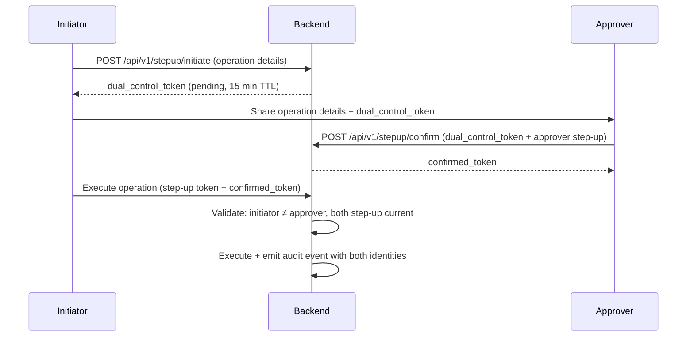

# Step-Up MFA & 4-Eyes

!!! warning "EXTERNAL_REVIEW_REQUIRED"
    This page describes intended control mappings. It is not evidence that the configured MFA or
    dual-control flow satisfies a particular legal, regulatory, security, or segregation-of-duties
    requirement. Roles, protected actions, assurance level, recovery, and audit evidence require
    deployment-specific review.

Certain operations in Registerwerk are so consequential — or so clearly required to have dual oversight by regulation — that a normal login session is not sufficient. **Step-up authentication** requires the operator to re-prove their identity at the moment of executing the operation. The **4-eyes principle** (Vier-Augen-Prinzip) further requires a second, independent approver to confirm before the action executes.

---

## Why this exists

| Regulation | Obligation |
|---|---|
| GwG §6(2) | Internal control systems — high-risk decisions require documented dual oversight |
| eWpG §16 | Blocking operations (Sperrvermerk) must be traceable to a named, verified operator |
| BaFin KAIT | IT security requires MFA for privileged access to critical systems |
| DSGVO Art. 32 | Appropriate technical measures to protect personal data — MFA is baseline |

---

## Protected operations

The `@RequiresStepUp` annotation is placed on the following endpoints and service methods. Operations marked **4-eyes** additionally require a second approver.

| Operation | Step-up | 4-Eyes | Reason |
|---|---|---|---|
| `forceTransfer` | ✅ | ✅ | Irreversible on-chain operation |
| `forceBurn` | ✅ | ✅ | Permanent destruction of tokens |
| `forceApprove` | ✅ | ✅ | Compliance override |
| `setSupplyCap` | ✅ | ✅ | Economic parameter change |
| KYC override (approve despite flag) | ✅ | ✅ | AML gate bypass |
| Sperrvermerk create | ✅ | ✅ | Legal restriction on holder |
| Sperrvermerk lift | ✅ | ✅ | Legal restriction removal |
| Start impersonation | ✅ | ❌ | Privileged access to customer data |
| Screening hit accept | ✅ (high-score) | ✅ (score ≥ 80) | AML override for confirmed hit |
| Wallet private key export (break-glass) | ✅ | ✅ | Key material access |

---

## Authentication methods

The `stepup` module supports two second factors:

**TOTP (Time-based One-Time Password)**
: Standard RFC 6238 TOTP. The operator configures an authenticator app (Google Authenticator, Authy, etc.) when setting up their account. The TOTP code is valid for 30 seconds and can only be used once.

**WebAuthn / FIDO2** *(primary, higher assurance)*
: Phishing-resistant hardware key (YubiKey, Apple Touch ID, Windows Hello). WebAuthn provides stronger assurance than TOTP because the credential is hardware-bound and cannot be phished.

On step-up challenge, the frontend prompts for the configured second factor. On success, the backend issues a short-lived **step-up token** (JWT claim `acr=stepup`) valid for 10 minutes. This token is passed as a header on the subsequent protected request.

---

## 4-Eyes implementation

The current dual-control enforcement requires two distinct `REGISTRY_ADMIN` users. There is no
`SECOND_APPROVER` application role, and a `COMPLIANCE_OFFICER` is not accepted as a substitute
unless the implementation is changed and separately reviewed.

Key invariants enforced by `StepUpEnforcementAspect`:

- The initiator and the approver **must be different users**
- Both must have valid, non-expired step-up tokens
- The `dual_control_token` is single-use and expires after 15 minutes
- The operation parameters are hashed into the `dual_control_token` — the approver is confirming the exact operation, not a blank authorisation

---

## AOP enforcement

The `StepUpEnforcementAspect` intercepts any method annotated with `@RequiresStepUp` and:

1. Extracts the `Authorization: Bearer <jwt>` from the current request context
2. Checks the JWT carries an `acr=stepup` claim issued within the last `maxAgeMinutes` (default: 10)
3. If `requireSecondApprover = true`, also checks the request carries a valid `X-Dual-Control-Token` header
4. On failure: returns HTTP 403 with body `{ "error": "STEP_UP_REQUIRED", "challenge": "totp|webauthn" }`

---

## Audit events

Every step-up authentication event and every protected operation generates an `AuditEvent`:

| Event type | Contents |
|---|---|
| `STEP_UP_ISSUED` | User ID, method (TOTP/WebAuthn), timestamp |
| `DUAL_CONTROL_INITIATED` | Initiator ID, operation type, operation parameters hash |
| `DUAL_CONTROL_CONFIRMED` | Approver ID, operation type, confirmed_token reference |
| `PROTECTED_OPERATION_EXECUTED` | Both user IDs, operation type, full operation parameters |
| `STEP_UP_FAILED` | User ID, failure reason, IP address |

These events are part of the tamper-evident [audit chain](../platform/audit-log.md) and cannot be deleted or modified.
