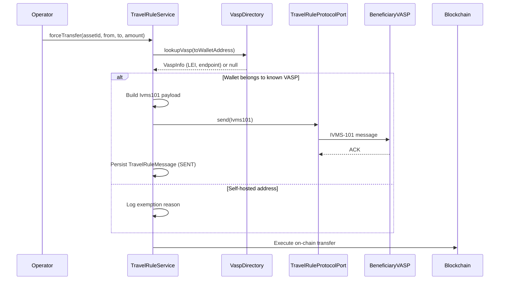

# Travel Rule (TFR / IVMS-101) { #travel-rule-tfr-ivms-101 }

!!! warning "EXTERNAL_REVIEW_REQUIRED"
    Auf dieser Seite werden beabsichtigte Steuerungszuordnungen und das aktuelle Repository-Verhalten
    aufgezeichnet. Es ist kein Beweis dafür, dass der Betreiber oder die Transaktion im
    Geltungsbereich liegt, dass alle erforderlichen Daten erfasst oder ausgetauscht werden, oder
    dass eine Übertragung den aktuellen TFR-/Travel-Rule-Regeln entspricht. Geltungsbereich,
    Schwellenwerte, Gegenparteien, Ausnahmen, Datenschutz und Protokollnachweise erfordern eine
    aktuelle externe Überprüfung.

Die **Transfer of Funds Regulation (TFR)** — Verordnung (EU) 2023/1113 — auch als **Travel Rule**
bekannt, gilt seit dem 30. Dezember 2024 uneingeschränkt. Sie verlangt, dass Angaben zu Auftraggeber
und Begünstigtem (strukturiert nach dem **IVMS-101**-Standard) **jeden** Krypto-Asset-Transfer
zwischen Crypto-Asset Service Providern (CASPs) begleiten, **unabhängig vom Betrag**. Anders als bei
Fiat-Überweisungen enthält die TFR **keinen Geringfügigkeitsschwellenwert** für Überweisungen von
CASP zu CASP — dies wird durch die EBA-Travel-Rule-Leitlinien (EBA/GL/2024/11) bestätigt. Der Betrag
von 1.000 € in der TFR bezieht sich nur auf Überweisungen zu/von **selbstgehosteten Adressen**:
oberhalb dieses Betrags verlangt Art. 14(5), dass der auftraggebende CASP überprüft, ob die
selbstgehostete Adresse seinem eigenen Kunden gehört oder von diesem kontrolliert wird.

---

## Was die Travel Rule auslöst { #what-triggers-the-travel-rule }

Jeder ausgehende Krypto-Asset-Transfer wird geprüft. Die Verpflichtungen unterscheiden sich je nach Art der Gegenpartei:

1. **Ziel-Wallet gehört zu einem bekannten CASP/VASP** (über Verzeichnissuche) → Es müssen vollständige IVMS-101-Informationen zu Auftraggeber/Begünstigtem übermittelt werden, **in beliebiger Höhe**.
2. **Ziel ist eine selbstgehostete Adresse** → Auftraggeberinformationen werden lokal erfasst und gespeichert; oberhalb von 1.000 € muss der auftraggebende CASP zusätzlich Besitz/Kontrolle über die Adresse überprüfen (Art. 14(5) TFR).
3. Überweisungen zwischen zwei Wallets derselben juristischen Person beim selben CASP fallen nicht unter die CASP-zu-CASP-Übermittlungspflicht, werden aber dennoch aufgezeichnet.

Registerwerk prüft diese Bedingungen in `TravelRuleService.evaluate()`, bevor `forceTransfer` oder eine externe Mint-Operation ausgeführt wird.

---

## IVMS-101-Datenstruktur { #ivms-101-data-structure }

IVMS-101 (InterVASP Messaging Standard) definiert ein strukturiertes Format für Auftraggeber- und Begünstigteninformationen. Der `Ivms101`-Datensatz von Registerwerk in `travelrule/api/` ist den Feldern der FATF-Empfehlung 16 zugeordnet:

```java
public record Ivms101(
    Person originator,       // IVMS101 Person: name, geographicAddress, nationalIdentification
    Person beneficiary,      // IVMS101 Person: name, geographicAddress, nationalIdentification
    String originatorVasp,   // LEI or BIC of the originating VASP
    String beneficiaryVasp,  // LEI or BIC of the beneficiary VASP
    BigDecimal amount,
    String currency,
    String transferRef       // Unique transfer reference
) {}
```

Der Datensatz `Person` enthält den Namen, die Adresse und eine oder mehrere nationale Identifikationen einer natürlichen oder juristischen Person (Passnummer, LEI, Steuernummer).

---

## Übertragungsablauf { #transfer-flow }



---

## Steckbarer Protokolladapter { #pluggable-protocol-adapter }

Verschiedene VASPs verwenden unterschiedliche Travel-Rule-Protokolle (TRP, Sygna Bridge, Notabene, OpenVASP). Registerwerk verwendet einen Port (`TravelRuleProtocolPort`) mit einer standardmäßigen No-Op-Implementierung (`NoopTravelRuleAdapter`) und einem steckbaren Adaptersteckplatz:

```java
public interface TravelRuleProtocolPort {
    void send(Ivms101 payload, String beneficiaryVaspEndpoint);
    TravelRuleMessage.Status getStatus(String transferRef);
}
```

Um ein echtes Protokoll in der Produktion zu aktivieren, implementieren Sie `TravelRuleProtocolPort` und registrieren Sie es als Spring-Bean. Das `NoopTravelRuleAdapter` wird automatisch durch jede konkrete Bean im Anwendungskontext verdrängt.

---

## Eingehende Travel-Rule-Nachrichten { #inbound-travel-rule-messages }

Registerwerk empfängt auch Travel-Rule-Nachrichten von anderen VASPs, wenn diese Token an von Registerwerk verwaltete Wallets übertragen. Der Posteingangsendpunkt:

```
POST /api/v1/public/travel-rule/inbox
```

Dieser Endpunkt ist öffentlich zugänglich (kein JWT erforderlich), erfordert jedoch Kong-seitiges mTLS, um Spoofing zu verhindern. Beim Empfang:

1. Die `Ivms101`-Nutzlast wird validiert und als `TravelRuleMessage` mit dem Status `RECEIVED` gespeichert.
2. Der entsprechende `token_transfer`-Datensatz wird über `transferRef` verknüpft.
3. Ist der Auftraggeber-VASP unbekannt oder die Nutzlast fehlerhaft, wird die Nachricht als `SUSPICIOUS` gespeichert und für die Überprüfung durch `COMPLIANCE_OFFICER` markiert.

---

## VASP-Verzeichnis { #vasp-directory }

Die `VaspDirectoryPort`-Schnittstelle unterstützt die steckbare VASP-Erkennung:

- **TRP-Verzeichnis** (Standard-Stub) — das globale VASP-Register, betrieben vom Travel Rule Protocol-Konsortium
- **Shyft Trust** — alternatives VASP-Verzeichnis
- Lokale Überschreibung: Betreiber können bekannte VASP-Zuordnungen im Admin-Portal registrieren

VASP-Abfragen werden über die bestehende Caffeine-Cache-Konfiguration 30 Sekunden lang zwischengespeichert.

---

## Pflichtenmatrix { #obligations-matrix }

| Szenario | Betrag | Aktion |
|---|---|---|
| CASP-zu-CASP-Übertragung | **Beliebiger Betrag** | Vollständige IVMS-101-Übertragung erforderlich — keine De-minimis-Grenze (TFR Art. 14–16) |
| CASP an selbstgehostete Wallet | ≤ 1.000 € | Auftraggeberinformationen erfassen und speichern (`UNHOSTED_RECORDED`) |
| CASP an selbstgehostete Wallet | > 1.000 € | Zusätzlich Besitz/Kontrolle über die Adresse überprüfen (Art. 14(5)) — `UNHOSTED_VERIFY_REQUIRED` |
| Selbstverwahrung durch dieselbe Einheit | Beliebiger Betrag | Außerhalb der CASP-zu-CASP-Übermittlungspflicht — wird aufgezeichnet |
| CASP-Gegenpartei, aber kein Protokolladapter konfiguriert | Beliebiger Betrag | **Übertragung wird abgelehnt (Fail-Closed / Abweisung im Fehlerfall)** — eine Ausführung ohne die erforderlichen Informationen würde gegen Art. 14 verstoßen |

Das EUR-Äquivalent wird aus dem Stückpreis des Tokens bei `TradeExecution.executedAt` oder aus dem NAV-Strike für Tresor-Token berechnet und wird **nur** für den Art.-14(5)-Verifizierungsauslöser bei selbstgehosteten Adressen verwendet — niemals, um die CASP-zu-CASP-Nachrichtenübermittlung zu überspringen.

---

## MiCA-Zulassungsprüfung der Gegenpartei { #mica-counterparty-authorization-check }

Die EU-weite MiCA-Übergangsfrist endet am **1. Juli 2026** (ESMA-Erklärung, 17. April 2026) — kein Mitgliedstaat darf den Bestandsschutz über dieses Datum hinaus verlängern. Ab dem Stichtag stellt die Erbringung von Krypto-Asset-Dienstleistungen in der EU ohne CASP-Zulassung einen Verstoß gegen EU-Recht dar, und Übertragungen an solche Gegenparteien dürfen nicht ausgeführt werden.

Registerwerk setzt dies über das **CASP-Zulassungsregister** durch (`/api/v1/compliance/casp-register`, Betreiber-UI unter *Compliance → CASP Register*). Compliance-Beauftragte spiegeln den ESMA-/NCA-Registerstatus jeder Travel-Rule-Gegenpartei wider:

| Gegenparteistatus | Vor dem 1. Juli 2026 | Ab dem 1. Juli 2026 |
|---|---|---|
| `AUTHORIZED` | Zulässig (blockiert, wenn `validUntil` überschritten ist) | Zulässig (blockiert, wenn `validUntil` überschritten ist) |
| `TRANSITIONAL` | Zulässig | **Blockiert** — kein Bestandsschutz |
| `NOT_AUTHORIZED` / `REVOKED` | **Blockiert** | **Blockiert** |
| Kein Registereintrag | Zulässig mit Warnung (Nicht-EU-VASPs fallen nicht in den Geltungsbereich von MiCA) | Zulässig mit Warnung |

Blockierte Versuche werden in `travel_rule_message` mit dem Status `BLOCKED_MICA` aufgezeichnet, bevor die Übertragung abgelehnt wird, sodass im Audit-Trail die versuchte Übertragung und der regulatorische Grund erscheinen. Der Stichtag kann über `registerwerk.travel-rule.mica-enforcement-date` konfiguriert werden.

## IVMS-101-Identitätsanreicherung { #ivms-101-identity-enrichment }

Ausgehende Nutzlasten werden aus dem Asset-Inhaber-Register angereichert: Die Wallet des Auftraggebers wird auf den registrierten Inhaber (`asset_holder` → `legal_entity`) aufgelöst, und der IVMS-101-Datensatz trägt den offiziellen Namen (`LEGL`), die LEI als nationale `LEIX`-Identifikation, sofern vorhanden, die Entitätsnummer als Kundenidentifikation sowie das Wohnsitzland — denn gemäß TFR Art. 14 Abs. 1 genügt die Wallet-Adresse allein nicht den Informationsanforderungen. Die Begünstigtenseite wird nur bei registerinternen Übertragungen angereichert; bei externen Begünstigten hält der Gegenpart-CASP die Identität vor.

## Massenimport des CASP-Registers { #bulk-import-of-the-casp-register }

`POST /api/v1/compliance/casp-register/import` (Betreiber-UI: *Compliance → CASP Register → Import CSV*) akzeptiert eine CSV-Datei mit den kanonischen Spalten `legal_name`, `vasp_did` (oder `lei`, aus dem `lei:<LEI>` synthetisiert wird), `status` sowie optional `home_member_state`, `authorization_id`, `valid_from`, `valid_until`, `notes`. Die Statuszuordnung ist tolerant gegenüber der britischen Schreibweise von ESMA („Authorised") und ordnet „Withdrawn" dem Wert `REVOKED` zu. Der Import erfolgt zeilenweise nach bestem Aufwand: gültige Zeilen werden anhand des Schlüssels `vaspDid` eingefügt oder aktualisiert, Fehler werden pro Zeile gemeldet.
