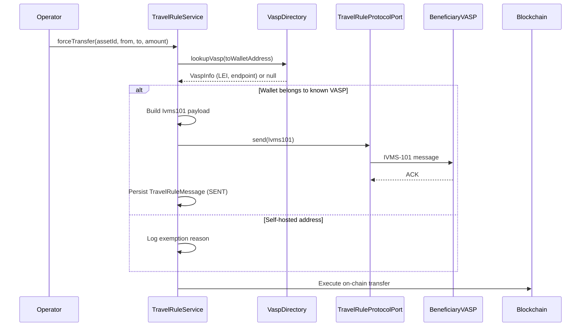

# Travel Rule (TFR / IVMS-101) { #travel-rule-tfr-ivms-101 }

!!! warning "EXTERNAL_REVIEW_REQUIRED"
    Esta página registra las asignaciones de control previstas y el comportamiento actual del repositorio. No es evidencia
    de que el operador o la transacción estén dentro del alcance, de que todos los datos requeridos se recopilen o
    intercambien, o de que una transferencia se ajuste a las reglas vigentes de la TFR/Travel Rule. El alcance, los
    umbrales, las contrapartes, las excepciones, la protección de datos y la evidencia del protocolo requieren una
    revisión externa actual.

El **Reglamento de Transferencias de Fondos (TFR)** — Reglamento (UE) 2023/1113 — se aplica en su totalidad desde el 30 de diciembre de 2024. Exige que la información del ordenante y del beneficiario (estructurada conforme al estándar **IVMS-101**) acompañe a **toda** transferencia de criptoactivos entre proveedores de servicios de criptoactivos (CASP), **con independencia del importe**. A diferencia de las transferencias bancarias en moneda fiduciaria, la TFR **no contiene un umbral de minimis** para las transferencias CASP a CASP — así lo confirman las directrices de la Travel Rule de la EBA (EBA/GL/2024/11). La cifra de 1.000 € en la TFR se refiere únicamente a las transferencias hacia/desde **direcciones autohospedadas (self-hosted)**: por encima de ese importe, el Art. 14(5) exige que el CASP de origen verifique que la dirección autohospedada es propiedad de su propio cliente o está bajo su control.

---

## Qué activa la Travel Rule { #what-triggers-the-travel-rule }

Se evalúa cada transferencia saliente de criptoactivos. Las obligaciones difieren según el tipo de contraparte:

1. **El monedero de destino pertenece a un CASP/VASP conocido** (mediante búsqueda en el directorio) → se debe transmitir la información completa del ordenante/beneficiario IVMS-101, **con cualquier importe**.
2. **El destino es una dirección autohospedada** → la información del ordenante se recopila y conserva localmente; por encima de 1.000 €, el CASP de origen debe verificar además la propiedad/control de la dirección (Art. 14(5) TFR).
3. Las transferencias entre dos monederos de la misma entidad legal en el mismo CASP quedan fuera del deber de transmisión CASP a CASP, pero aun así se registran.

Registerwerk verifica estas condiciones en `TravelRuleService.evaluate()` antes de ejecutar cualquier operación de `forceTransfer` o de mint externo.

---

## Estructura de datos IVMS-101 { #ivms-101-data-structure }

IVMS-101 (InterVASP Messaging Standard) define un formato estructurado para la información del ordenante y del beneficiario. El registro `Ivms101` de Registerwerk en `travelrule/api/` se corresponde con los campos de la Recomendación 16 del GAFI (FATF):

```java
public record Ivms101(
    Person originator,       // IVMS101 Person: name, geographicAddress, nationalIdentification
    Person beneficiary,      // IVMS101 Person: name, geographicAddress, nationalIdentification
    String originatorVasp,   // LEI or BIC of the originating VASP
    String beneficiaryVasp,  // LEI or BIC of the beneficiary VASP
    BigDecimal amount,
    String currency,
    String transferRef       // Unique transfer reference
) {}
```

El registro `Person` incluye el nombre de la persona física o jurídica, la dirección y una o más identificaciones nacionales (número de pasaporte, LEI, identificación fiscal).

---

## Flujo de transferencia { #transfer-flow }



---

## Adaptador de protocolo conectable { #pluggable-protocol-adapter }

Distintos VASP usan distintos protocolos de Travel Rule (TRP, Sygna Bridge, Notabene, OpenVASP). Registerwerk usa un puerto (`TravelRuleProtocolPort`) con una implementación no operativa (no-op) por defecto (`NoopTravelRuleAdapter`) y una ranura para adaptador conectable:

```java
public interface TravelRuleProtocolPort {
    void send(Ivms101 payload, String beneficiaryVaspEndpoint);
    TravelRuleMessage.Status getStatus(String transferRef);
}
```

Para habilitar un protocolo real en producción, implemente `TravelRuleProtocolPort` y regístrelo como Spring Bean. El `NoopTravelRuleAdapter` será desplazado automáticamente por cualquier bean concreto en el contexto de la aplicación.

---

## Mensajes entrantes de la Travel Rule { #inbound-travel-rule-messages }

Registerwerk también recibe mensajes de la Travel Rule de otros VASP cuando estos transfieren tokens a monederos administrados por Registerwerk. El endpoint de la bandeja de entrada:

```
POST /api/v1/public/travel-rule/inbox
```

Este endpoint no requiere un JWT de Registerwerk, pero no es anónimo. Configure
`REGISTERWERK_TRAVEL_RULE_INBOX_API_KEY`; la contraparte debe enviarlo en
`X-Travel-Rule-Api-Key`. Una configuración vacía desactiva la bandeja de entrada. Además,
`X-Vasp-Id` debe coincidir con `originatingVasp.vaspId` en el payload. En producción se recomienda
mTLS como segunda capa; la configuración de Kong incluida no configura certificados de cliente. Al recibirlo:

1. Se validan la credencial, la coincidencia de identidad del VASP, los números de cuenta y la referencia de transferencia.
2. La carga útil `Ivms101` se almacena una sola vez como `TravelRuleMessage` con estado `RECEIVED`; se ignoran las referencias repetidas del mismo VASP.
3. Las cargas útiles no válidas se rechazan con HTTP 400 y no se almacenan como mensajes de Travel Rule de confianza.

La clave API compartida autentica el acceso a la bandeja de entrada, no la identidad de un VASP
individual. En producción, utilice mTLS por contraparte o controles equivalentes de identidad en el gateway.

---

## Directorio de VASP { #vasp-directory }

La interfaz `VaspDirectoryPort` admite el descubrimiento conectable de VASP:

- **Directorio TRP** (stub por defecto) — el registro global de VASP operado por el consorcio Travel Rule Protocol
- **Shyft Trust** — directorio de VASP alternativo
- Anulación local: los operadores pueden registrar asignaciones de VASP conocidas en el portal de administración

Las búsquedas de VASP se almacenan en caché durante 30 segundos usando la configuración de caché Caffeine existente.

---

## Matriz de obligaciones { #obligations-matrix }

| Escenario | Importe | Acción |
|---|---|---|
| Transferencia CASP a CASP | **Cualquier importe** | Se requiere transmisión IVMS-101 completa — sin de minimis (TFR Art. 14–16) |
| CASP a monedero autohospedado | ≤ 1.000 € | Recopilar y conservar la información del ordenante (`UNHOSTED_RECORDED`) |
| CASP a monedero autohospedado | > 1.000 € | Bloquear la ejecución hasta verificar la propiedad/control de la dirección (Art. 14(5)) — `UNHOSTED_VERIFY_REQUIRED` |
| Autocustodia de la misma entidad | Cualquier importe | Fuera del deber de transmisión CASP a CASP — se registra |
| Contraparte CASP sin adaptador de protocolo configurado | Cualquier importe | **La transferencia se rechaza (denegación por defecto / fail closed)** — ejecutarla sin la información exigida infringiría el Art. 14 |

El equivalente en EUR se calcula a partir del precio unitario del token en `TradeExecution.executedAt`, o del strike de NAV para los tokens de bóveda, y se utiliza **únicamente** como activador de la verificación de direcciones autohospedadas del Art. 14(5) — nunca para omitir la mensajería CASP a CASP.


---

## Verificación de la autorización MiCA de la contraparte { #mica-counterparty-authorization-check }

El período transitorio de MiCA en toda la UE finaliza el **1 de julio de 2026** (declaración de la ESMA, 17 de abril de 2026) — ningún Estado miembro puede prorrogar los derechos adquiridos (grandfathering) más allá de esa fecha. A partir de esa fecha límite, prestar servicios de criptoactivos en la UE sin autorización CASP constituye una infracción del derecho de la UE, y las transferencias a esas contrapartes no deben ejecutarse.

Registerwerk hace cumplir esto mediante el **Registro de Autorización CASP** (`/api/v1/compliance/casp-register`, en la UI del operador bajo *Compliance → CASP Register*). Los compliance officers reflejan el estado del registro ESMA/NCA de cada contraparte de la Travel Rule:

| Estado de contraparte | Antes del 1 de julio de 2026 | A partir del 1 de julio de 2026 |
|---|---|---|
| `AUTHORIZED` | Permitido (bloqueado si `validUntil` ya venció) | Permitido (bloqueado si `validUntil` ya venció) |
| `TRANSITIONAL` | Permitido | **Bloqueado** — sin derechos adquiridos |
| `NOT_AUTHORIZED` / `REVOKED` | **Bloqueado** | **Bloqueado** |
| Sin entrada de registro | Permitido con advertencia (los VASP fuera de la UE están fuera del alcance de MiCA) | Permitido con advertencia |

Los intentos bloqueados se registran en `travel_rule_message` con el estado `BLOCKED_MICA` antes de rechazar la transferencia, de modo que el registro de auditoría muestra el intento de transferencia y el motivo regulatorio. La fecha límite es configurable mediante `registerwerk.travel-rule.mica-enforcement-date`.

## Enriquecimiento de identidad IVMS-101 { #ivms-101-identity-enrichment }

Las cargas salientes se enriquecen a partir del registro de titulares de activos: el monedero del ordenante se resuelve al titular registrado (`asset_holder` → `legal_entity`) y el registro IVMS-101 incorpora el nombre legal (`LEGL`), el LEI como identificación nacional `LEIX` cuando está presente, el número de entidad como identificación de cliente, y el país de residencia — conforme al Art. 14(1) de la TFR, la dirección del monedero por sí sola no satisface los requisitos de información. El lado del beneficiario solo se enriquece en las transferencias internas al registro; para beneficiarios externos, la identidad la conserva el CASP de contraparte.

## Importación masiva del registro CASP { #bulk-import-of-the-casp-register }

`POST /api/v1/compliance/casp-register/import` (UI del operador: *Cumplimiento → Registro CASP → Importar CSV*) acepta una CSV con las columnas canónicas `legal_name`, `vasp_did` (o `lei`, de las cuales se sintetiza `lei:<LEI>`), `status`, y opcionalmente `home_member_state`, `authorization_id`, `valid_from`, `valid_until`, `notes`. El mapeo de estado tolera la ortografía británica de ESMA ("Autorizado") y asigna "Retirado" a `REVOKED`. La importación se realiza con el mejor esfuerzo por fila: las filas válidas se insertan con la clave `vaspDid`, las fallas se informan por línea.
