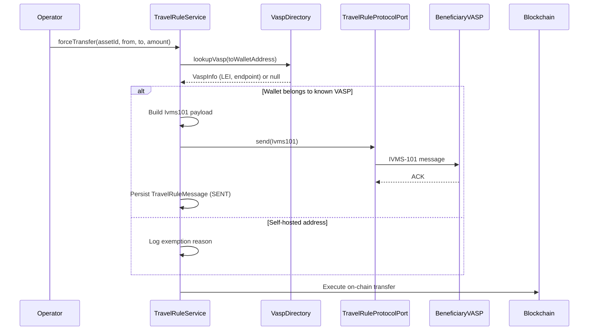

# Travel Rule (TFR / IVMS-101) {#travel-rule-tfr-ivms-101}

!!! warning "EXTERNAL_REVIEW_REQUIRED"
    Cette page enregistre les mappages de contrôle prévus et le comportement actuel du référentiel. Elle ne
    constitue pas une preuve que l'opérateur ou la transaction est concerné, que toutes les données requises
    sont collectées ou échangées, ou qu'un transfert est conforme aux règles TFR/Travel Rule actuelles. Le
    champ d'application, les seuils, les contreparties, les exceptions, la protection des données et les
    preuves de protocole nécessitent un examen externe à jour.

Le **règlement sur les transferts de fonds (TFR)** — Règlement (UE) 2023/1113 — s'applique pleinement depuis le
30 décembre 2024. Il exige que les informations sur le donneur d'ordre et le bénéficiaire (structurées selon la
**norme IVMS-101**) accompagnent **chaque** transfert de crypto-actifs entre fournisseurs de services sur
crypto-actifs (CASP), **quel que soit le montant**. Contrairement aux virements en monnaie fiduciaire, le TFR
ne contient **aucun seuil de minimis** pour les transferts CASP vers CASP — ceci est confirmé par les lignes
directrices Travel Rule de l'EBA (EBA/GL/2024/11). Le montant de 1 000 € figurant dans le TFR ne concerne que
les transferts vers/depuis des **adresses auto-hébergées** : au-delà, l'art. 14(5) exige que le CASP d'origine
vérifie que l'adresse auto-hébergée est détenue ou contrôlée par son propre client.

---

## Ce qui déclenche la Travel Rule {#what-triggers-the-travel-rule}

Chaque transfert sortant de crypto-actifs est évalué. Les obligations diffèrent selon le type de contrepartie :

1. **Le portefeuille de destination appartient à un CASP/VASP connu** (via une recherche dans l'annuaire) → les
   informations complètes IVMS-101 sur le donneur d'ordre/bénéficiaire doivent être transmises, **quel que
   soit le montant**.
2. **La destination est une adresse auto-hébergée** → les informations sur le donneur d'ordre sont collectées
   et conservées localement ; au-delà de 1 000 €, le CASP d'origine doit en outre vérifier la
   propriété/le contrôle de l'adresse (art. 14(5) TFR).
3. Les transferts entre deux portefeuilles de la même entité juridique au sein du même CASP ne relèvent pas de
   l'obligation de transmission CASP à CASP, mais restent enregistrés.

Registerwerk vérifie ces conditions dans `TravelRuleService.evaluate()` avant d'exécuter toute opération
`forceTransfer` ou de mint externe.

---

## Structure de données IVMS-101 {#ivms-101-data-structure}

IVMS-101 (InterVASP Messaging Standard) définit un format structuré pour les informations sur le donneur
d'ordre et le bénéficiaire. L'enregistrement `Ivms101` de Registerwerk dans `travelrule/api/` correspond aux
champs de la recommandation 16 du GAFI :

```java
public record Ivms101(
    Person originator,       // IVMS101 Person: name, geographicAddress, nationalIdentification
    Person beneficiary,      // IVMS101 Person: name, geographicAddress, nationalIdentification
    String originatorVasp,   // LEI or BIC of the originating VASP
    String beneficiaryVasp,  // LEI or BIC of the beneficiary VASP
    BigDecimal amount,
    String currency,
    String transferRef       // Unique transfer reference
) {}
```

L'enregistrement `Person` comprend le nom, l'adresse et une ou plusieurs identifications nationales de la
personne physique ou morale (numéro de passeport, LEI, numéro d'identification fiscale).

---

## Flux de transfert {#transfer-flow}



---

## Adaptateur de protocole enfichable {#pluggable-protocol-adapter}

Différents VASP utilisent différents protocoles Travel Rule (TRP, Sygna Bridge, Notabene, OpenVASP).
Registerwerk utilise un port (`TravelRuleProtocolPort`) avec une implémentation sans opération par défaut
(`NoopTravelRuleAdapter`) et un emplacement d'adaptateur enfichable :

```java
public interface TravelRuleProtocolPort {
    void send(Ivms101 payload, String beneficiaryVaspEndpoint);
    TravelRuleMessage.Status getStatus(String transferRef);
}
```

Pour activer un véritable protocole en production, implémentez `TravelRuleProtocolPort` et enregistrez-le en
tant que bean Spring. Le `NoopTravelRuleAdapter` sera automatiquement supplanté par tout bean concret présent
dans le contexte de l'application.

---

## Messages Travel Rule entrants {#inbound-travel-rule-messages}

Registerwerk reçoit également des messages Travel Rule d'autres VASP lorsqu'ils transfèrent des jetons vers des
portefeuilles gérés par Registerwerk. Le point de terminaison de la boîte de réception :

```
POST /api/v1/public/travel-rule/inbox
```

Ce point de terminaison est accessible publiquement (aucun JWT requis) mais nécessite le mTLS côté Kong pour
empêcher l'usurpation. À réception :

1. La charge utile `Ivms101` est validée et stockée sous forme de `TravelRuleMessage` avec le statut `RECEIVED`
2. L'enregistrement `token_transfer` correspondant est lié via `transferRef`
3. Si le VASP donneur d'ordre est inconnu ou si la charge utile est mal formée, le message est stocké avec le
   statut `SUSPICIOUS` et signalé pour examen par le `COMPLIANCE_OFFICER`

---

## Annuaire VASP {#vasp-directory}

L'interface `VaspDirectoryPort` prend en charge la découverte enfichable de VASP :

- **Répertoire TRP** (stub par défaut) — le registre mondial de VASP géré par le consortium Travel Rule
  Protocol
- **Shyft Trust** — répertoire VASP alternatif
- Surcharge locale : les opérateurs peuvent enregistrer des correspondances VASP connues dans le portail
  d'administration

Les recherches VASP sont mises en cache pendant 30 secondes à l'aide de la configuration de cache Caffeine
existante.

---

## Matrice des obligations {#obligations-matrix}

| Scénario | Montant | Action |
|---|---|---|
| Transfert CASP vers CASP | **Tout montant** | Transmission complète IVMS-101 requise — aucun de minimis (TFR art. 14–16) |
| Portefeuille CASP vers auto-hébergé | ≤ 1 000 € | Collecter et conserver les informations sur le donneur d'ordre (`UNHOSTED_RECORDED`) |
| Portefeuille CASP vers auto-hébergé | > 1 000 € | Vérifier en outre la propriété/le contrôle de l'adresse (art. 14(5)) — `UNHOSTED_VERIFY_REQUIRED` |
| Auto-conservation au sein d'une même entité | Tout montant | Hors obligation de transmission CASP à CASP — enregistré |
| Contrepartie CASP mais aucun adaptateur de protocole configuré | Tout montant | **Le transfert est rejeté (fail closed)** — l'exécuter sans les informations requises violerait l'art. 14 |

L'équivalent en EUR est calculé à partir du prix unitaire du jeton à `TradeExecution.executedAt`, ou à partir
du prix d'exercice NAV pour les jetons de coffre, et n'est utilisé **que** pour déclencher la vérification
auto-hébergée de l'art. 14(5) — jamais pour dispenser de la messagerie CASP à CASP.

---

## Contrôle d'autorisation de la contrepartie au titre de MiCA {#mica-counterparty-authorization-check}

La période de transition MiCA, à l'échelle de l'UE, se termine le **1er juillet 2026** (déclaration de l'ESMA,
17 avril 2026) — aucun État membre ne peut prolonger le régime transitoire au-delà de cette date. À compter de
cette échéance, fournir des services sur crypto-actifs dans l'UE sans autorisation CASP constitue une violation
du droit de l'UE, et les transferts vers de telles contreparties ne doivent pas être exécutés.

Registerwerk applique cette règle via le **registre d'autorisation CASP** (`/api/v1/compliance/casp-register`,
interface opérateur sous *Compliance → CASP Register*). Les responsables de conformité reflètent le statut du
registre ESMA / de l'autorité nationale compétente (NCA) pour chaque contrepartie Travel Rule :

| Statut de la contrepartie | Avant le 1er juillet 2026 | À partir du 1er juillet 2026 |
|---|---|---|
| `AUTHORIZED` | Autorisé (bloqué si `validUntil` est dépassé) | Autorisé (bloqué si `validUntil` est dépassé) |
| `TRANSITIONAL` | Autorisé | **Bloqué** — pas de régime transitoire prolongé |
| `NOT_AUTHORIZED` / `REVOKED` | **Bloqué** | **Bloqué** |
| Aucune inscription au registre | Autorisé avec avertissement (les VASP hors UE sont hors du champ d'application de MiCA) | Autorisé avec avertissement |

Les tentatives bloquées sont enregistrées dans `travel_rule_message` avec le statut `BLOCKED_MICA` avant que le
transfert ne soit rejeté, de sorte que la piste d'audit conserve la trace de la tentative de transfert et de son
motif réglementaire. La date d'échéance est configurable via `registerwerk.travel-rule.mica-enforcement-date`.

---

## Enrichissement d'identité IVMS-101 {#ivms-101-identity-enrichment}

Les charges utiles sortantes sont enrichies à partir du registre des détenteurs d'actifs : le portefeuille du
donneur d'ordre est résolu vers le titulaire enregistré (`asset_holder` → `legal_entity`), et l'enregistrement
IVMS-101 porte le nom légal (`LEGL`), le LEI comme identification nationale `LEIX` lorsqu'il est disponible, le
numéro d'entité comme identification client, et le pays de résidence — conformément à l'art. 14(1) du TFR,
l'adresse du portefeuille seule ne satisfait pas aux exigences d'information. Le côté bénéficiaire n'est enrichi
que pour les transferts intra-registre ; pour les bénéficiaires externes, c'est le CASP homologue qui détient
l'identité.

---

## Importation groupée du registre CASP {#bulk-import-of-the-casp-register}

`POST /api/v1/compliance/casp-register/import` (interface opérateur : *Compliance → CASP Register →
Import CSV*) accepte un CSV avec les colonnes canoniques `legal_name`, `vasp_did` (ou `lei`, à partir duquel
`lei:<LEI>` est généré), `status`, et facultativement `home_member_state`, `authorization_id`, `valid_from`,
`valid_until`, `notes`. Le mappage des statuts tolère l'orthographe britannique de l'ESMA (« Authorised ») et
fait correspondre « Withdrawn » à `REVOKED`. L'import se fait au mieux ligne par ligne : les lignes valides sont
insérées/mises à jour (upsert) sur la clé `vaspDid`, les échecs étant signalés ligne par ligne.
