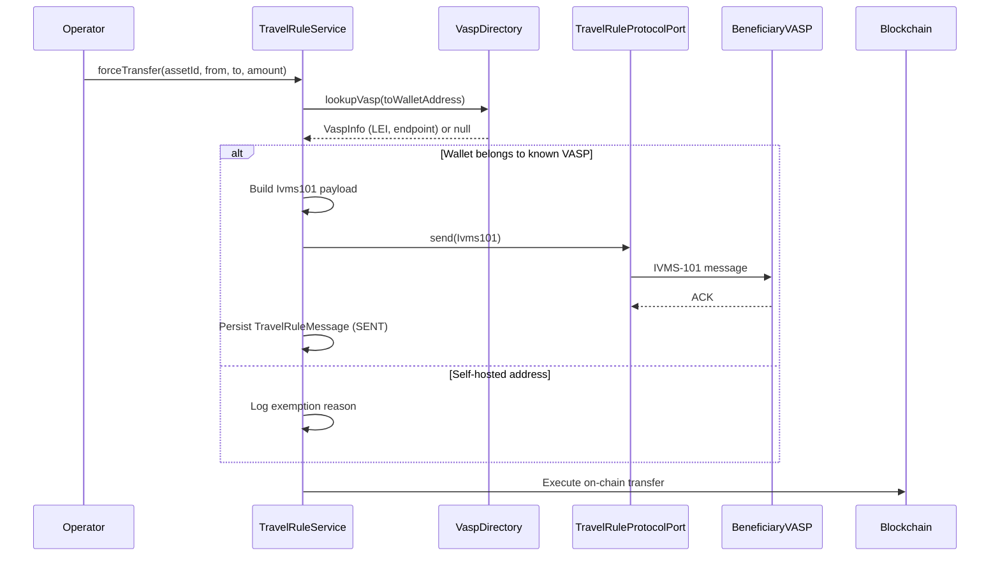

# Travel Rule (TFR / IVMS-101) { #travel-rule-tfr-ivms-101 }

!!! warning "EXTERNAL_REVIEW_REQUIRED"
    Questa pagina registra le mappature dei controlli previste e il comportamento corrente del repository. Non è prova
    che l'operatore o la transazione rientrino nell'ambito, che tutti i dati richiesti siano raccolti o scambiati,
    o che un trasferimento sia conforme alle attuali regole TFR/Travel Rule. L'ambito, le soglie, le controparti, le eccezioni, la protezione dei dati e le prove del protocollo richiedono un'attuale revisione esterna.

Il **Regolamento sul trasferimento di fondi (TFR)** — Regolamento (UE) 2023/1113 — si applica integralmente dal 30 dicembre 2024. Richiede che le informazioni su ordinante e beneficiario (strutturate secondo lo standard **IVMS-101**) accompagnino **ogni** trasferimento di cripto-attività tra Crypto-Asset Service Provider (CASP), **indipendentemente dall'importo**. A differenza dei bonifici in valuta fiat, il TFR non prevede **alcuna soglia de minimis** per i trasferimenti da CASP a CASP: lo confermano le linee guida EBA sulla Travel Rule (EBA/GL/2024/11). La cifra di 1.000 euro nel TFR riguarda solo i trasferimenti da/verso **indirizzi self-hosted**: al di sopra di essa, l'Art. 14(5) richiede che il CASP di origine verifichi che l'indirizzo self-hosted sia di proprietà o sotto il controllo del proprio cliente.

---

## Cosa attiva la Travel Rule { #what-triggers-the-travel-rule }

Viene valutato ogni trasferimento di cripto-attività in uscita. Gli obblighi differiscono in base al tipo di controparte:

1. **Il wallet di destinazione appartiene a un CASP/VASP noto** (tramite ricerca nella directory) → è necessario trasmettere le informazioni complete IVMS-101 su ordinante/beneficiario, **a qualsiasi importo**.
2. **La destinazione è un indirizzo self-hosted** → le informazioni sull'ordinante vengono raccolte e conservate localmente; sopra i 1.000 € il CASP di origine deve inoltre verificare la titolarità/il controllo dell'indirizzo (Art. 14(5) TFR).
3. I trasferimenti tra due wallet della stessa persona giuridica presso lo stesso CASP non rientrano nell'obbligo di trasmissione da CASP a CASP, ma vengono comunque registrati.

Registerwerk verifica queste condizioni in `TravelRuleService.evaluate()` prima di eseguire qualsiasi operazione di `forceTransfer` o di minting esterno.

---

## IVMS-101 struttura dati { #ivms-101-data-structure }

IVMS-101 (InterVASP Messaging Standard) definisce un formato strutturato per le informazioni sull'originatore e sul beneficiario. Il record `Ivms101` di Registerwerk in `travelrule/api/` è mappato ai campi della raccomandazione 16 FATF:

```java
public record Ivms101(
    Person originator,       // IVMS101 Person: name, geographicAddress, nationalIdentification
    Person beneficiary,      // IVMS101 Person: name, geographicAddress, nationalIdentification
    String originatorVasp,   // LEI or BIC of the originating VASP
    String beneficiaryVasp,  // LEI or BIC of the beneficiary VASP
    BigDecimal amount,
    String currency,
    String transferRef       // Unique transfer reference
) {}
```

Il record `Person` include il nome della persona fisica o giuridica, l'indirizzo e uno o più identificativi nazionali (numero di passaporto, LEI, codice fiscale).

---

## Flusso di trasferimento { #transfer-flow }



---

## Adattatore di protocollo collegabile { #pluggable-protocol-adapter }

Diversi VASP utilizzano diversi protocolli Travel Rule (TRP, Sygna Bridge, Notabene, OpenVASP). Registerwerk utilizza una porta (`TravelRuleProtocolPort`) con un'implementazione no-op predefinita (`NoopTravelRuleAdapter`) e uno slot per adattatore collegabile:

```java
public interface TravelRuleProtocolPort {
    void send(Ivms101 payload, String beneficiaryVaspEndpoint);
    TravelRuleMessage.Status getStatus(String transferRef);
}
```

Per abilitare un protocollo reale in produzione, implementare `TravelRuleProtocolPort` e registrarlo come Spring bean. `NoopTravelRuleAdapter` verrà automaticamente sostituito da qualsiasi bean concreto nel contesto dell'applicazione.

---

## Messaggi Travel Rule in entrata { #inbound-travel-rule-messages }

Registerwerk riceve anche messaggi Travel Rule da altri VASP quando trasferiscono token ai wallet gestiti da Registerwerk. L'endpoint della posta in arrivo:

```
POST /api/v1/public/travel-rule/inbox
```

Questo endpoint non richiede un JWT Registerwerk, ma non è anonimo. Configurare
`REGISTERWERK_TRAVEL_RULE_INBOX_API_KEY`; la controparte deve inviarlo in
`X-Travel-Rule-Api-Key`. Una configurazione vuota disabilita la casella in ingresso. Inoltre,
`X-Vasp-Id` deve corrispondere a `originatingVasp.vaspId` nel payload. In produzione è consigliato
mTLS come secondo livello; la configurazione Kong inclusa non configura certificati client. Al ricevimento:

1. Vengono convalidati la credenziale, la corrispondenza dell'identità VASP, i numeri di conto e il riferimento del trasferimento.
2. Il payload `Ivms101` viene archiviato una sola volta come `TravelRuleMessage` con stato `RECEIVED`; i riferimenti ripetuti dello stesso VASP vengono ignorati.
3. I payload non validi vengono respinti con HTTP 400 e non sono archiviati come messaggi Travel Rule attendibili.

La chiave API condivisa autentica l'accesso alla casella in ingresso, non l'identità di un singolo
VASP. In produzione utilizzare mTLS per controparte o controlli gateway equivalenti basati sull'identità.

---

## VASP directory { #vasp-directory }

L'interfaccia `VaspDirectoryPort` supporta il rilevamento VASP collegabile:

- **TRP Directory** (stub predefinito) — il registro globale VASP gestito dal consorzio Travel Rule Protocol
- **Shyft Trust** — directory VASP alternativa
- Override locale: gli operatori possono registrare le mappature VASP conosciute nel portale di amministrazione

Le ricerche VASP vengono memorizzate nella cache per 30 secondi utilizzando la configurazione della cache Caffeine esistente.

---

## Matrice degli obblighi { #obligations-matrix }

| Scenario | Importo | Azione |
|---|---|---|
| Trasferimento da CASP a CASP | **Qualsiasi importo** | È richiesta la trasmissione completa IVMS-101 — nessuna soglia de minimis (TFR Art. 14–16) |
| Wallet CASP verso self-hosted | ≤ 1.000 € | Raccogliere e conservare le informazioni sull'ordinante (`UNHOSTED_RECORDED`) |
| Wallet CASP verso self-hosted | > 1.000 € | Bloccare l'esecuzione finché non è verificata la titolarità/il controllo dell'indirizzo (Art. 14(5)) — `UNHOSTED_VERIFY_REQUIRED` |
| Autocustodia della stessa entità | Qualsiasi importo | Al di fuori dell'obbligo di trasmissione da CASP a CASP — registrato |
| Controparte CASP ma nessun adattatore di protocollo configurato | Qualsiasi importo | **Il trasferimento è rifiutato (fail closed)** — eseguirlo senza le informazioni richieste violerebbe l'Art. 14 |

L'equivalente in EUR è calcolato dal prezzo unitario del token a `TradeExecution.executedAt`, oppure dallo strike NAV per i token dei vault, ed è utilizzato **solo** come trigger di verifica self-hosted ai sensi dell'Art. 14(5) — mai per saltare la messaggistica da CASP a CASP.


---

## Controllo dell'autorizzazione della controparte MiCA { #mica-counterparty-authorization-check }

Il periodo transitorio MiCA a livello di UE termina il **1 luglio 2026** (Dichiarazione ESMA, 17 aprile 2026) — nessuno Stato membro può estendere la tutela oltre questa data. Da quel momento in poi, fornire servizi di cripto-asset nell'UE senza l'autorizzazione di CASP costituisce una violazione del diritto dell'UE e i trasferimenti a tali controparti non devono essere eseguiti.

Registerwerk lo applica attraverso il **Registro di autorizzazione CASP** (`/api/v1/compliance/casp-register`, UI dell'operatore in *Compliance → CASP Register*). I responsabili della conformità rispecchiano lo stato del registro ESMA / NCA di ciascuna controparte Travel Rule:

| Stato della controparte | Prima del 1° luglio 2026 | Dal 1° luglio 2026 |
|---|---|---|
| `AUTHORIZED` | Consentito (bloccato se `validUntil` è superato) | Consentito (bloccato se `validUntil` è superato) |
| `TRANSITIONAL` | Consentito | **Bloccato** — nessuna tutela |
| `NOT_AUTHORIZED` / `REVOKED` | **Bloccato** | **Bloccato** |
| Nessuna voce di registro | Consentito con avvertimento (i VASP non UE non rientrano nell'ambito di applicazione del MiCA) | Consentito con avviso |

I tentativi bloccati vengono registrati in `travel_rule_message` con lo stato `BLOCKED_MICA` prima che il trasferimento venga rifiutato, quindi l'audit trail mostra il tentativo di trasferimento e il motivo normativo. La data limite è configurabile tramite `registerwerk.travel-rule.mica-enforcement-date`.


## Arricchimento dell'identità IVMS-101 { #ivms-101-identity-enrichment }

I payload in uscita vengono arricchiti a partire dal registro dei titolari dell'asset: il wallet dell'ordinante viene risolto al titolare registrato (`asset_holder` → `legal_entity`) e il record IVMS-101 riporta il nome legale (`LEGL`), il LEI come identificazione nazionale `LEIX` ove presente, il numero di entità come identificazione del cliente e il paese di residenza — ai sensi dell'Art. 14(1) TFR, il solo indirizzo del wallet non soddisfa i requisiti informativi. Il lato beneficiario viene arricchito solo per i trasferimenti interni al registro; per i beneficiari esterni è il CASP controparte a detenere l'identità.

## Importazione massiva del registro CASP { #bulk-import-of-the-casp-register }

`POST /api/v1/compliance/casp-register/import` (UI operatore: *Compliance → CASP Register → Import CSV*) accetta un CSV con le colonne canoniche `legal_name`, `vasp_did` (o `lei`, da cui viene sintetizzato `lei:<LEI>`), `status` e, facoltativamente, `home_member_state`, `authorization_id`, `valid_from`, `valid_until`, `notes`. La mappatura dello stato tollera l'ortografia britannica di ESMA ("Authorised") e mappa "Withdrawn" su `REVOKED`. L'importazione è best-effort per riga: le righe valide vengono upsertate usando `vaspDid` come chiave, gli errori vengono segnalati riga per riga.
