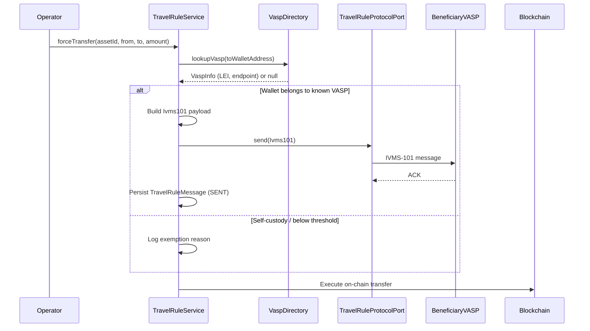

# Travel Rule (TFR / IVMS-101)

The **Transfer of Funds Regulation (TFR)** — Regulation (EU) 2023/1113 — came into force on 30 December 2024. It requires that originator and beneficiary information (structured according to the **IVMS-101** standard) accompany every crypto-asset transfer above **€1,000** between Virtual Asset Service Providers (VASPs).

---

## What triggers the Travel Rule

A transfer triggers Travel Rule obligations when **all** of the following are true:

1. The transfer value is ≥ €1,000 (all four jurisdictions)
2. The destination wallet is associated with a known VASP (determined via VASP directory lookup)
3. The transfer is not between two wallets owned by the same legal entity (self-custody exemption)

Registerwerk checks these conditions in `TravelRuleService.evaluate()` before executing any `forceTransfer` or external mint operation.

---

## IVMS-101 data structure

IVMS-101 (InterVASP Messaging Standard) defines a structured format for originator and beneficiary information. Registerwerk's `Ivms101` record in `travelrule/api/` maps to the FATF Recommendation 16 fields:

```java
public record Ivms101(
    Person originator,       // IVMS101 Person: name, geographicAddress, nationalIdentification
    Person beneficiary,      // IVMS101 Person: name, geographicAddress, nationalIdentification
    String originatorVasp,   // LEI or BIC of the originating VASP
    String beneficiaryVasp,  // LEI or BIC of the beneficiary VASP
    BigDecimal amount,
    String currency,
    String transferRef       // Unique transfer reference
) {}
```

The `Person` record includes natural person or legal entity name, address, and one or more national identifications (passport number, LEI, tax ID).

---

## Transfer flow



---

## Pluggable protocol adapter

Different VASPs use different Travel Rule protocols (TRP, Sygna Bridge, Notabene, OpenVASP). Registerwerk uses a port (`TravelRuleProtocolPort`) with a default no-op implementation (`NoopTravelRuleAdapter`) and a pluggable adapter slot:

```java
public interface TravelRuleProtocolPort {
    void send(Ivms101 payload, String beneficiaryVaspEndpoint);
    TravelRuleMessage.Status getStatus(String transferRef);
}
```

To enable a real protocol in production, implement `TravelRuleProtocolPort` and register it as a Spring bean. The `NoopTravelRuleAdapter` will be automatically displaced by any concrete bean in the application context.

---

## Inbound Travel Rule messages

Registerwerk also receives Travel Rule messages from other VASPs when they transfer tokens to wallets managed by Registerwerk. The inbox endpoint:

```
POST /api/v1/public/travel-rule/inbox
```

This endpoint is publicly accessible (no JWT required) but requires Kong-side mTLS to prevent spoofing. On receipt:

1. The `Ivms101` payload is validated and stored as a `TravelRuleMessage` with status `RECEIVED`
2. The corresponding `token_transfer` record is linked via `transferRef`
3. If the originator VASP is unknown or the payload is malformed, the message is stored as `SUSPICIOUS` and flagged for `COMPLIANCE_OFFICER` review

---

## VASP directory

The `VaspDirectoryPort` interface supports pluggable VASP discovery:

- **TRP Directory** (default stub) — the global VASP registry operated by the Travel Rule Protocol consortium
- **Shyft Trust** — alternative VASP directory
- Local override: operators can register known VASP mappings in the admin portal

VASP lookups are cached for 30 seconds using the existing Caffeine cache configuration.

---

## Threshold and exemptions

| Scenario | Threshold | Action |
|---|---|---|
| VASP-to-VASP transfer | ≥ €1,000 | Full IVMS-101 required |
| VASP-to-unhosted wallet | ≥ €1,000 | Originator VASP must collect and hold beneficiary info (but not transmit) |
| Self-custody (same entity) | Any amount | Exempt — log exemption reason |
| Below threshold | < €1,000 | Basic beneficiary information only |

The threshold check uses the EUR equivalent calculated from the token's unit price at `TradeExecution.executedAt`, or from the NAV strike for vault tokens.
