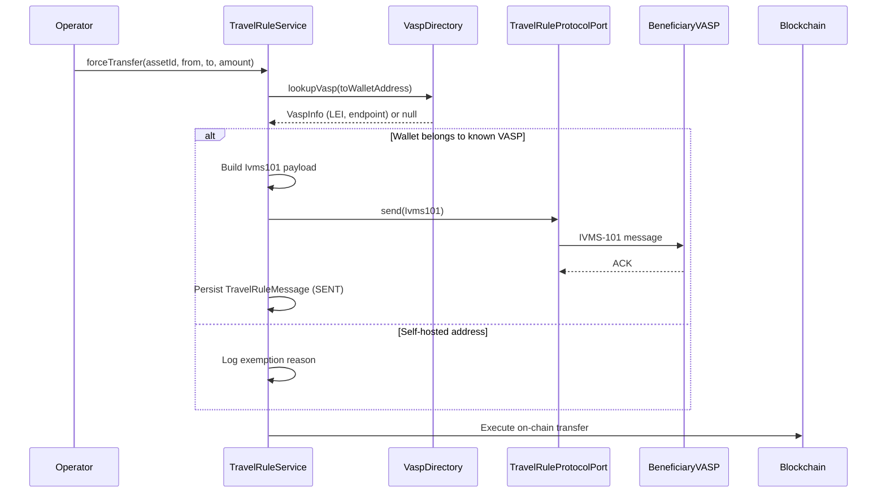

# Travel Rule (TFR / IVMS-101)

The **Transfer of Funds Regulation (TFR)** — Regulation (EU) 2023/1113 — applies in full since 30 December 2024. It requires that originator and beneficiary information (structured according to the **IVMS-101** standard) accompany **every** crypto-asset transfer between Crypto-Asset Service Providers (CASPs), **regardless of amount**. Unlike fiat wire transfers, the TFR contains **no de minimis threshold** for CASP-to-CASP transfers — this is confirmed by the EBA Travel Rule Guidelines (EBA/GL/2024/11). The €1,000 figure in the TFR relates only to transfers to/from **self-hosted addresses**: above it, Art. 14(5) requires the originating CASP to verify that the self-hosted address is owned or controlled by its own customer.

---

## What triggers the Travel Rule

Every outbound crypto-asset transfer is evaluated. The obligations differ by counterparty type:

1. **Destination wallet belongs to a known CASP/VASP** (via directory lookup) → full IVMS-101 originator/beneficiary information must be transmitted, **at any amount**.
2. **Destination is a self-hosted address** → originator information is collected and retained locally; above €1,000 the originating CASP must additionally verify ownership/control of the address (Art. 14(5) TFR).
3. Transfers between two wallets of the same legal entity at the same CASP fall outside the CASP-to-CASP transmission duty but are still recorded.

Registerwerk checks these conditions in `TravelRuleService.evaluate()` before executing any `forceTransfer` or external mint operation.

---

## IVMS-101 data structure

IVMS-101 (InterVASP Messaging Standard) defines a structured format for originator and beneficiary information. Registerwerk's `Ivms101` record in `travelrule/api/` maps to the FATF Recommendation 16 fields:

```java
public record Ivms101(
    Person originator,       // IVMS101 Person: name, geographicAddress, nationalIdentification
    Person beneficiary,      // IVMS101 Person: name, geographicAddress, nationalIdentification
    String originatorVasp,   // LEI or BIC of the originating VASP
    String beneficiaryVasp,  // LEI or BIC of the beneficiary VASP
    BigDecimal amount,
    String currency,
    String transferRef       // Unique transfer reference
) {}
```

The `Person` record includes natural person or legal entity name, address, and one or more national identifications (passport number, LEI, tax ID).

---

## Transfer flow



---

## Pluggable protocol adapter

Different VASPs use different Travel Rule protocols (TRP, Sygna Bridge, Notabene, OpenVASP). Registerwerk uses a port (`TravelRuleProtocolPort`) with a default no-op implementation (`NoopTravelRuleAdapter`) and a pluggable adapter slot:

```java
public interface TravelRuleProtocolPort {
    void send(Ivms101 payload, String beneficiaryVaspEndpoint);
    TravelRuleMessage.Status getStatus(String transferRef);
}
```

To enable a real protocol in production, implement `TravelRuleProtocolPort` and register it as a Spring bean. The `NoopTravelRuleAdapter` will be automatically displaced by any concrete bean in the application context.

---

## Inbound Travel Rule messages

Registerwerk also receives Travel Rule messages from other VASPs when they transfer tokens to wallets managed by Registerwerk. The inbox endpoint:

```
POST /api/v1/public/travel-rule/inbox
```

This endpoint is publicly accessible (no JWT required) but requires Kong-side mTLS to prevent spoofing. On receipt:

1. The `Ivms101` payload is validated and stored as a `TravelRuleMessage` with status `RECEIVED`
2. The corresponding `token_transfer` record is linked via `transferRef`
3. If the originator VASP is unknown or the payload is malformed, the message is stored as `SUSPICIOUS` and flagged for `COMPLIANCE_OFFICER` review

---

## VASP directory

The `VaspDirectoryPort` interface supports pluggable VASP discovery:

- **TRP Directory** (default stub) — the global VASP registry operated by the Travel Rule Protocol consortium
- **Shyft Trust** — alternative VASP directory
- Local override: operators can register known VASP mappings in the admin portal

VASP lookups are cached for 30 seconds using the existing Caffeine cache configuration.

---

## Obligations matrix

| Scenario | Amount | Action |
|---|---|---|
| CASP-to-CASP transfer | **Any amount** | Full IVMS-101 transmission required — no de minimis (TFR Art. 14–16) |
| CASP-to-self-hosted wallet | ≤ €1,000 | Collect and retain originator info (`UNHOSTED_RECORDED`) |
| CASP-to-self-hosted wallet | > €1,000 | Additionally verify ownership/control of the address (Art. 14(5)) — `UNHOSTED_VERIFY_REQUIRED` |
| Same-entity self-custody | Any amount | Outside CASP-to-CASP transmission duty — recorded |
| CASP counterparty but no protocol adapter configured | Any amount | **Transfer is rejected (fail closed)** — executing without the required information would breach Art. 14 |

The EUR equivalent is calculated from the token's unit price at `TradeExecution.executedAt`, or from the NAV strike for vault tokens, and is used **only** for the Art. 14(5) self-hosted verification trigger — never to skip CASP-to-CASP messaging.


---

## MiCA counterparty authorization check

The EU-wide MiCA transitional period ends on **1 July 2026** (ESMA statement, 17 April 2026) — no member state may extend grandfathering beyond this date. From the cutoff, providing crypto-asset services in the EU without CASP authorization is a breach of EU law, and transfers to such counterparties must not be executed.

Registerwerk enforces this through the **CASP Authorization Register** (`/api/v1/compliance/casp-register`, operator UI under *Compliance → CASP Register*). Compliance officers mirror the ESMA / NCA register status of each Travel Rule counterparty:

| Counterparty status | Before 1 July 2026 | From 1 July 2026 |
|---|---|---|
| `AUTHORIZED` | Permitted (blocked if `validUntil` passed) | Permitted (blocked if `validUntil` passed) |
| `TRANSITIONAL` | Permitted | **Blocked** — no grandfathering |
| `NOT_AUTHORIZED` / `REVOKED` | **Blocked** | **Blocked** |
| No register entry | Permitted with warning (non-EU VASPs are outside MiCA's scope) | Permitted with warning |

Blocked attempts are recorded in `travel_rule_message` with status `BLOCKED_MICA` before the transfer is rejected, so the audit trail shows the attempted transfer and the regulatory reason. The cutoff date is configurable via `registerwerk.travel-rule.mica-enforcement-date`.


## IVMS-101 identity enrichment

Outbound payloads are enriched from the asset holder registry: the originator's wallet is resolved to the registered holder (`asset_holder` → `legal_entity`) and the IVMS-101 record carries the legal name (`LEGL`), the LEI as `LEIX` national identification where present, the entity number as customer identification, and the country of residence — per TFR Art. 14(1), the wallet address alone does not satisfy the information requirements. The beneficiary side is enriched only for intra-registry transfers; for external beneficiaries the counterpart CASP holds the identity.

## Bulk import of the CASP register

`POST /api/v1/compliance/casp-register/import` (operator UI: *Compliance → CASP Register → Import CSV*) accepts a CSV with the canonical columns `legal_name`, `vasp_did` (or `lei`, from which `lei:<LEI>` is synthesized), `status`, and optionally `home_member_state`, `authorization_id`, `valid_from`, `valid_until`, `notes`. Status mapping is tolerant of ESMA's British spelling ("Authorised") and maps "Withdrawn" to `REVOKED`. The import is best-effort per row: valid rows are upserted keyed by `vaspDid`, failures are reported per line.
