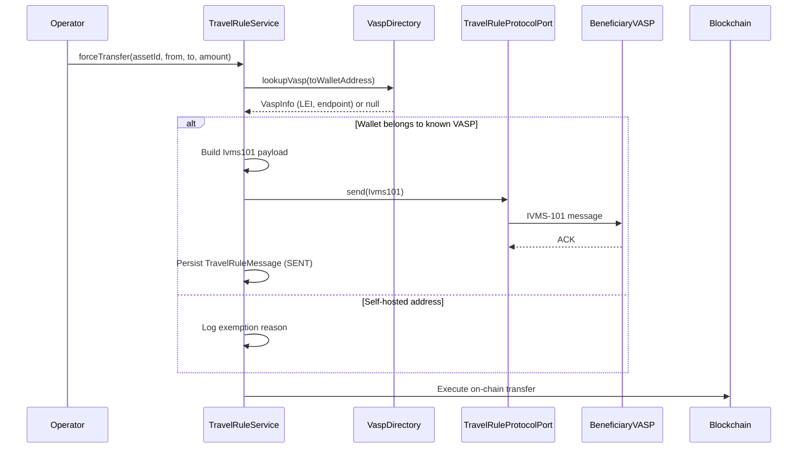

# Travel Rule (TFR / IVMS-101)

!!! warning "EXTERNAL_REVIEW_REQUIRED"
    This page records intended control mappings and current repository behavior. It is not evidence
    that the operator or transaction is in scope, that all required data is collected or exchanged,
    or that a transfer conforms to current TFR/Travel Rule rules. Scope, thresholds,
    counterparties, exceptions, data protection, and protocol evidence require current external review.

The **Transfer of Funds Regulation (TFR)** — Regulation (EU) 2023/1113 — applies in full since 30 December 2024. It requires that originator and beneficiary information (structured according to the **IVMS-101** standard) accompany **every** crypto-asset transfer between Crypto-Asset Service Providers (CASPs), **regardless of amount**. Unlike fiat wire transfers, the TFR contains **no de minimis threshold** for CASP-to-CASP transfers — this is confirmed by the EBA Travel Rule Guidelines (EBA/GL/2024/11). The €1,000 figure in the TFR relates only to transfers to/from **self-hosted addresses**: above it, Art. 14(5) requires the originating CASP to verify that the self-hosted address is owned or controlled by its own customer.

---

## What triggers the Travel Rule

Every outbound crypto-asset transfer is evaluated. The obligations differ by counterparty type:

1. **Destination wallet belongs to a known CASP/VASP** (via directory lookup) → full IVMS-101 originator/beneficiary information must be transmitted, **at any amount**.
2. **Destination is a self-hosted address** → originator information is collected and retained locally; above €1,000 the originating CASP must additionally verify ownership/control of the address (Art. 14(5) TFR).
3. Transfers between two wallets of the same legal entity at the same CASP fall outside the CASP-to-CASP transmission duty but are still recorded.

Registerwerk checks these conditions in `TravelRuleService.evaluate()` before executing any `forceTransfer` or external mint operation.

---

## IVMS-101 data structure

IVMS-101 (InterVASP Messaging Standard) defines a structured format for originator and beneficiary information. Registerwerk's `Ivms101` record in `travelrule/api/` maps to the FATF Recommendation 16 fields:

```java
public record Ivms101(
    Person originator,       // IVMS101 Person: name, geographicAddress, nationalIdentification
    Person beneficiary,      // IVMS101 Person: name, geographicAddress, nationalIdentification
    String originatorVasp,   // LEI or BIC of the originating VASP
    String beneficiaryVasp,  // LEI or BIC of the beneficiary VASP
    BigDecimal amount,
    String currency,
    String transferRef       // Unique transfer reference
) {}
```

The `Person` record includes natural person or legal entity name, address, and one or more national identifications (passport number, LEI, tax ID).

---

## Transfer flow


```mermaid
sequenceDiagram
    participant Operator
    participant TravelRuleService
    participant VaspDirectory
    participant TravelRuleProtocolPort
    participant BeneficiaryVASP

    Operator->>TravelRuleService: forceTransfer(assetId, from, to, amount)
    TravelRuleService->>VaspDirectory: lookupVasp(toWalletAddress)
    VaspDirectory-->>TravelRuleService: VaspInfo (LEI, endpoint) or null
    alt Wallet belongs to known VASP
        TravelRuleService->>TravelRuleService: Build Ivms101 payload
        TravelRuleService->>TravelRuleProtocolPort: send(Ivms101)
        TravelRuleProtocolPort->>BeneficiaryVASP: IVMS-101 message
        BeneficiaryVASP-->>TravelRuleProtocolPort: ACK
        TravelRuleService->>TravelRuleService: Persist TravelRuleMessage (SENT)
    else Self-hosted address
        TravelRuleService->>TravelRuleService: Log exemption reason
    end
    TravelRuleService->>Blockchain: Execute on-chain transfer
```

---

## Pluggable protocol adapter

Different VASPs use different Travel Rule protocols (TRP, Sygna Bridge, Notabene, OpenVASP). Registerwerk uses a port (`TravelRuleProtocolPort`) with a default no-op implementation (`NoopTravelRuleAdapter`) and a pluggable adapter slot:

```java
public interface TravelRuleProtocolPort {
    void send(Ivms101 payload, String beneficiaryVaspEndpoint);
    TravelRuleMessage.Status getStatus(String transferRef);
}
```

To enable a real protocol in production, implement `TravelRuleProtocolPort` and register it as a Spring bean. The `NoopTravelRuleAdapter` will be automatically displaced by any concrete bean in the application context.

---

## Inbound Travel Rule messages

Registerwerk also receives Travel Rule messages from other VASPs when they transfer tokens to wallets managed by Registerwerk. The inbox endpoint:

```
POST /api/v1/public/travel-rule/inbox
```

Each peer VASP is registered by a `REGISTRY_ADMIN` (`POST /api/v1/compliance/travel-rule/peers`, step-up and a second approver) and receives its own HMAC key, shown once. A request is accepted only if all of the following hold:

- `X-Vasp-Id`, `X-Registerwerk-Timestamp` (epoch seconds, within 5 minutes) and `X-Registerwerk-Peer-Signature` = hex HMAC-SHA256 over `timestamp|vaspId|sha256(body)` verify against the key of that registered peer, and the signature has not been used before (replay cache);
- `originatingVasp.vaspId` in the payload equals the authenticated peer;
- the sender is not blocked or revoked in the CASP register (a refused delivery is stored as `REJECTED_CASP` and audited).

On receipt:

1. Account numbers and transfer reference are validated; the body is limited to 256 KiB.
2. The message is stored under the **authenticated peer** with its payload hash and `transferDetails`. A re-delivery of the identical payload is idempotent; a different payload under the same reference is stored too and both rows get status `CONFLICT` plus an audit event — a peer can no longer suppress another message by claiming its reference first.
3. Incomplete messages (originator/beneficiary name, address or identification missing, TFR Art. 16(1)) get status `INCOMPLETE`. A background job links each message to the indexed `token_transfer` (`matched_transfer_id`). `GET /api/v1/compliance/travel-rule/open` lists everything that needs an operator.

!!! warning "Shared key"
    The old shared `X-Travel-Rule-Api-Key` is deprecated: it works only with `registerwerk.travel-rule.legacy-shared-key=true` outside production mode, and the `X-Vasp-Id` is then **not** authenticated. Registerwerk does not place a hold on the credited tokens; whether the operator or the holder's custodian is the receiving CASP of record is an open legal question (parked T6-08).

---

## VASP directory

The `VaspDirectoryPort` interface supports pluggable VASP discovery:

- **TRP Directory** (default stub) — the global VASP registry operated by the Travel Rule Protocol consortium
- **Shyft Trust** — alternative VASP directory
- Local override: operators can register known VASP mappings in the admin portal

VASP lookups are cached for 30 seconds using the existing Caffeine cache configuration.

---

## Obligations matrix

| Scenario | Amount | Action |
|---|---|---|
| CASP-to-CASP transfer | **Any amount** | Full IVMS-101 transmission required — no de minimis (TFR Art. 14–16) |
| CASP-to-self-hosted wallet | ≤ €1,000 | Collect and retain originator info (`UNHOSTED_RECORDED`) |
| CASP-to-self-hosted wallet | > €1,000 | Block execution until ownership/control of the address is verified (Art. 14(5)) — `UNHOSTED_VERIFY_REQUIRED` |
| Same-entity self-custody | Any amount | Outside CASP-to-CASP transmission duty — recorded |
| CASP counterparty but no protocol adapter configured | Any amount | **Transfer is rejected (fail closed)** — executing without the required information would breach Art. 14 |

No caller currently supplies a EUR valuation: an unknown value is treated as above €1,000 (fail closed; valuation source parked as T6-06), so a wallet-control proof (see below) is what releases a transfer to a registered self-hosted holder wallet. The valuation is used **only** for the Art. 14(5) trigger — never to skip CASP-to-CASP messaging.


---

## MiCA counterparty authorization check

The EU-wide MiCA transitional period ends on **1 July 2026** (ESMA statement, 17 April 2026) — no member state may extend grandfathering beyond this date. From the cutoff, providing crypto-asset services in the EU without CASP authorization is a breach of EU law, and transfers to such counterparties must not be executed.

Registerwerk enforces this through the **CASP Authorization Register** (`/api/v1/compliance/casp-register`, operator UI under *Compliance → CASP Register*). Compliance officers mirror the ESMA / NCA register status of each Travel Rule counterparty:

| Counterparty status | Before 1 July 2026 | From 1 July 2026 |
|---|---|---|
| `AUTHORIZED` | Permitted (blocked if `validUntil` passed) | Permitted (blocked if `validUntil` passed) |
| `TRANSITIONAL` | Permitted | **Blocked** — no grandfathering |
| `NOT_AUTHORIZED` / `REVOKED` | **Blocked** | **Blocked** |
| No register entry | Permitted with warning | **Blocked** (fail closed); non-EU VASPs need a reviewed `THIRD_COUNTRY_REVIEWED` entry |

Blocked attempts are recorded in `travel_rule_message` with status `BLOCKED_MICA` before the transfer is rejected, so the audit trail shows the attempted transfer and the regulatory reason. The cutoff date is configurable via `registerwerk.travel-rule.mica-enforcement-date`.


## IVMS-101 identity enrichment

Outbound payloads are enriched from the asset holder registry: the originator's wallet is resolved to the registered holder (`asset_holder` → `legal_entity`) and the IVMS-101 record carries the legal name (`LEGL`), the LEI as `LEIX` national identification where present, the entity number as customer identification, and the country of residence — per TFR Art. 14(1), the wallet address alone does not satisfy the information requirements. The beneficiary side is enriched only for intra-registry transfers; for external beneficiaries the counterpart CASP holds the identity.

## Bulk import of the CASP register

The step-by-step procedure (preview, diff digest, commit) is on its own page: [CASP register import](casp-register-import.md).

The import is two steps: `POST /api/v1/compliance/casp-register/import/preview` (writes nothing) and `POST /api/v1/compliance/casp-register/import?diffDigest=...` (operator UI: *Compliance → CASP Register → Import CSV*), which accepts a CSV with the canonical columns `legal_name`, `vasp_did` (or `lei`, from which `lei:<LEI>` is synthesized), `status`, and optionally `home_member_state`, `authorization_id`, `valid_from`, `valid_until`, `notes`. Status mapping is tolerant of ESMA's British spelling ("Authorised") and maps "Withdrawn" to `REVOKED`. The import is best-effort per row: valid rows are upserted keyed by `vaspDid`, failures are reported per line.


## Delivery, proofs and register controls { #delivery-proofs-register-controls }

!!! note "Outbound delivery is awaited"
    For a CASP beneficiary the `PENDING_SEND` row is committed first, the message is sent and awaited (`registerwerk.travel-rule.send-timeout-seconds`, default 15), and only a confirmed `SENT` lets the forced transfer be submitted on-chain. A failure or timeout stores `FAILED`, refuses the operation and can simply be repeated; there is no override (parked T6-06). Rows stuck in `PENDING_SEND` for more than 5 minutes are marked `FAILED` by a sweeper with an alert. The same gate runs for ERC-20/721/1155 and for ERC-3643 forced transfers.

The message carries the operator's own VASP (`registerwerk.travel-rule.own-vasp.did`/`lei`/`legal-name`, mandatory in production), the beneficiary VASP resolved from the directory (its own endpoint is used for delivery: https only, no private addresses, optional `trp.allowed-hosts`) and `transferDetails` (token amount and symbol, contract, execution date). Missing mandatory originator or beneficiary data stops the transfer with status `INCOMPLETE_IVMS` and nothing is sent.

**Art. 14(5) wallet-control proofs.** A transfer to a self-hosted holder wallet is released when a valid proof exists for that exact (legal entity, wallet) pair: a signed-message challenge (`POST /api/v1/compliance/travel-rule/wallet-proofs/challenges`, then `/{id}/signature`) or an operator attestation with a mandatory evidence note (step-up and a second approver). The message is recorded as `UNHOSTED_VERIFIED` with the proof id. Without a proof the transfer stays blocked and the error names the endpoint. The register-internal exemption (`registerwerk.travel-rule.register-internal-exempt`) is off by default because it is a legal position (parked T6-06).

**CASP register.** Lookup runs by DID, then LEI, then a unique legal name. Edits, deletions and imports require step-up and a second approver; lifting a `NOT_AUTHORIZED`/`REVOKED` status or deleting such a row needs a `REGISTRY_ADMIN` as approver. A CSV import is a two-step process: `POST /casp-register/import/preview` returns the diff and a `diffDigest`, `POST /casp-register/import?diffDigest=...` commits it. A `THIRD_COUNTRY_REVIEWED` entry needs reviewer, second approver and an expiry.

!!! warning "Legal assumptions"
    Whether the TFR applies to eWpG crypto-securities, whether court-ordered or register-internal transfers are exempt, the EUR valuation source and the treatment of non-EU VASPs are parked decisions (T6-06, T6-07). The behaviour above is the conservative interim, not a legal assessment.
