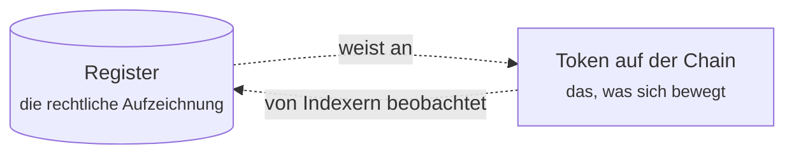

# Für Kunden

Sie haben Zugang zu einem Register erhalten, das auf Registerwerk läuft. Irgendwo darin liegt ein Wertpapier, das Sie emittiert haben, oder eines, das Ihnen gehört, oder eines, das Sie kaufen möchten. Dieser Abschnitt erklärt, was da ist, was Sie damit tun können und was darunter passiert, wenn Sie es tun.

**Finanz- oder Blockchain-Vorwissen wird nicht vorausgesetzt.** Begriffe werden dort erklärt, wo sie zuerst auftauchen.

Der Kunden- und Betreiberteil dieser Dokumentation liegt auf Deutsch vor. Die vertiefenden Referenzabschnitte — Rechtsrahmen, Compliance-Komponenten, Token-Standards, Blockchains und Plattform-Interna — erscheinen weiterhin auf Englisch. Gesetzesbezeichnungen wie **§16 eWpG** bleiben in jeder Sprache unübersetzt, damit sie zitierfähig bleiben.

---

## Drei Wege hinein

-   **Ich bin ganz neu**

    ---

    Beginnen Sie mit [Was Registerwerk ist](intro.md), dann [Zugang erhalten](onboarding.md). Etwa fünfzehn Minuten.

-   **Ich will das Geschäft verstehen**

    ---

    Lesen Sie [Der Lebenszyklus eines Wertpapiers](lifecycle/index.md) von Anfang bis Ende. Eine Anleihe, sechs Stationen, von der Idee bis zur Rückzahlung.

-   **Ich weiß, was ich brauche**

    ---

    Direkt zu Ihrem Arbeitsbereich: [Anleger](workspaces/investor.md) · [Händler](workspaces/trader.md) · [Emittent](workspaces/issuer.md) · [Unternehmensadministrator](workspaces/company-admin.md) · [dApp-Herausgeber](workspaces/dapp-publisher.md) · [Prüfer](workspaces/auditor.md)

---

## Wonach das Portal gegliedert ist

Nach der Anmeldung landen Sie in einem **Arbeitsbereich**. Ein Arbeitsbereich ist keine Berechtigung — er ist eine Perspektive. Dasselbe Konto kann mehrere haben; der Umschalter oben links wechselt zwischen ihnen.

| Arbeitsbereich | Sie sind hier, um… | Sie sehen |
|---|---|---|
| **Investor** | Wertpapiere zu halten und zu beobachten | Positions, Investments, Marketplace |
| **Trader** | zu kaufen, zu verkaufen und Positionen zu finanzieren | Trading Desk, Liquidity, Positions, Marketplace |
| **Issuer** | Wertpapiere zu schaffen und zu verwalten | Issuances, My dApps, Company Admin, Marketplace |

Drei Dinge stehen außerhalb der Arbeitsbereiche, weil sie unabhängig davon gelten, was Sie gerade tun: Ihr [**KYC-Status**](kyc.md), Ihre [**Endpunkte**](investors/wallet-setup.md) (die von Ihnen registrierten Wallet-Adressen) und Ihre [**Sicherheitseinstellungen**](authentication.md).

!!! note "Die Bezeichnungen der Oberfläche bleiben englisch"
    Beide Portale sind ausschließlich englischsprachig. Diese Dokumentation nennt daher die englische Beschriftung so, wie sie auf dem Bildschirm steht, und erklärt sie: *Trading Desk → **Create listing** (Verkaufsangebot anlegen)*. Eine übersetzte Beschriftung, die Sie auf dem Bildschirm nicht wiederfinden, hilft niemandem.

??? note "Warum Arbeitsbereiche statt eines langen Menüs?"

    Weil eine Person oft mehrere Rollen gleichzeitig hat — eine Treasury-Managerin etwa, die eigene Papiere emittiert, überschüssige Liquidität anlegt und beides handelt. Zeigt man ihr sämtliche Funktionen, für die sie irgendeine Rolle hält, entsteht eine Navigationsleiste, die keiner Aufgabe gerecht wird.

    Arbeitsbereiche werden pro Browser gespeichert, die Auswahl bleibt also erhalten. Sie filtern **nur die Navigation**: Ihre Berechtigungen ändern sich nicht dadurch, in welchem Arbeitsbereich Sie sind, und das Backend setzt sie unabhängig davon durch. Die Wahl des Issuer-Bereichs verleiht keine Emittentenrechte, und ihn zu verlassen nimmt sie nicht weg.

---

## Das Wichtigste vorweg

Registerwerk führt **zwei Aufzeichnungen derselben Sache** — und behauptet bewusst nichts anderes.

Da ist das **Register** — eine Datenbank beim Betreiber, die rechtlich maßgebliche Aufzeichnung. Und da ist der **Token** — ein Eintrag auf einer Blockchain, das, was sich bei einer Übertragung tatsächlich bewegt.

Software beobachtet die Chain und schreibt das Gesehene ins Register zurück. Meistens stimmen beide überein. Wenn nicht, ist das Register maßgeblich, und die Differenz muss ein Mensch auflösen.

Fast alles, was an der Plattform überraschend wirkt, folgt daraus. Warum eine Übertragung *pending* sein kann. Warum einem Emittenten gemeldet wird, dass On-Chain-Bestand und Registerbestand auseinanderfallen. Warum manche Vorgänge den Betreiber brauchen. Wer diese beiden Dinge auseinanderhält, dem erschließt sich der Rest von selbst — [Verwahrung und Bestand](lifecycle/holding.md) geht dem ordentlich nach.

---

!!! info "Zu den Beispielen"
    Alle Zahlen, Unternehmen und Wertpapiere in dieser Dokumentation sind erfunden. Die *Nordwind Energie GmbH* existiert nicht, und ihre Anleihe wurde nie begeben. Die Zahlen sind so gewählt, dass die Rechnung leicht nachvollziehbar ist — nicht, dass sie realistische Marktkonditionen abbilden.
