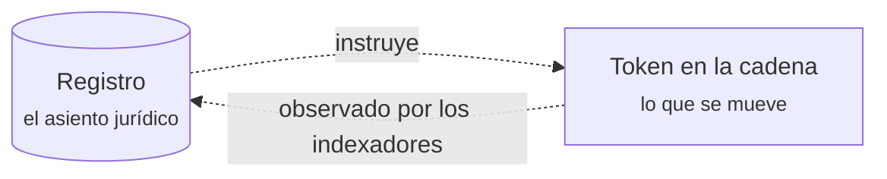

# Para clientes

Le han dado acceso a un registro construido sobre Registerwerk. En algún lugar dentro de él hay un valor que usted emitió, o uno que posee, o uno que le gustaría comprar. Esta sección explica qué hay, qué puede hacer con ello y qué ocurre por debajo cuando lo hace.

**No se presupone formación financiera ni en blockchain.** Los términos se explican donde aparecen por primera vez.

Las secciones para clientes y para operadores están disponibles en español. Las secciones de referencia más técnicas — marcos jurídicos, componentes de cumplimiento, estándares de token, blockchains e interioridades de la plataforma — permanecen en inglés. Las referencias legales como **§16 eWpG** no se traducen en ningún idioma, para que sigan siendo citables.

---

## Tres formas de entrar

-   **Soy completamente nuevo**

    ---

    Empiece por [Qué es Registerwerk](intro.md) y luego [Obtener su cuenta](onboarding.md). Unos quince minutos.

-   **Quiero entender el negocio**

    ---

    Lea [La vida de un valor](lifecycle/index.md) de principio a fin. Un bono, seis etapas, de la idea a la devolución del dinero.

-   **Ya sé lo que necesito**

    ---

    Vaya directo a su espacio: [Inversor](workspaces/investor.md) · [Trader](workspaces/trader.md) · [Emisor](workspaces/issuer.md) · [Administrador de la empresa](workspaces/company-admin.md) · [Editor de dApps](workspaces/dapp-publisher.md) · [Auditor](workspaces/auditor.md)

---

## En torno a qué se organiza el portal

Al iniciar sesión aterriza en un **espacio de trabajo**. Un espacio de trabajo no es un permiso: es un punto de vista. Una misma cuenta puede tener varios, y el selector de la parte superior izquierda cambia entre ellos.

| Espacio | Está aquí para… | Ve |
|---|---|---|
| **Investor** | mantener valores y seguir su evolución | Positions, Investments, Marketplace |
| **Trader** | comprar, vender y financiar posiciones | Trading Desk, Liquidity, Positions, Marketplace |
| **Issuer** | crear valores y administrarlos | Issuances, My dApps, Company Admin, Marketplace |

Tres cosas quedan fuera de los espacios de trabajo, porque le afectan haga lo que haga: su [**estado KYC**](kyc.md), sus [**puntos finales**](investors/wallet-setup.md) (las direcciones de monedero que ha registrado) y sus [**ajustes de seguridad**](authentication.md).

!!! note "Las etiquetas de la interfaz permanecen en inglés"
    Ambos portales están únicamente en inglés. Por eso esta documentación cita la etiqueta inglesa tal como aparece en pantalla y luego la explica: *Trading Desk → **Create listing** (crear una oferta de venta)*. Una etiqueta traducida que no encuentra en pantalla no ayuda a nadie.

??? note "¿Por qué espacios de trabajo y no un único menú largo?"

    Porque una misma persona suele acumular varios papeles — un tesorero que emite el papel de su empresa, invierte la liquidez sobrante y negocia ambas cosas. Mostrarle todas las funciones para las que tiene algún permiso produce una barra de navegación que no sirve bien para ninguna tarea.

    Los espacios se guardan por navegador, así que la elección persiste. Filtran **solo la navegación**: sus permisos no cambian según el espacio en el que esté, y el backend los aplica igualmente. Elegir el espacio Issuer no otorga derechos de emisor, y salir de él no los quita.

---

## Lo único que conviene saber de entrada

Registerwerk mantiene **dos registros de la misma cosa**, y deliberadamente no finge lo contrario.

Está el **registro** — una base de datos, en poder del operador, que es el asiento con relevancia jurídica. Y está el **token** — una anotación en una blockchain, lo que realmente se mueve cuando hay una transmisión.

Un software observa la cadena y reescribe en el registro lo que ve. La mayor parte del tiempo coinciden. Cuando no, prevalece el registro y la diferencia la resuelve una persona.

Casi todo lo que resulta sorprendente de la plataforma se deriva de esto. Por qué una transmisión puede estar *pending*. Por qué a un emisor se le puede avisar de que el saldo on-chain y el del registro divergen. Por qué algunas acciones requieren al operador. Mantener separadas estas dos ideas hace evidente todo lo demás — y [Tenencia y custodia](lifecycle/holding.md) lo desarrolla en condiciones.

---

!!! info "Sobre los ejemplos"
    Todas las cifras, empresas y valores de esta documentación son inventados. *Nordwind Energie GmbH* no existe y su bono nunca se ha emitido. Los importes están elegidos para que las cuentas sean fáciles de seguir, no para representar condiciones de mercado realistas.
