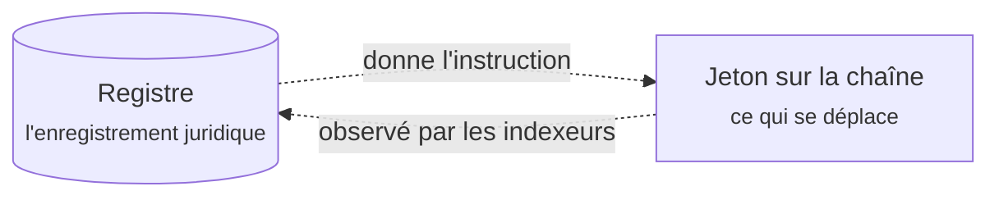

# Pour les clients

Vous avez reçu un accès à un registre bâti sur Registerwerk. Quelque part à l'intérieur se trouve un titre que vous avez émis, ou un titre que vous détenez, ou un titre que vous aimeriez acheter. Cette section explique ce qui s'y trouve, ce que vous pouvez en faire, et ce qui se passe en dessous quand vous le faites.

**Aucune connaissance financière ou blockchain n'est supposée.** Les termes sont expliqués là où ils apparaissent pour la première fois.

Les sections client et opérateur de cette documentation sont disponibles en français. Les sections de référence approfondies — cadres juridiques, composants de conformité, normes de jetons, blockchains et internes de la plateforme — restent en anglais. Les références légales telles que **§16 eWpG** ne sont traduites dans aucune langue, afin de rester citables.

---

## Trois façons d'entrer

-   **Je suis totalement nouveau**

    ---

    Commencez par [Qu'est-ce que Registerwerk](intro.md), puis [Obtenir votre compte](onboarding.md). Environ quinze minutes.

-   **Je veux comprendre le métier**

    ---

    Lisez [La vie d'un titre financier](lifecycle/index.md) de bout en bout. Une obligation, six étapes, de l'idée au remboursement.

-   **Je sais ce qu'il me faut**

    ---

    Allez directement à votre espace : [Investisseur](workspaces/investor.md) · [Trader](workspaces/trader.md) · [Émetteur](workspaces/issuer.md) · [Administrateur d'entreprise](workspaces/company-admin.md) · [Éditeur de dApp](workspaces/dapp-publisher.md) · [Auditeur](workspaces/auditor.md)

---

## Autour de quoi le portail est organisé

À la connexion, vous arrivez dans un **espace de travail**. Un espace de travail n'est pas une autorisation — c'est un point de vue. Un même compte peut en avoir plusieurs, et le sélecteur en haut à gauche permet de passer de l'un à l'autre.

| Espace | Vous êtes là pour… | Vous voyez |
|---|---|---|
| **Investor** | détenir des titres et suivre leur évolution | Positions, Investments, Marketplace |
| **Trader** | acheter, vendre et financer des positions | Trading Desk, Liquidity, Positions, Marketplace |
| **Issuer** | créer des titres et les administrer | Issuances, My dApps, Company Admin, Marketplace |

Trois éléments se situent hors des espaces de travail, parce qu'ils s'appliquent quoi que vous fassiez : votre [**statut KYC**](kyc.md), vos [**points de réception**](investors/wallet-setup.md) (les adresses de portefeuille que vous avez enregistrées) et vos [**paramètres de sécurité**](authentication.md).

!!! note "Les libellés de l'interface restent en anglais"
    Les deux portails sont exclusivement en anglais. Cette documentation cite donc le libellé anglais tel qu'il apparaît à l'écran, puis l'explique : *Trading Desk → **Create listing** (créer une offre de vente)*. Un libellé traduit que vous ne retrouvez pas à l'écran n'aide personne.

??? note "Pourquoi des espaces de travail plutôt qu'un long menu ?"

    Parce qu'une même personne cumule souvent plusieurs rôles — un trésorier qui émet le papier de sa société, place les excédents de trésorerie et négocie les deux. Lui afficher toutes les fonctionnalités pour lesquelles il détient un rôle produit une barre de navigation qui ne sert bien aucune tâche.

    Les espaces sont mémorisés par navigateur : votre choix persiste. Ils filtrent **uniquement la navigation** : vos autorisations ne changent pas selon l'espace choisi, et le backend les applique indépendamment. Choisir l'espace Issuer ne confère aucun droit d'émetteur, et en sortir ne les retire pas.

---

## La seule chose à savoir d'emblée

Registerwerk tient **deux enregistrements de la même chose**, et ne prétend délibérément pas le contraire.

Il y a le **registre** — une base de données, tenue par l'opérateur, qui est l'enregistrement doté d'une portée juridique. Et il y a le **jeton** — une inscription sur une blockchain, ce qui se déplace réellement lors d'un transfert.

Un logiciel observe la chaîne et réinscrit ce qu'il voit dans le registre. La plupart du temps, les deux concordent. Quand ce n'est pas le cas, le registre fait foi et l'écart doit être résolu par un humain.

Presque tout ce qui surprend dans cette plateforme en découle. Pourquoi un transfert peut être *pending*. Pourquoi un émetteur peut être averti que le solde on-chain et le solde du registre divergent. Pourquoi certaines actions nécessitent l'opérateur. Distinguer ces deux idées rend le reste évident — et [Détention et conservation](lifecycle/holding.md) l'approfondit.

---

!!! info "À propos des exemples"
    Tous les chiffres, sociétés et titres de cette documentation sont inventés. *Nordwind Energie GmbH* n'existe pas et son obligation n'a jamais été émise. Les montants sont choisis pour rendre les calculs faciles à suivre, non pour représenter des conditions de marché réalistes.
