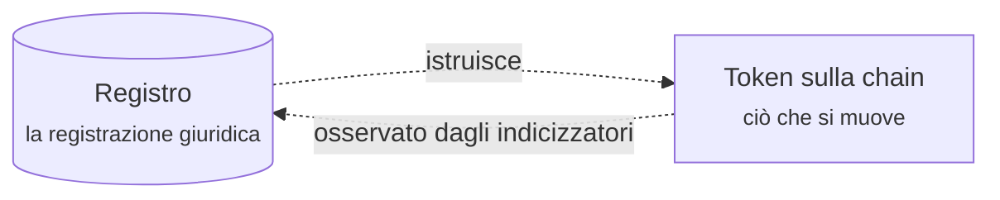

# Per i clienti

Hai ricevuto l'accesso a un registro costruito su Registerwerk. Da qualche parte al suo interno c'è uno strumento finanziario che hai emesso, o uno che possiedi, o uno che vorresti comprare. Questa sezione spiega che cosa c'è, che cosa puoi farci e che cosa accade sotto quando lo fai.

**Non si presuppone alcuna conoscenza di finanza o blockchain.** I termini sono spiegati dove compaiono per la prima volta.

Le sezioni per i clienti e per gli operatori sono disponibili in italiano. Le sezioni di riferimento più tecniche — quadri normativi, componenti di conformità, standard di token, blockchain e interni della piattaforma — restano in inglese. I riferimenti normativi come **§16 eWpG** non vengono tradotti in nessuna lingua, per restare citabili.

---

## Tre modi per iniziare

-   **Sono completamente nuovo**

    ---

    Comincia da [Che cos'è Registerwerk](intro.md), poi [Ottenere l'account](onboarding.md). Circa quindici minuti.

-   **Voglio capire il business**

    ---

    Leggi [La vita di uno strumento finanziario](lifecycle/index.md) dall'inizio alla fine. Un'obbligazione, sei fasi, dall'idea al rimborso.

-   **So già cosa mi serve**

    ---

    Vai direttamente alla tua area: [Investitore](workspaces/investor.md) · [Negoziatore](workspaces/trader.md) · [Emittente](workspaces/issuer.md) · [Amministratore aziendale](workspaces/company-admin.md) · [Editore di dApp](workspaces/dapp-publisher.md) · [Revisore](workspaces/auditor.md)

---

## Come è organizzato il portale

Dopo l'accesso arrivi in un'**area di lavoro**. Un'area di lavoro non è un permesso: è un punto di vista. Lo stesso account può averne più di una, e il selettore in alto a sinistra passa dall'una all'altra.

| Area | Sei qui per… | Vedi |
|---|---|---|
| **Investor** | detenere strumenti e seguirne l'andamento | Positions, Investments, Marketplace |
| **Trader** | comprare, vendere e finanziare posizioni | Trading Desk, Liquidity, Positions, Marketplace |
| **Issuer** | creare strumenti e amministrarli | Issuances, My dApps, Company Admin, Marketplace |

Tre elementi stanno fuori dalle aree di lavoro, perché valgono qualunque cosa tu stia facendo: il tuo [**stato KYC**](kyc.md), i tuoi [**endpoint**](investors/wallet-setup.md) (gli indirizzi wallet che hai registrato) e le tue [**impostazioni di sicurezza**](authentication.md).

!!! note "Le etichette dell'interfaccia restano in inglese"
    Entrambi i portali sono solo in inglese. Questa documentazione riporta quindi l'etichetta inglese così come appare a schermo e la spiega: *Trading Desk → **Create listing** (crea una proposta di vendita)*. Un'etichetta tradotta che non ritrovi a schermo non aiuta nessuno.

??? note "Perché aree di lavoro e non un unico menu lungo?"

    Perché una stessa persona ricopre spesso più ruoli insieme — un tesoriere che emette la carta della propria società, investe la liquidità in eccesso e negozia entrambe. Mostrargli ogni funzione per cui possiede un ruolo produce una barra di navigazione che non serve bene a nessun compito.

    Le aree sono memorizzate per browser, quindi la scelta rimane. Filtrano **solo la navigazione**: i tuoi permessi non cambiano a seconda dell'area, e il backend li applica comunque. Scegliere l'area Issuer non conferisce diritti di emittente, e uscirne non li toglie.

---

## L'unica cosa da sapere subito

Registerwerk tiene **due registrazioni della stessa cosa**, e deliberatamente non finge il contrario.

C'è il **registro** — una banca dati presso l'operatore, la registrazione con rilevanza giuridica. E c'è il **token** — un'iscrizione su una blockchain, ciò che si muove davvero quando avviene un trasferimento.

Un software osserva la chain e riscrive nel registro ciò che vede. Nella maggior parte dei casi coincidono. Quando non coincidono, fa fede il registro e la differenza va risolta da una persona.

Quasi tutto ciò che sorprende della piattaforma discende da qui. Perché un trasferimento può essere *pending*. Perché a un emittente può essere segnalato che il saldo on-chain e quello di registro divergono. Perché alcune operazioni richiedono l'operatore. Tenere distinte queste due idee rende chiaro tutto il resto — e [Detenzione e custodia](lifecycle/holding.md) lo approfondisce.

---

!!! info "Sugli esempi"
    Tutti i numeri, le società e gli strumenti citati in questa documentazione sono inventati. *Nordwind Energie GmbH* non esiste e la sua obbligazione non è mai stata emessa. Gli importi sono scelti per rendere facili i conti, non per rappresentare condizioni di mercato realistiche.
