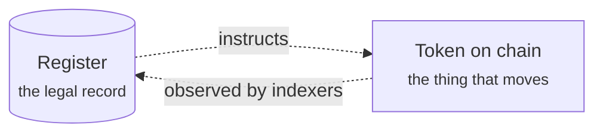

# For customers

You have been given access to a registry built on Registerwerk. Somewhere in it there is a security you issued, or one you own, or one you would like to buy. This section explains what is there, what you can do with it, and what is happening underneath when you do.

**No finance or blockchain background is assumed.** Terms are explained where they first appear.

---

## Three ways in

-   **I am completely new**

    ---

    Start with [What Registerwerk is](intro.md), then [Getting your account](onboarding.md). About fifteen minutes.

-   **I want to understand the business**

    ---

    Read [The life of a security](lifecycle/index.md) end to end. One bond, six stages, from idea to repayment.

-   **I know what I need, just show me**

    ---

    Jump to your workspace: [Investor](workspaces/investor.md) · [Trader](workspaces/trader.md) · [Issuer](workspaces/issuer.md) · [Company admin](workspaces/company-admin.md) · [dApp publisher](workspaces/dapp-publisher.md) · [Auditor](workspaces/auditor.md)

---

## What the portal is arranged around

When you sign in you land in a **workspace**. A workspace is not a permission — it is a point of view. The same account can hold several, and the switcher at the top left moves between them.

| Workspace | You are here to… | You see |
|---|---|---|
| **Investor** | hold securities and watch what they do | Positions, Investments, Marketplace |
| **Trader** | buy and sell, and finance positions | Trading Desk, Liquidity, Positions, Marketplace |
| **Issuer** | create securities and administer them | Issuances, My dApps, Company Admin, Marketplace |

Three things sit outside the workspaces because they apply to you no matter what you are doing: your [**KYC status**](kyc.md), your [**endpoints**](investors/wallet-setup.md) (the wallet addresses you have registered), and your [**security settings**](authentication.md).

??? note "Why workspaces rather than one long menu?"

    Because a single person is often several roles at once — a treasury manager who issues the company's own paper, invests spare cash, and trades both. Showing every feature they hold a role for produces a navigation bar that serves no task well.

    Workspaces are stored per browser, so switching sticks. They filter *navigation only*: your permissions are unchanged by which workspace you are in, and the backend enforces them regardless. Choosing the Issuer workspace does not grant issuer rights, and leaving it does not take them away.

---

## The one thing worth knowing up front

Registerwerk keeps **two records of the same thing**, and deliberately does not pretend otherwise.

There is the **register** — a database, held by the operator, which is the record with legal significance. And there is the **token** — an entry on a blockchain, which is what actually moves when a transfer happens.

They are kept in step by software that watches the chain and writes what it sees back into the register. Most of the time they agree. When they do not, the register is authoritative and the difference is something a human has to resolve.

Almost everything that seems surprising about the platform follows from this. Why a transfer can be *pending*. Why an issuer can be told "on-chain balance and register balance disagree". Why some actions need the operator. Holding these two ideas apart makes the rest straightforward — and [Holding and custody](lifecycle/holding.md) goes into it properly.

---

!!! info "About the examples"
    Every figure, company and security in this documentation is invented. *Nordwind Energie GmbH* does not exist and its bond has never been issued. The numbers are chosen to make arithmetic easy to follow, not to represent realistic market terms.
