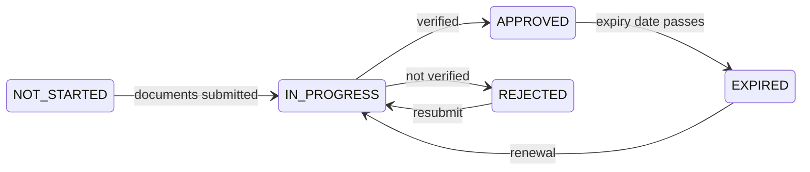

# Verifizierung (KYC)

**KYC** — *Know Your Customer*, Kundenidentifizierung — ist die Prüfung, die feststellt, mit wem das Register es zu tun hat. Bis Ihre Organisation sie besteht, können Sie sich anmelden und umsehen — und sonst sehr wenig.

Es ist das Tor, hinter dem alles wartet. Es lohnt sich, es beim ersten Mal richtig zu machen.

---

## Warum es das gibt

Nicht weil der Betreiber vorsichtig wäre. Sondern weil ein reguliertes Unternehmen, das eine nicht verifizierte Partei Wertpapiere halten lässt, eine Straftat begeht — und weil die Alternative, ein Finanzsystem, in dem niemand weiß, wem etwas gehört, genau jenes ist, durch das kriminelle Erlöse fließen.

Die maßgeblichen Pflichten stammen aus dem Geldwäscherecht: dem deutschen GwG, den EU-Geldwäscherichtlinien und ihren Entsprechungen in den anderen Jurisdiktionen, die Registerwerk abbildet. [KYC & AML](../compliance/kyc-aml.md) enthält die Einzelheiten.

!!! info "Verifiziert wird Ihre Organisation, nicht Sie persönlich"
    Registerwerk verifiziert **juristische Personen**. Einzelne Nutzer gehören zu einem verifizierten Rechtsträger; sie werden nicht gesondert verifiziert.

    Deshalb hält ein abgelaufenes KYC Ihrer Organisation *alle* in Ihrem Unternehmen auf, nicht nur die dafür zuständige Person.

---

## Was Sie beibringen

Das hängt von Jurisdiktion, Rechtsform und der Politik des Betreibers ab. Typischerweise:

| | |
|---|---|
| **Registerunterlagen** | Handelsregisterauszug, Gründungsurkunde. |
| **Identität der Vertreter** | Wer für die Organisation handeln darf. |
| **Wirtschaftlich Berechtigte** | Wem sie letztlich gehört oder wer sie kontrolliert — meist jeder über 25 %. |
| **Adressnachweis** | Sitz der Gesellschaft. |
| **LEI** | Sofern vorhanden. |
| **Sanktionserklärung** | Und Abgleich gegen Sanktionslisten. |

!!! tip "Die wirtschaftlich Berechtigten verursachen die Verzögerungen"
    Alles Übrige ist ein Dokument, das Sie ohnehin haben. Die wirtschaftlich Berechtigten oft nicht.

    Verläuft Ihre Eigentümerstruktur über Holdinggesellschaften, Trusts oder mehrere Jurisdiktionen, stellen Sie die Kette *vorher* zusammen — bis zu den natürlichen Personen am Ende. „Das reichen wir nach" ist die Stelle, an der die meisten KYC-Anträge hängen bleiben, mitunter wochenlang.

---

## Die Zustände

| Zustand | Sie können |
|---|---|
| `NOT_STARTED` | Sich anmelden. Kaum mehr. |
| `IN_PROGRESS` | Warten. Rückfragen beantworten. |
| `APPROVED` | Alles, was Ihre Rollen erlauben. |
| `REJECTED` | Die Begründung lesen, beheben, erneut einreichen. |
| `EXPIRED` | Halten, was Sie haben. Es nicht bewegen. |

*KYC* in der oberen Leiste zeigt Ihren aktuellen Zustand und das Ablaufdatum.

---

## Wenn es abläuft

Die Verifizierung ist nicht dauerhaft. Sie trägt ein Ablaufdatum, weil sich Eigentum und Kontrolle ändern und eine Prüfung von vor vier Jahren sehr wenig belegt.

!!! danger "Der Ablauf stoppt Übertragungen für Ihre gesamte Organisation"
    Läuft das KYC aus, stoppen Übertragungen. Nicht nur für die Compliance-Verantwortlichen — für alle in Ihrem Unternehmen.

    **Sie verlieren Ihre Wertpapiere nicht.** Sie bleiben Inhaber, behalten Ansprüche auf Kupons und Rückzahlung, und alles bleibt sichtbar. Verloren geht die Möglichkeit, etwas zu bewegen.

    Die Plattform warnt Sie, wenn der Ablauf näher rückt. **Beginnen Sie die Erneuerung dann, nicht danach.** Die Erneuerung dauert so lange wie die Erstprüfung, und der Ablauf wartet nicht, bis Sie bereit sind.

Tragen Sie das Ablaufdatum in den Kalender ein, in den Ihre Organisation tatsächlich schaut. Das ist die am leichtesten vermeidbare Störung auf der Plattform — und zugleich die häufigste.

---

## Ablehnung

Sie erhalten eine Begründung. Lesen Sie sie und beheben Sie genau diesen Punkt — dasselbe Paket erneut einzureichen bringt dieselbe Antwort.

Häufige Ursachen:

- Wirtschaftlich Berechtigte unvollständig oder nicht bis zu natürlichen Personen verfolgt
- Veraltete Dokumente (Registerauszüge haben meist ein Höchstalter)
- Uneinheitliche Namensschreibweisen über die Dokumente hinweg
- Ein ungeklärter Treffer in der Sanktionsprüfung

!!! note "Ein Treffer ist kein Vorwurf"
    Die Sanktionsprüfung gleicht Namen ab, und Namen sind nicht eindeutig. Fehltreffer sind häufig — in den meisten Beständen die Mehrheit aller Treffer.

    Ein Treffer bedeutet, dass ein Mensch hinsehen muss, nicht dass irgendjemand etwas glaubt. Beantworten Sie die Fragen, dann klärt es sich. Es ist kein Urteil über Ihre Organisation.

---

## Schnell hindurchkommen

- [ ] Die wirtschaftlich Berechtigten **zuerst** zusammenstellen, bis zu natürlichen Personen.
- [ ] Prüfen, dass jedes Dokument aktuell und lesbar ist.
- [ ] Sicherstellen, dass der Name des Rechtsträgers in allen Dokumenten exakt übereinstimmt.
- [ ] Eine Person benennen, die den Vorgang verantwortet und Rückfragen beantwortet.
- [ ] Den Ablauf am Tag der Genehmigung in den Kalender eintragen.

---

## Wohin als Nächstes

- [Zugang erhalten](onboarding.md)
- [Wallet verbinden](investors/wallet-setup.md) — die andere Voraussetzung
- [KYC & AML](../compliance/kyc-aml.md) — die regulatorischen Einzelheiten
